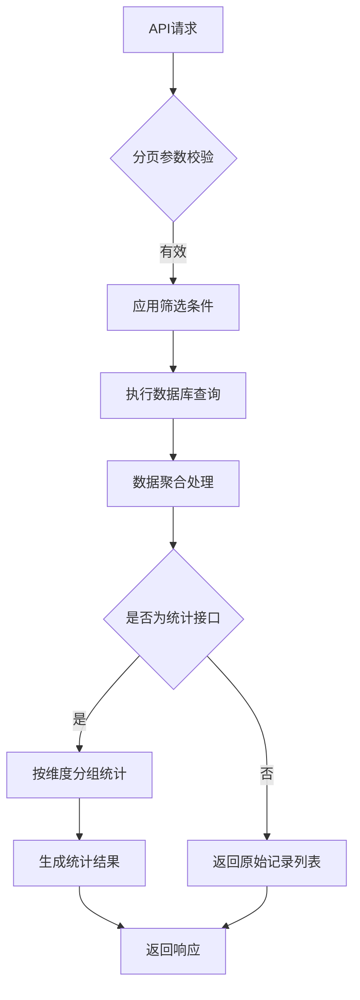
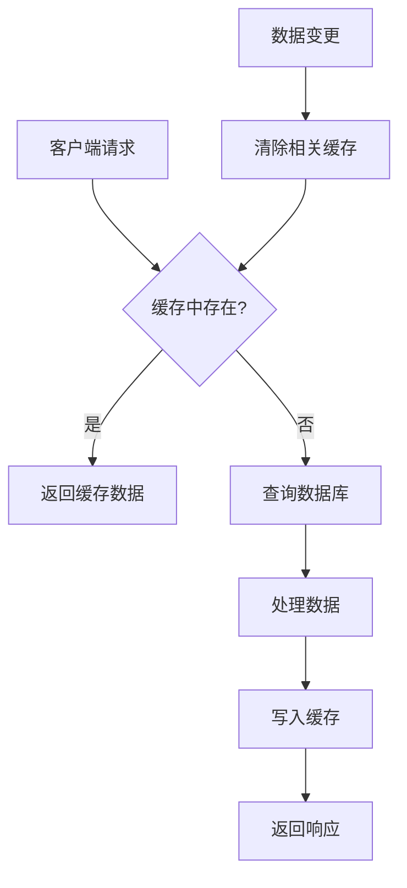

# 借还信息接口

<cite>
**本文档引用文件**  
- [collectInfo.js](file://daoju/src/api/borrowReturnInfo/collectInfo.js)
- [returnInfo.js](file://daoju/src/api/borrowReturnInfo/returnInfo.js)
- [unreturnedInfo.js](file://daoju/src/api/borrowReturnInfo/unreturnedInfo.js)
- [totalInventoryStats.js](file://daoju/src/api/borrowReturnInfo/totalInventoryStats.js)
- [rankingStatistics.js](file://daoju/src/api/borrowReturnInfo/rankingStatistics.js)
</cite>

## 目录
1. [简介](#简介)
2. [核心接口分析](#核心接口分析)
3. [数据查询逻辑与参数说明](#数据查询逻辑与参数说明)
4. [组件调用示例](#组件调用示例)
5. [数据缓存策略与性能优化](#数据缓存策略与性能优化)
6. [附录：API端点汇总](#附录api端点汇总)

## 简介
本API文档详细解析刀具管理系统中借还信息管理模块的核心接口实现。涵盖收刀、还刀、未还信息追踪、总库存统计及排名统计五大功能模块，深入说明各接口的数据查询逻辑、分页参数、筛选条件和返回的统计维度。同时提供前端组件调用示例，展示如何在借还记录页面中组合多个API获取完整业务视图，并阐述系统的数据缓存机制与性能优化措施。

## 核心接口分析

### 收刀信息接口（collectInfo.js）
该模块提供对收刀操作的完整CRUD支持，包括列表查询、详情获取、确认收刀、新增、修改、删除及批量删除功能。此外还支持导出操作，并提供刀柜编码与库位列表的辅助查询接口，用于前端下拉选择。

**接口功能：**
- 列表查询：`listCollectInfo(query)`
- 详情获取：`getCollectInfo(id)`
- 确认收刀：`confirmCollect(data)`
- 新增记录：`addCollectInfo(data)`
- 修改记录：`updateCollectInfo(data)`
- 删除记录：`delCollectInfo(id)`
- 批量删除：`batchDelCollectInfo(ids)`
- 导出数据：`exportCollectInfo(query)`
- 获取刀柜列表：`getCabinetCodeList()`
- 获取库位列表：`getLocationList(cabinetCode)`

**Section sources**
- [collectInfo.js](file://daoju/src/api/borrowReturnInfo/collectInfo.js#L4-L88)

### 还刀信息接口（returnInfo.js）
该模块实现还刀信息的管理功能，支持列表查询、详情查看、新增、修改、删除和导出操作。接口设计简洁，专注于还刀流程的数据交互。

**接口功能：**
- 列表查询：`listReturnInfo(query)`
- 详情获取：`getReturnInfo(id)`
- 新增记录：`addReturnInfo(data)`
- 修改记录：`updateReturnInfo(data)`
- 删除记录：`delReturnInfo(id)`
- 导出数据：`exportReturnInfo(query)`

**Section sources**
- [returnInfo.js](file://daoju/src/api/borrowReturnInfo/returnInfo.js#L4-L53)

### 未还信息追踪接口（unreturnedInfo.js）
该模块用于追踪尚未归还的刀具信息，除常规的增删改查和导出功能外，特别提供了统计接口 `statisticsUnreturnedInfo`，可用于生成逾期未还报表或进行风险预警分析。

**接口功能：**
- 列表查询：`listUnreturnedInfo(query)`
- 详情获取：`getUnreturnedInfo(id)`
- 新增记录：`addUnreturnedInfo(data)`
- 修改记录：`updateUnreturnedInfo(data)`
- 删除记录：`delUnreturnedInfo(id)`
- 导出数据：`exportUnreturnedInfo(query)`
- 统计分析：`statisticsUnreturnedInfo(query)`

**Section sources**
- [unreturnedInfo.js](file://daoju/src/api/borrowReturnInfo/unreturnedInfo.js#L4-L62)

### 总库存统计接口（totalInventoryStats.js）
该模块提供多维度的库存统计能力，支持按刀具、刀柄分别查询库存，并可获取品牌、类型、刀柜等基础数据列表。同时提供汇总数据接口和导出功能，满足不同层级的统计需求。

**接口功能：**
- 总库存列表：`listTotalInventoryStats(query)`
- 刀具库存查询：`getCutterInventoryStats(query)`
- 刀柄库存查询：`getHandleInventoryStats(query)`
- 库存汇总数据：`getInventorySummary(type)`
- 导出统计：`exportInventoryStats(query)`
- 品牌列表：`getBrandList()`
- 刀具类型列表：`getCutterTypeList()`
- 刀柄类型列表：`getHandleTypeList()`
- 刀柜列表：`getCabinetList()`

**Section sources**
- [totalInventoryStats.js](file://daoju/src/api/borrowReturnInfo/totalInventoryStats.js#L4-L78)

### 排名统计接口（rankingStatistics.js）
该模块专注于各类排行榜数据的生成，涵盖年度取刀数量、金额、累计使用情况，以及员工、设备、刀具型号、工单和异常还刀等多个维度的排名统计，为管理决策提供数据支持。

**接口功能：**
- 年度取刀数量统计：`getYearlyQuantityStatistics(query)`
- 年度取刀金额统计：`getYearlyAmountStatistics(query)`
- 年度累计使用统计：`getYearlyUsageStatistics(query)`
- 员工领刀排行：`getEmployeeRankingStatistics(query)`
- 设备用刀排行：`getEquipmentRankingStatistics(query)`
- 刀具型号排行：`getCutterModelRankingStatistics(query)`
- 工单排行：`getWorkOrderRankingStatistics(query)`
- 异常还刀排行：`getAbnormalReturnRankingStatistics(query)`

**Section sources**
- [rankingStatistics.js](file://daoju/src/api/borrowReturnInfo/rankingStatistics.js#L4-L73)

## 数据查询逻辑与参数说明

### 分页参数
所有支持分页的接口均接受以下标准分页参数：
- `pageNum`：当前页码（从1开始）
- `pageSize`：每页条数
- 示例：`{ pageNum: 1, pageSize: 10 }`

### 筛选条件
各接口根据业务需求支持不同的筛选字段，常见筛选条件包括：
- 时间范围：`beginTime`, `endTime`
- 状态码：`status`
- 关键字搜索：`keyword`
- 分类筛选：`cutterType`, `brandName`, `cabinetCode` 等

### 返回统计维度
| 接口模块 | 主要统计维度 |
|--------|------------|
| **总库存统计** | 刀具/刀柄分类、品牌、型号、刀柜位置、可用数量 |
| **排名统计** | 数量、金额、使用频次、排名序号、时间周期 |
| **未还信息** | 逾期天数、借出人、设备编号、工单号、预期归还日期 |



**Diagram sources**
- [totalInventoryStats.js](file://daoju/src/api/borrowReturnInfo/totalInventoryStats.js#L4-L78)
- [rankingStatistics.js](file://daoju/src/api/borrowReturnInfo/rankingStatistics.js#L4-L73)

## 组件调用示例

在借还记录页面中，通常需要组合调用多个API以构建完整的业务视图。以下是一个典型的组合调用场景：

```javascript
// 示例：初始化借还统计页面
async function initBorrowReturnPage() {
  const currentMonth = '2023-10';
  
  // 并行调用多个统计接口
  const [
    yearlyQuantityRes,
    employeeRankingRes,
    unreturnedStatsRes
  ] = await Promise.all([
    getYearlyQuantityStatistics({ month: currentMonth }),
    getEmployeeRankingStatistics({ top: 10 }),
    statisticsUnreturnedInfo({ status: 'overdue' })
  ]);

  // 整合数据用于展示
  this.quantityData = yearlyQuantityRes.data;
  this.rankingData = employeeRankingRes.data;
  this.overdueCount = unreturnedStatsRes.data.count;
}
```

此模式通过 `Promise.all` 实现接口并行调用，显著提升页面加载效率。

**Section sources**
- [rankingStatistics.js](file://daoju/src/api/borrowReturnInfo/rankingStatistics.js#L4-L73)
- [unreturnedInfo.js](file://daoju/src/api/borrowReturnInfo/unreturnedInfo.js#L56-L62)

## 数据缓存策略与性能优化

系统通过Redis实现多级缓存机制，显著提升高频查询接口的响应速度。

### 缓存策略
- **缓存键设计**：采用 `module:submodule:key` 格式，如 `borrowReturnInfo:rankingStatistics:employeeRanking_2023-10`
- **TTL设置**：统计类数据缓存30分钟，基础列表数据缓存2小时
- **缓存更新**：在数据变更（增删改）操作后主动清除相关缓存

### 性能优化措施
1. **接口合并**：对关联性强的查询提供组合接口
2. **分页加载**：默认限制单页数据量，避免全量加载
3. **懒加载**：非首屏内容延迟加载
4. **前端缓存**：利用浏览器本地存储缓存静态资源和基础数据



**Diagram sources**
- [cache.js](file://daoju/src/api/monitor/cache.js#L1-L57)

## 附录API端点汇总

| 模块 | 功能 | HTTP方法 | 路径 |
|------|------|---------|------|
| **收刀信息** | 查询列表 | GET | `/borrowReturnInfo/collectInfo/list` |
| | 确认收刀 | POST | `/borrowReturnInfo/collectInfo/confirm` |
| | 获取库位列表 | GET | `/borrowReturnInfo/collectInfo/locations` |
| **还刀信息** | 查询列表 | GET | `/borrowReturnInfo/returnInfo/list` |
| | 导出数据 | GET | `/borrowReturnInfo/returnInfo/export` |
| **未还信息** | 统计分析 | GET | `/borrowReturnInfo/unreturnedInfo/statistics` |
| **总库存统计** | 获取刀具库存 | GET | `/borrowReturnInfo/totalInventoryStats/cutter` |
| | 获取汇总数据 | GET | `/borrowReturnInfo/totalInventoryStats/summary` |
| **排名统计** | 员工排行 | GET | `/borrowReturnInfo/rankingStatistics/employeeRanking` |
| | 异常还刀排行 | GET | `/borrowReturnInfo/rankingStatistics/abnormalReturnRanking` |