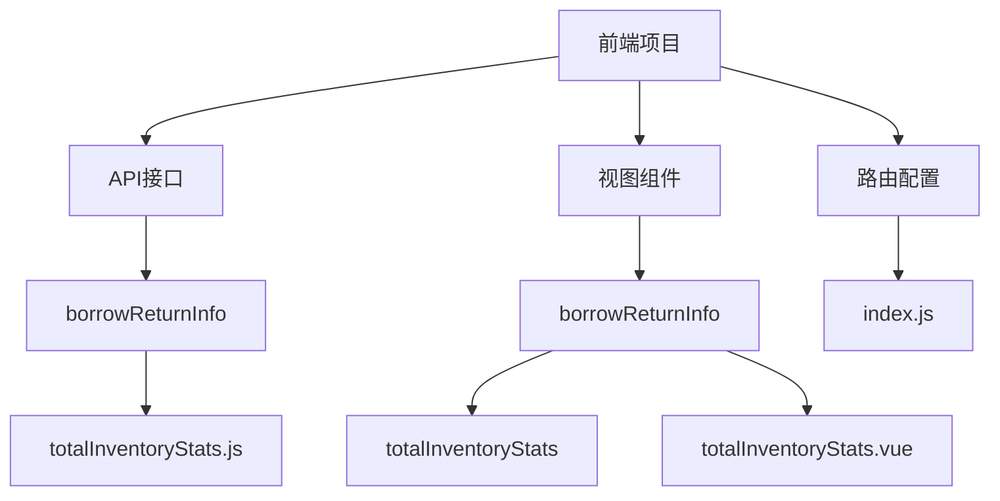
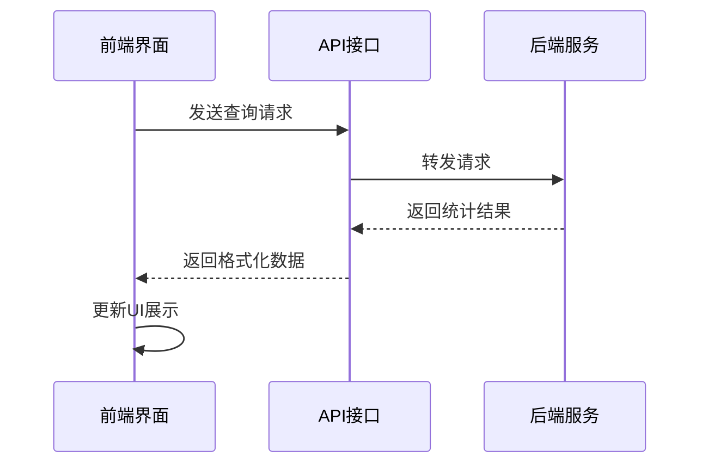
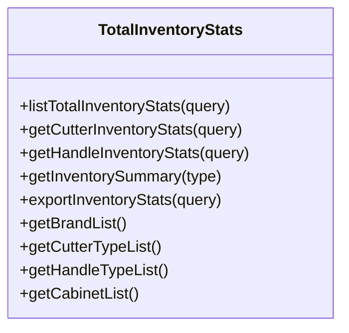
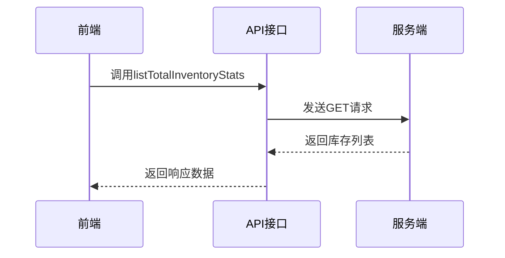
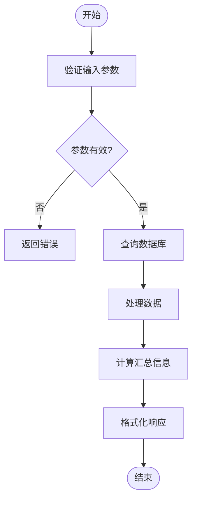
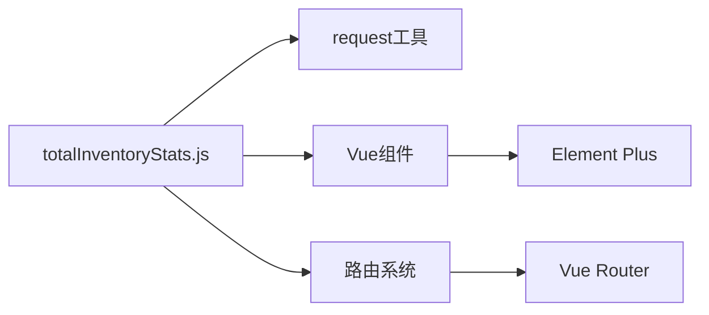

# 总库存统计接口

<cite>
**本文档引用的文件**
- [totalInventoryStats.js](file://daoju\src\api\borrowReturnInfo\totalInventoryStats.js)
- [totalInventoryStats.vue](file://daoju\src\views\borrowReturnInfo\totalInventoryStats\index.vue)
- [router/index.js](file://daoju\src\router\index.js)
</cite>

## 目录
1. [项目结构](#项目结构)
2. [核心组件](#核心组件)
3. [架构概述](#架构概述)
4. [详细组件分析](#详细组件分析)
5. [依赖分析](#依赖分析)
6. [性能考虑](#性能考虑)
7. [故障排除指南](#故障排除指南)
8. [结论](#结论)

## 项目结构

**图表来源**
- [totalInventoryStats.js](file://daoju\src\api\borrowReturnInfo\totalInventoryStats.js)
- [totalInventoryStats.vue](file://daoju\src\views\borrowReturnInfo\totalInventoryStats\index.vue)
- [router/index.js](file://daoju\src\router\index.js)

**章节来源**
- [totalInventoryStats.js](file://daoju\src\api\borrowReturnInfo\totalInventoryStats.js)
- [totalInventoryStats.vue](file://daoju\src\views\borrowReturnInfo\totalInventoryStats\index.vue)

## 核心组件

总库存统计接口提供全面的库存汇总功能，支持按类型、品牌、状态等维度进行统计。该接口通过API调用获取数据，并在库存仪表盘中展示统计结果。接口支持分页查询，确保在大数据量下的性能优化。

**章节来源**
- [totalInventoryStats.js](file://daoju\src\api\borrowReturnInfo\totalInventoryStats.js)
- [totalInventoryStats.vue](file://daoju\src\views\borrowReturnInfo\totalInventoryStats\index.vue)

## 架构概述

**图表来源**
- [totalInventoryStats.js](file://daoju\src\api\borrowReturnInfo\totalInventoryStats.js)
- [totalInventoryStats.vue](file://daoju\src\views\borrowReturnInfo\totalInventoryStats\index.vue)

## 详细组件分析

### 组件分析

总库存统计接口包含多个功能函数，支持不同维度的库存查询。接口通过RESTful API提供服务，支持GET请求方式。查询参数包括库存类型、品牌名称、刀柜编码、刀具/刀柄类型和库位状态等。

#### 对象导向组件

**图表来源**
- [totalInventoryStats.js](file://daoju\src\api\borrowReturnInfo\totalInventoryStats.js)

#### API/服务组件

**图表来源**
- [totalInventoryStats.js](file://daoju\src\api\borrowReturnInfo\totalInventoryStats.js)

#### 复杂逻辑组件

**图表来源**
- [totalInventoryStats.js](file://daoju\src\api\borrowReturnInfo\totalInventoryStats.js)
- [totalInventoryStats.vue](file://daoju\src\views\borrowReturnInfo\totalInventoryStats\index.vue)

**章节来源**
- [totalInventoryStats.js](file://daoju\src\api\borrowReturnInfo\totalInventoryStats.js)
- [totalInventoryStats.vue](file://daoju\src\views\borrowReturnInfo\totalInventoryStats\index.vue)

## 依赖分析

**图表来源**
- [totalInventoryStats.js](file://daoju\src\api\borrowReturnInfo\totalInventoryStats.js)
- [totalInventoryStats.vue](file://daoju\src\views\borrowReturnInfo\totalInventoryStats\index.vue)
- [router/index.js](file://daoju\src\router\index.js)

**章节来源**
- [totalInventoryStats.js](file://daoju\src\api\borrowReturnInfo\totalInventoryStats.js)
- [totalInventoryStats.vue](file://daoju\src\views\borrowReturnInfo\totalInventoryStats\index.vue)

## 性能考虑

总库存统计接口在设计时考虑了大数据量下的性能优化。通过分页查询机制，限制每次请求返回的数据量，避免一次性加载过多数据导致性能下降。接口支持缓存策略，减少重复查询对数据库的压力。同时，通过合理的索引设计和查询优化，确保在大数据量下的查询效率。

## 故障排除指南

当总库存统计接口出现问题时，可按照以下步骤进行排查：
1. 检查API端点是否正确
2. 验证查询参数是否符合要求
3. 检查网络连接是否正常
4. 查看浏览器控制台是否有错误信息
5. 检查后端服务是否正常运行

**章节来源**
- [totalInventoryStats.js](file://daoju\src\api\borrowReturnInfo\totalInventoryStats.js)
- [totalInventoryStats.vue](file://daoju\src\views\borrowReturnInfo\totalInventoryStats\index.vue)

## 结论

总库存统计接口为库存管理提供了全面的数据支持，通过灵活的查询参数和高效的性能优化，满足了不同场景下的统计需求。接口设计合理，易于集成和扩展，为库存仪表盘提供了可靠的数据基础。