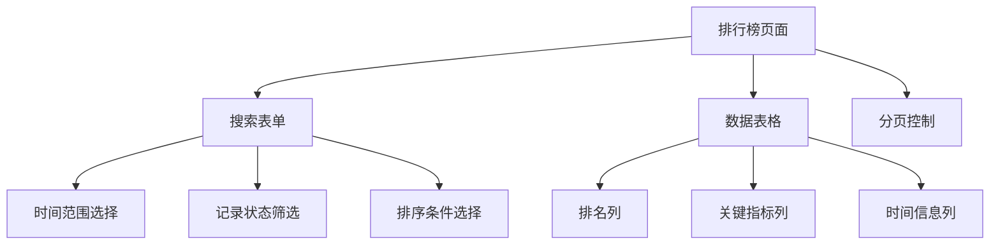
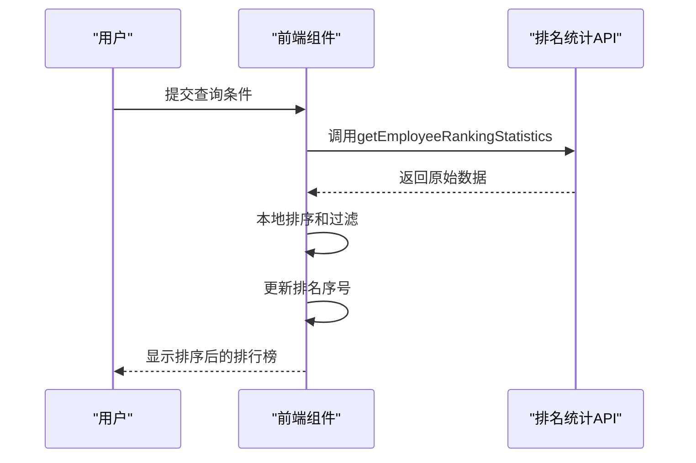
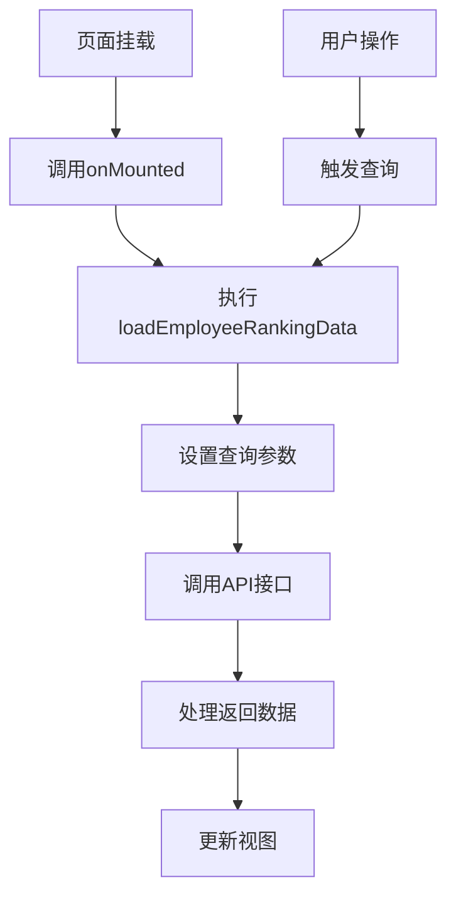
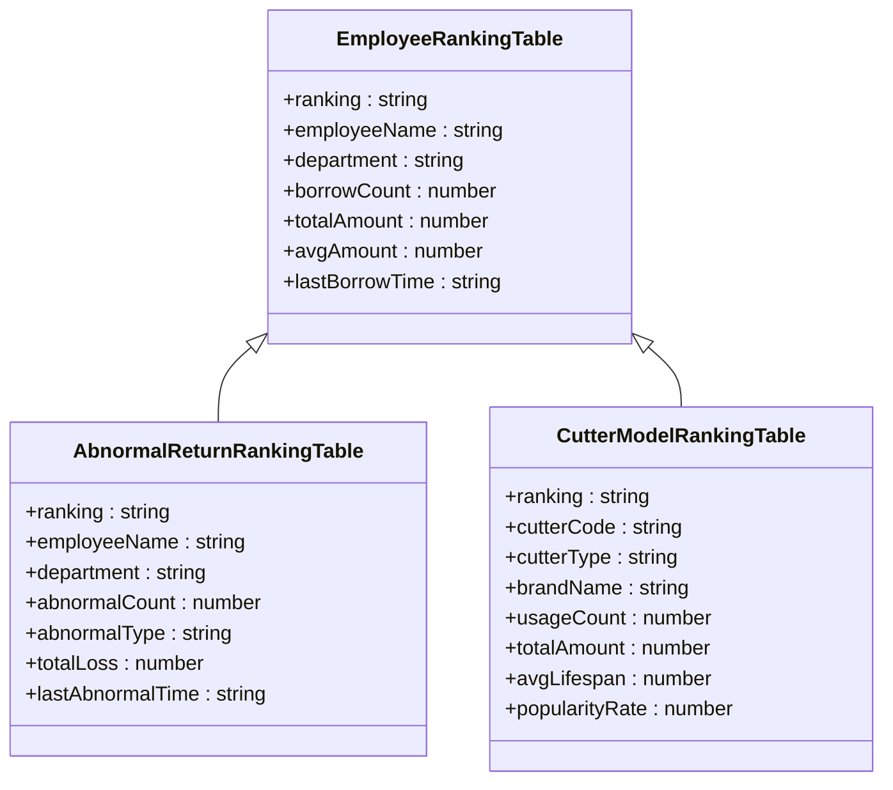
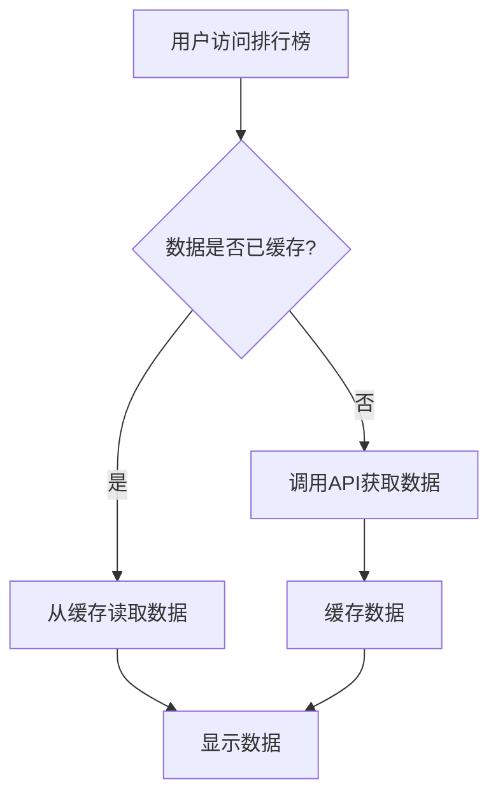

# 排名统计接口

<cite>
**Referenced Files in This Document**   
- [rankingStatistics.js](file://daoju/src/api/borrowReturnInfo/rankingStatistics.js)
- [index.vue](file://daoju/src/views/borrowReturnInfo/rankingStatistics/index.vue)
- [EmployeeRanking/index.vue](file://daoju/src/views/leaderBoard/EmployeeRanking/index.vue)
- [AbnormalReturnRanking/index.vue](file://daoju/src/views/leaderBoard/AbnormalReturnRanking/index.vue)
- [CutterModelRanking/index.vue](file://daoju/src/views/leaderBoard/CutterModelRanking/index.vue)
</cite>

## 目录
1. [介绍](#介绍)
2. [核心接口分析](#核心接口分析)
3. [前端实现与数据可视化](#前端实现与数据可视化)
4. [性能考量与缓存机制](#性能考量与缓存机制)
5. [权限控制](#权限控制)
6. [常见问题与解决方案](#常见问题与解决方案)

## 介绍

本文档详细解析刀具管理系统中的排名统计API，涵盖员工借刀频次排名、刀具使用率排名、异常归还次数排名等核心功能。系统通过`rankingStatistics.js`文件中的API接口提供各类统计数据，支持按时间范围、记录状态、排序类型和顺序进行筛选和排序。前端通过Vue组件实现数据可视化，提供直观的排行榜展示。文档将深入分析接口实现、前端调用方式、性能优化策略和权限控制机制，为开发者提供全面的技术参考。

**Section sources**
- [rankingStatistics.js](file://daoju/src/api/borrowReturnInfo/rankingStatistics.js#L1-L74)

## 核心接口分析

排名统计API位于`daoju/src/api/borrowReturnInfo/rankingStatistics.js`文件中，提供了多个用于获取不同维度统计数据的接口。这些接口均基于统一的请求模式，通过GET方法调用后端服务，传递查询参数以获取过滤和排序后的数据。

### 员工借刀频次排名

`getEmployeeRankingStatistics`接口用于获取员工领刀排行数据。该接口支持多种筛选和排序条件：

- **筛选条件**：
  - 开始时间（startTime）
  - 结束时间（endTime）
  - 记录状态（recordStatus）：取刀(0)、还刀(1)、收刀(2)、暂存(3)、完成(4)、违规还刀(5)
  
- **排序条件**：
  - 排序类型（rankingType）：数量(0)、金额(1)
  - 排序顺序（order）：从大到小(0)、从小到大(1)

接口返回数据包含排名、员工姓名、部门、领刀次数、总金额、平均金额和最后领刀时间等字段。

**Section sources**
- [rankingStatistics.js](file://daoju/src/api/borrowReturnInfo/rankingStatistics.js#L30-L37)

### 刀具使用率排名

`getCutterModelRankingStatistics`接口用于获取刀具型号使用排行数据。该接口的查询参数与员工排名接口相同，支持相同的时间范围、记录状态和排序条件筛选。

返回数据包含排名、刀具型号、刀具类型、品牌名称、使用次数、总金额、平均寿命和受欢迎度等关键指标，为分析刀具使用效率和受欢迎程度提供数据支持。

**Section sources**
- [rankingStatistics.js](file://daoju/src/api/borrowReturnInfo/rankingStatistics.js#L48-L54)

### 异常归还次数排名

`getAbnormalReturnRankingStatistics`接口专门用于统计异常还刀情况。该接口同样支持标准的查询参数，但其返回数据侧重于异常情况的分析：

- 排名
- 员工姓名
- 部门
- 异常次数
- 异常类型（如超时还刀、损坏还刀等）
- 总损失金额
- 最后异常时间

此接口对于识别高风险操作行为和优化刀具管理流程具有重要意义。

**Section sources**
- [rankingStatistics.js](file://daoju/src/api/borrowReturnInfo/rankingStatistics.js#L66-L72)

### 其他统计接口

除了上述核心排名接口外，系统还提供了其他相关统计接口：

- `getYearlyQuantityStatistics`：全年取刀数量统计
- `getYearlyAmountStatistics`：全年取刀金额统计
- `getYearlyUsageStatistics`：今年累计使用统计
- `getEquipmentRankingStatistics`：设备用刀排行
- `getWorkOrderRankingStatistics`：工单排行

这些接口共同构成了完整的刀具使用统计分析体系，为管理层提供全面的数据洞察。

**Section sources**
- [rankingStatistics.js](file://daoju/src/api/borrowReturnInfo/rankingStatistics.js#L4-L74)

## 前端实现与数据可视化

### 排行榜页面结构

前端排行榜页面主要通过`daoju/src/views/leaderBoard`目录下的Vue组件实现。每个排行榜组件（如`EmployeeRanking/index.vue`）都遵循相似的结构设计，包含搜索表单、数据表格和分页控制等核心元素。



**Diagram sources**
- [EmployeeRanking/index.vue](file://daoju/src/views/leaderBoard/EmployeeRanking/index.vue#L1-L193)

### 数据处理流程

前端数据处理流程遵循典型的Vue响应式模式。当用户提交查询条件时，系统会触发相应的API调用，获取数据后进行本地排序和过滤，最后更新视图。



**Diagram sources**
- [rankingStatistics.js](file://daoju/src/api/borrowReturnInfo/rankingStatistics.js#L30-L37)
- [EmployeeRanking/index.vue](file://daoju/src/views/leaderBoard/EmployeeRanking/index.vue#L152-L160)

### 动态更新实现

系统通过`onMounted`生命周期钩子在页面加载时自动获取默认数据。当用户修改查询条件或切换标签页时，系统会重新调用相应的加载函数，实现数据的动态更新。



**Diagram sources**
- [EmployeeRanking/index.vue](file://daoju/src/views/leaderBoard/EmployeeRanking/index.vue#L95-L97)

### 数据可视化组件

系统使用Element Plus的`el-table`组件实现数据表格展示，支持固定高度和滚动条，确保在大量数据情况下仍能保持良好的用户体验。表格列定义清晰，包含排名、姓名、部门、次数、金额等关键信息。



**Diagram sources**
- [EmployeeRanking/index.vue](file://daoju/src/views/leaderBoard/EmployeeRanking/index.vue#L62-L70)
- [AbnormalReturnRanking/index.vue](file://daoju/src/views/leaderBoard/AbnormalReturnRanking/index.vue#L62-L70)
- [CutterModelRanking/index.vue](file://daoju/src/views/leaderBoard/CutterModelRanking/index.vue#L62-L71)

## 性能考量与缓存机制

### 接口性能优化

排名统计接口在设计时考虑了性能因素。所有接口均采用GET方法，通过查询参数传递筛选条件，避免了复杂的请求体解析。后端服务应实现适当的索引策略，特别是在时间戳、员工ID、设备编码等常用查询字段上建立索引，以确保查询效率。

对于大数据量的统计查询，建议后端实现分页机制或限制返回结果的数量，避免一次性返回过多数据导致网络传输和前端渲染性能问题。

**Section sources**
- [rankingStatistics.js](file://daoju/src/api/borrowReturnInfo/rankingStatistics.js#L30-L72)

### 前端缓存策略

前端组件在`onMounted`钩子中直接调用API获取数据，目前未实现本地缓存机制。对于频繁访问的排行榜数据，可以考虑引入浏览器本地存储（如localStorage）或状态管理工具（如Vuex）来缓存最近的查询结果，减少不必要的网络请求。



[No sources needed since this diagram shows conceptual workflow, not actual code structure]

### 数据加载优化

当前实现中，每个排行榜组件在加载时都会重新获取数据。对于包含多个标签页的综合统计页面，可以考虑实现懒加载策略，仅在用户切换到特定标签页时才加载对应的数据，减少初始页面加载时的网络请求压力。

**Section sources**
- [index.vue](file://daoju/src/views/borrowReturnInfo/rankingStatistics/index.vue#L516-L553)

## 权限控制

### 接口访问权限

排名统计API作为敏感数据接口，应实施严格的权限控制。系统应验证用户身份和角色权限，确保只有授权人员（如管理员、主管等）才能访问这些统计信息。权限验证应在后端服务层面实现，前端不应作为权限控制的唯一防线。

### 数据范围限制

对于不同权限级别的用户，系统应提供差异化的数据访问范围。例如，部门主管只能查看本部门员工的排名数据，而系统管理员可以查看全局统计数据。这种数据范围限制应在API层面通过查询参数自动添加相应的过滤条件来实现。

[No sources needed since this section doesn't analyze specific source files]

## 常见问题与解决方案

### 查询条件重置问题

在实际使用中，用户可能会遇到查询条件重置后数据未更新的问题。这通常是由于表单引用（ref）未正确获取或重置方法调用失败导致的。

**解决方案**：
确保在组件中正确声明表单引用，并在重置方法中使用可选链操作符（?.）来避免空引用错误：

```javascript
const resetEmployeeQuery = () => {
  employeeQueryRef.value?.resetFields()
  loadEmployeeRankingData()
}
```

**Section sources**
- [EmployeeRanking/index.vue](file://daoju/src/views/leaderBoard/EmployeeRanking/index.vue#L157-L160)

### 数据排序异常

当用户选择排序条件但数据未按预期排序时，可能是由于排序逻辑未正确处理空值或数据类型转换问题。

**解决方案**：
在排序函数中添加空值检查，并确保比较的数值类型一致：

```javascript
mockData.sort((a, b) => {
  let valueA = a.borrowCount || 0
  let valueB = b.borrowCount || 0
  return employeeQueryParams.order === 0 ? valueB - valueA : valueA - valueB
})
```

**Section sources**
- [EmployeeRanking/index.vue](file://daoju/src/views/leaderBoard/EmployeeRanking/index.vue#L121-L140)

### 空数据状态处理

当查询结果为空时，系统应提供友好的用户提示，避免显示空白表格。

**解决方案**：
使用`el-empty`组件显示"暂无数据"的提示信息，并确保在数据数组为空时正确显示该组件：

```vue
<el-empty v-if="!employeeRankingData.length" description="暂无数据" />
<div v-else class="statistics-content">
  <!-- 数据表格 -->
</div>
```

**Section sources**
- [EmployeeRanking/index.vue](file://daoju/src/views/leaderBoard/EmployeeRanking/index.vue#L60-L61)

### 时间范围选择问题

用户在选择时间范围时可能会遇到日期格式不匹配或时区问题。

**解决方案**：
确保日期选择器的`format`和`value-format`属性正确设置，与后端API期望的格式保持一致：

```vue
<el-date-picker
  v-model="employeeQueryParams.startTime"
  type="datetime"
  format="YYYY-MM-DD HH:mm:ss"
  value-format="YYYY-MM-DD HH:mm:ss"
/>
```

**Section sources**
- [EmployeeRanking/index.vue](file://daoju/src/views/leaderBoard/EmployeeRanking/index.vue#L81-L87)