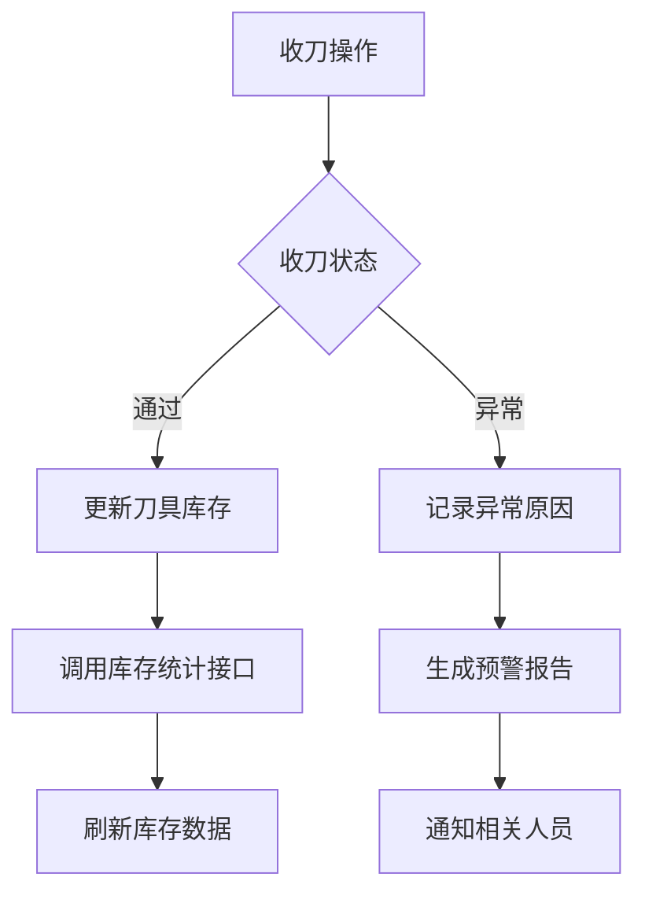

# 收刀信息接口

<cite>
**Referenced Files in This Document**   
- [collectInfo.js](file://daoju/src/api/borrowReturnInfo/collectInfo.js)
- [index.vue](file://daoju/src/views/borrowReturnInfo/collectInfo/index.vue)
- [permission.js](file://daoju/src/utils/permission.js)
- [request.js](file://daoju/src/utils/request.js)
- [errorCode.js](file://daoju/src/utils/errorCode.js)
- [totalInventoryStats.js](file://daoju/src/api/borrowReturnInfo/totalInventoryStats.js)
</cite>

## 目录
1. [接口概述](#接口概述)
2. [HTTP请求方法与URL路径](#http请求方法与url路径)
3. [请求参数说明](#请求参数说明)
4. [响应数据结构](#响应数据结构)
5. [业务用途与应用场景](#业务用途与应用场景)
6. [前端调用示例](#前端调用示例)
7. [与表格组件的集成](#与表格组件的集成)
8. [错误码处理](#错误码处理)
9. [权限校验要求](#权限校验要求)
10. [性能优化建议](#性能优化建议)
11. [与其他接口的数据关联](#与其他接口的数据关联)

## 接口概述

收刀信息接口是刀具管理系统中的核心功能之一，用于记录和管理刀具归还过程中的各项信息。该接口提供了完整的CRUD（创建、读取、更新、删除）操作，支持分页查询、条件筛选、数据导出等高级功能。接口主要服务于生产现场的刀具回收管理，确保刀具使用过程的可追溯性和安全性。

**Section sources**
- [collectInfo.js](file://daoju/src/api/borrowReturnInfo/collectInfo.js#L1-L89)

## HTTP请求方法与URL路径

收刀信息接口提供了一系列RESTful风格的API端点，每个端点对应特定的业务操作：

| 操作功能 | HTTP方法 | URL路径 |
|---------|--------|-------|
| 查询收刀信息列表 | GET | /borrowReturnInfo/collectInfo/list |
| 查询收刀信息详细 | GET | /borrowReturnInfo/collectInfo/{id} |
| 确认收刀操作 | POST | /borrowReturnInfo/collectInfo/confirm |
| 新增收刀信息 | POST | /borrowReturnInfo/collectInfo |
| 修改收刀信息 | PUT | /borrowReturnInfo/collectInfo |
| 删除收刀信息 | DELETE | /borrowReturnInfo/collectInfo/{id} |
| 批量删除收刀信息 | DELETE | /borrowReturnInfo/collectInfo/batch |
| 导出收刀信息 | GET | /borrowReturnInfo/collectInfo/export |
| 获取刀柜编码列表 | GET | /borrowReturnInfo/collectInfo/cabinetCodes |
| 获取库位列表 | GET | /borrowReturnInfo/collectInfo/locations |

**Section sources**
- [collectInfo.js](file://daoju/src/api/borrowReturnInfo/collectInfo.js#L4-L88)

## 请求参数说明

收刀信息接口支持多种查询参数，以满足不同的业务需求：

### 分页参数
- `pageNum`: 当前页码（从1开始）
- `pageSize`: 每页显示数量（默认10，最大100）

### 时间范围参数
- `collectTime`: 收刀时间范围，格式为日期区间（如：["2024-01-01", "2024-12-31"]）

### 设备相关参数
- `cabinetCode`: 刀柜编码，用于筛选特定刀柜的收刀记录
- `locList`: 收刀库位号集合，支持多选查询

### 业务状态参数
- `borrowCode`: 还刀码，用于精确查找特定还刀记录
- `collectUser`: 收刀人，支持模糊查询
- `status`: 收刀状态（0：通过，1：异常）

### 其他参数
- `cutterCode`: 刀具型号
- `cutterType`: 刀具类型
- `brandName`: 品牌名称

**Section sources**
- [index.vue](file://daoju/src/views/borrowReturnInfo/collectInfo/index.vue#L6-L48)

## 响应数据结构

收刀信息接口返回的数据结构包含以下字段：

| 字段名 | 类型 | 说明 |
|-------|-----|------|
| id | number | 收刀记录ID |
| borrowCode | string | 还刀码 |
| cabinetCode | string | 刀柜编码 |
| stockLoc | string | 刀柜库位号 |
| collectUser | string | 收刀人 |
| collectTime | string | 收刀时间（YYYY-MM-DD HH:mm:ss） |
| status | number | 收刀状态（0：通过，1：异常） |
| cutterCode | string | 刀具型号 |
| cutterType | string | 刀具类型 |
| brandName | string | 品牌名称 |
| quantity | number | 收刀数量 |
| remarks | string | 原因说明 |
| createUser | string | 创建人 |
| createTime | string | 创建时间 |
| updateUser | string | 更新人 |
| updateTime | string | 更新时间 |
| specification | string | 规格参数 |

**Section sources**
- [index.vue](file://daoju/src/views/borrowReturnInfo/collectInfo/index.vue#L63-L81)

## 业务用途与应用场景

收刀信息接口主要用于生产现场的刀具回收管理，其核心业务用途包括：

1. **刀具归还记录**：记录每次刀具归还的详细信息，包括操作人员、时间、设备位置等
2. **异常处理**：当收刀过程中发现刀具损坏或异常时，记录异常状态和原因
3. **追溯管理**：通过还刀码关联借出和归还记录，实现刀具全生命周期的追溯
4. **库存更新**：收刀成功后自动更新刀具库存状态
5. **绩效统计**：为员工收刀绩效统计提供数据支持

典型应用场景包括：
- 生产班次结束时的刀具集中回收
- 刀具异常更换后的归还处理
- 刀具维修前的预归还登记
- 刀具报废前的确认流程

**Section sources**
- [index.vue](file://daoju/src/views/borrowReturnInfo/collectInfo/index.vue#L549-L587)

## 前端调用示例

以下是收刀信息接口的前端调用示例代码：

```javascript
// 导入API函数
import { listCollectInfo, getCollectInfo, addCollectInfo, confirmCollect } from '@/api/borrowReturnInfo/collectInfo'

// 查询收刀信息列表
const queryCollectInfoList = async () => {
  const query = {
    pageNum: 1,
    pageSize: 10,
    collectDto: {
      cabinetCode: 'CAB001',
      status: 0,
      collectTime: ['2024-01-01', '2024-12-31']
    }
  }
  
  try {
    const response = await listCollectInfo(query)
    console.log('收刀信息列表:', response.rows)
    return response
  } catch (error) {
    console.error('查询失败:', error)
  }
}

// 新增收刀信息
const createCollectInfo = async () => {
  const data = {
    collectDto: {
      cabinetCode: 'CAB001',
      locList: ['A01-01'],
      borrowCode: 'RC20241226001',
      collectUser: '张三',
      cutterCode: 'R390-11T308M-PM',
      cutterType: '铣刀',
      brandName: '三菱',
      quantity: 2,
      status: 0,
      remarks: '正常收刀'
    },
    cabinetCode: 'CAB001',
    locList: ['A01-01']
  }
  
  try {
    const response = await addCollectInfo(data)
    console.log('新增成功:', response)
    return response
  } catch (error) {
    console.error('新增失败:', error)
  }
}

// 确认收刀操作
const confirmCollectOperation = async () => {
  const data = {
    borrowCode: 'RC20241226001',
    stockLoc: 'A01-01',
    status: 0,
    remarks: '确认收刀'
  }
  
  try {
    const response = await confirmCollect(data)
    console.log('确认成功:', response)
    return response
  } catch (error) {
    console.error('确认失败:', error)
  }
}
```

**Section sources**
- [index.vue](file://daoju/src/views/borrowReturnInfo/collectInfo/index.vue#L415-L730)

## 与表格组件的集成

收刀信息接口与前端表格组件的集成示例如下：

```vue
<template>
  <div class="collect-info-container">
    <!-- 查询表单 -->
    <el-form :inline="true" :model="formInline" ref="formInlineRes">
      <el-form-item label="刀柜编码">
        <el-select v-model="formInline.cabinetCode" placeholder="请选择刀柜编码">
          <el-option
            v-for="cabinet in cabinetCodeList"
            :key="cabinet.value"
            :label="cabinet.label"
            :value="cabinet.value"
          />
        </el-select>
      </el-form-item>
      <el-form-item label="收刀状态">
        <el-select v-model="formInline.status" placeholder="请选择收刀状态">
          <el-option label="通过" :value="0"/>
          <el-option label="异常" :value="1"/>
        </el-select>
      </el-form-item>
      <el-form-item>
        <el-button type="primary" @click="onSubmit">搜索</el-button>
        <el-button @click="reFreshForm(formInlineRes)">重置</el-button>
      </el-form-item>
    </el-form>

    <!-- 数据表格 -->
    <el-table :data="tableData" border v-loading="loading">
      <el-table-column type="selection" width="55" align="center"/>
      <el-table-column prop="borrowCode" label="还刀码" align="center" width="150"/>
      <el-table-column prop="cabinetCode" label="刀柜编码" align="center" width="120"/>
      <el-table-column prop="collectUser" label="收刀人" align="center" width="100"/>
      <el-table-column prop="collectTime" label="收刀时间" align="center" width="150"/>
      <el-table-column prop="status" label="收刀状态" align="center" width="100">
        <template #default="scope">
          <el-tag :type="scope.row.status === 0 ? 'success' : 'danger'">
            {{ scope.row.status === 0 ? '通过' : '异常' }}
          </el-tag>
        </template>
      </el-table-column>
      <el-table-column label="操作" align="center" width="160">
        <template #default="scope">
          <el-button type="default" size="small" @click="handleDetail(scope.row)">详情</el-button>
          <el-button type="primary" size="small" @click="handleConfirm(scope.row)">确认</el-button>
        </template>
      </el-table-column>
    </el-table>

    <!-- 分页组件 -->
    <el-pagination
      v-model:current-page="pagination.current"
      v-model:page-size="pagination.size"
      :page-sizes="[10, 20, 50, 100]"
      :total="pagination.total"
      layout="total, sizes, prev, pager, next, jumper"
      @size-change="handleSizeChange"
      @current-change="handleCurrentChange"
    />
  </div>
</template>

<script setup>
import { reactive, ref } from 'vue'
import { listCollectInfo, getCabinetCodeList } from '@/api/borrowReturnInfo/collectInfo'

// 表格数据
const tableData = ref([])
const loading = ref(false)

// 分页配置
const pagination = reactive({
  current: 1,
  size: 10,
  total: 0
})

// 查询条件
const formInline = reactive({
  cabinetCode: '',
  status: ''
})

// 获取数据列表
const getList = async () => {
  loading.value = true
  try {
    const query = {
      pageNum: pagination.current,
      pageSize: pagination.size,
      collectDto: {
        cabinetCode: formInline.cabinetCode,
        status: formInline.status
      }
    }
    const response = await listCollectInfo(query)
    tableData.value = response.rows
    pagination.total = response.total
  } catch (error) {
    console.error('获取数据失败:', error)
  } finally {
    loading.value = false
  }
}

// 搜索操作
const onSubmit = () => {
  pagination.current = 1
  getList()
}

// 重置搜索
const reFreshForm = (formRef) => {
  formRef.resetFields()
  pagination.current = 1
  getList()
}

// 初始化数据
getList()
</script>
```

**Section sources**
- [index.vue](file://daoju/src/views/borrowReturnInfo/collectInfo/index.vue#L1-L413)

## 错误码处理

系统定义了标准的错误码处理机制，确保前端能够正确处理各种异常情况：

```javascript
// errorCode.js 中定义的错误码
export default {
  '401': '认证失败，无法访问系统资源',
  '403': '当前操作没有权限',
  '404': '访问资源不存在',
  'default': '系统未知错误，请反馈给管理员'
}
```

前端在调用收刀信息接口时，应根据返回的错误码进行相应的处理：

- **401错误**：用户认证失败，需要重新登录
- **403错误**：当前用户没有执行该操作的权限
- **404错误**：请求的资源不存在
- **其他错误**：显示通用错误提示，并记录日志

**Section sources**
- [request.js](file://daoju/src/utils/request.js#L74-L106)
- [errorCode.js](file://daoju/src/utils/errorCode.js#L1-L7)

## 权限校验要求

收刀信息接口实施了严格的权限校验机制，确保数据安全：

### 角色权限
- **操作员**：可以查看和操作自己负责的收刀记录
- **管理员**：拥有所有收刀信息的完全访问权限
- **审计员**：可以查看所有收刀记录，但不能修改

### 权限配置
```javascript
// 页面访问权限配置
export const PAGE_PERMISSIONS = {
  '/borrowReturnInfo/collectInfo': 'borrowReturnInfo:collectInfo:view'
}
```

用户必须具备 `borrowReturnInfo:collectInfo:view` 权限才能访问收刀信息页面。权限校验在路由守卫中进行，确保未授权用户无法访问敏感数据。

**Section sources**
- [permission.js](file://daoju/src/utils/permission.js#L107-L120)

## 性能优化建议

为确保收刀信息接口的高性能运行，建议采取以下优化措施：

1. **分页大小限制**：建议每页最多显示100条记录，避免一次性加载过多数据
2. **合理使用缓存**：对频繁查询但不常变更的数据（如刀柜编码列表）进行客户端缓存
3. **索引优化**：在数据库中为常用查询字段（如cabinetCode、collectTime）建立索引
4. **批量操作**：对于大量数据的删除操作，使用批量删除接口而非单条删除
5. **防重复提交**：系统已实现防重复提交机制，避免同一操作被多次执行

**Section sources**
- [request.js](file://daoju/src/utils/request.js#L39-L66)

## 与其他接口的数据关联

收刀信息接口与其他系统接口存在紧密的数据关联：

### 与库存统计接口的关联
收刀信息接口与总库存统计接口（totalInventoryStats.js）协同工作，确保库存数据的实时同步：

```javascript
// 查询总库存统计
export function listTotalInventoryStats(query) {
  return request({
    url: '/borrowReturnInfo/totalInventoryStats/list',
    method: 'get',
    params: query
  })
}
```

当收刀操作完成后，系统会自动调用库存统计接口更新相关刀具的库存数量。

### 数据关联流程


**Diagram sources**
- [collectInfo.js](file://daoju/src/api/borrowReturnInfo/collectInfo.js#L4-L88)
- [totalInventoryStats.js](file://daoju/src/api/borrowReturnInfo/totalInventoryStats.js#L4-L79)

**Section sources**
- [totalInventoryStats.js](file://daoju/src/api/borrowReturnInfo/totalInventoryStats.js#L4-L79)