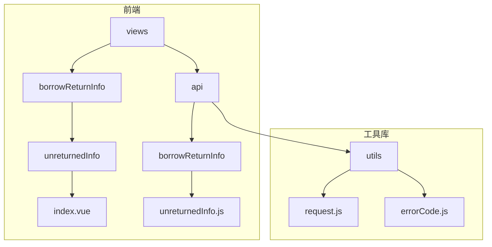
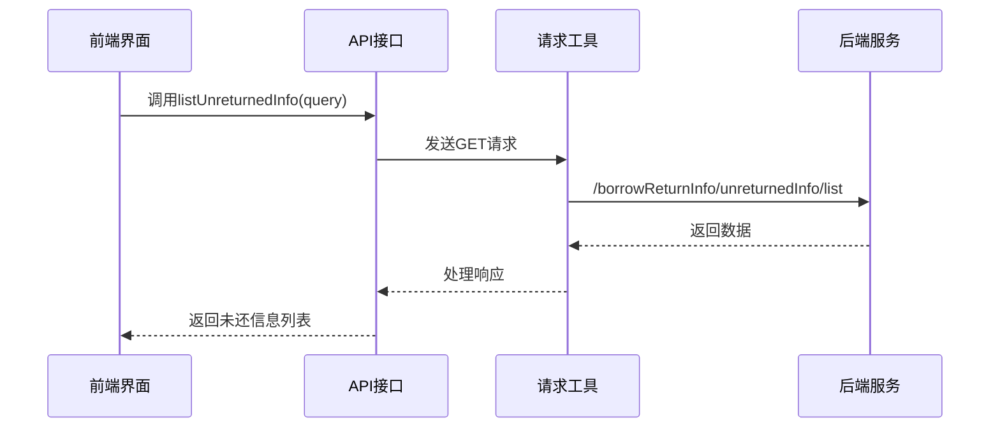
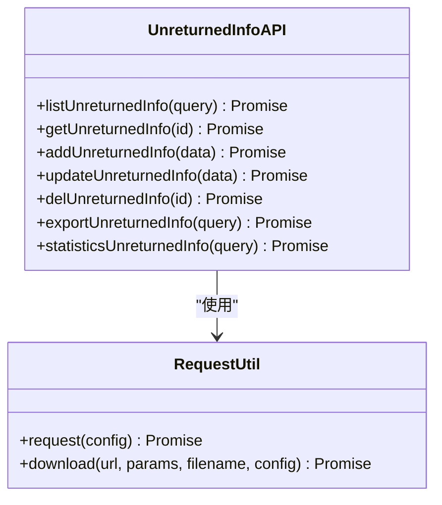
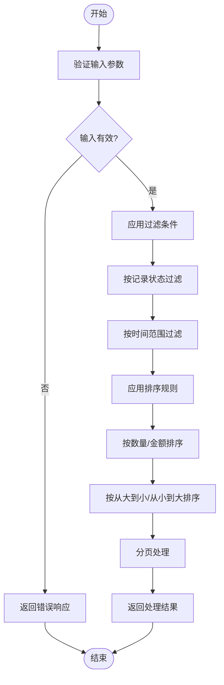
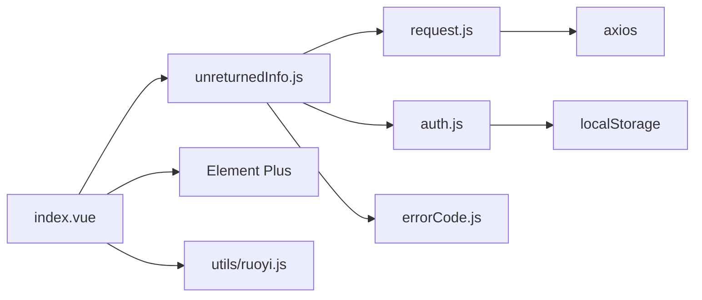
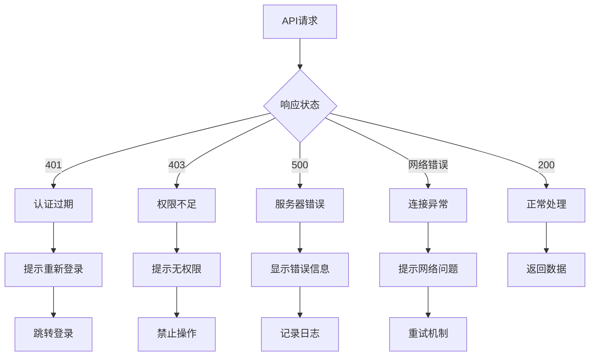

# 未还信息追踪接口

<cite>
**本文档引用文件**  
- [unreturnedInfo.js](file://daoju\src\api\borrowReturnInfo\unreturnedInfo.js)
- [index.vue](file://daoju\src\views\borrowReturnInfo\unreturnedInfo\index.vue)
- [request.js](file://daoju\src\utils\request.js)
- [errorCode.js](file://daoju\src\utils\errorCode.js)
</cite>

## 目录
1. [简介](#简介)
2. [项目结构](#项目结构)
3. [核心组件](#核心组件)
4. [架构概述](#架构概述)
5. [详细组件分析](#详细组件分析)
6. [依赖分析](#依赖分析)
7. [性能考虑](#性能考虑)
8. [故障排除指南](#故障排除指南)
9. [结论](#结论)

## 简介
未还信息追踪接口是刀具管理系统中的关键预警模块，用于查询和管理逾期未归还的刀具信息。该接口在系统中扮演着重要角色，通过实时监控刀具借用状态，为管理人员提供及时的逾期提醒和异常告警，有效防止生产中断和资产流失。接口支持多维度数据过滤、分页查询和导出功能，为前端告警列表提供数据支撑。

## 项目结构
本项目采用前后端分离架构，前端基于 Vue 3 + Element Plus 构建，后端提供 RESTful API 接口。未还信息追踪功能位于 `borrowReturnInfo` 模块下，包含 API 接口定义和视图组件。

**图示来源**  
- [index.vue](file://daoju\src\views\borrowReturnInfo\unreturnedInfo\index.vue)
- [unreturnedInfo.js](file://daoju\src\api\borrowReturnInfo\unreturnedInfo.js)
- [request.js](file://daoju\src\utils\request.js)

**本节来源**  
- [index.vue](file://daoju\src\views\borrowReturnInfo\unreturnedInfo\index.vue)
- [unreturnedInfo.js](file://daoju\src\api\borrowReturnInfo\unreturnedInfo.js)

## 核心组件
未还信息追踪接口的核心功能由 `unreturnedInfo.js` 文件中的 API 函数和 `index.vue` 中的视图组件共同实现。API 层负责与后端服务通信，获取未还刀具数据；视图层负责数据展示、用户交互和业务逻辑处理。

**本节来源**  
- [unreturnedInfo.js](file://daoju\src\api\borrowReturnInfo\unreturnedInfo.js)
- [index.vue](file://daoju\src\views\borrowReturnInfo\unreturnedInfo\index.vue)

## 架构概述
系统采用模块化设计，未还信息追踪功能作为借还信息管理模块的子模块，通过标准化的 API 接口与后端服务交互。前端使用 Axios 进行 HTTP 请求，通过 request.js 封装统一的请求处理逻辑，包括认证、错误处理和重复提交防护。

**图示来源**  
- [unreturnedInfo.js](file://daoju\src\api\borrowReturnInfo\unreturnedInfo.js)
- [request.js](file://daoju\src\utils\request.js)

## 详细组件分析
### 未还信息查询组件分析
未还信息查询组件实现了完整的 CRUD 操作，支持数据查询、详情查看、新增、修改、删除、导出和统计功能。组件采用 Vue 3 的 Composition API 风格编写，使用响应式数据和组合式函数管理状态。

#### API 接口设计

**图示来源**  
- [unreturnedInfo.js](file://daoju\src\api\borrowReturnInfo\unreturnedInfo.js)
- [request.js](file://daoju\src\utils\request.js)

#### 数据过滤与排序逻辑
组件实现了灵活的数据过滤和排序功能，支持按时间范围、记录状态、排序类型和顺序进行查询。前端通过 queryParams 对象管理查询参数，结合 Element Plus 的表单组件实现用户友好的搜索界面。

**图示来源**  
- [index.vue](file://daoju\src\views\borrowReturnInfo\unreturnedInfo\index.vue)

**本节来源**  
- [unreturnedInfo.js](file://daoju\src\api\borrowReturnInfo\unreturnedInfo.js)
- [index.vue](file://daoju\src\views\borrowReturnInfo\unreturnedInfo\index.vue)

## 依赖分析
未还信息追踪组件依赖多个核心模块，包括请求工具、权限管理、错误处理和 UI 组件库。这些依赖关系确保了组件的功能完整性和系统集成性。

**图示来源**  
- [unreturnedInfo.js](file://daoju\src\api\borrowReturnInfo\unreturnedInfo.js)
- [request.js](file://daoju\src\utils\request.js)
- [auth.js](file://daoju\src\utils\auth.js)
- [errorCode.js](file://daoju\src\utils\errorCode.js)

**本节来源**  
- [unreturnedInfo.js](file://daoju\src\api\borrowReturnInfo\unreturnedInfo.js)
- [request.js](file://daoju\src\utils\request.js)
- [errorCode.js](file://daoju\src\utils\errorCode.js)

## 性能考虑
为确保未还信息追踪接口的高性能运行，建议采取以下优化措施：

1. **数据库索引优化**：在常用查询字段（如借刀人、车间编号、逾期天数）上创建索引，提高查询效率。
2. **分页查询**：默认使用分页查询，避免一次性加载大量数据，减少网络传输和内存占用。
3. **缓存机制**：对频繁查询但不常变更的数据实施缓存策略，减少数据库压力。
4. **请求合并**：在必要时合并多个小请求为一个批量请求，降低网络开销。

**本节来源**  
- [unreturnedInfo.js](file://daoju\src\api\borrowReturnInfo\unreturnedInfo.js)
- [index.vue](file://daoju\src\views\borrowReturnInfo\unreturnedInfo\index.vue)

## 故障排除指南
### 权限控制策略
系统采用三权分立的权限管理模式，不同角色具有不同的操作权限：
- **操作员**：可查看自己借出的刀具信息
- **管理员**：可管理所有未还信息，执行增删改查操作
- **审计员**：可查看和导出未还信息，用于审计分析

### 异常情况处理机制
系统实现了完善的异常处理机制，通过 request.js 统一处理各类错误情况：

**图示来源**  
- [request.js](file://daoju\src\utils\request.js)
- [errorCode.js](file://daoju\src\utils\errorCode.js)

**本节来源**  
- [request.js](file://daoju\src\utils\request.js)
- [errorCode.js](file://daoju\src\utils\errorCode.js)

## 结论
未还信息追踪接口是刀具管理系统中不可或缺的预警功能模块，通过完善的 API 设计和用户友好的界面，实现了对逾期未还刀具的有效监控和管理。接口支持灵活的查询条件、分页展示和数据导出，为生产管理提供了有力支持。建议在实际部署中优化数据库索引，确保系统在大数据量下的查询性能，同时合理配置用户权限，保障数据安全。