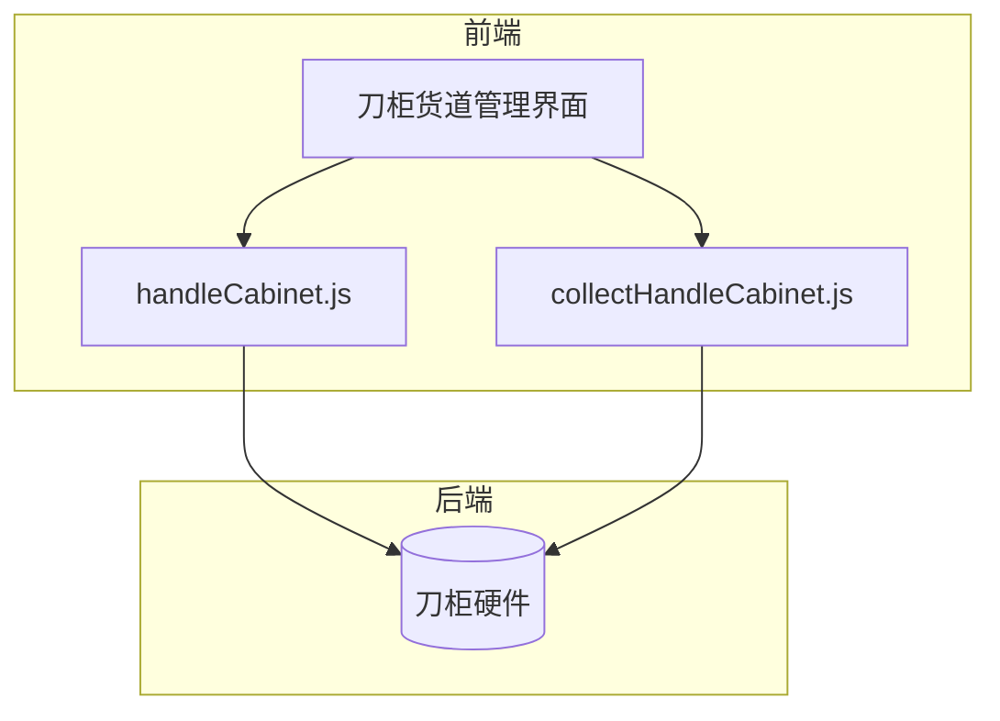
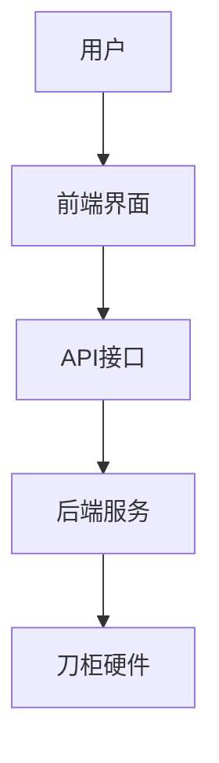
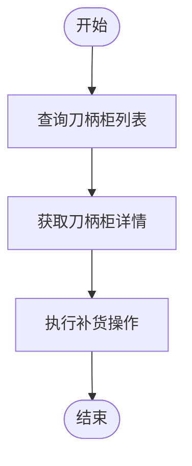
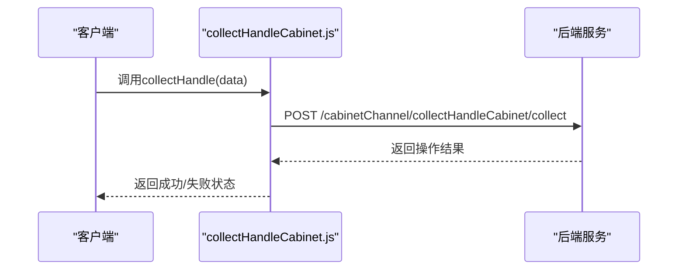
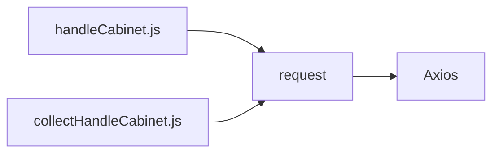

# 刀柜货道接口

<cite>
**本文档引用文件**  
- [handleCabinet.js](file://daoju/src/api/cabinetChannel/handleCabinet.js)
- [collectHandleCabinet.js](file://daoju/src/api/cabinetChannel/collectHandleCabinet.js)
- [README.md](file://README.md)
</cite>

## 目录
1. [简介](#简介)
2. [项目结构](#项目结构)
3. [核心组件](#核心组件)
4. [架构概述](#架构概述)
5. [详细组件分析](#详细组件分析)
6. [依赖分析](#依赖分析)
7. [性能考虑](#性能考虑)
8. [故障排除指南](#故障排除指南)
9. [结论](#结论)

## 简介
本文档详细阐述了刀柜货道管理模块的API接口，重点分析`handleCabinet.js`（刀柄柜管理）和`collectHandleCabinet.js`（收刀柄柜操作）中定义的核心功能。文档涵盖货道状态查询、柜体控制指令、通道锁定/解锁等操作，并说明接口如何支持与刀柜硬件通信协议的交互。通过请求体结构（如柜体编号、货道位置）和响应确认机制的说明，帮助开发者理解系统行为。同时提供实际使用场景示例，如借出刀柄时的货道释放流程，并解释异常处理机制（如货道堵塞反馈）。

## 项目结构
刀柜货道管理模块位于`daoju/src/api/cabinetChannel/`目录下，包含两个主要API文件：`handleCabinet.js`用于刀柄柜的管理和补货操作；`collectHandleCabinet.js`用于收刀柄柜的操作与统计。前端视图文件位于`daoju/src/views/cabinetChannel/`路径下，采用Vue 3 + Element Plus技术栈实现界面交互。整个系统基于前后端分离架构，通过RESTful API进行数据通信。

**图示来源**  
- [handleCabinet.js](file://daoju/src/api/cabinetChannel/handleCabinet.js#L1-L96)
- [collectHandleCabinet.js](file://daoju/src/api/cabinetChannel/collectHandleCabinet.js#L1-L113)

**本节来源**  
- [handleCabinet.js](file://daoju/src/api/cabinetChannel/handleCabinet.js#L1-L96)
- [collectHandleCabinet.js](file://daoju/src/api/cabinetChannel/collectHandleCabinet.js#L1-L113)

## 核心组件
`handleCabinet.js`提供了刀柄柜的增删改查、补货及基础信息获取功能，是刀柜货道状态维护的核心模块。`collectHandleCabinet.js`则专注于收刀操作、批量处理和统计功能，支持对回收流程的全面监控。两个文件均通过统一的`request`工具发送HTTP请求，确保与后端服务稳定通信。

**本节来源**  
- [handleCabinet.js](file://daoju/src/api/cabinetChannel/handleCabinet.js#L1-L96)
- [collectHandleCabinet.js](file://daoju/src/api/cabinetChannel/collectHandleCabinet.js#L1-L113)

## 架构概述
系统采用模块化设计，前端通过API层与后端服务通信，实现刀柜货道的状态同步与控制指令下发。`handleCabinet.js`和`collectHandleCabinet.js`作为独立的服务接口模块，分别对接不同的业务逻辑处理单元。整体架构支持三权分立权限模型（操作员、管理员、审计员），保障系统安全性与职责分离。

**图示来源**  
- [handleCabinet.js](file://daoju/src/api/cabinetChannel/handleCabinet.js#L1-L96)
- [collectHandleCabinet.js](file://daoju/src/api/cabinetChannel/collectHandleCabinet.js#L1-L113)

## 详细组件分析

### handleCabinet.js 分析
该文件提供对刀柄柜的完整生命周期管理，包括列表查询、详情获取、新增、修改、删除、导出和补货操作。其中`restockHandleCabinet`方法用于执行补货逻辑，接收包含柜体编号、货道位置和数量的数据对象，向服务端提交补货请求。

#### 功能调用流程图

**图示来源**  
- [handleCabinet.js](file://daoju/src/api/cabinetChannel/handleCabinet.js#L1-L96)

**本节来源**  
- [handleCabinet.js](file://daoju/src/api/cabinetChannel/handleCabinet.js#L1-L96)

### collectHandleCabinet.js 分析
该文件专注于收刀柄柜的操作，支持单个或批量收刀、统计信息获取以及相关基础数据查询。`collectHandle`方法用于触发单个收刀操作，`batchCollectHandle`支持批量处理，提升效率。此外，还提供品牌、刀柄类型和刀柜列表的获取接口，辅助前端展示。

#### 收刀操作序列图

**图示来源**  
- [collectHandleCabinet.js](file://daoju/src/api/cabinetChannel/collectHandleCabinet.js#L64-L70)

**本节来源**  
- [collectHandleCabinet.js](file://daoju/src/api/cabinetChannel/collectHandleCabinet.js#L1-L113)

## 依赖分析
`handleCabinet.js`和`collectHandleCabinet.js`均依赖于`@/utils/request`模块进行HTTP通信，该模块封装了Axios客户端，提供统一的请求拦截、错误处理和认证机制。两文件无直接相互依赖，但共享相同的API基础架构和权限控制策略。系统整体依赖Vue 3、Element Plus和Vite构建工具链。

**图示来源**  
- [handleCabinet.js](file://daoju/src/api/cabinetChannel/handleCabinet.js#L1)
- [collectHandleCabinet.js](file://daoju/src/api/cabinetChannel/collectHandleCabinet.js#L1)

**本节来源**  
- [handleCabinet.js](file://daoju/src/api/cabinetChannel/handleCabinet.js#L1-L96)
- [collectHandleCabinet.js](file://daoju/src/api/cabinetChannel/collectHandleCabinet.js#L1-L113)

## 性能考虑
所有API接口均采用异步请求方式，避免阻塞主线程。补货和收刀操作建议在非高峰时段执行，以减少对硬件通信的压力。前端应合理使用分页和过滤参数，避免一次性加载过多数据。对于批量操作，建议分批提交以降低网络负载和失败风险。

## 故障排除指南
当出现货道堵塞或通信失败时，系统应返回明确的错误码和提示信息。常见问题包括：
- 柜体离线：检查网络连接和设备电源状态
- 货道堵塞：通过`listHandleCabinet`查询状态并人工干预
- 补货失败：确认货道容量和输入参数合法性

**本节来源**  
- [handleCabinet.js](file://daoju/src/api/cabinetChannel/handleCabinet.js#L64-L70)
- [collectHandleCabinet.js](file://daoju/src/api/cabinetChannel/collectHandleCabinet.js#L64-L70)

## 结论
本文档全面介绍了刀柜货道管理模块的API设计与实现，明确了`handleCabinet.js`和`collectHandleCabinet.js`的功能边界与使用方式。通过标准化的接口定义和清晰的通信流程，系统能够高效支持刀具借还、补货和回收等核心业务场景。建议在实际开发中结合模拟数据测试接口稳定性，并遵循权限控制规范确保系统安全。