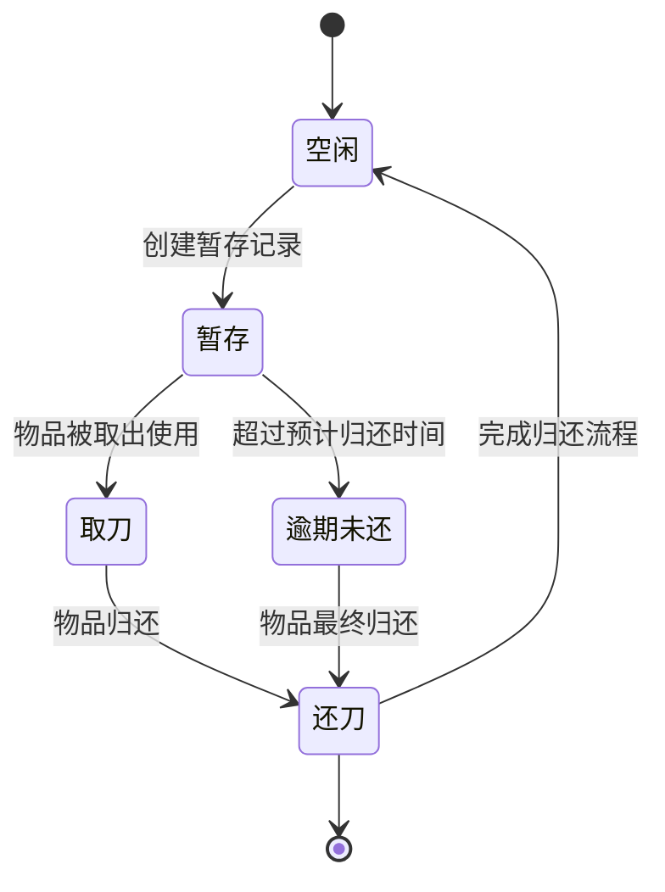

# 公共暂存记录接口

<cite>
**本文档引用文件**  
- [publicStorage.js](file://daoju/src/api/historyRecord/publicStorage.js#L1-L74)
- [publicStorage\index.vue](file://daoju/src/views/historyRecord/publicStorage/index.vue#L1-L530)
- [daoBingTemporaryStorage\index.vue](file://daoju/src/views/borrowManagement/daoBingTemporaryStorage/index.vue#L1-L882)
- [daoTouTemporaryStorage\index.vue](file://daoju/src/views/borrowManagement/daoTouTemporaryStorage/index.vue#L1-L888)
</cite>

## 目录
1. [接口概述](#接口概述)
2. [核心接口说明](#核心接口说明)
3. [业务流程与状态流转](#业务流程与状态流转)
4. [查询与统计功能](#查询与统计功能)
5. [接口调用示例](#接口调用示例)
6. [错误处理与注意事项](#错误处理与注意事项)

## 接口概述

本接口文档旨在详细说明公共暂存记录模块的核心API，包括分页查询、导出、详情获取、统计分析及批量删除等功能。公共暂存区用于管理刀具、刀柄等物品的临时存放，支持基于暂存时间、操作人、所属柜体等条件的查询，并提供逾期预警的统计分析能力。该模块是刀具管理系统中实现物品流转与监控的关键组成部分。

**Section sources**
- [publicStorage.js](file://daoju/src/api/historyRecord/publicStorage.js#L1-L74)
- [publicStorage\index.vue](file://daoju/src/views/historyRecord/publicStorage/index.vue#L1-L530)

## 核心接口说明

### getPublicStorageList (分页查询)

此接口用于分页查询公共暂存记录。

- **URL**: `/qw/knife/web/from/mes/record/publicStorage`
- **Method**: `GET`
- **参数**: `query` 对象，包含分页信息（如pageNum, pageSize）及查询条件。
- **返回**: 分页的公共暂存记录列表。

**Section sources**
- [publicStorage.js](file://daoju/src/api/historyRecord/publicStorage.js#L3-L9)

### exportPublicStorage (导出)

此接口用于导出公共暂存记录。

- **URL**: `/qw/knife/web/from/mes/record/exportPublicStorage`
- **Method**: `GET`
- **参数**: `query` 对象，用于指定导出范围。
- **返回**: 文件流（`responseType: 'blob'`），可直接用于浏览器下载。

**Section sources**
- [publicStorage.js](file://daoju/src/api/historyRecord/publicStorage.js#L12-L19)

### getPublicStorageDetail (详情)

此接口用于获取单条公共暂存记录的详细信息。

- **URL**: `/qw/knife/web/from/mes/record/publicStorage/{id}`
- **Method**: `GET`
- **参数**: `id` - 记录的唯一标识符。
- **返回**: 指定ID的公共暂存记录详情。

**Section sources**
- [publicStorage.js](file://daoju/src/api/historyRecord/publicStorage.js#L22-L27)

### getPublicStorageStats (统计)

此接口用于查询公共暂存记录的统计信息。

- **URL**: `/qw/knife/web/from/mes/record/publicStorage/stats`
- **Method**: `GET`
- **参数**: `query` 对象，可包含时间范围、状态等统计条件。
- **返回**: 统计结果，如数量、金额等聚合数据。

**Section sources**
- [publicStorage.js](file://daoju/src/api/historyRecord/publicStorage.js#L30-L36)

### deletePublicStorageRecords (批量删除)

此接口用于批量删除公共暂存记录。

- **URL**: `/qw/knife/web/from/mes/record/publicStorage`
- **Method**: `DELETE`
- **参数**: `ids` - 要删除的记录ID数组（作为请求体 `data` 发送）。
- **返回**: 删除操作的结果。

**Section sources**
- [publicStorage.js](file://daoju/src/api/historyRecord/publicStorage.js#L39-L45)

## 业务流程与状态流转

公共暂存区的业务流程主要包括暂存创建、领取确认和超时处理三个核心环节。

1.  **暂存创建 (Storage Creation)**:
    *   用户（如张三）在系统中发起暂存请求，填写暂存人、物品信息（品牌、型号）、数量、暂存时间、预计归还时间及用途。
    *   系统调用 `createPublicStorageRecord` 接口创建记录，状态初始化为“暂存”（`status: 3`）。
    *   系统可自动分配或由用户指定一个库位号（`stockLoc`）用于存放物品。

2.  **领取确认 (Collection Confirmation)**:
    *   当物品需要被取出使用时，操作员在系统中执行“取刀”操作。
    *   系统记录操作日志，状态可能变更为“取刀”（`status: 0`），并更新操作人和时间。
    *   此过程确保了物品流转的可追溯性。

3.  **超时处理 (Timeout Handling)**:
    *   系统会监控每条暂存记录的“预计归还时间”。
    *   若物品在预计时间后仍未归还，其状态将被标记为“逾期未还”。
    *   系统可通过 `getPublicStorageStats` 接口进行统计分析，生成逾期预警报告，提醒相关人员处理。



**Diagram sources**
- [publicStorage.js](file://daoju/src/api/historyRecord/publicStorage.js#L48-L64)
- [publicStorage\index.vue](file://daoju/src/views/historyRecord/publicStorage/index.vue#L457-L467)

## 查询与统计功能

系统支持多种条件的查询和统计，以满足不同的管理需求。

### 查询条件
*   **暂存时间**: 可通过 `startTime` 和 `endTime` 参数查询指定时间范围内的记录。
*   **操作人**: 可通过 `lendUserName` 或 `storageUserName` 字段进行筛选。
*   **所属柜体**: 可通过 `cabinetCode` 字段精确查询特定刀柜的暂存记录。
*   **记录状态**: 支持按 `status` 字段（如取刀、还刀、暂存、逾期等）进行过滤。

### 统计分析
*   **逾期预警**: 通过 `getPublicStorageStats` 接口，结合当前时间和“预计归还时间”字段，可以统计出所有逾期未还的记录数量和详情。
*   **价值统计**: 可以根据 `newPrice` 和 `quantity` 字段，统计暂存物品的总价值，用于库存管理。
*   **高频使用分析**: 可以按品牌、型号等维度进行统计，分析哪些物品被暂存的频率最高。

**Section sources**
- [publicStorage\index.vue](file://daoju/src/views/historyRecord/publicStorage/index.vue#L7-L54)
- [publicStorage.js](file://daoju/src/api/historyRecord/publicStorage.js#L30-L36)

## 接口调用示例

以下为基于前端代码的调用示例：

### 分页查询示例
```javascript
// 查询第一页，每页20条，且状态为“暂存”的记录
const query = {
  pageNum: 1,
  pageSize: 20,
  recordStatus: 3 // 3代表“暂存”
};
getPublicStorageList(query).then(response => {
  console.log(response.data);
});
```

### 导出逾期记录示例
```javascript
// 导出所有逾期未还的记录
const query = {
  recordStatus: 3, // 暂存状态
  endTime: new Date().toISOString().split('T')[0] // 结束时间为今天，意味着已过期
};
exportPublicStorage(query);
```

### 批量删除示例
```javascript
// 删除ID为1, 2, 3的暂存记录
const idsToDelete = [1, 2, 3];
deletePublicStorageRecords(idsToDelete).then(() => {
  console.log("删除成功");
});
```

**Section sources**
- [publicStorage.js](file://daoju/src/api/historyRecord/publicStorage.js#L3-L45)
- [publicStorage\index.vue](file://daoju/src/views/historyRecord/publicStorage/index.vue#L408-L411)

## 错误处理与注意事项

*   **权限校验**: 在执行“归还”等操作时，系统会校验操作人是否为暂存人本人，非本人无法操作。
*   **数据完整性**: 在调用 `deletePublicStorageRecords` 接口时，需确保传入的ID数组不为空。
*   **导出处理**: `exportPublicStorage` 接口返回的是Blob数据，前端需正确处理以触发文件下载。
*   **状态流转**: 业务状态（`status`）的变更应遵循预设的流程，避免出现逻辑错误。

**Section sources**
- [daoBingTemporaryStorage\index.vue](file://daoju/src/views/borrowManagement/daoBingTemporaryStorage/index.vue#L740-L743)
- [publicStorage.js](file://daoju/src/api/historyRecord/publicStorage.js#L18)