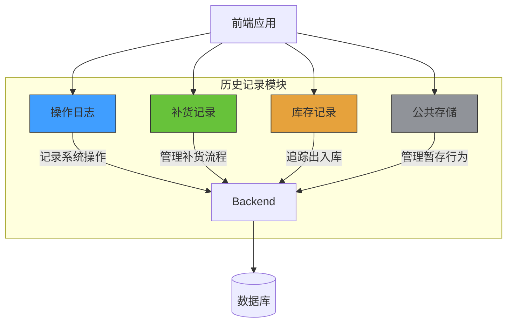
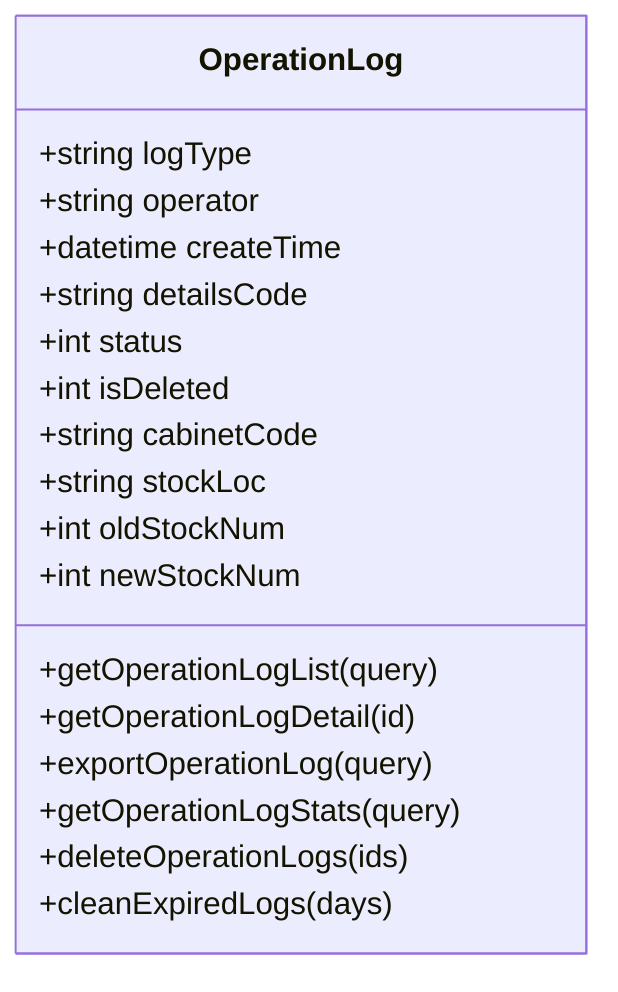
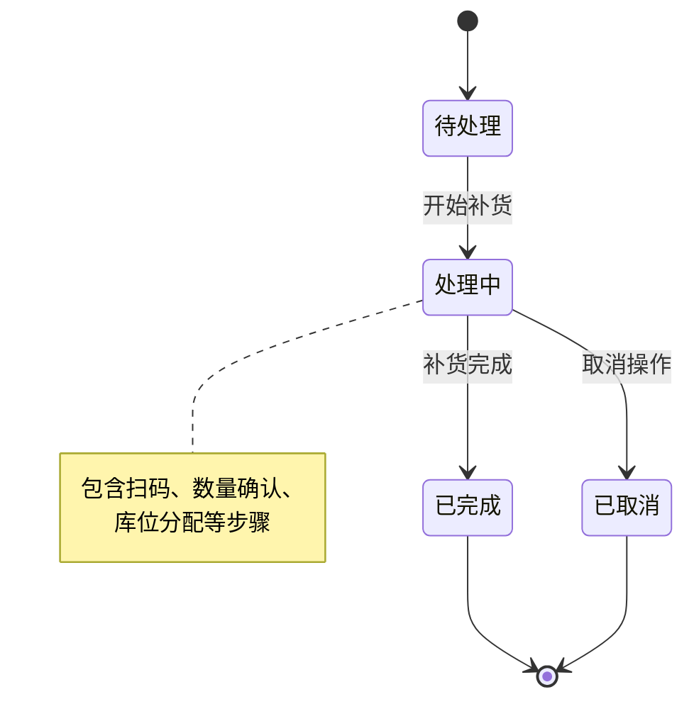
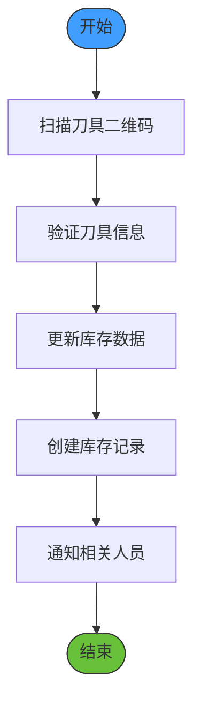
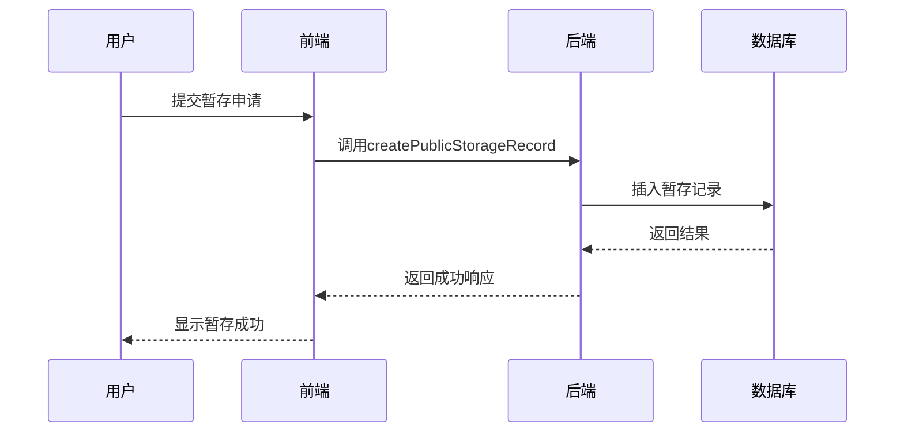
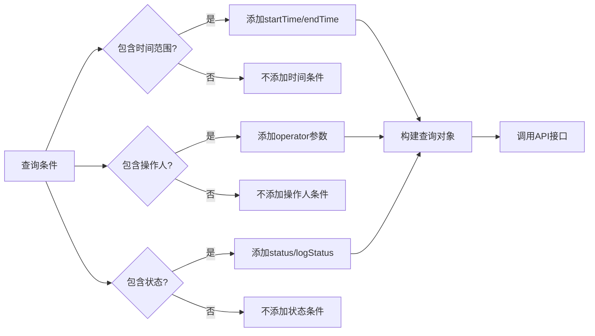
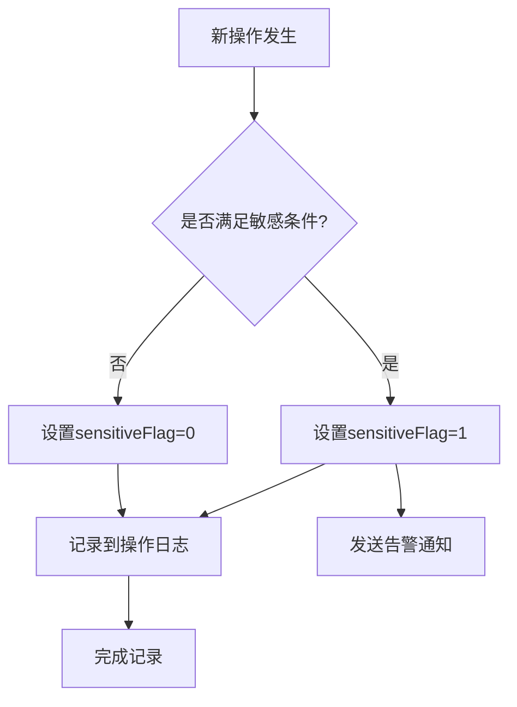

# 历史记录接口

<cite>
**本文档引用文件**  
- [operationLog.js](file://daoju/src/api/historyRecord/operationLog.js)
- [restockRecord.js](file://daoju/src/api/historyRecord/restockRecord.js)
- [stockRecord.js](file://daoju/src/api/historyRecord/stockRecord.js)
- [publicStorage.js](file://daoju/src/api/historyRecord/publicStorage.js)
- [index.vue（操作日志）](file://daoju/src/views/historyRecord/operationLog/index.vue)
- [index.vue（补货记录）](file://daoju/src/views/historyRecord/restockRecord/index.vue)
- [index.vue（公共存储）](file://daoju/src/views/historyRecord/publicStorage/index.vue)
</cite>

## 目录
1. [引言](#引言)
2. [接口概览](#接口概览)
3. [操作日志接口](#操作日志接口)
4. [补货记录接口](#补货记录接口)
5. [库存记录接口](#库存记录接口)
6. [公共存储接口](#公共存储接口)
7. [通用查询参数](#通用查询参数)
8. [审计分析示例](#审计分析示例)
9. [日志归档与数据保留](#日志归档与数据保留)
10. [性能优化与敏感操作标记](#性能优化与敏感操作标记)

## 引言

本接口文档旨在全面阐述刀具管理系统中历史记录模块的审计追踪功能。系统通过操作日志、补货记录、库存记录和公共存储四大核心接口，实现对关键业务操作的完整追溯。所有接口均支持分页查询、数据导出、详情查看、统计分析及批量删除功能，确保系统具备完善的审计能力，满足生产管理中的合规性与可追溯性要求。

**Section sources**
- [operationLog.js](file://daoju/src/api/historyRecord/operationLog.js#L1-L55)
- [restockRecord.js](file://daoju/src/api/historyRecord/restockRecord.js#L1-L65)
- [stockRecord.js](file://daoju/src/api/historyRecord/stockRecord.js#L1-L47)
- [publicStorage.js](file://daoju/src/api/historyRecord/publicStorage.js#L1-L74)

## 接口概览

历史记录模块提供四个主要的审计接口，分别对应不同类型的业务操作记录。所有接口均遵循统一的RESTful设计规范，使用标准的HTTP方法进行资源操作。



**Diagram sources**
- [operationLog.js](file://daoju/src/api/historyRecord/operationLog.js#L1-L55)
- [restockRecord.js](file://daoju/src/api/historyRecord/restockRecord.js#L1-L65)
- [stockRecord.js](file://daoju/src/api/historyRecord/stockRecord.js#L1-L47)
- [publicStorage.js](file://daoju/src/api/historyRecord/publicStorage.js#L1-L74)

## 操作日志接口

操作日志接口用于记录系统中所有关键业务操作，是审计追踪的核心组件。该接口提供完整的CRUD操作和数据管理功能。

### 核心功能

- **分页查询**：`getOperationLogList(query)` - 支持按时间、操作人、日志类型等条件分页获取操作日志
- **详情查看**：`getOperationLogDetail(id)` - 获取指定ID操作日志的详细信息
- **数据导出**：`exportOperationLog(query)` - 导出符合查询条件的操作日志数据
- **统计分析**：`getOperationLogStats(query)` - 获取操作日志的统计信息
- **批量删除**：`deleteOperationLogs(ids)` - 批量删除指定ID的操作日志
- **过期清理**：`cleanExpiredLogs(days)` - 清理指定天数前的过期日志

### 字段结构

操作日志包含以下关键字段：
- `logType`：日志类型（如库存变更、补货操作等）
- `operator`：操作人姓名
- `createTime`：操作创建时间
- `detailsCode`：操作详情编码
- `status`：业务状态
- `isDeleted`：删除标记



**Diagram sources**
- [operationLog.js](file://daoju/src/api/historyRecord/operationLog.js#L1-L55)
- [index.vue（操作日志）](file://daoju/src/views/historyRecord/operationLog/index.vue#L85-L108)

**Section sources**
- [operationLog.js](file://daoju/src/api/historyRecord/operationLog.js#L1-L55)

## 补货记录接口

补货记录接口专门用于管理刀具的补货流程，支持多种补货类型，确保补货操作的可追溯性。

### 核心功能

- **分页查询**：`getRestockRecordList(query)` - 分页获取补货记录
- **详情查看**：`getRestockRecordDetail(id)` - 获取补货记录详情
- **数据导出**：`exportRestockRecord(query)` - 导出补货记录数据
- **统计分析**：`getRestockRecordStats(query)` - 获取补货记录统计信息
- **批量删除**：`deleteRestockRecords(ids)` - 批量删除补货记录
- **创建记录**：`createRestockRecord(data)` - 创建新的补货记录
- **更新记录**：`updateRestockRecord(data)` - 更新现有补货记录

### 补货类型

系统支持多种补货类型，通过`logType`字段区分：
- `RESTOCK`：常规补货
- `EMERGENCY_RESTOCK`：紧急补货（红色标记）
- `NEW_PRODUCT_RESTOCK`：新品补货（绿色标记）
- `PLANNED_RESTOCK`：计划补货（蓝色标记）
- `REPAIR_RESTOCK`：返修补货（黄色标记）



**Diagram sources**
- [restockRecord.js](file://daoju/src/api/historyRecord/restockRecord.js#L1-L65)
- [index.vue（补货记录）](file://daoju/src/views/historyRecord/restockRecord/index.vue#L504-L573)

**Section sources**
- [restockRecord.js](file://daoju/src/api/historyRecord/restockRecord.js#L1-L65)

## 库存记录接口

库存记录接口用于追踪所有刀具的出入库操作，是库存管理的核心审计组件。

### 核心功能

- **分页查询**：`getStockRecordList(query)` - 分页获取出入库记录
- **详情查看**：`getStockRecordDetail(id)` - 获取出入库记录详情
- **数据导出**：`exportStockRecord(query)` - 导出出入库记录数据
- **统计分析**：`getStockRecordStats(query)` - 获取出入库记录统计信息
- **批量删除**：`deleteStockRecords(ids)` - 批量删除出入库记录

### 字段结构

库存记录包含以下关键字段：
- `detailsName`：操作详情名称
- `oldStockNum`：操作前库存数
- `newStockNum`：操作后库存数
- `stockLoc`：库位号
- `cabinetCode`：刀柜编码
- `quantity`：操作数量



**Diagram sources**
- [stockRecord.js](file://daoju/src/api/historyRecord/stockRecord.js#L1-L47)
- [index.vue（库存记录）](file://daoju/src/views/historyRecord/stockRecord/index.vue#L164-L196)

**Section sources**
- [stockRecord.js](file://daoju/src/api/historyRecord/stockRecord.js#L1-L47)

## 公共存储接口

公共存储接口用于管理刀具的公共暂存行为，支持创建、更新和批量处理操作。

### 核心功能

- **分页查询**：`getPublicStorageList(query)` - 分页获取公共暂存记录
- **详情查看**：`getPublicStorageDetail(id)` - 获取公共暂存记录详情
- **数据导出**：`exportPublicStorage(query)` - 导出公共暂存记录数据
- **统计分析**：`getPublicStorageStats(query)` - 获取公共暂存记录统计信息
- **批量删除**：`deletePublicStorageRecords(ids)` - 批量删除公共暂存记录
- **创建记录**：`createPublicStorageRecord(data)` - 创建公共暂存记录
- **更新记录**：`updatePublicStorageRecord(data)` - 更新公共暂存记录
- **批量处理**：`batchProcessPublicStorage(data)` - 批量处理公共暂存记录

### 业务状态

公共存储记录包含多种业务状态：
- `createDept`：创建部门
- `createUser`：创建人
- `updateUser`：更新人
- `operator`：操作人
- `logStatus`：日志状态（0:操作日志, 1:公共暂存, 2:补货）



**Diagram sources**
- [publicStorage.js](file://daoju/src/api/historyRecord/publicStorage.js#L1-L74)
- [index.vue（公共存储）](file://daoju/src/views/historyRecord/publicStorage/index.vue#L148-L165)

**Section sources**
- [publicStorage.js](file://daoju/src/api/historyRecord/publicStorage.js#L1-L74)

## 通用查询参数

所有历史记录接口支持统一的查询参数，便于进行多维度审计分析。

### 时间范围查询

所有接口均支持通过`startTime`和`endTime`参数进行时间范围查询，格式为`YYYY-MM-DD HH:mm:ss`。

### 操作人过滤

通过`operator`参数可按操作人姓名进行过滤，支持模糊查询。

### 状态过滤

通过`status`和`logStatus`参数可按业务状态和日志状态进行过滤。

### 分页参数

- `current`：当前页码（默认1）
- `size`：每页大小（默认20）
- `total`：总记录数（返回值）



**Section sources**
- [operationLog.js](file://daoju/src/api/historyRecord/operationLog.js#L4-L9)
- [restockRecord.js](file://daoju/src/api/historyRecord/restockRecord.js#L4-L9)
- [stockRecord.js](file://daoju/src/api/historyRecord/stockRecord.js#L4-L9)
- [publicStorage.js](file://daoju/src/api/historyRecord/publicStorage.js#L4-L9)

## 审计分析示例

以下示例展示如何通过组合查询定位特定操作行为。

### 示例1：查找紧急补货操作

```javascript
// 查找最近24小时内所有紧急补货操作
const query = {
  startTime: '2024-12-27 00:00:00',
  endTime: '2024-12-28 00:00:00',
  logType: 'EMERGENCY_RESTOCK',
  operator: '张三',
  current: 1,
  size: 10
}

getRestockRecordList(query).then(response => {
  console.log('紧急补货记录:', response.data)
})
```

### 示例2：分析特定刀柜的操作日志

```javascript
// 分析CAB001刀柜的所有操作
const query = {
  cabinetCode: 'CAB001',
  startTime: '2024-12-01 00:00:00',
  endTime: '2024-12-31 23:59:59',
  logType: 'STOCK_CHANGE'
}

getOperationLogList(query).then(response => {
  const stats = response.data.reduce((acc, log) => {
    acc[log.operator] = (acc[log.operator] || 0) + 1
    return acc
  }, {})
  console.log('操作统计:', stats)
})
```

### 示例3：公共存储超期未还分析

```javascript
// 查找超过3天未归还的公共存储记录
const threeDaysAgo = new Date(Date.now() - 3 * 24 * 60 * 60 * 1000)
const query = {
  startTime: threeDaysAgo.toISOString().slice(0, 19).replace('T', ' '),
  status: 1, // 未归还状态
  size: 100
}

getPublicStorageList(query).then(response => {
  const overdueRecords = response.data.filter(record => 
    !record.actualReturnDate || 
    new Date(record.actualReturnDate) > new Date(record.expectedReturnDate)
  )
  console.log('超期记录:', overdueRecords)
})
```

**Section sources**
- [restockRecord.js](file://daoju/src/api/historyRecord/restockRecord.js#L4-L9)
- [operationLog.js](file://daoju/src/api/historyRecord/operationLog.js#L4-L9)
- [publicStorage.js](file://daoju/src/api/historyRecord/publicStorage.js#L4-L9)

## 日志归档与数据保留

系统实施严格的日志归档策略，确保审计数据的完整性和存储效率。

### 数据保留周期

- **操作日志**：保留180天
- **补货记录**：永久保留
- **库存记录**：永久保留
- **公共存储**：保留365天

### 归档策略

通过`cleanExpiredLogs(days)`接口定期清理过期日志：

```javascript
// 每月执行一次，清理180天前的操作日志
cleanExpiredLogs(180).then(response => {
  console.log('过期日志清理完成:', response.data)
}).catch(error => {
  console.error('清理失败:', error)
})
```

### 敏感操作标记

系统自动标记敏感操作，包括：
- 库存数量异常变更
- 高价值刀具操作
- 非工作时间操作
- 批量删除操作

这些标记有助于快速识别潜在风险操作，加强审计监控。

**Section sources**
- [operationLog.js](file://daoju/src/api/historyRecord/operationLog.js#L48-L55)
- [index.vue（操作日志）](file://daoju/src/views/historyRecord/operationLog/index.vue#L147-L167)

## 性能优化与敏感操作标记

为确保历史记录查询的高性能，系统实施了多项优化策略。

### 分页性能优化

- **默认分页**：所有列表接口默认分页，每页20条记录
- **索引优化**：在`createTime`、`operator`、`cabinetCode`等常用查询字段上建立数据库索引
- **缓存机制**：对频繁查询的统计信息进行缓存

### 敏感操作标记机制

系统通过以下方式标记敏感操作：

1. **自动检测**：当操作满足以下任一条件时自动标记
   - 单次操作数量超过阈值
   - 操作时间在非工作时段
   - 操作人权限异常
   - 连续快速操作

2. **标记字段**：在日志记录中添加`sensitiveFlag`字段
3. **告警通知**：对标记的敏感操作发送告警通知



**Section sources**
- [operationLog.js](file://daoju/src/api/historyRecord/operationLog.js#L4-L55)
- [index.vue（操作日志）](file://daoju/src/views/historyRecord/operationLog/index.vue#L85-L108)