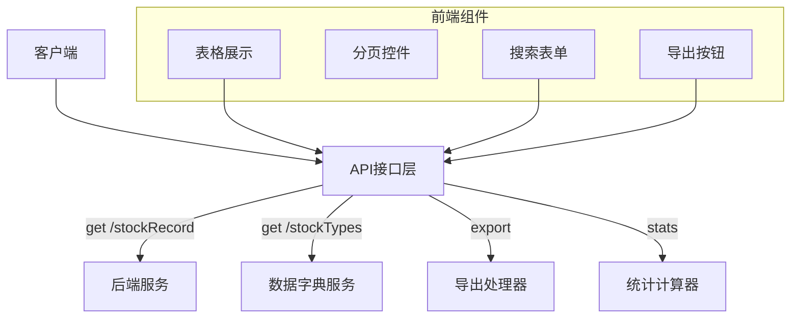
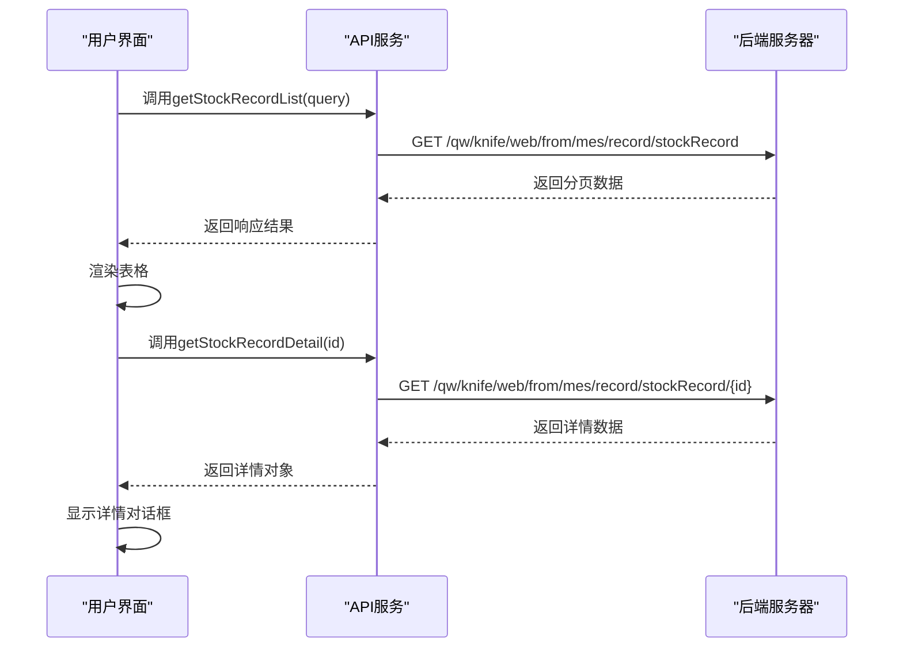
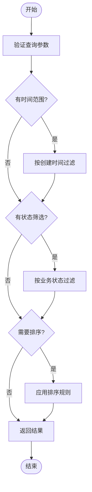
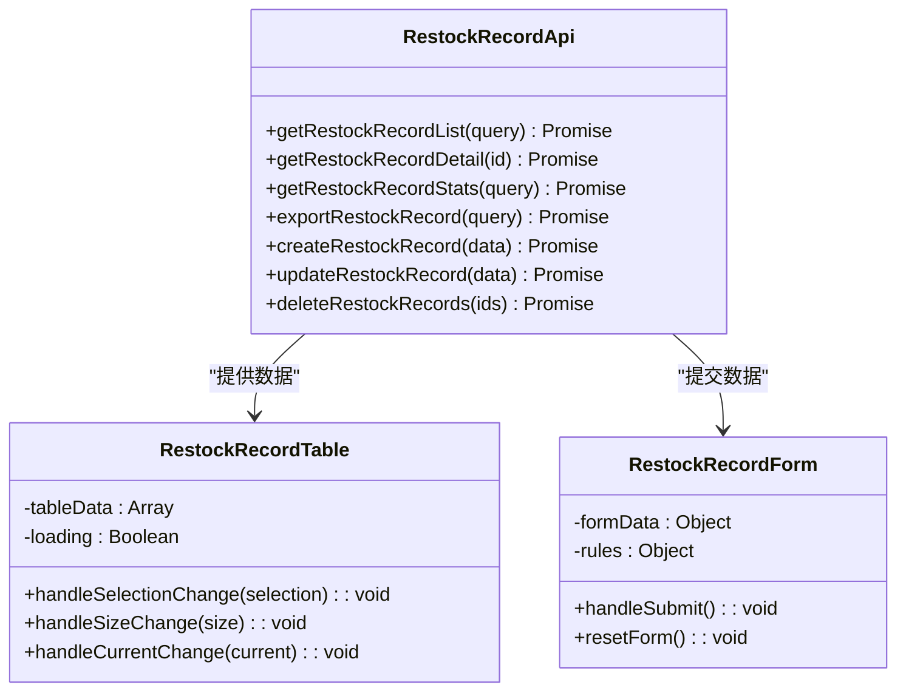
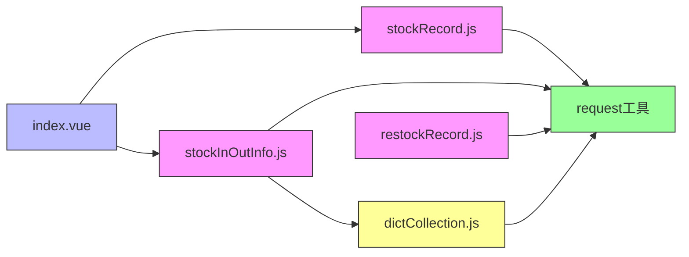

# 库存记录接口

<cite>
**本文档中引用的文件**
- [stockRecord.js](file://daoju/src/api/historyRecord/stockRecord.js)
- [stockInOutInfo.js](file://daoju/src/api/consumableService/stockInOutInfo.js)
- [dictCollection.js](file://daoju/src/api/dataDictionary/dictCollection.js)
- [restockRecord.js](file://daoju/src/api/historyRecord/restockRecord.js)
- [index.vue](file://daoju/src/views/historyRecord/stockRecord/index.vue)
</cite>

## 目录
1. [简介](#简介)
2. [项目结构](#项目结构)
3. [核心组件](#核心组件)
4. [架构概述](#架构概述)
5. [详细组件分析](#详细组件分析)
6. [依赖分析](#依赖分析)
7. [性能考虑](#性能考虑)
8. [故障排除指南](#故障排除指南)
9. [结论](#结论)

## 简介
本API文档详细描述了刀具管理系统中的库存记录模块，重点涵盖库存变更日志的查询接口功能。系统支持分页列表展示、详情查看、数据导出和统计分析等核心能力。文档明确了库存变动类型（如入库、出库、报废等）的编码规范，并说明了与借还记录、补货单等业务单据的追溯机制。此外，还介绍了库存快照生成逻辑、历史库存查询能力以及按刀具、品牌、仓库位置等维度进行趋势分析的API使用方式。

## 项目结构
库存记录模块主要由前端API定义、视图组件和后端服务接口构成。前端API位于`daoju/src/api/historyRecord`目录下，包含`stockRecord.js`和`restockRecord.js`两个核心文件，分别处理出入库记录和补货记录。视图层通过`daoju/src/views/historyRecord/stockRecord/index.vue`实现用户交互界面。数据字典服务支持变动类型编码管理，相关逻辑在`consumableService/stockInOutInfo.js`中定义。

```mermaid
graph TB
subgraph "前端视图"
A[index.vue] --> B[stockRecord.js]
A --> C[stockInOutInfo.js]
end
subgraph "API接口"
B --> D[/qw/knife/web/from/mes/record/stockRecord*]
C --> E[/consumableService/stockInOutInfo/*]
end
subgraph "数据字典"
F[dictCollection.js] --> G[stockTypes]
C --> G
end
A --> |调用| B
B --> |HTTP请求| D
C --> |获取类型列表| G
```

**图示来源**
- [stockRecord.js](file://daoju/src/api/historyRecord/stockRecord.js#L3-L47)
- [stockInOutInfo.js](file://daoju/src/api/consumableService/stockInOutInfo.js#L57-L63)
- [index.vue](file://daoju/src/views/historyRecord/stockRecord/index.vue#L1-L541)

**本节来源**
- [stockRecord.js](file://daoju/src/api/historyRecord/stockRecord.js#L1-L47)
- [stockInOutInfo.js](file://daoju/src/api/consumableService/stockInOutInfo.js#L1-L80)
- [index.vue](file://daoju/src/views/historyRecord/stockRecord/index.vue#L1-L541)

## 核心组件
库存记录模块的核心功能包括分页查询出入库记录、导出记录、查看详情、统计分析及批量删除操作。补货记录模块额外支持创建和更新功能。系统通过`stockInOutInfo.js`提供库存变动类型列表查询接口，用于前端渲染选择器。数据字典服务`dictCollection.js`支持通用字典项管理，为库存类型编码提供基础支撑。

**本节来源**
- [stockRecord.js](file://daoju/src/api/historyRecord/stockRecord.js#L3-L47)
- [restockRecord.js](file://daoju/src/api/historyRecord/restockRecord.js#L4-L65)
- [stockInOutInfo.js](file://daoju/src/api/consumableService/stockInOutInfo.js#L57-L63)

## 架构概述
系统采用前后端分离架构，前端通过Vue.js框架构建用户界面，利用Element Plus组件库实现表单、表格和弹窗等UI元素。API层封装HTTP请求，统一使用`request`工具发送RESTful接口调用。库存变动类型通过独立接口获取，确保编码规范的集中管理。分页机制基于`current`和`size`参数实现，支持动态加载大量数据。导出功能返回Blob流，便于浏览器下载文件。



**图示来源**
- [stockRecord.js](file://daoju/src/api/historyRecord/stockRecord.js#L4-L47)
- [stockInOutInfo.js](file://daoju/src/api/consumableService/stockInOutInfo.js#L57-L63)
- [index.vue](file://daoju/src/views/historyRecord/stockRecord/index.vue#L64-L114)

## 详细组件分析

### 出入库记录分析
该组件实现了完整的CRUD操作，重点在于查询和展示库存变动历史。支持按时间范围、业务状态、排序类型等条件进行过滤查询，满足多维分析需求。

#### 接口调用流程


**图示来源**
- [stockRecord.js](file://daoju/src/api/historyRecord/stockRecord.js#L4-L28)
- [index.vue](file://daoju/src/views/historyRecord/stockRecord/index.vue#L470-L473)

#### 查询逻辑流程图


**图示来源**
- [index.vue](file://daoju/src/views/historyRecord/stockRecord/index.vue#L386-L435)

**本节来源**
- [stockRecord.js](file://daoju/src/api/historyRecord/stockRecord.js#L4-L47)
- [index.vue](file://daoju/src/views/historyRecord/stockRecord/index.vue#L1-L541)

### 补货记录分析
补货记录模块在基础查询功能之上，增加了创建和更新能力，形成完整的工作流闭环。支持对补货行为进行全生命周期管理。

#### 补货记录操作类图


**图示来源**
- [restockRecord.js](file://daoju/src/api/historyRecord/restockRecord.js#L4-L65)
- [index.vue](file://daoju/src/views/historyRecord/stockRecord/index.vue#L1-L541)

**本节来源**
- [restockRecord.js](file://daoju/src/api/historyRecord/restockRecord.js#L1-L65)

### 库存变动类型编码分析
系统通过标准化编码体系管理库存变动类型，确保数据一致性与可追溯性。类型信息通过独立接口获取，支持动态配置。

#### 变动类型编码表
| 编码 | 类型名称 | 说明 |
|------|----------|------|
| 0 | 入库 | 物料进入仓库 |
| 1 | 出库 | 物料离开仓库 |
| 2 | 报废 | 物料损毁处理 |
| 3 | 调拨 | 仓库间转移 |
| 4 | 盘点 | 库存数量核对 |

**图示来源**
- [stockInOutInfo.js](file://daoju/src/api/consumableService/stockInOutInfo.js#L57-L63)
- [dictCollection.js](file://daoju/src/api/dataDictionary/dictCollection.js#L73-L78)

**本节来源**
- [stockInOutInfo.js](file://daoju/src/api/consumableService/stockInOutInfo.js#L57-L63)
- [dictCollection.js](file://daoju/src/api/dataDictionary/dictCollection.js#L73-L78)

## 依赖分析
库存记录模块依赖多个基础服务组件，形成清晰的依赖关系网络。



**图示来源**
- [stockRecord.js](file://daoju/src/api/historyRecord/stockRecord.js#L1)
- [stockInOutInfo.js](file://daoju/src/api/consumableService/stockInOutInfo.js#L1)
- [dictCollection.js](file://daoju/src/api/dataDictionary/dictCollection.js#L1)
- [index.vue](file://daoju/src/views/historyRecord/stockRecord/index.vue#L187)

**本节来源**
- [stockRecord.js](file://daoju/src/api/historyRecord/stockRecord.js#L1-L47)
- [stockInOutInfo.js](file://daoju/src/api/consumableService/stockInOutInfo.js#L1-L80)
- [dictCollection.js](file://daoju/src/api/dataDictionary/dictCollection.js#L1-L88)

## 性能考虑
系统在处理大量库存记录时采用分页加载策略，避免一次性加载过多数据导致内存溢出。查询接口支持字段级过滤，减少网络传输量。导出功能采用流式响应（responseType: 'blob'），适合处理大数据量导出场景。前端实现虚拟滚动和懒加载机制，提升大表格渲染性能。建议生产环境对高频查询字段建立数据库索引，如`createTime`、`status`、`cutterId`等。

## 故障排除指南
当遇到库存记录查询异常时，可按以下步骤排查：
1. 检查API接口返回状态码是否为200
2. 验证请求参数格式是否正确，特别是时间格式
3. 确认用户权限是否具备访问该接口的权限
4. 查看浏览器控制台是否有JavaScript错误
5. 检查网络请求是否被防火墙拦截
6. 验证导出功能时需确认浏览器是否阻止了弹出窗口

对于数据不一致问题，应检查：
- 业务单据与库存变动的关联关系
- 库存快照生成时间点是否准确
- 并发操作导致的数据竞争问题
- 审计日志中是否存在异常操作记录

**本节来源**
- [stockRecord.js](file://daoju/src/api/historyRecord/stockRecord.js#L6-L8)
- [index.vue](file://daoju/src/views/historyRecord/stockRecord/index.vue#L476-L479)

## 结论
库存记录模块提供了完整的出入库管理功能，支持精细化查询、多维统计和数据追溯。通过标准化的API设计和清晰的编码体系，确保了系统的可维护性和扩展性。未来可进一步优化方向包括：增加实时库存看板、支持复杂条件组合查询、完善审计追踪机制等。