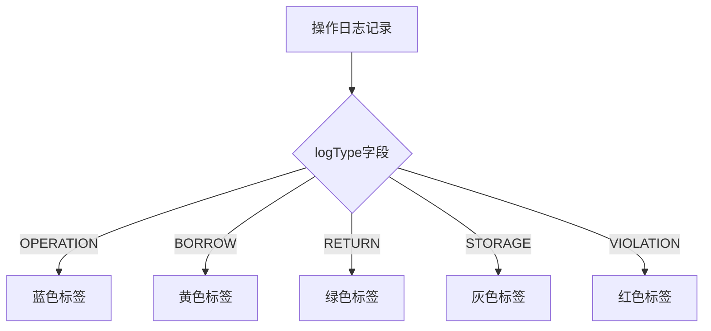
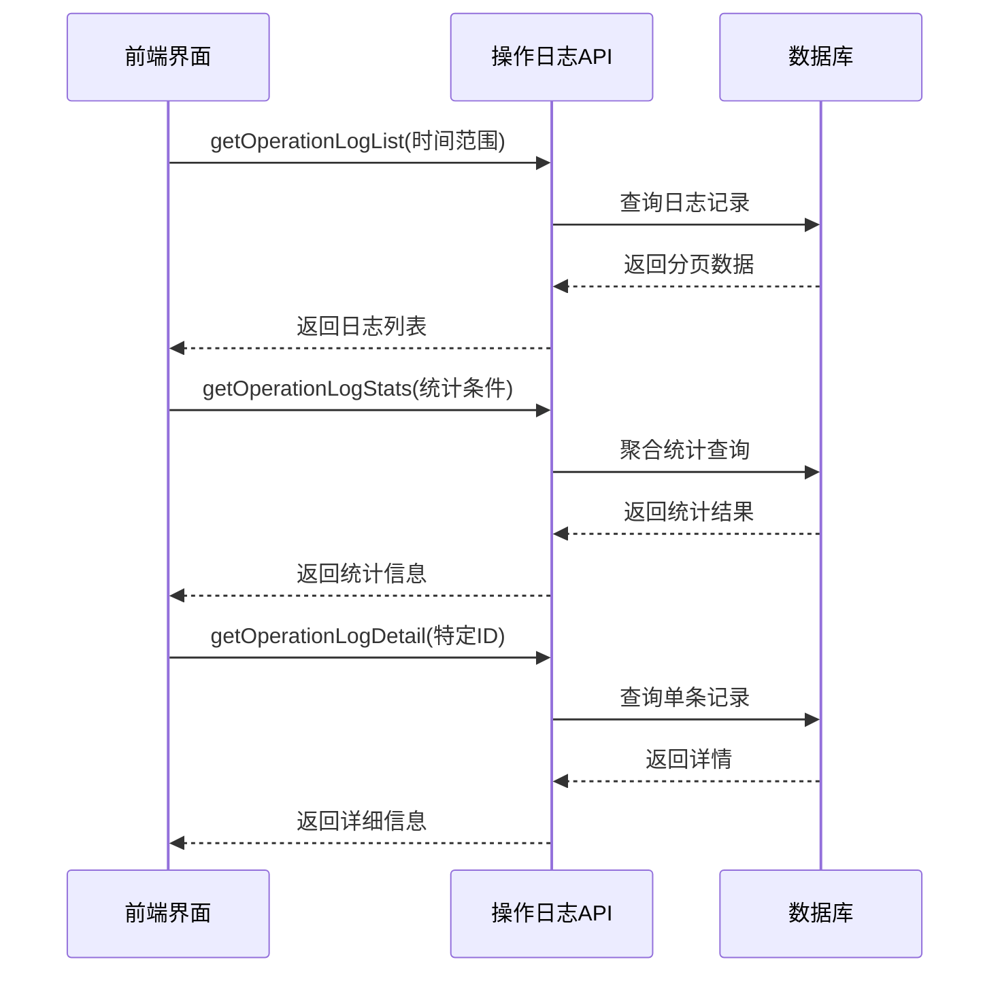

# 操作日志接口

<cite>
**Referenced Files in This Document**   
- [operationLog.js](file://daoju/src/api/historyRecord/operationLog.js)
- [operlog.js](file://daoju/src/api/monitor/operlog.js)
- [index.vue](file://daoju/src/views/historyRecord/operationLog/index.vue)
</cite>

## 目录
1. [简介](#简介)
2. [核心接口定义](#核心接口定义)
3. [查询能力](#查询能力)
4. [性能优化建议](#性能优化建议)
5. [敏感操作标记机制](#敏感操作标记机制)
6. [前端调用示例](#前端调用示例)
7. [审计场景应用](#审计场景应用)

## 简介
操作日志模块提供了一套完整的日志管理API，支持分页查询、数据导出、详情查看、统计分析、批量删除和过期清理等功能。该模块主要用于记录系统关键操作行为，为系统审计、故障排查和行为分析提供数据支持。

**Section sources**
- [operationLog.js](file://daoju/src/api/historyRecord/operationLog.js#L1-L55)

## 核心接口定义

### 分页查询操作日志 (getOperationLogList)
- **HTTP方法**: GET
- **URL路径**: `/qw/knife/web/from/mes/record/operationLog`
- **请求参数**: 查询条件对象，包含分页参数和过滤条件
- **响应结构**: 分页数据对象，包含日志列表和总数

### 导出操作日志数据 (exportOperationLog)
- **HTTP方法**: GET
- **URL路径**: `/qw/knife/web/from/mes/record/exportOperationLog`
- **请求参数**: 查询条件对象
- **响应结构**: Blob格式的文件流，用于下载Excel或CSV文件
- **特殊配置**: `responseType: 'blob'`

### 获取操作日志详情 (getOperationLogDetail)
- **HTTP方法**: GET
- **URL路径**: `/qw/knife/web/from/mes/record/operationLog/{id}`
- **请求参数**: 日志记录ID
- **响应结构**: 单条日志的完整详情对象

### 查询操作日志统计信息 (getOperationLogStats)
- **HTTP方法**: GET
- **URL路径**: `/qw/knife/web/from/mes/record/operationLog/stats`
- **请求参数**: 统计条件对象
- **响应结构**: 统计结果对象，包含各类汇总数据

### 批量删除操作日志 (deleteOperationLogs)
- **HTTP方法**: DELETE
- **URL路径**: `/qw/knife/web/from/mes/record/operationLog`
- **请求参数**: ID数组（通过请求体传递）
- **响应结构**: 删除结果状态

### 清理过期操作日志 (cleanExpiredLogs)
- **HTTP方法**: POST
- **URL路径**: `/qw/knife/web/from/mes/record/operationLog/clean`
- **请求参数**: 过期天数（通过查询参数传递）
- **响应结构**: 清理结果状态

**Section sources**
- [operationLog.js](file://daoju/src/api/historyRecord/operationLog.js#L3-L54)

## 查询能力

### 时间范围过滤
支持通过`startTime`和`endTime`参数进行时间范围过滤，格式为`YYYY-MM-DD HH:mm:ss`。

### 操作人筛选
可通过`operator`参数筛选特定操作人的日志记录。

### 日志类型分类
支持按日志类型进行分类查询，主要类型包括：
- `OPERATION`: 普通操作
- `BORROW`: 借出操作
- `RETURN`: 归还操作
- `STORAGE`: 暂存操作
- `VIOLATION`: 违规操作

### 业务状态筛选
支持按业务状态进行筛选，状态值包括：
- 0: 取刀
- 1: 还刀
- 2: 收刀
- 3: 暂存
- 4: 完成
- 5: 违规还刀

**Section sources**
- [index.vue](file://daoju/src/views/historyRecord/operationLog/index.vue#L8-L36)

## 性能优化建议

### 分页策略
- 默认每页大小为20条记录
- 支持可配置的分页大小（10, 20, 50, 100）
- 建议在大数据量查询时使用较小的分页大小

### 查询条件优化
- 建议结合时间范围和操作人等条件进行复合查询
- 避免无条件的全表扫描查询
- 对于统计查询，建议设置合理的数据范围

### 缓存机制
- 对于频繁访问的统计结果，建议在前端实现缓存
- 可以考虑在服务端实现查询结果缓存

**Section sources**
- [index.vue](file://daoju/src/views/historyRecord/operationLog/index.vue#L118-L126)

## 敏感操作标记机制

### 违规操作标记
系统通过`logType`字段标记违规操作，当值为`VIOLATION`时，前端会显示红色标签进行警示。



**Diagram sources**
- [index.vue](file://daoju/src/views/historyRecord/operationLog/index.vue#L503-L523)

## 前端调用示例

### 分页查询调用
```javascript
import { getOperationLogList } from '@/api/historyRecord/operationLog'

const query = {
  startTime: '2024-01-01 00:00:00',
  endTime: '2024-12-31 23:59:59',
  operator: '张三',
  current: 1,
  size: 20
}

getOperationLogList(query).then(response => {
  // 处理分页数据
  console.log(response.data)
})
```

### 导出数据调用
```javascript
import { exportOperationLog } from '@/api/historyRecord/operationLog'

const query = {
  startTime: '2024-01-01 00:00:00',
  endTime: '2024-12-31 23:59:59'
}

exportOperationLog(query).then(response => {
  // 处理文件下载
  const blob = new Blob([response.data], { type: 'application/vnd.ms-excel' })
  const url = window.URL.createObjectURL(blob)
  const link = document.createElement('a')
  link.href = url
  link.setAttribute('download', '操作日志.xlsx')
  document.body.appendChild(link)
  link.click()
})
```

**Section sources**
- [operationLog.js](file://daoju/src/api/historyRecord/operationLog.js#L3-L19)

## 审计场景应用

### 行为追踪分析
通过组合使用多个接口，可以实现全面的行为追踪分析：



**Diagram sources**
- [operationLog.js](file://daoju/src/api/historyRecord/operationLog.js#L3-L36)
- [index.vue](file://daoju/src/views/historyRecord/operationLog/index.vue#L463-L466)

### 审计流程
1. 首先使用`getOperationLogList`获取指定时间范围内的操作日志
2. 使用`getOperationLogStats`获取关键指标的统计信息
3. 对于可疑操作，使用`getOperationLogDetail`获取详细信息
4. 必要时导出数据进行离线分析
5. 发现违规操作后，可考虑批量删除或清理过期日志

**Section sources**
- [operationLog.js](file://daoju/src/api/historyRecord/operationLog.js#L3-L54)
- [index.vue](file://daoju/src/views/historyRecord/operationLog/index.vue#L463-L466)