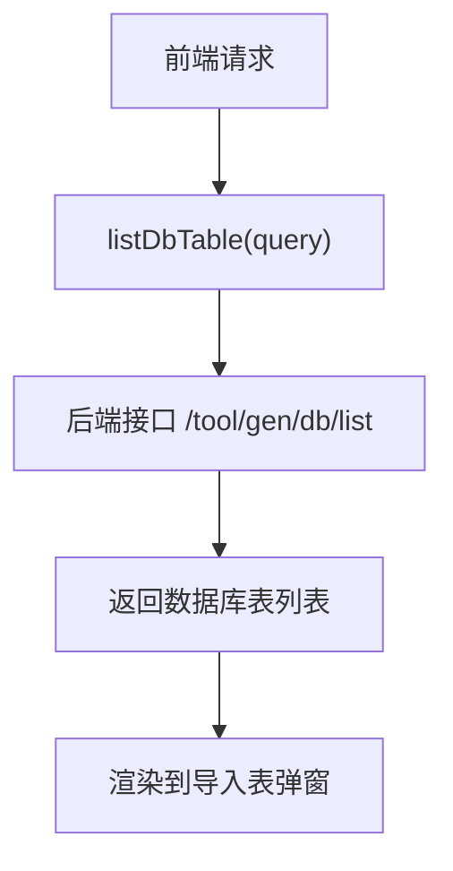
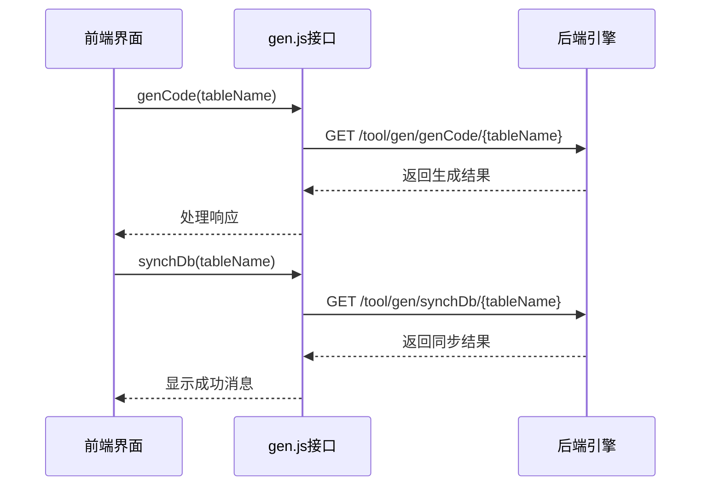
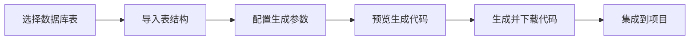
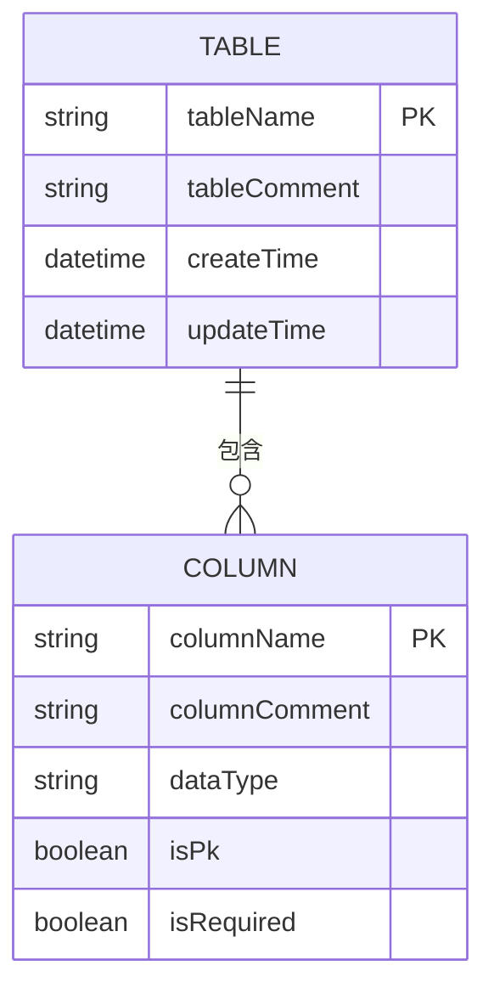
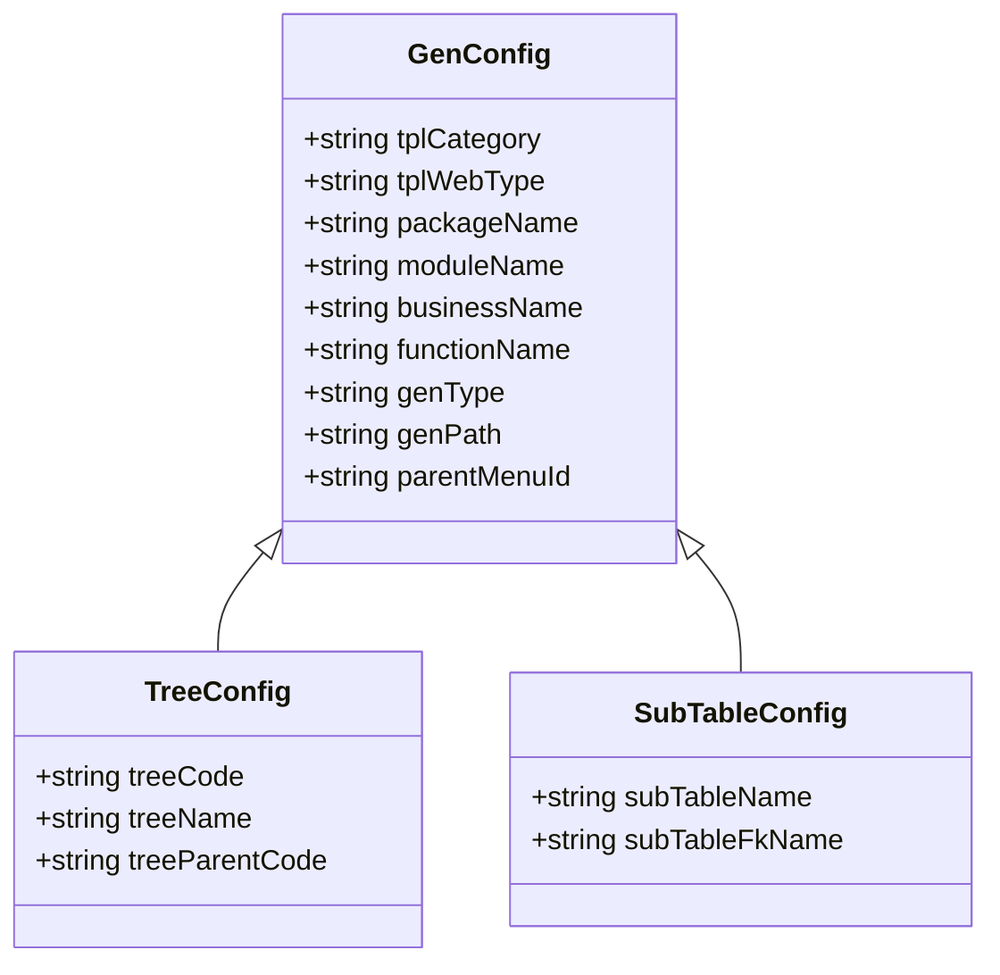
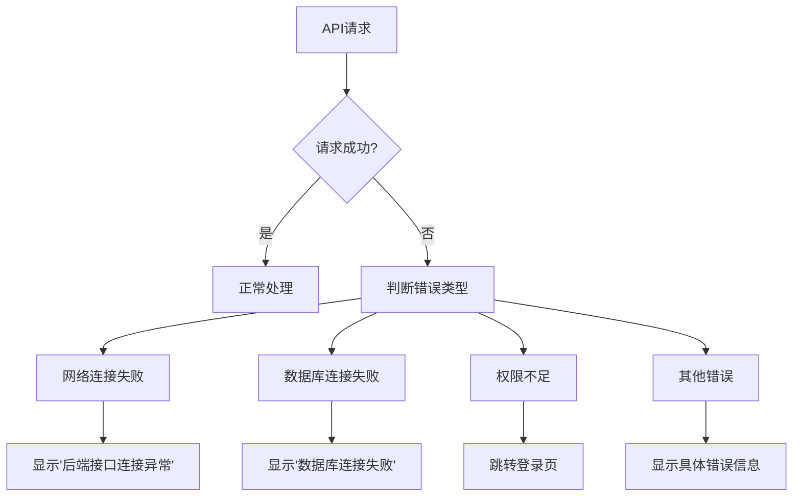

# 工具模块接口

<cite>
**本文档引用文件**  
- [gen.js](file://daoju\src\api\tool\gen.js)
- [index.vue](file://daoju\src\views\tool\gen\index.vue)
- [importTable.vue](file://daoju\src\views\tool\gen\importTable.vue)
- [createTable.vue](file://daoju\src\views\tool\gen\createTable.vue)
- [genInfoForm.vue](file://daoju\src\views\tool\gen\genInfoForm.vue)
- [editTable.vue](file://daoju\src\views\tool\gen\editTable.vue)
- [request.js](file://daoju\src\utils\request.js)
- [download.js](file://daoju\src\plugins\download.js)
</cite>

## 目录
1. [简介](#简介)
2. [核心功能接口](#核心功能接口)
3. [代码生成工作流](#代码生成工作流)
4. [生成配置参数](#生成配置参数)
5. [错误处理机制](#错误处理机制)

## 简介
工具模块提供了一套完整的代码自动生成解决方案，通过前端界面与后端引擎的交互，实现数据库表结构到前后端代码的自动化生成。该模块支持表查询、配置管理、代码预览和下载等核心功能，极大提升了开发效率。

**接口交互流程**：前端通过API调用后端代码生成引擎，获取数据库元数据，配置生成参数，最终生成符合项目规范的前端代码。

## 核心功能接口

### 数据库表查询接口
提供对数据库表的查询和管理功能，支持从数据库获取表结构信息。

**接口说明**：
- `listDbTable(query)`：查询数据库中的表列表，用于表导入功能
- `listTable(query)`：查询已配置的生成表数据

**代码预览接口**：
- `previewTable(tableId)`：根据表ID预览生成的代码内容

**Section sources**
- [gen.js](file://daoju\src\api\tool\gen.js#L1-L85)
- [importTable.vue](file://daoju\src\views\tool\gen\importTable.vue#L54-L92)

### 代码生成与管理接口
提供代码生成、同步和删除等管理操作。

**主要接口**：
- `genCode(tableName)`：生成代码（自定义路径）
- `synchDb(tableName)`：同步数据库结构
- `delTable(tableId)`：删除表配置
- `updateGenTable(data)`：更新生成配置

**Section sources**
- [gen.js](file://daoju\src\api\tool\gen.js#L1-L85)
- [index.vue](file://daoju\src\views\tool\gen\index.vue#L149-L239)

## 代码生成工作流

### 完整调用序列
从选择数据表到生成前端代码的完整流程：

**详细步骤**：
1. 用户在数据库表列表中选择需要生成代码的表
2. 调用`importTable(data)`接口导入表结构
3. 配置生成参数（包路径、模块名等）
4. 调用`previewTable(tableId)`预览生成的代码
5. 确认无误后，调用`genCode(tableName)`生成代码

**Section sources**
- [index.vue](file://daoju\src\views\tool\gen\index.vue#L216-L228)
- [importTable.vue](file://daoju\src\views\tool\gen\importTable.vue#L108-L119)

### 表结构获取方式
系统通过以下方式获取数据库表的元数据：

**元数据字段**：
- 表基本信息：表名、表描述、创建时间、更新时间
- 列信息：列名、列描述、数据类型、是否主键、是否必填

**Section sources**
- [importTable.vue](file://daoju\src\views\tool\gen\importTable.vue#L32-L35)
- [genInfoForm.vue](file://daoju\src\views\tool\gen\genInfoForm.vue#L143-L186)

## 生成配置参数

### 模板参数配置
代码生成器支持多种模板参数配置，满足不同场景需求。

**核心参数说明**：
- `tplCategory`：生成模板类型（单表、树表、主子表）
- `tplWebType`：前端类型（Vue2/Vue3）
- `packageName`：Java包路径
- `moduleName`：生成模块名
- `businessName`：生成业务名
- `functionName`：生成功能名
- `genType`：生成方式（0-zip包，1-自定义路径）
- `genPath`：自定义生成路径

**Section sources**
- [genInfoForm.vue](file://daoju\src\views\tool\gen\genInfoForm.vue#L1-L306)
- [editTable.vue](file://daoju\src\views\tool\gen\editTable.vue#L142-L187)

## 错误处理机制

### 异常处理流程
系统对各类异常情况进行了完善的处理：

**错误处理策略**：
- 网络异常：捕获"Network Error"并显示友好提示
- 超时异常：捕获"timeout"并提示请求超时
- 认证失效：检测401状态码，引导用户重新登录
- 业务错误：根据错误码显示对应的错误消息

**Section sources**
- [request.js](file://daoju\src\utils\request.js#L110-L122)
- [download.js](file://daoju\src\plugins\download.js#L63-L67)