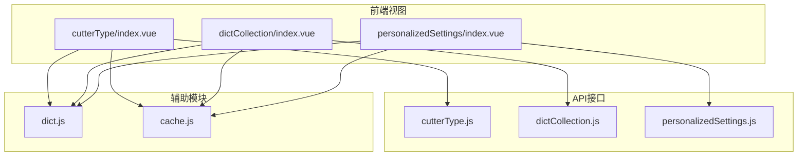
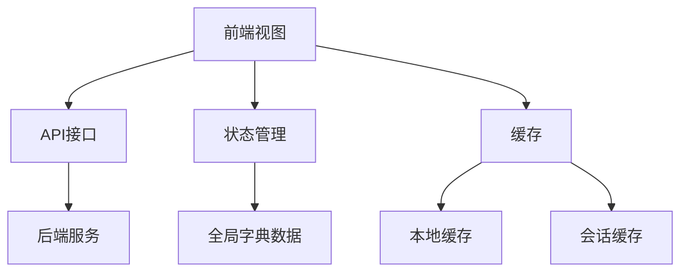
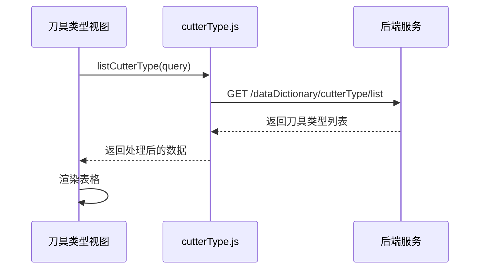
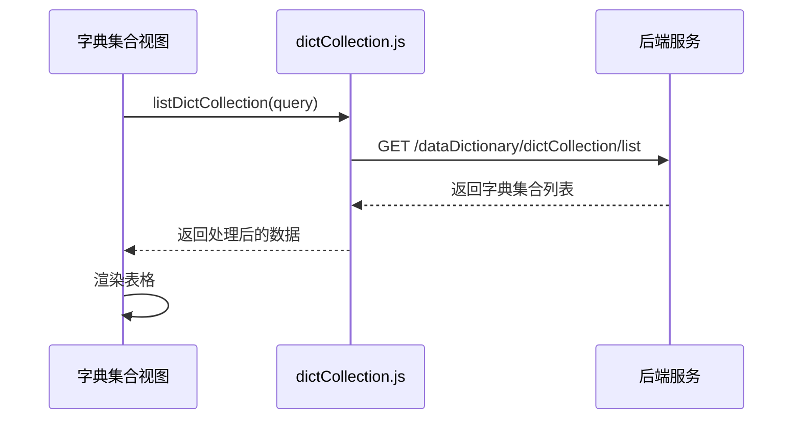
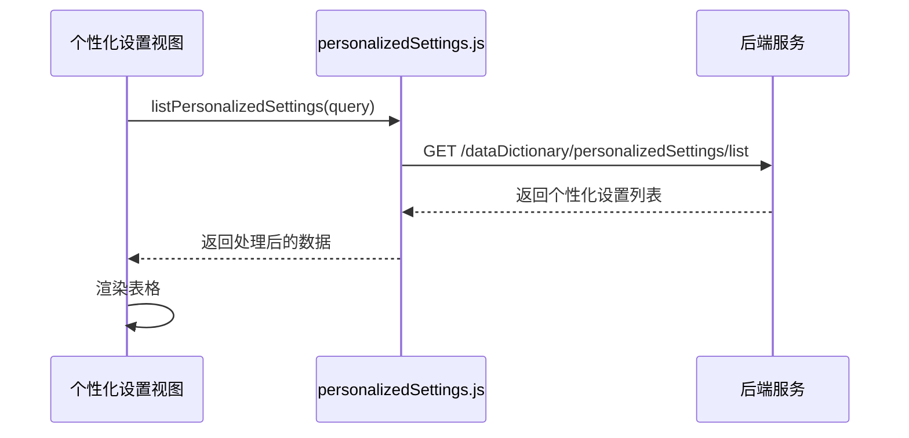
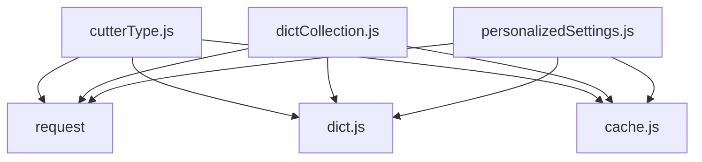

# 数据字典接口

<cite>
**本文档引用的文件**
- [cutterType.js](file://daoju\src\api\dataDictionary\cutterType.js)
- [dictCollection.js](file://daoju\src\api\dataDictionary\dictCollection.js)
- [personalizedSettings.js](file://daoju\src\api\dataDictionary\personalizedSettings.js)
- [cutterType\index.vue](file://daoju\src\views\dataDictionary\cutterType\index.vue)
- [dictCollection\index.vue](file://daoju\src\views\dataDictionary\dictCollection\index.vue)
- [personalizedSettings\index.vue](file://daoju\src\views\dataDictionary\personalizedSettings\index.vue)
- [dict.js](file://daoju\src\store\modules\dict.js)
- [cache.js](file://daoju\src\plugins\cache.js)
</cite>

## 目录
1. [简介](#简介)
2. [项目结构](#项目结构)
3. [核心组件](#核心组件)
4. [架构概述](#架构概述)
5. [详细组件分析](#详细组件分析)
6. [依赖分析](#依赖分析)
7. [性能考虑](#性能考虑)
8. [故障排除指南](#故障排除指南)
9. [结论](#结论)

## 简介
本文档详细说明了刀具管理系统中数据字典模块的API接口，重点介绍`cutterType.js`（刀具类型）、`dictCollection.js`（字典集合）和`personalizedSettings.js`（个性化设置）三个文件提供的元数据管理接口。这些接口支撑前端动态表单渲染和下拉选项加载，文档化字典项的增删改查操作、分类查询和状态管理。通过实际应用示例展示如何在刀具类型管理页面中使用这些接口，并说明缓存策略以提升系统响应速度。

## 项目结构
数据字典模块位于`daoju/src/api/dataDictionary/`目录下，包含三个核心API文件：`cutterType.js`、`dictCollection.js`和`personalizedSettings.js`。这些文件提供了对刀具类型、字典集合和个性化设置的增删改查操作。前端视图文件位于`daoju/src/views/dataDictionary/`目录下，分别对应三个管理页面。系统还包含`store/modules/dict.js`用于字典数据的全局状态管理，以及`plugins/cache.js`提供本地和会话级缓存功能。

**图表来源**
- [cutterType.js](file://daoju\src\api\dataDictionary\cutterType.js)
- [dictCollection.js](file://daoju\src\api\dataDictionary\dictCollection.js)
- [personalizedSettings.js](file://daoju\src\api\dataDictionary\personalizedSettings.js)
- [cutterType\index.vue](file://daoju\src\views\dataDictionary\cutterType\index.vue)
- [dictCollection\index.vue](file://daoju\src\views\dataDictionary\dictCollection\index.vue)
- [personalizedSettings\index.vue](file://daoju\src\views\dataDictionary\personalizedSettings\index.vue)
- [dict.js](file://daoju\src\store\modules\dict.js)
- [cache.js](file://daoju\src\plugins\cache.js)

**章节来源**
- [cutterType.js](file://daoju\src\api\dataDictionary\cutterType.js)
- [dictCollection.js](file://daoju\src\api\dataDictionary\dictCollection.js)
- [personalizedSettings.js](file://daoju\src\api\dataDictionary\personalizedSettings.js)

## 核心组件
数据字典模块的核心组件包括三个API文件，分别管理刀具类型、字典集合和个性化设置。每个文件都提供了标准的增删改查（CRUD）操作，以及特定的查询功能如分类查询和状态管理。这些接口通过统一的请求方法与后端进行通信，支持分页查询、批量操作和数据导出功能。

**章节来源**
- [cutterType.js](file://daoju\src\api\dataDictionary\cutterType.js)
- [dictCollection.js](file://daoju\src\api\dataDictionary\dictCollection.js)
- [personalizedSettings.js](file://daoju\src\api\dataDictionary\personalizedSettings.js)

## 架构概述
数据字典模块采用分层架构设计，前端视图层通过API接口与后端服务进行通信。API接口层封装了HTTP请求，提供统一的调用方式。状态管理层（dict.js）负责字典数据的全局管理，缓存层（cache.js）提供本地和会话级缓存功能，以提升系统响应速度。整个架构支持动态表单渲染和下拉选项加载，确保用户界面的灵活性和响应性。

**图表来源**
- [cutterType.js](file://daoju\src\api\dataDictionary\cutterType.js)
- [dictCollection.js](file://daoju\src\api\dataDictionary\dictCollection.js)
- [personalizedSettings.js](file://daoju\src\api\dataDictionary\personalizedSettings.js)
- [dict.js](file://daoju\src\store\modules\dict.js)
- [cache.js](file://daoju\src\plugins\cache.js)

## 详细组件分析

### 刀具类型管理分析
刀具类型管理接口提供了完整的增删改查功能，支持按类型编码、名称和品牌进行查询。接口还提供了获取刀具分类列表和父级刀具类型列表的功能，支持树形结构的数据展示。在刀具类型管理页面中，这些接口被用于动态渲染表格数据和下拉选项。

#### 接口调用流程

**图表来源**
- [cutterType.js](file://daoju\src\api\dataDictionary\cutterType.js)
- [cutterType\index.vue](file://daoju\src\views\dataDictionary\cutterType\index.vue)

**章节来源**
- [cutterType.js](file://daoju\src\api\dataDictionary\cutterType.js)
- [cutterType\index.vue](file://daoju\src\views\dataDictionary\cutterType\index.vue)

### 字典集合管理分析
字典集合管理接口提供了对字典项的全面管理功能，包括增删改查、批量操作和数据导出。接口支持按字典码、值和名称进行查询，并提供了获取字典类型列表和父级字典列表的功能。这些接口被用于构建灵活的配置管理系统。

#### 接口调用流程

**图表来源**
- [dictCollection.js](file://daoju\src\api\dataDictionary\dictCollection.js)
- [dictCollection\index.vue](file://daoju\src\views\dataDictionary\dictCollection\index.vue)

**章节来源**
- [dictCollection.js](file://daoju\src\api\dataDictionary\dictCollection.js)
- [dictCollection\index.vue](file://daoju\src\views\dataDictionary\dictCollection\index.vue)

### 个性化设置管理分析
个性化设置管理接口提供了对系统配置的全面管理功能，包括显示设置、借还设置、库存设置和功能设置。接口支持按各种配置项进行查询，并提供了获取设置类型列表和配置分组列表的功能。这些接口被用于构建系统的个性化配置界面。

#### 接口调用流程

**图表来源**
- [personalizedSettings.js](file://daoju\src\api\dataDictionary\personalizedSettings.js)
- [personalizedSettings\index.vue](file://daoju\src\views\dataDictionary\personalizedSettings\index.vue)

**章节来源**
- [personalizedSettings.js](file://daoju\src\api\dataDictionary\personalizedSettings.js)
- [personalizedSettings\index.vue](file://daoju\src\views\dataDictionary\personalizedSettings\index.vue)

## 依赖分析
数据字典模块依赖于多个核心组件，包括API请求模块、状态管理模块和缓存模块。API请求模块（request）封装了HTTP通信，状态管理模块（dict.js）提供了全局字典数据管理，缓存模块（cache.js）提供了本地和会话级缓存功能。这些依赖关系确保了模块的高内聚和低耦合。

**图表来源**
- [cutterType.js](file://daoju\src\api\dataDictionary\cutterType.js)
- [dictCollection.js](file://daoju\src\api\dataDictionary\dictCollection.js)
- [personalizedSettings.js](file://daoju\src\api\dataDictionary\personalizedSettings.js)
- [dict.js](file://daoju\src\store\modules\dict.js)
- [cache.js](file://daoju\src\plugins\cache.js)

**章节来源**
- [cutterType.js](file://daoju\src\api\dataDictionary\cutterType.js)
- [dictCollection.js](file://daoju\src\api\dataDictionary\dictCollection.js)
- [personalizedSettings.js](file://daoju\src\api\dataDictionary\personalizedSettings.js)
- [dict.js](file://daoju\src\store\modules\dict.js)
- [cache.js](file://daoju\src\plugins\cache.js)

## 性能考虑
为了提升系统响应速度，数据字典模块采用了多级缓存策略。首先，利用`plugins/cache.js`提供的本地和会话级缓存功能，将常用的字典数据存储在浏览器中。其次，通过`store/modules/dict.js`进行全局状态管理，避免重复的API调用。最后，API接口支持分页查询，减少单次请求的数据量，提高响应速度。

**章节来源**
- [dict.js](file://daoju\src\store\modules\dict.js)
- [cache.js](file://daoju\src\plugins\cache.js)

## 故障排除指南
在使用数据字典接口时，可能会遇到以下常见问题：
1. 数据加载缓慢：检查网络连接，确认是否启用了缓存功能。
2. 下拉选项不显示：确认API接口是否返回了正确的数据格式。
3. 搜索功能失效：检查查询参数是否正确传递。
4. 缓存数据过期：手动清除浏览器缓存或重新加载页面。

**章节来源**
- [cutterType.js](file://daoju\src\api\dataDictionary\cutterType.js)
- [dictCollection.js](file://daoju\src\api\dataDictionary\dictCollection.js)
- [personalizedSettings.js](file://daoju\src\api\dataDictionary\personalizedSettings.js)
- [dict.js](file://daoju\src\store\modules\dict.js)
- [cache.js](file://daoju\src\plugins\cache.js)

## 结论
数据字典模块通过`cutterType.js`、`dictCollection.js`和`personalizedSettings.js`三个API文件提供了全面的元数据管理功能。这些接口支持动态表单渲染和下拉选项加载，通过增删改查操作、分类查询和状态管理，满足了系统的配置需求。结合缓存策略和状态管理，有效提升了系统响应速度和用户体验。