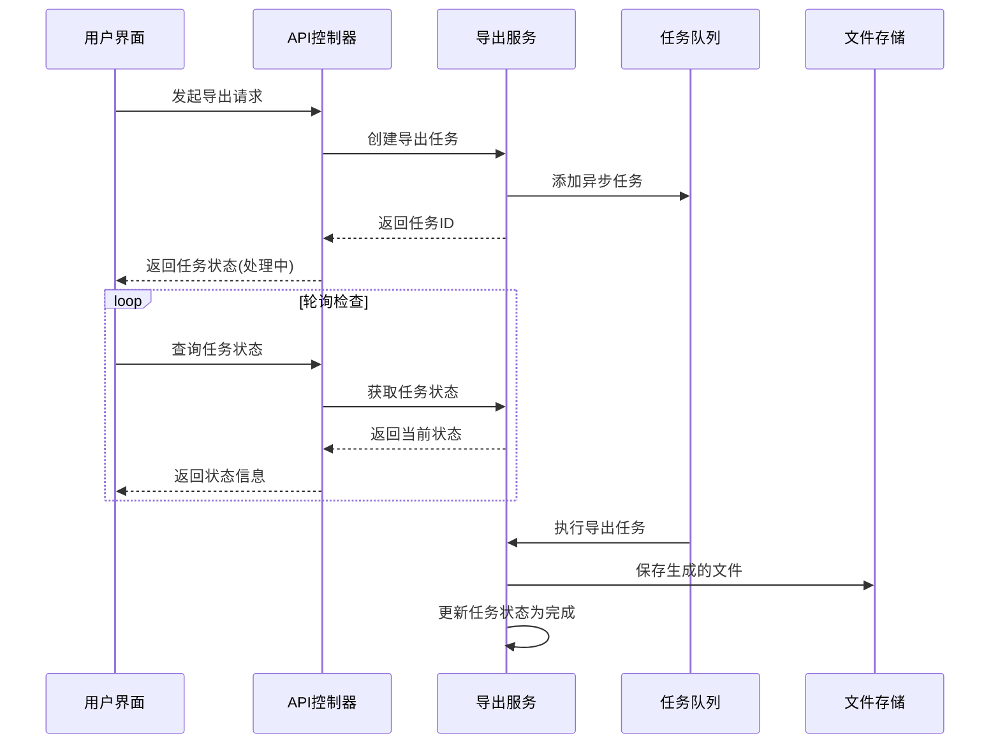
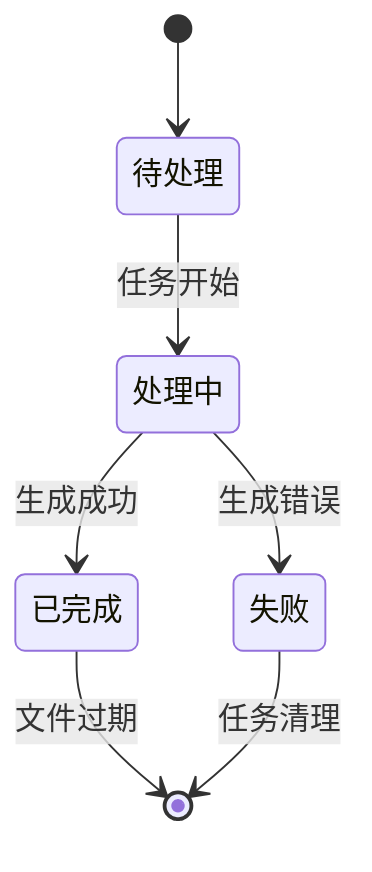
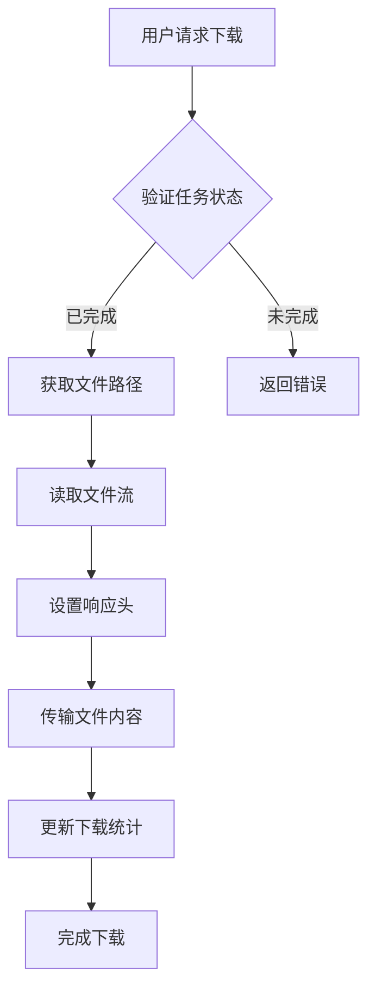
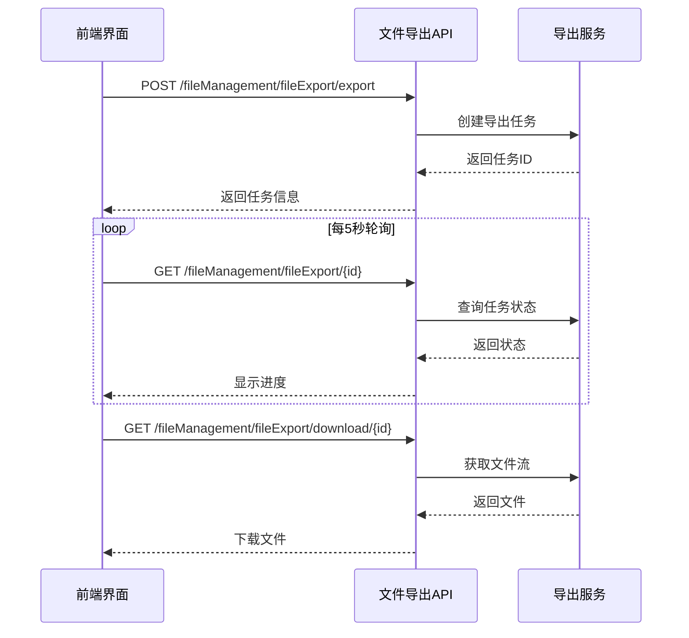

# 文件导出接口

<cite>
**Referenced Files in This Document**  
- [fileExport.js](file://daoju/src/api/fileManagement/fileExport.js)
- [index.vue](file://daoju/src/views/fileManagement/fileExport/index.vue)
- [totalInventoryStats.js](file://daoju/src/api/borrowReturnInfo/totalInventoryStats.js)
</cite>

## 目录
1. [简介](#简介)
2. [核心功能接口](#核心功能接口)
3. [异步导出机制](#异步导出机制)
4. [任务管理与状态查询](#任务管理与状态查询)
5. [文件下载流程](#文件下载流程)
6. [典型使用场景](#典型使用场景)
7. [视图层调用示例](#视图层调用示例)
8. [错误处理与重试逻辑](#错误处理与重试逻辑)

## 简介
本文档详细说明了系统中文件导出功能的API设计与实现。该功能支持异步导出机制，允许用户创建导出任务、查询导出状态以及下载生成的文件。文档涵盖`fileExport.js`中的核心接口，包括导出任务创建、状态查询和文件下载等操作，并解释了后台报表生成、任务队列处理和进度轮询的设计原理。

## 核心功能接口
文件导出功能通过`fileExport.js`模块提供多个RESTful API接口，支持对导出任务的全生命周期管理。

**Section sources**
- [fileExport.js](file://daoju/src/api/fileManagement/fileExport.js#L46-L52)
- [fileExport.js](file://daoju/src/api/fileManagement/fileExport.js#L55-L61)

## 异步导出机制
系统采用异步导出模式，避免长时间运行的导出操作阻塞主线程。当用户发起导出请求时，系统会创建一个后台任务，立即返回任务ID，客户端可通过该ID轮询任务状态。

**Diagram sources**
- [fileExport.js](file://daoju/src/api/fileManagement/fileExport.js#L46-L52)

## 任务管理与状态查询
导出任务具有完整的状态管理机制，包括待处理、处理中和已完成三种状态。系统通过唯一任务标识符跟踪每个导出任务，并设置了合理的过期时间策略。

**Diagram sources**
- [fileExport.js](file://daoju/src/api/fileManagement/fileExport.js#L4-L9)
- [fileExport.js](file://daoju/src/api/fileManagement/fileExport.js#L12-L17)

**Section sources**
- [fileExport.js](file://daoju/src/api/fileManagement/fileExport.js#L3-L17)

## 文件下载流程
文件下载接口专门设计用于安全地传输生成的文件内容。系统采用blob响应类型确保二进制文件的完整传输，并在下载后更新下载计数等统计信息。

**Diagram sources**
- [fileExport.js](file://daoju/src/api/fileManagement/fileExport.js#L55-L61)

**Section sources**
- [fileExport.js](file://daoju/src/api/fileManagement/fileExport.js#L55-L61)

## 典型使用场景
以库存统计报表导出为例，展示完整的调用序列。用户首先触发导出操作，系统创建任务并返回标识符，随后通过轮询机制检查任务状态，最后在任务完成后下载文件。

**Diagram sources**
- [fileExport.js](file://daoju/src/api/fileManagement/fileExport.js#L46-L52)
- [fileExport.js](file://daoju/src/api/fileManagement/fileExport.js#L12-L17)
- [fileExport.js](file://daoju/src/api/fileManagement/fileExport.js#L55-L61)

## 视图层调用示例
在`index.vue`组件中，实现了文件导出功能的用户界面。该组件展示了如何调用导出API并处理响应，包括列表展示、详情查看和导出操作等功能。

**Section sources**
- [index.vue](file://daoju/src/views/fileManagement/fileExport/index.vue#L237-L245)

## 错误处理与重试逻辑
系统实现了完善的错误处理机制，能够捕获导出过程中的各种异常情况。对于临时性错误，客户端可实现智能重试策略，而对于永久性错误则提供明确的错误信息和解决方案建议。

**Section sources**
- [fileExport.js](file://daoju/src/api/fileManagement/fileExport.js#L46-L52)
- [fileExport.js](file://daoju/src/api/fileManagement/fileExport.js#L55-L61)