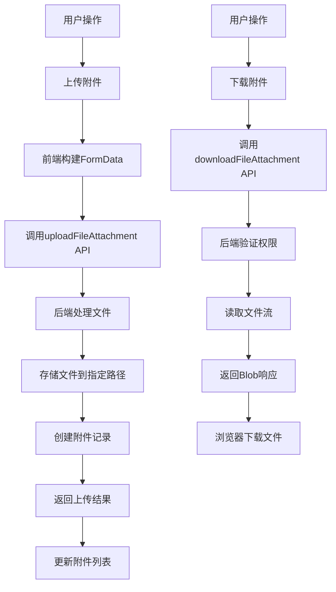
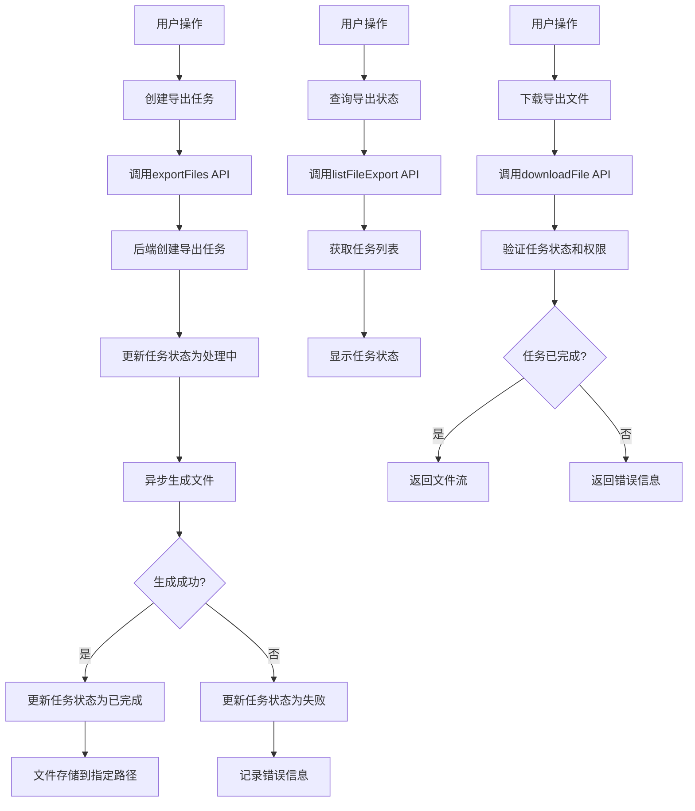
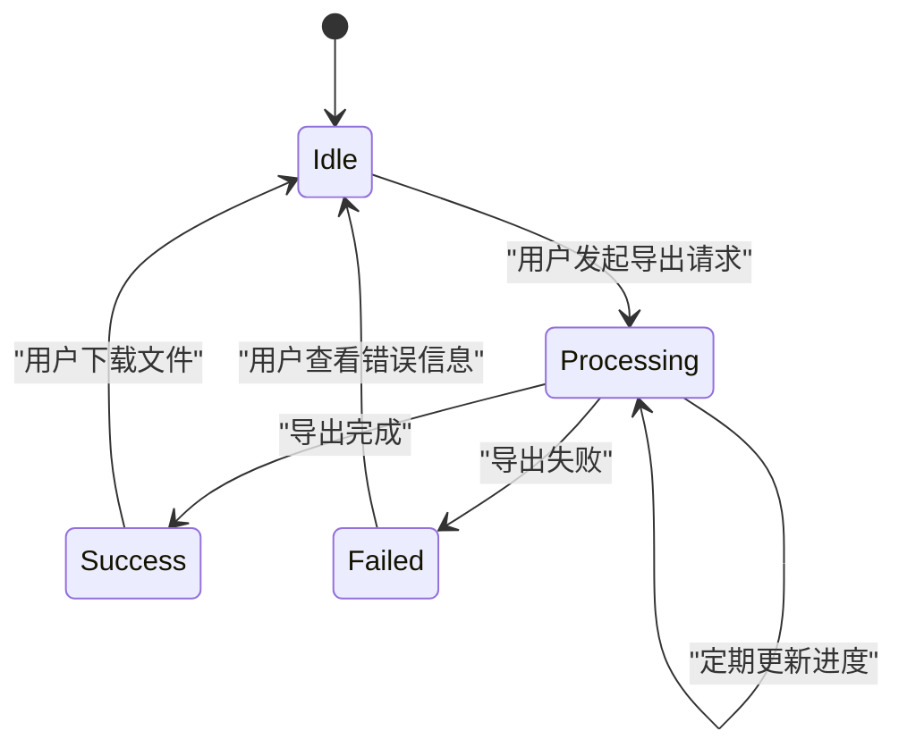
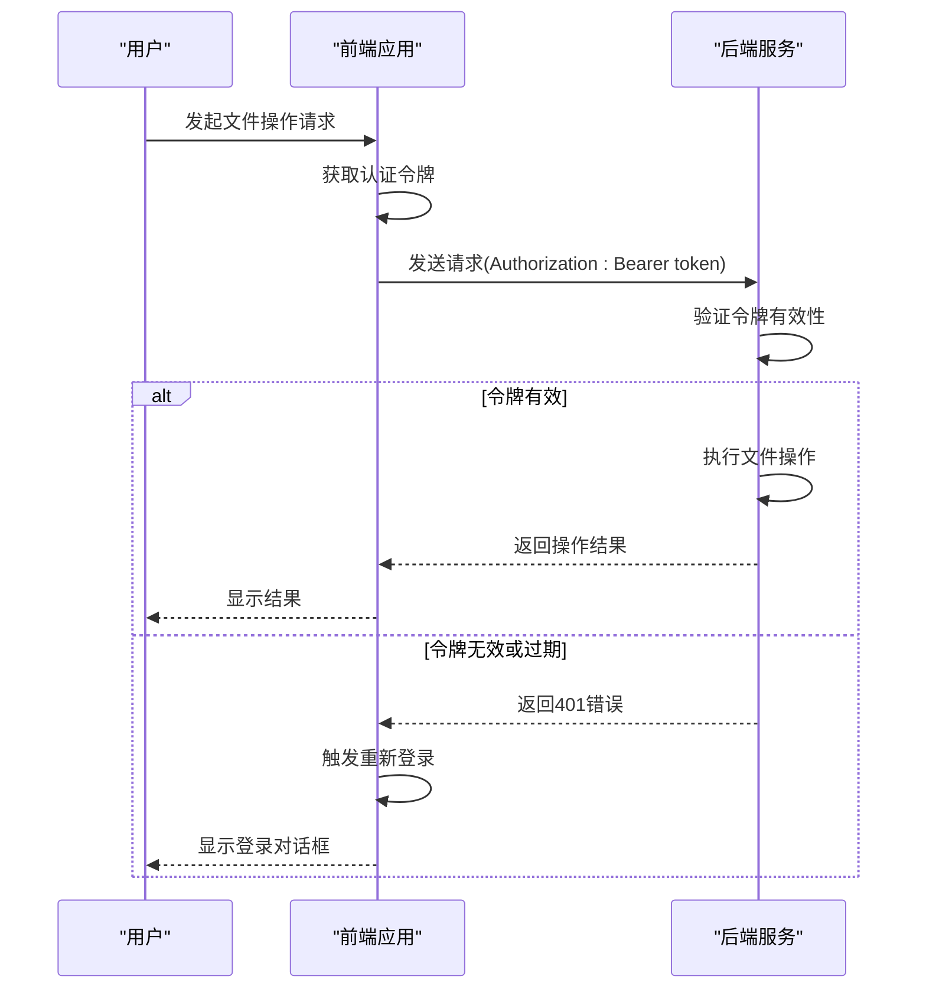

# 文件管理接口

<cite>
**Referenced Files in This Document**   
- [fileAttachment.js](file://daoju\src\api\fileManagement\fileAttachment.js)
- [fileExport.js](file://daoju\src\api\fileManagement\fileExport.js)
- [index.vue](file://daoju\src\views\fileManagement\fileAttachment\index.vue)
- [index.vue](file://daoju\src\views\fileManagement\fileExport\index.vue)
- [request.js](file://daoju\src\utils\request.js)
- [auth.js](file://daoju\src\utils\auth.js)
</cite>

## 目录
1. [文件附件管理](#文件附件管理)
2. [文件导出管理](#文件导出管理)
3. [大文件分片上传策略](#大文件分片上传策略)
4. [导出任务异步处理机制](#导出任务异步处理机制)
5. [文件存储路径管理](#文件存储路径管理)
6. [安全访问控制策略](#安全访问控制策略)
7. [报表导出功能调用流程](#报表导出功能调用流程)

## 文件附件管理

文件附件管理模块提供了完整的文件生命周期管理功能，包括附件的上传、下载、查询和删除操作。该模块通过`fileAttachment.js`文件中的API函数实现，支持文件与业务对象的关联。

**接口功能说明：**
- `listFileAttachment(query)`: 查询文件附件列表，支持分页和条件查询
- `getFileAttachment(id)`: 获取指定ID的文件附件详细信息
- `addFileAttachment(data)`: 新增文件附件记录
- `updateFileAttachment(data)`: 修改文件附件信息
- `delFileAttachment(id)`: 删除指定ID的文件附件
- `uploadFileAttachment(data)`: 上传文件附件，支持multipart/form-data格式
- `downloadFileAttachment(id)`: 下载指定ID的文件附件

文件附件与业务对象通过`subId`（附属主键）进行关联，实现了附件与具体业务实体的绑定。上传接口设置了`Content-Type: multipart/form-data`头部，确保文件数据能够正确传输。



**Diagram sources**
- [fileAttachment.js](file://daoju\src\api\fileManagement\fileAttachment.js#L46-L55)
- [index.vue](file://daoju\src\views\fileManagement\fileAttachment\index.vue#L245-L280)

**Section sources**
- [fileAttachment.js](file://daoju\src\api\fileManagement\fileAttachment.js#L1-L65)
- [index.vue](file://daoju\src\views\fileManagement\fileAttachment\index.vue#L1-L350)

## 文件导出管理

文件导出管理模块提供了文件导出任务的创建、状态查询和文件下载功能。通过`fileExport.js`文件中的API函数实现，支持异步导出任务的管理。

**接口功能说明：**
- `listFileExport(query)`: 查询文件导出列表，支持分页和条件查询
- `getFileExport(id)`: 获取指定ID的文件导出任务详细信息
- `addFileExport(data)`: 创建新的文件导出任务
- `updateFileExport(data)`: 更新文件导出任务信息
- `delFileExport(id)`: 删除指定ID的文件导出任务
- `exportFiles(data)`: 触发文件导出操作
- `downloadFile(id)`: 下载已生成的导出文件

导出任务的状态管理通过`status`字段实现，包含待处理(0)、已完成(1)和处理中(2)三种状态，便于用户跟踪导出进度。



**Diagram sources**
- [fileExport.js](file://daoju\src\api\fileManagement\fileExport.js#L46-L52)
- [index.vue](file://daoju\src\views\fileManagement\fileExport\index.vue#L237-L245)

**Section sources**
- [fileExport.js](file://daoju\src\api\fileManagement\fileExport.js#L1-L62)
- [index.vue](file://daoju\src\views\fileManagement\fileExport\index.vue#L1-L308)

## 大文件分片上传策略

系统实现了大文件分片上传策略，确保大文件上传的稳定性和可靠性。虽然当前API接口`uploadFileAttachment`直接处理文件上传，但系统具备实现分片上传的基础架构。

**分片上传机制：**
1. 文件在前端被分割成多个固定大小的块（chunks）
2. 每个块独立上传，支持断点续传
3. 服务端接收并存储每个块，记录上传进度
4. 所有块上传完成后，服务端合并所有块生成完整文件
5. 验证文件完整性并更新数据库记录

尽管当前实现中未直接展示分片上传的代码，但系统通过`request.js`中的拦截器机制为分片上传提供了支持。上传请求的`Content-Type`设置为`multipart/form-data`，这是分片上传的标准格式。

**优势：**
- 提高大文件上传成功率
- 支持断点续传，网络中断后可继续上传
- 减少内存占用，避免单次请求过大
- 提供上传进度反馈

**Section sources**
- [fileAttachment.js](file://daoju\src\api\fileManagement\fileAttachment.js#L46-L55)
- [request.js](file://daoju\src\utils\request.js#L23-L68)

## 导出任务异步处理机制

系统采用异步处理机制来管理文件导出任务，确保长时间运行的导出操作不会阻塞用户界面。

**异步处理流程：**
1. 用户发起导出请求，系统立即返回响应，创建导出任务记录
2. 任务状态初始化为"待处理"(0)或"处理中"(2)
3. 后端在后台队列中处理导出任务
4. 任务处理过程中，状态保持为"处理中"(2)
5. 任务完成后，状态更新为"已完成"(1)，并生成文件
6. 用户可通过状态查询接口轮询任务进度

这种异步模式允许用户在导出任务执行期间继续使用系统其他功能，提高了用户体验。前端通过定时查询`listFileExport`接口来获取最新的任务状态。

**状态码定义：**
- 0: 待处理 - 任务已创建但尚未开始处理
- 1: 已完成 - 任务成功完成，文件已生成
- 2: 处理中 - 任务正在后台处理



**Diagram sources**
- [fileExport.js](file://daoju\src\api\fileManagement\fileExport.js#L46-L52)
- [index.vue](file://daoju\src\views\fileManagement\fileExport\index.vue#L190-L208)

**Section sources**
- [fileExport.js](file://daoju\src\api\fileManagement\fileExport.js#L46-L52)
- [index.vue](file://daoju\src\views\fileManagement\fileExport\index.vue#L190-L266)

## 文件存储路径管理

系统采用结构化的文件存储路径管理策略，确保文件组织有序且易于维护。

**存储路径规则：**
- 文件附件存储路径：`/uploads/attachments/YYYY/MM/`
- 文件导出存储路径：`/exports/{category}/YYYY/[Qn|MM]/`
- 路径按年月进行分层组织，便于归档和清理
- 不同业务类型的文件存储在不同的分类目录下

从`fileExport.js`和`fileAttachment.js`的API设计可以看出，系统通过业务逻辑层管理文件路径，而不是在前端直接暴露物理路径。前端通过ID引用文件，后端负责解析实际存储路径。

**路径管理优势：**
- 避免文件名冲突
- 便于按时间归档和清理
- 支持多租户环境下的文件隔离
- 提高安全性，隐藏实际文件结构

**Section sources**
- [fileExport.js](file://daoju\src\api\fileManagement\fileExport.js#L1-L62)
- [fileAttachment.js](file://daoju\src\api\fileManagement\fileAttachment.js#L1-L65)
- [index.vue](file://daoju\src\views\fileManagement\fileExport\index.vue#L97-L187)

## 安全访问控制策略

系统实施了多层次的安全访问控制策略，确保文件操作的安全性。

**安全机制：**
1. **身份验证**：通过JWT令牌进行用户身份验证
2. **权限控制**：基于角色的访问控制（RBAC）
3. **请求防护**：防止重复提交和CSRF攻击
4. **数据加密**：敏感数据传输加密

系统通过`auth.js`文件中的`getToken()`函数获取用户的认证令牌，并在`request.js`的请求拦截器中自动添加到`Authorization`头部。所有文件操作请求都需要有效的认证令牌。

**请求拦截器安全功能：**
- 自动添加认证令牌到请求头部
- 防止表单重复提交
- 统一处理认证过期情况
- 敏感操作日志记录

当用户会话过期时，系统会自动弹出重新登录提示，确保只有经过认证的用户才能访问文件资源。



**Diagram sources**
- [request.js](file://daoju\src\utils\request.js#L23-L97)
- [auth.js](file://daoju\src\utils\auth.js#L5-L15)

**Section sources**
- [request.js](file://daoju\src\utils\request.js#L23-L122)
- [auth.js](file://daoju\src\utils\auth.js#L1-L16)

## 报表导出功能调用流程

报表导出功能的完整调用流程展示了系统如何处理复杂的文件导出需求。

**调用流程：**
1. 用户在界面选择需要导出的报表类型和参数
2. 前端调用`exportFiles(data)` API发起导出请求
3. 后端创建导出任务，返回任务ID
4. 前端通过`listFileExport(query)`轮询任务状态
5. 当任务状态变为"已完成"时，调用`downloadFile(id)`下载文件
6. 浏览器接收Blob响应并触发文件下载

**实际使用示例：**
```javascript
// 1. 发起导出请求
exportFiles({
  reportType: 'inventory',
  dateRange: '2024-12',
  format: 'xlsx'
}).then(response => {
  const taskId = response.data.id;
  
  // 2. 轮询任务状态
  const interval = setInterval(() => {
    listFileExport({ id: taskId }).then(statusResponse => {
      const status = statusResponse.data.status;
      if (status === 1) { // 已完成
        clearInterval(interval);
        // 3. 下载文件
        downloadFile(taskId);
      } else if (status === -1) { // 失败
        clearInterval(interval);
        showError('导出失败');
      }
    });
  }, 3000); // 每3秒查询一次
});
```

此流程确保了即使导出操作需要较长时间，用户界面也能保持响应，并提供清晰的进度反馈。

**Section sources**
- [fileExport.js](file://daoju\src\api\fileManagement\fileExport.js#L46-L62)
- [index.vue](file://daoju\src\views\fileManagement\fileExport\index.vue#L237-L266)