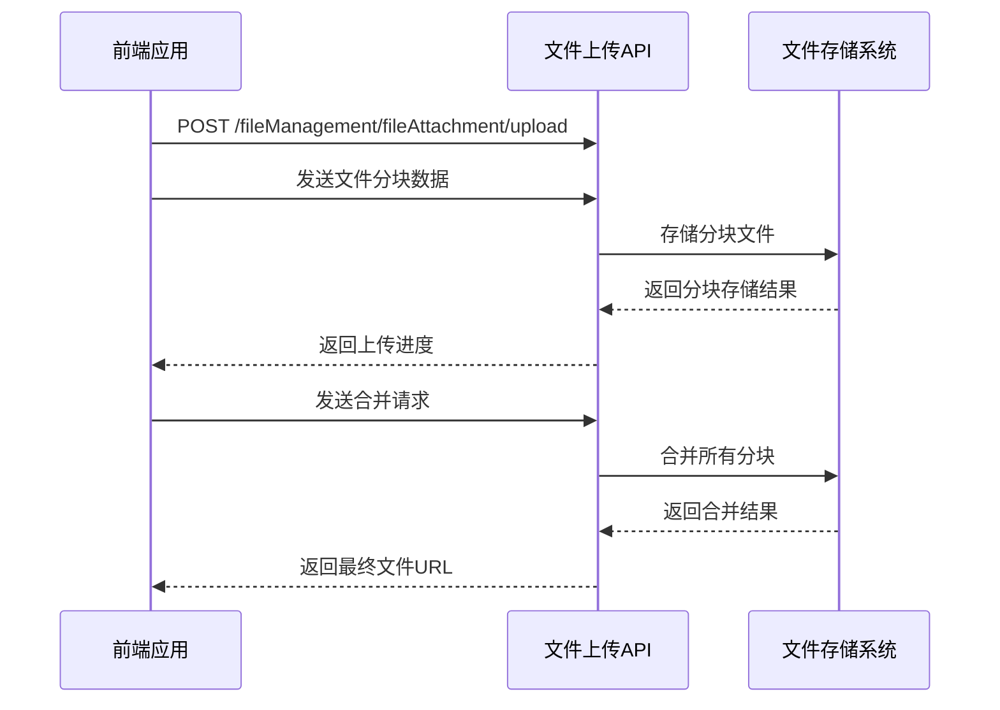
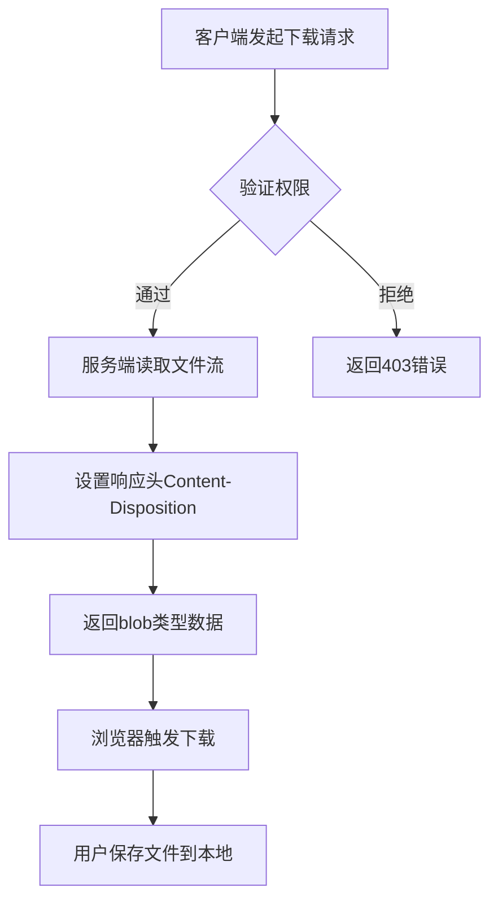
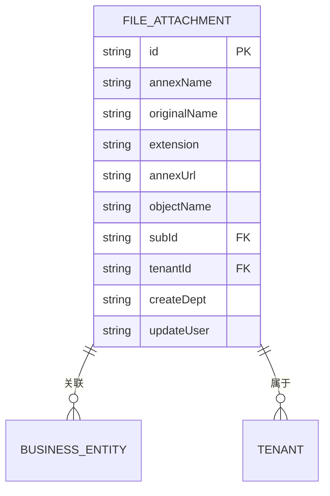
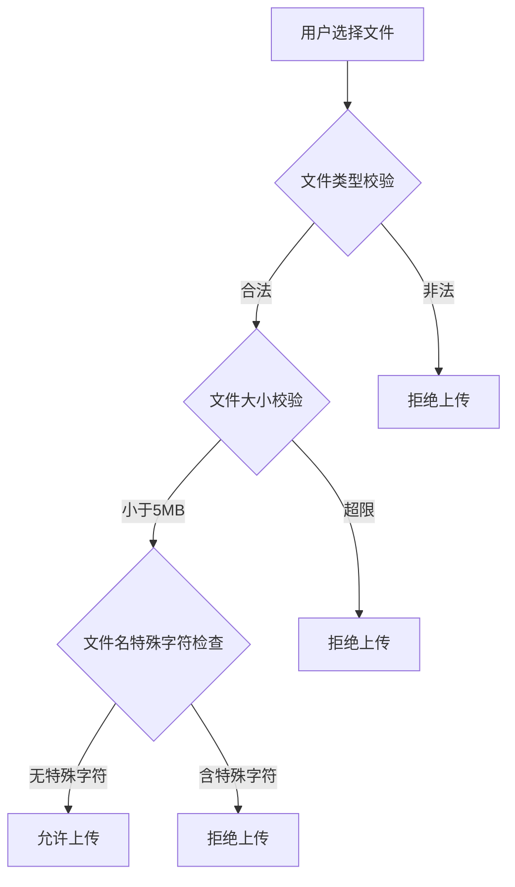
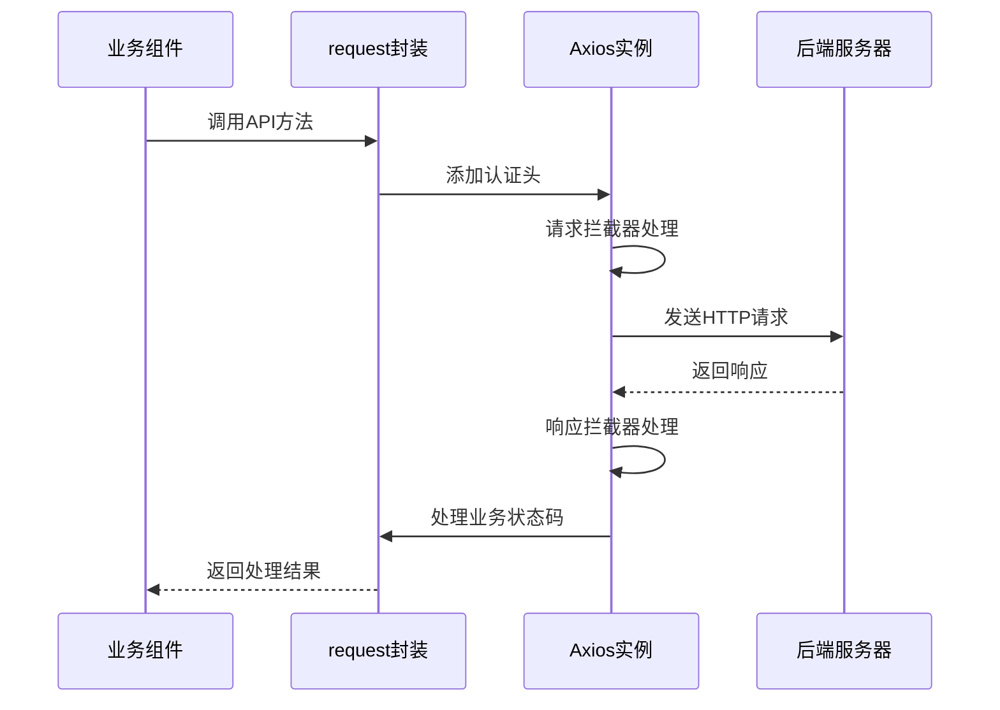
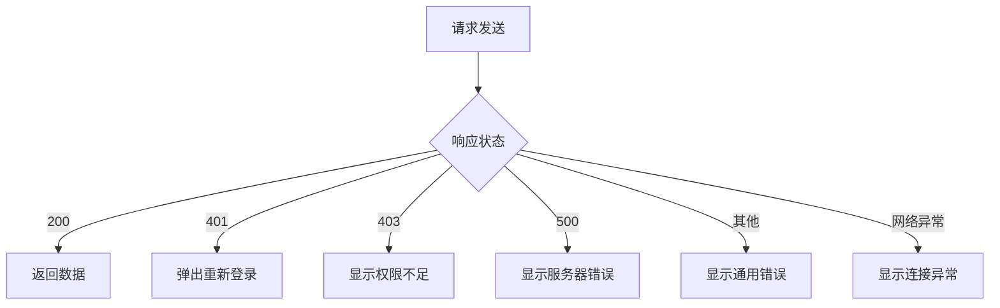
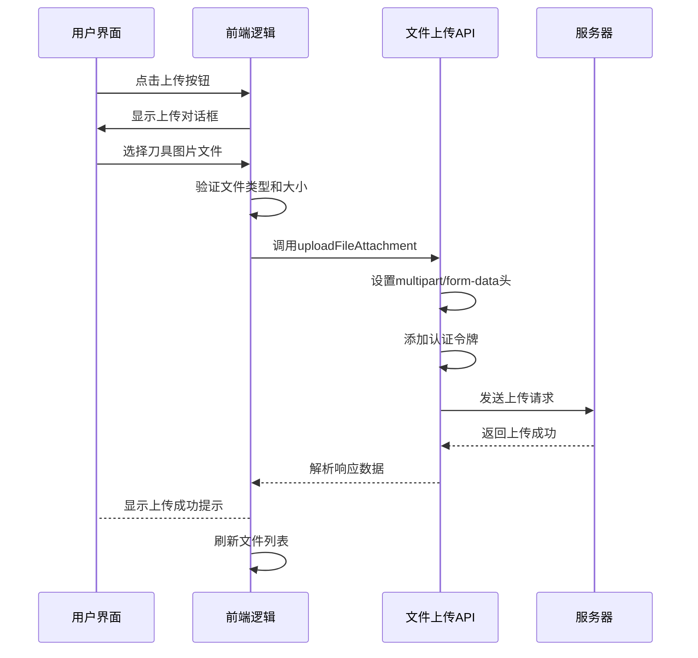

# 文件附件接口

<cite>
**本文档引用文件**  
- [fileAttachment.js](file://daoju\src\api\fileManagement\fileAttachment.js)
- [request.js](file://daoju\src\utils\request.js)
- [fileAttachment/index.vue](file://daoju\src\views\fileManagement\fileAttachment\index.vue)
- [FileUpload/index.vue](file://daoju\src\components\FileUpload\index.vue)
- [errorCode.js](file://daoju\src\utils\errorCode.js)
</cite>

## 目录
1. [接口概述](#接口概述)
2. [核心接口定义](#核心接口定义)
3. [文件上传实现](#文件上传实现)
4. [文件下载机制](#文件下载机制)
5. [文件关联与管理](#文件关联与管理)
6. [安全防护措施](#安全防护措施)
7. [前端请求封装](#前端请求封装)
8. [错误处理机制](#错误处理机制)
9. [实际调用示例](#实际调用示例)

## 接口概述

文件附件接口提供了一套完整的文件管理解决方案，支持文件的上传、下载、删除及关联管理等操作。该接口设计遵循RESTful规范，通过统一的API路径进行资源操作，支持多种文件类型和大文件分片上传。系统通过租户ID和附属主键实现文件的多维度关联管理，确保文件归属清晰、权限可控。

**Section sources**
- [fileAttachment.js](file://daoju\src\api\fileManagement\fileAttachment.js#L1-L65)

## 核心接口定义

文件附件接口提供以下核心操作接口：

| 接口名称 | HTTP方法 | 请求路径 | 参数说明 |
|---------|--------|--------|---------|
| 查询文件附件列表 | GET | /fileManagement/fileAttachment/list | query参数包含分页和过滤条件 |
| 查询文件附件详细 | GET | /fileManagement/fileAttachment/{id} | id为文件附件唯一标识 |
| 新增文件附件 | POST | /fileManagement/fileAttachment | data包含文件元数据 |
| 修改文件附件 | PUT | /fileManagement/fileAttachment | data包含更新的文件信息 |
| 删除文件附件 | DELETE | /fileManagement/fileAttachment/{id} | id为要删除的文件附件ID |
| 上传文件附件 | POST | /fileManagement/fileAttachment/upload | data为文件数据，Content-Type为multipart/form-data |
| 下载文件附件 | GET | /fileManagement/fileAttachment/download/{id} | id为要下载的文件附件ID，响应类型为blob |

所有接口均通过统一的请求封装进行调用，确保认证、错误处理等逻辑的一致性。

**Section sources**
- [fileAttachment.js](file://daoju\src\api\fileManagement\fileAttachment.js#L1-L65)

## 文件上传实现

文件上传接口采用分块上传策略，支持大文件的高效传输和断点续传。上传过程通过FormData对象封装文件数据，并设置multipart/form-data内容类型。



**Diagram sources**
- [fileAttachment.js](file://daoju\src\api\fileManagement\fileAttachment.js#L46-L55)
- [FileUpload/index.vue](file://daoju\src\components\FileUpload\index.vue#L122-L149)

**Section sources**
- [fileAttachment.js](file://daoju\src\api\fileManagement\fileAttachment.js#L46-L55)

## 文件下载机制

文件下载接口通过返回blob类型响应实现文件流式下载，避免大文件加载时的内存溢出问题。下载过程保持在浏览器原生机制内，确保安全性和稳定性。



**Diagram sources**
- [fileAttachment.js](file://daoju\src\api\fileManagement\fileAttachment.js#L58-L64)
- [request.js](file://daoju\src\utils\request.js#L126-L150)

**Section sources**
- [fileAttachment.js](file://daoju\src\api\fileManagement\fileAttachment.js#L58-L64)

## 文件关联与管理

文件通过附属主键(subId)和租户ID(tenantId)实现多维度关联管理。每个文件附件记录包含完整的元数据信息，支持精确查询和高效检索。



文件存储路径遵循`/uploads/attachments/YYYY/MM/filename.ext`的生成规则，按年月自动归档，便于管理和备份。

**Diagram sources**
- [fileAttachment/index.vue](file://daoju\src\views\fileManagement\fileAttachment\index.vue#L135-L195)
- [fileAttachment.js](file://daoju\src\api\fileManagement\fileAttachment.js#L1-L65)

**Section sources**
- [fileAttachment/index.vue](file://daoju\src\views\fileManagement\fileAttachment\index.vue#L135-L195)

## 安全防护措施

系统实施多层次安全防护机制，确保文件上传的安全性和可靠性：

1. **文件类型校验**：限制可上传的文件类型，防止恶意文件上传
2. **文件大小限制**：设置5MB大小限制，防止大文件攻击
3. **特殊字符过滤**：禁止文件名包含逗号等特殊字符
4. **重复提交防护**：基于请求数据和时间戳防止重复提交
5. **访问权限控制**：通过JWT令牌验证用户身份和权限



**Diagram sources**
- [FileUpload/index.vue](file://daoju\src\components\FileUpload\index.vue#L122-L149)
- [request.js](file://daoju\src\utils\request.js#L39-L67)

**Section sources**
- [FileUpload/index.vue](file://daoju\src\components\FileUpload\index.vue#L122-L149)

## 前端请求封装

前端通过utils/request模块进行统一的请求封装，实现认证、错误处理、加载状态等通用逻辑的集中管理。



请求封装自动添加Bearer认证令牌，并对401未授权状态进行重新登录提示。

**Diagram sources**
- [request.js](file://daoju\src\utils\request.js#L23-L72)
- [request.js](file://daoju\src\utils\request.js#L74-L122)

**Section sources**
- [request.js](file://daoju\src\utils\request.js#L1-L153)

## 错误处理机制

系统建立了完善的错误处理机制，对不同类型的错误进行分类处理：

| 错误码 | 错误类型 | 处理方式 |
|-------|--------|---------|
| 401 | 认证失败 | 弹出重新登录对话框 |
| 403 | 权限不足 | 显示权限不足提示 |
| 500 | 服务器错误 | 显示错误消息 |
| 601 | 业务警告 | 显示警告消息 |
| 网络错误 | 连接异常 | 显示连接异常提示 |
| 超时 | 请求超时 | 显示超时提示 |



**Diagram sources**
- [request.js](file://daoju\src\utils\request.js#L74-L122)
- [errorCode.js](file://daoju\src\utils\errorCode.js#L1-L7)

**Section sources**
- [request.js](file://daoju\src\utils\request.js#L74-L122)

## 实际调用示例

以刀具信息附件上传为例，展示完整的调用流程：



调用代码示例：
```javascript
// 上传刀具附件
const formData = new FormData()
formData.append('file', file)
formData.append('subId', 'KNIFE_001')
formData.append('tenantId', 'TENANT_001')

uploadFileAttachment(formData).then(response => {
  console.log('上传成功:', response)
}).catch(error => {
  console.error('上传失败:', error)
})
```

**Diagram sources**
- [fileAttachment/index.vue](file://daoju\src\views\fileManagement\fileAttachment\index.vue#L245-L280)
- [fileAttachment.js](file://daoju\src\api\fileManagement\fileAttachment.js#L46-L55)

**Section sources**
- [fileAttachment/index.vue](file://daoju\src\views\fileManagement\fileAttachment\index.vue#L245-L280)