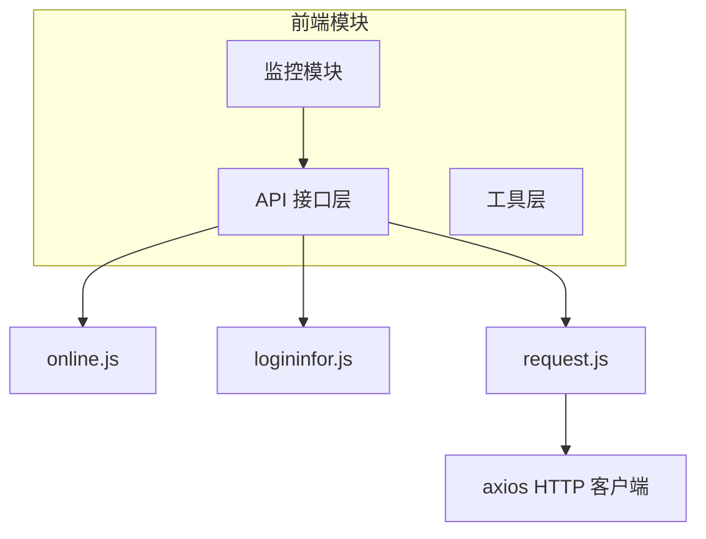
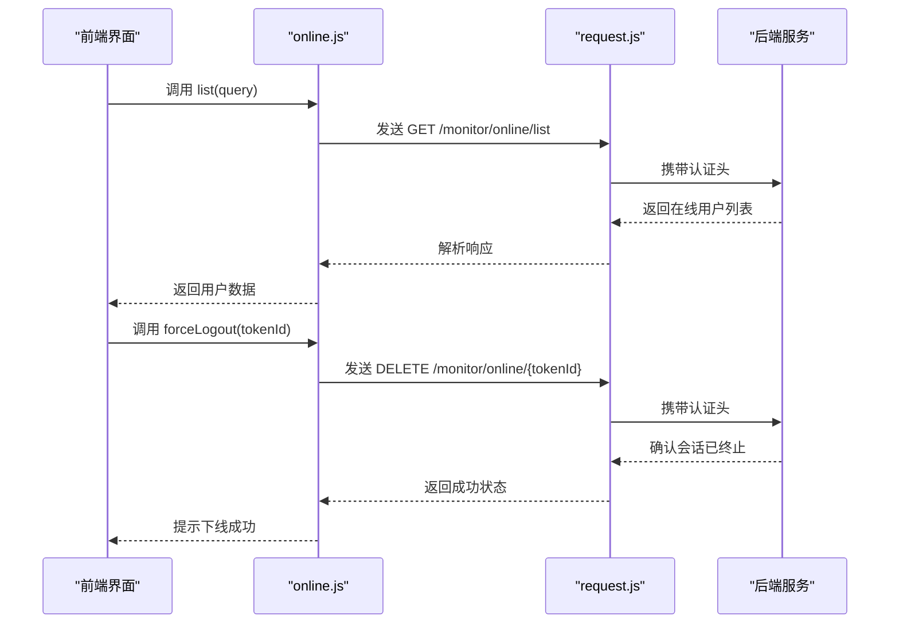
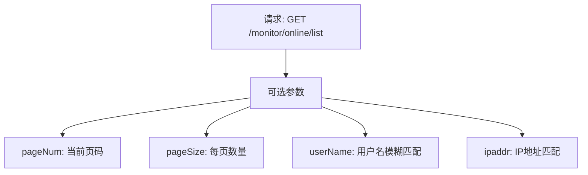
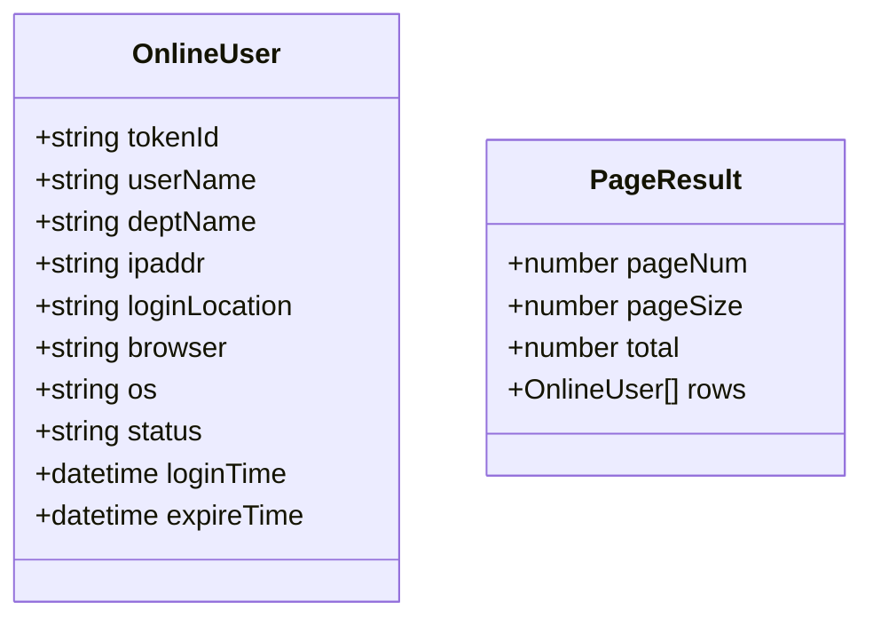
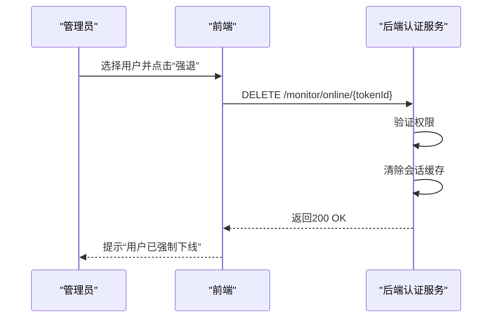
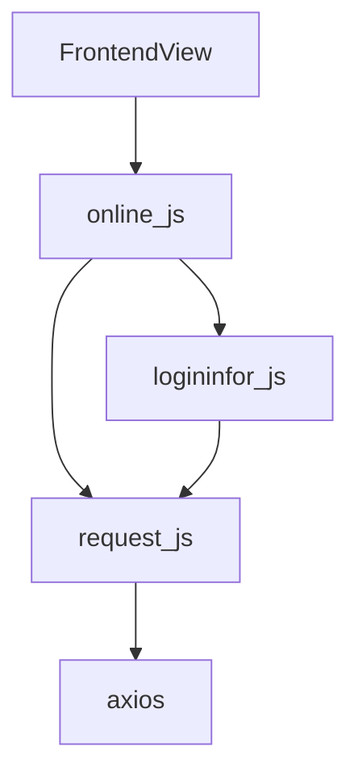

# 在线用户监控接口

<cite>
**本文档引用的文件**  
- [online.js](file://daoju/src/api/monitor/online.js)
- [logininfor.js](file://daoju/src/api/monitor/logininfor.js)
- [request.js](file://daoju/src/utils/request.js)
</cite>

## 目录
1. [简介](#简介)
2. [项目结构](#项目结构)
3. [核心组件](#核心组件)
4. [架构概述](#架构概述)
5. [详细组件分析](#详细组件分析)
6. [依赖分析](#依赖分析)
7. [性能考虑](#性能考虑)
8. [故障排除指南](#故障排除指南)
9. [结论](#结论)

## 简介
本文档详细说明了在线用户监控接口的功能与使用方式，重点介绍 `online.js` 中提供的查询当前系统在线用户列表、会话信息、登录时间、IP地址等数据的API接口。文档涵盖请求与响应的数据结构，包括分页参数、用户状态标识等字段定义，并提供前端实现在线用户表格展示和强制下线功能的代码示例。同时解释会话管理机制与后端认证体系的关联，以及如何通过此接口辅助安全审计和异常登录检测。

## 项目结构
在线用户监控功能位于前端项目的 `daoju/src/api/monitor/` 目录下，主要由 `online.js` 提供接口调用逻辑，配合 `logininfor.js` 实现登录日志相关功能。该模块属于系统监控（monitor）子系统的一部分，与缓存、服务状态、操作日志等功能并列。

**Diagram sources**  
- [online.js](file://daoju/src/api/monitor/online.js#L1-L18)
- [logininfor.js](file://daoju/src/api/monitor/logininfor.js#L1-L35)
- [request.js](file://daoju/src/utils/request.js)

**Section sources**  
- [online.js](file://daoju/src/api/monitor/online.js#L1-L18)

## 核心组件
`online.js` 文件封装了两个核心功能：获取在线用户列表和强制用户下线。前者通过 GET 请求获取分页的在线用户信息，后者通过 DELETE 请求注销指定会话令牌的用户会话。

**Section sources**  
- [online.js](file://daoju/src/api/monitor/online.js#L3-L17)

## 架构概述
在线用户监控接口基于前后端分离架构，前端通过统一的 `request` 工具发起 HTTP 请求，后端返回标准化的 JSON 响应。该接口与系统的认证中心紧密集成，依赖 JWT 或 Session Token 进行身份验证和会话管理。

**Diagram sources**  
- [online.js](file://daoju/src/api/monitor/online.js#L3-L17)

## 详细组件分析

### 查询在线用户列表分析
该功能用于获取当前系统中所有在线用户的会话信息，支持分页查询。

#### 请求参数结构

#### 响应数据结构

**Diagram sources**  
- [online.js](file://daoju/src/api/monitor/online.js#L4-L9)

### 强制用户下线分析
该功能允许管理员强制终止某个用户的会话，常用于安全审计或异常行为处理。

**Diagram sources**  
- [online.js](file://daoju/src/api/monitor/online.js#L12-L17)

## 依赖分析
在线用户监控接口依赖于多个核心模块，形成清晰的调用链路。

**Diagram sources**  
- [online.js](file://daoju/src/api/monitor/online.js#L1-L18)
- [logininfor.js](file://daoju/src/api/monitor/logininfor.js#L1-L35)

**Section sources**  
- [online.js](file://daoju/src/api/monitor/online.js#L1-L18)
- [logininfor.js](file://daoju/src/api/monitor/logininfor.js#L1-L35)

## 性能考虑
由于在线用户列表可能频繁刷新，建议合理设置轮询间隔（如30秒），避免对服务器造成过大压力。对于大规模系统，可考虑引入 WebSocket 实现主动推送机制以提升实时性。

## 故障排除指南
当无法获取在线用户列表时，请检查以下几点：
- 当前用户是否具备“在线用户查看”权限
- 后端 `/monitor/online/list` 接口是否正常运行
- 网络连接是否稳定
- 认证 Token 是否过期

**Section sources**  
- [online.js](file://daoju/src/api/monitor/online.js#L4-L9)
- [request.js](file://daoju/src/utils/request.js)

## 结论
在线用户监控接口为系统管理员提供了重要的运维与安全保障能力。通过标准化的 API 设计和清晰的权限控制，能够有效支持用户行为审计、异常登录检测和会话管理等关键场景。建议结合登录日志（logininfor）模块进行综合分析，提升系统安全性。