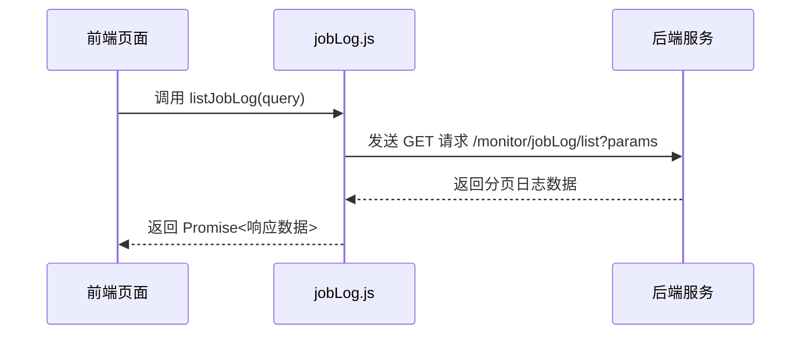
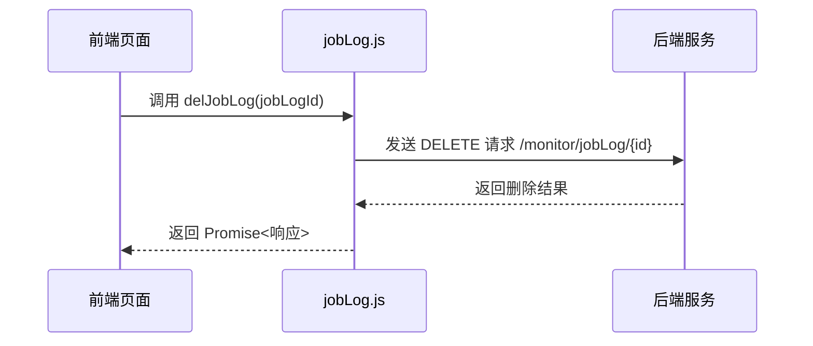
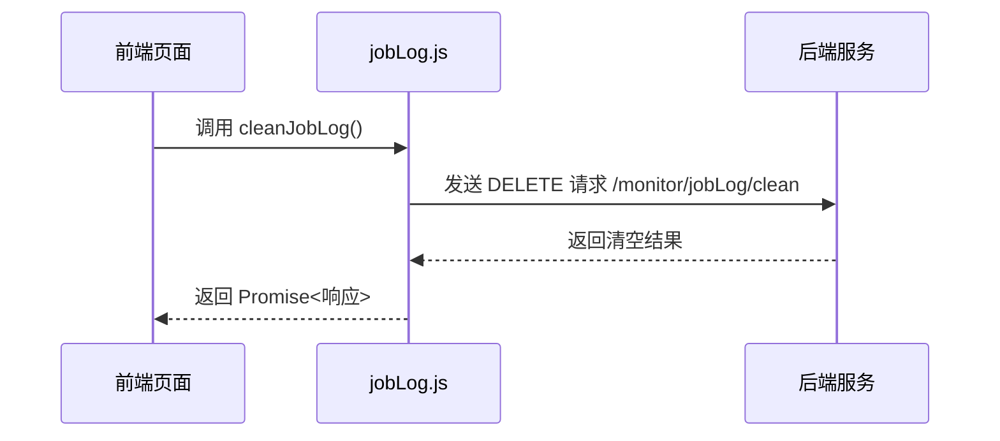

# 定时任务日志接口

<cite>
**本文档引用文件**  
- [jobLog.js](file://daoju/src/api/monitor/jobLog.js)
- [job.js](file://daoju/src/api/monitor/job.js)
- [operationLog.js](file://daoju/src/api/historyRecord/operationLog.js)
- [operationLog.vue](file://daoju/src/views/historyRecord/operationLog/index.vue)
</cite>

## 目录
1. [简介](#简介)
2. [核心接口说明](#核心接口说明)
3. [日志数据结构](#日志数据结构)
4. [前端调用示例](#前端调用示例)
5. [日志清理策略](#日志清理策略)
6. [性能建议](#性能建议)

## 简介
本文档详细描述了基于 `jobLog.js` 实现的定时任务调度日志接口，涵盖日志的查询、删除与清空操作。系统通过 `/monitor/jobLog` 路由提供 RESTful API，支持分页查询、按 ID 删除单条日志以及批量清空日志功能。日志记录包含任务执行的关键信息，如任务名称、执行结果、耗时、异常信息等，为系统监控与故障排查提供数据支持。

**Section sources**
- [jobLog.js](file://daoju/src/api/monitor/jobLog.js#L1-L26)

## 核心接口说明

### 查询调度日志列表（listJobLog）
- **请求方式**：GET
- **请求路径**：`/monitor/jobLog/list`
- **参数说明**：
  - `query`：查询条件对象，支持分页与过滤
    - `pageNum`：当前页码
    - `pageSize`：每页数量
    - `jobName`：任务名称（模糊匹配）
    - `status`：执行状态（0：成功，1：失败）
    - `startTime` / `endTime`：执行时间范围
- **响应结构**：分页数据对象，包含日志列表及总数



**Diagram sources**
- [jobLog.js](file://daoju/src/api/monitor/jobLog.js#L4-L9)

### 删除调度日志（delJobLog）
- **请求方式**：DELETE
- **请求路径**：`/monitor/jobLog/{jobLogId}`
- **参数说明**：
  - `jobLogId`：日志唯一标识（路径参数）
- **响应结构**：标准操作结果（success/error）



**Diagram sources**
- [jobLog.js](file://daoju/src/api/monitor/jobLog.js#L13-L17)

### 清空调度日志（cleanJobLog）
- **请求方式**：DELETE
- **请求路径**：`/monitor/jobLog/clean`
- **参数说明**：无
- **响应结构**：清空操作结果，包含影响行数



**Diagram sources**
- [jobLog.js](file://daoju/src/api/monitor/jobLog.js#L20-L25)

## 日志数据结构
调度日志记录包含以下关键字段：
- `jobLogId`：日志ID
- `jobName`：任务名称
- `jobGroup`：任务组名
- `invokeTarget`：调用目标
- `status`：执行状态（0：成功，1：失败）
- `result`：执行结果描述
- `exceptionInfo`：异常信息（失败时填充）
- `startTime`：开始时间（ISO8601格式）
- `endTime`：结束时间
- `executionTime`：执行耗时（毫秒）
- `createTime`：日志创建时间

**Section sources**
- [jobLog.js](file://daoju/src/api/monitor/jobLog.js#L4-L25)

## 前端调用示例
在任务详情页中，可通过以下方式关联展示历史执行日志：

```javascript
import { listJobLog } from '@/api/monitor/jobLog'

// 在任务详情组件中加载日志
async loadJobLogs(jobId) {
  const query = {
    pageNum: 1,
    pageSize: 10,
    jobId: jobId
  }
  const response = await listJobLog(query)
  this.jobLogList = response.rows
  this.total = response.total
}
```

结合 `job.js` 中的 `getJob(jobId)` 接口，可先获取任务基本信息，再加载其执行日志，实现任务与日志的关联展示。

```mermaid
flowchart TD
A[进入任务详情页] --> B[调用 getJob(jobId)]
B --> C[显示任务基本信息]
C --> D[调用 listJobLog({ jobId })]
D --> E[展示执行日志列表]
E --> F[支持分页与筛选]
```

**Diagram sources**
- [jobLog.js](file://daoju/src/api/monitor/jobLog.js#L4-L9)
- [job.js](file://daoju/src/api/monitor/job.js#L13-L17)

## 日志清理策略
系统提供两种日志清理机制：
1. **手动清空**：通过 `cleanJobLog()` 接口一次性删除所有日志
2. **定期清理**：建议结合业务需求设置定时任务，例如每月清理3个月前的日志

参考 `operationLog.js` 中的 `cleanExpiredLogs(days)` 接口设计，可扩展支持按时间范围清理，避免全量删除带来的数据丢失风险。

**Section sources**
- [jobLog.js](file://daoju/src/api/monitor/jobLog.js#L20-L25)
- [operationLog.js](file://daoju/src/api/historyRecord/operationLog.js#L28-L33)

## 性能建议
- **定期清理**：调度日志持续增长，建议每月执行一次清理，防止数据库表过大影响查询性能
- **索引优化**：确保 `job_name`、`status`、`start_time` 字段建立数据库索引，提升查询效率
- **分页查询**：前端默认每页展示10-20条，避免一次性加载过多数据
- **异常监控**：对执行失败（status=1）的日志进行重点监控，及时发现任务异常

**Section sources**
- [jobLog.js](file://daoju/src/api/monitor/jobLog.js#L1-L26)
- [operationLog.js](file://daoju/src/api/historyRecord/operationLog.js#L1-L55)