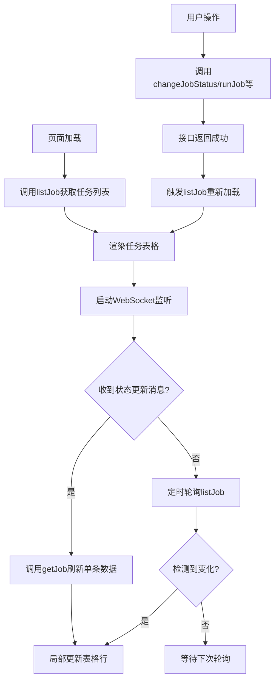
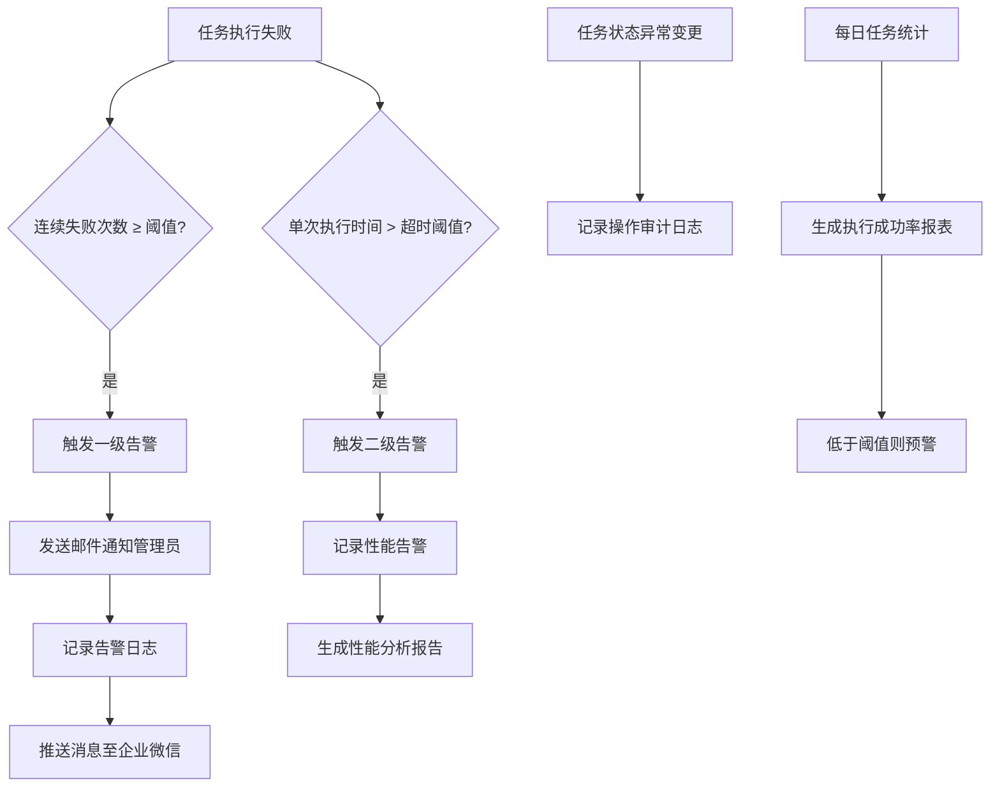

# 定时任务监控接口

<cite>
**本文档引用文件**  
- [job.js](file://daoju/src/api/monitor/job.js)
- [jobLog.js](file://daoju/src/api/monitor/jobLog.js)
- [index.vue](file://daoju/src/components/Crontab/index.vue)
</cite>

## 目录
1. [简介](#简介)
2. [定时任务管理接口](#定时任务管理接口)
3. [任务日志管理接口](#任务日志管理接口)
4. [任务实体关键字段说明](#任务实体关键字段说明)
5. [前端任务管理页面数据绑定示例](#前端任务管理页面数据绑定示例)
6. [任务失败重试与超时机制](#任务失败重试与超时机制)
7. [系统告警联动策略](#系统告警联动策略)

## 简介
本接口文档详细说明了定时任务监控模块的API设计与使用方式，涵盖任务的增删改查、启停控制、立即执行、状态查询及日志关联等核心功能。通过整合`job.js`和`jobLog.js`中的接口定义，为前端任务管理页面提供完整的数据支撑与交互逻辑。

**Section sources**
- [job.js](file://daoju/src/api/monitor/job.js#L1-L71)
- [jobLog.js](file://daoju/src/api/monitor/jobLog.js#L1-L27)

## 定时任务管理接口

### 查询任务列表
获取所有定时任务调度的分页列表。

**接口路径**：`GET /monitor/job/list`  
**调用方法**：`listJob(query)`  
**参数**：查询条件对象（如页码、每页数量、任务名称等）

### 查询任务详情
根据任务ID获取单个任务的详细信息。

**接口路径**：`GET /monitor/job/{jobId}`  
**调用方法**：`getJob(jobId)`  
**参数**：`jobId` - 任务唯一标识

### 新增定时任务
创建一个新的定时任务。

**接口路径**：`POST /monitor/job`  
**调用方法**：`addJob(data)`  
**参数**：任务配置对象（包含任务名称、Cron表达式、执行类等）

### 修改定时任务
更新已有定时任务的配置。

**接口路径**：`PUT /monitor/job`  
**调用方法**：`updateJob(data)`  
**参数**：包含任务ID及其他更新字段的对象

### 删除定时任务
从系统中移除指定的定时任务。

**接口路径**：`DELETE /monitor/job/{jobId}`  
**调用方法**：`delJob(jobId)`  
**参数**：`jobId` - 待删除任务ID

### 修改任务状态
启用或停用指定的定时任务。

**接口路径**：`PUT /monitor/job/changeStatus`  
**调用方法**：`changeJobStatus(jobId, status)`  
**参数**：
- `jobId`：任务ID
- `status`：目标状态（如"0"启用，"1"停用）

### 立即执行任务
手动触发一次定时任务的执行，不改变其原有调度计划。

**接口路径**：`PUT /monitor/job/run`  
**调用方法**：`runJob(jobId, jobGroup)`  
**参数**：
- `jobId`：任务ID
- `jobGroup`：任务所属分组

**Section sources**
- [job.js](file://daoju/src/api/monitor/job.js#L3-L70)

## 任务日志管理接口

### 查询调度日志列表
获取定时任务执行的历史日志记录。

**接口路径**：`GET /monitor/jobLog/list`  
**调用方法**：`listJobLog(query)`  
**参数**：分页及筛选条件

### 删除调度日志
删除指定ID的任务执行日志。

**接口路径**：`DELETE /monitor/jobLog/{jobLogId}`  
**调用方法**：`delJobLog(jobLogId)`  
**参数**：`jobLogId` - 日志记录ID

### 清空调度日志
批量清除所有任务执行日志记录。

**接口路径**：`DELETE /monitor/jobLog/clean`  
**调用方法**：`cleanJobLog()`  
**参数**：无

**Section sources**
- [jobLog.js](file://daoju/src/api/monitor/jobLog.js#L3-L27)

## 任务实体关键字段说明
定时任务核心数据模型包含以下关键字段：

| 字段名 | 说明 |
|--------|------|
| 任务名称 | 用户可读的任务标识，用于区分不同任务 |
| Cron表达式 | 定义任务执行频率的调度规则，遵循标准Cron语法 |
| 执行状态 | 当前任务运行状态（如运行中、已暂停、已停止） |
| 下次执行时间 | 根据当前Cron表达式计算得出的下一次预计执行时间戳 |
| 任务分组 | 逻辑分组标识，用于分类管理和权限控制 |
| 执行类名 | 实际执行业务逻辑的后端服务类全限定名 |
| 创建时间 | 任务创建的时间戳 |
| 更新时间 | 最后一次修改任务配置的时间戳 |

这些字段通过`job.js`中的接口进行持久化与查询，构成任务管理的基础数据结构。

**Section sources**
- [job.js](file://daoju/src/api/monitor/job.js#L20-L35)

## 前端任务管理页面数据绑定示例
前端任务管理界面通过以下方式实现数据绑定与实时刷新：

**Diagram sources**
- [job.js](file://daoju/src/api/monitor/job.js#L3-L70)
- [index.vue](file://daoju/src/components/Crontab/index.vue#L1-L313)

此外，Cron表达式生成器组件（`Crontab/index.vue`）提供可视化配置界面，支持秒、分、时、日、月、周、年七位表达式编辑，并实时预览下五次执行时间，确保配置准确性。

## 任务失败重试机制
系统内置任务失败自动重试逻辑：

1. **重试策略**：当任务执行异常时，按照预设的最大重试次数进行重试
2. **重试间隔**：采用指数退避算法，避免短时间内频繁重试造成系统压力
3. **状态标记**：每次失败均记录失败原因与堆栈信息至日志表
4. **最终失败处理**：达到最大重试次数后，任务状态置为“失败”，停止自动重试

该机制通过任务执行框架底层拦截异常并触发重试流程，无需业务代码显式处理。

## 执行超时判断逻辑
为防止任务长时间占用资源，系统实施超时控制：

- **超时阈值**：可在任务配置中设置单次执行最大允许时间（单位：秒）
- **超时检测**：任务启动时记录开始时间，执行过程中定期检查是否超限
- **强制终止**：一旦超时，系统将尝试中断任务线程并标记为“超时”
- **资源清理**：超时后释放相关数据库连接、文件句柄等资源

超时判断由调度器在独立线程中监控，不影响其他任务正常执行。

## 系统告警联动策略
定时任务异常情况将触发多级告警机制：

**Diagram sources**
- [job.js](file://daoju/src/api/monitor/job.js#L46-L56)
- [jobLog.js](file://daoju/src/api/monitor/jobLog.js#L3-L10)

告警策略通过监听任务执行事件流实现，与日志模块紧密集成，确保关键异常能够及时上报并留存追溯记录。