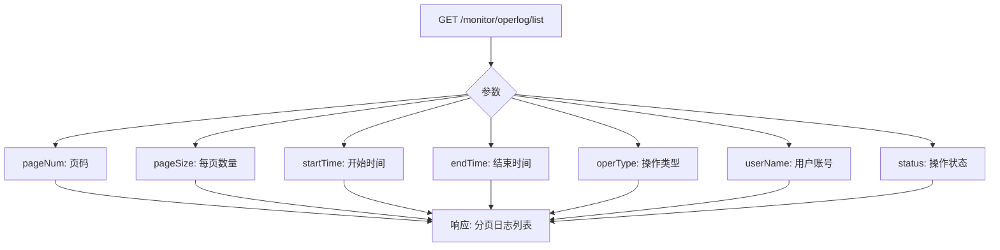
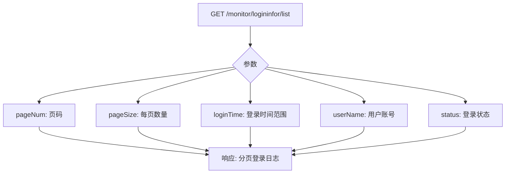

# 操作与登录日志接口

<cite>
**本文档引用文件**  
- [operlog.js](file://daoju\src\api\monitor\operlog.js)
- [logininfor.js](file://daoju\src\api\monitor\logininfor.js)
- [operationLog\index.vue](file://daoju\src\views\historyRecord\operationLog\index.vue)
- [historyRecord\operationLog.js](file://daoju\src\api\historyRecord\operationLog.js)
</cite>

## 目录
1. [简介](#简介)
2. [日志记录机制](#日志记录机制)
3. [查询接口定义](#查询接口定义)
4. [关键字段说明](#关键字段说明)
5. [前端审计页面功能实现](#前端审计页面功能实现)
6. [日志存储与安全策略](#日志存储与安全策略)
7. [安全事件追溯应用](#安全事件追溯应用)

## 简介
本系统提供操作日志与登录日志的完整审计功能，支持对用户行为和系统访问的全面追踪。通过标准化的API接口，实现日志的查询、删除、清空等管理操作，为系统安全与合规性提供保障。

## 日志记录机制

操作日志（operlog）与登录日志（logininfor）由系统在用户执行关键操作或登录行为时自动记录。日志信息包含操作模块、请求方式、操作结果、IP地址、用户账号等关键数据，确保所有行为可追溯。

**日志类型说明：**
- **操作日志**：记录用户在系统中的各类业务操作，如借刀、还刀、补货等。
- **登录日志**：记录用户的登录尝试、成功/失败状态、登录时间及IP地址。

**Section sources**
- [operlog.js](file://daoju\src\api\monitor\operlog.js#L1-L26)
- [logininfor.js](file://daoju\src\api\monitor\logininfor.js#L1-L34)

## 查询接口定义

### 操作日志查询接口


**Diagram sources**
- [operlog.js](file://daoju\src\api\monitor\operlog.js#L4-L9)

### 登录日志查询接口


**Diagram sources**
- [logininfor.js](file://daoju\src\api\monitor\logininfor.js#L4-L9)

### 删除与清空接口
| 接口名称 | 方法 | 路径 | 说明 |
|--------|------|------|------|
| 删除单条操作日志 | DELETE | /monitor/operlog/{operId} | 根据操作ID删除 |
| 清空所有操作日志 | DELETE | /monitor/operlog/clean | 批量清除 |
| 删除单条登录日志 | DELETE | /monitor/logininfor/{infoId} | 根据日志ID删除 |
| 清空所有登录日志 | DELETE | /monitor/logininfor/clean | 批量清除 |
| 解锁用户账户 | GET | /monitor/logininfor/unlock/{userName} | 解除账户锁定 |

**Section sources**
- [operlog.js](file://daoju\src\api\monitor\operlog.js#L12-L25)
- [logininfor.js](file://daoju\src\api\monitor\logininfor.js#L12-L34)

## 关键字段说明

| 字段名 | 中文含义 | 示例值 | 说明 |
|-------|--------|-------|------|
| operModule | 操作模块 | 刀具管理 | 记录操作所属功能模块 |
| requestMethod | 请求方式 | POST/GET | HTTP请求方法 |
| operType | 操作类型 | 新增/修改/删除 | 具体操作行为 |
| operResult | 操作结果 | 成功/失败 | 操作执行状态 |
| ipaddr | IP地址 | 192.168.1.100 | 用户客户端IP |
| loginStatus | 登录状态 | 0:成功 1:失败 | 登录尝试结果 |
| userName | 用户账号 | admin | 操作或登录用户 |
| operTime | 操作时间 | 2024-12-27 10:30:00 | 操作发生时间 |
| remark | 备注 | 批量导入失败 | 操作附加信息 |

**Section sources**
- [operationLog\index.vue](file://daoju\src\views\historyRecord\operationLog\index.vue#L133-L174)

## 前端审计页面功能实现

### 分页查询与条件过滤
前端通过`operationLog/index.vue`组件实现日志审计功能，支持以下条件组合查询：
- 时间范围（开始时间、结束时间）
- 记录状态（取刀、还刀、收刀、暂存、完成、违规还刀）
- 排序方式（按数量或金额，从大到小或从小到大）

```mermaid
flowchart LR
S[搜索表单] --> T[开始时间]
S --> U[结束时间]
S --> V[记录状态]
S --> W[排序类型]
S --> X[排序方式]
S --> Y[查询按钮]
Y --> Z[调用getList()]
Z --> AA[更新tableData]
Z --> AB[更新分页信息]
```

**Diagram sources**
- [operationLog\index.vue](file://daoju\src\views\historyRecord\operationLog\index.vue#L7-L53)

### 数据导出功能
支持选中多条日志记录后导出为文件，若未选择任何记录则提示用户。

```javascript
function handleExport() {
  if (selectedRows.value.length === 0) {
    ElMessage.warning('请选择要导出的记录')
    return
  }
  // 调用导出接口
}
```

**Section sources**
- [operationLog\index.vue](file://daoju\src\views\historyRecord\operationLog\index.vue#L58-L60)

## 日志存储与安全策略

### 存储策略
- 日志数据持久化存储于数据库中，支持长期保留与审计
- 提供分页查询接口避免一次性加载过多数据
- 支持按时间范围归档与清理过期日志

### 敏感信息脱敏
系统对日志中的敏感信息进行脱敏处理：
- IP地址部分字段隐藏（如：192.168.*.*）
- 用户密码等敏感字段不记录
- 支持配置脱敏规则，满足不同安全等级要求

**Section sources**
- [historyRecord\operationLog.js](file://daoju\src\api\historyRecord\operationLog.js#L1-L55)

## 安全事件追溯应用

通过操作日志与登录日志的联合分析，可实现：
- **异常行为检测**：识别频繁失败登录、非常规时间操作等风险行为
- **责任追溯**：定位具体操作人、时间、IP地址，明确责任归属
- **合规审计**：满足等保、ISO27001等安全标准的审计要求
- **事件复盘**：完整还原安全事件发生过程，辅助问题排查

日志系统为三权分立架构（管理员、操作员、审计员）提供数据支撑，确保权限分离与相互监督。

**Section sources**
- [logininfor.js](file://daoju\src\api\monitor\logininfor.js#L20-L25)
- [operationLog\index.vue](file://daoju\src\views\historyRecord\operationLog\index.vue#L108-L136)