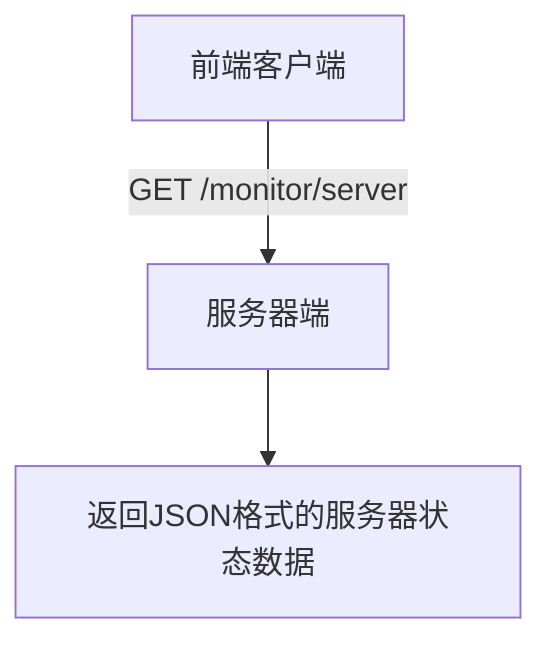
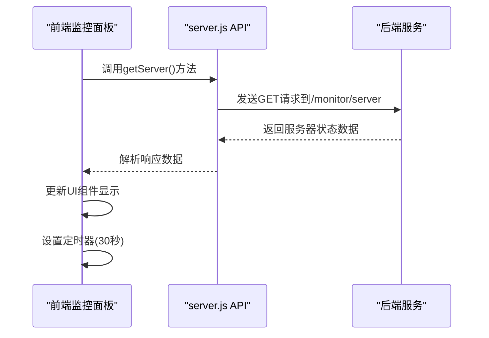
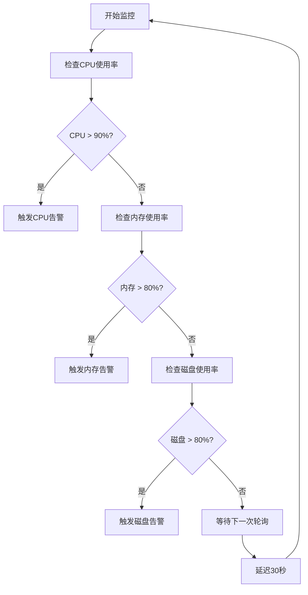
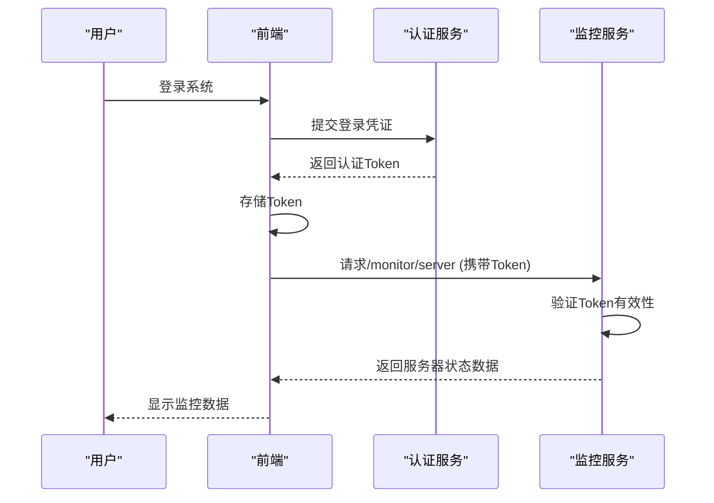

# 服务器状态监控接口

<cite>
**本文档引用文件**   
- [server.js](file://daoju/src/api/monitor/server.js)
- [index.vue](file://daoju/src/views/monitor/server/index.vue)
</cite>

## 目录
1. [简介](#简介)
2. [API接口定义](#api接口定义)
3. [核心性能指标说明](#核心性能指标说明)
4. [前端监控面板实现](#前端监控面板实现)
5. [异常阈值判断与预警系统集成](#异常阈值判断与预警系统集成)
6. [安全认证机制](#安全认证机制)

## 简介
本系统提供全面的服务器状态监控功能，通过RESTful API接口实时采集服务器的核心性能指标，包括CPU使用率、内存占用、磁盘空间、系统运行时间等关键数据。前端监控面板通过轮询机制获取这些指标并实时更新仪表盘，帮助运维人员及时掌握系统运行状态。

**Section sources**
- [index.vue](file://daoju/src/views/monitor/server/index.vue#L1-L188)

## API接口定义
系统提供`/monitor/server`接口用于获取服务器状态信息，该接口通过HTTP GET方法访问，返回JSON格式的服务器性能数据。

**Diagram sources**
- [server.js](file://daoju/src/api/monitor/server.js#L4-L9)

**Section sources**
- [server.js](file://daoju/src/api/monitor/server.js#L1-L9)

## 核心性能指标说明
服务器状态监控接口采集以下核心性能指标：

### CPU使用率
- **核心数**: 系统CPU核心数量
- **用户使用率**: CPU在用户模式下的使用百分比
- **系统使用率**: CPU在系统模式下的使用百分比
- **当前空闲率**: CPU空闲时间百分比

### 内存占用
- **总内存**: 系统物理内存总量（单位：G）
- **已用内存**: 已使用的物理内存（单位：G）
- **剩余内存**: 可用的物理内存（单位：G）
- **使用率**: 内存使用百分比

### JVM内存
- **总内存**: JVM堆内存总量（单位：M）
- **已用内存**: JVM已使用的堆内存（单位：M）
- **剩余内存**: JVM可用的堆内存（单位：M）
- **使用率**: JVM内存使用百分比

### 服务器信息
- **服务器名称**: 主机名
- **服务器IP**: 主机IP地址
- **操作系统**: 操作系统名称
- **系统架构**: 系统架构类型

### Java虚拟机信息
- **Java名称**: JVM名称
- **Java版本**: JVM版本号
- **启动时间**: JVM启动时间
- **运行时长**: JVM已运行时间
- **安装路径**: Java安装目录
- **项目路径**: 当前项目工作目录

### 磁盘状态
- **盘符路径**: 磁盘挂载路径
- **文件系统**: 磁盘文件系统类型
- **盘符类型**: 磁盘类型
- **总大小**: 磁盘总容量
- **可用大小**: 磁盘可用空间
- **已用大小**: 磁盘已用空间
- **已用百分比**: 磁盘使用率

**Section sources**
- [index.vue](file://daoju/src/views/monitor/server/index.vue#L7-L167)

## 前端监控面板实现
前端监控面板通过Vue.js框架实现，采用轮询机制定期获取服务器状态数据并更新UI。

**Diagram sources**
- [index.vue](file://daoju/src/views/monitor/server/index.vue#L178-L186)
- [server.js](file://daoju/src/api/monitor/server.js#L4-L9)

**Section sources**
- [index.vue](file://daoju/src/views/monitor/server/index.vue#L172-L187)

## 异常阈值判断与预警系统集成
系统内置异常阈值判断逻辑，当关键指标超过预设阈值时触发视觉告警。

### 阈值判断规则
- **内存使用率**: > 80% 触发警告样式
- **JVM内存使用率**: > 80% 触发警告样式
- **磁盘使用率**: > 80% 触发警告样式

**Diagram sources**
- [index.vue](file://daoju/src/views/monitor/server/index.vue#L68-L70)
- [index.vue](file://daoju/src/views/monitor/server/index.vue#L161-L162)

**Section sources**
- [index.vue](file://daoju/src/views/monitor/server/index.vue#L65-L70)
- [index.vue](file://daoju/src/views/monitor/server/index.vue#L161-L162)

## 安全认证机制
服务器状态监控接口受系统安全认证机制保护，只有经过身份验证的用户才能访问。系统采用基于Token的认证方式，前端在每次请求时自动携带认证令牌。

**Diagram sources**
- [server.js](file://daoju/src/api/monitor/server.js#L5-L8)
- [index.vue](file://daoju/src/views/monitor/server/index.vue#L180-L182)

**Section sources**
- [server.js](file://daoju/src/api/monitor/server.js#L5-L8)
- [index.vue](file://daoju/src/views/monitor/server/index.vue#L180-L182)