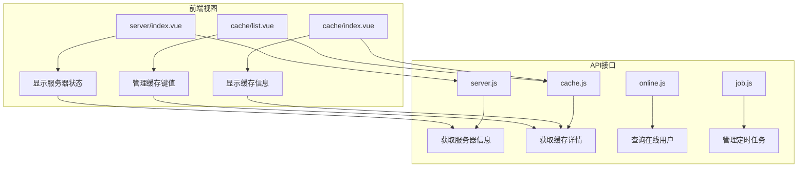
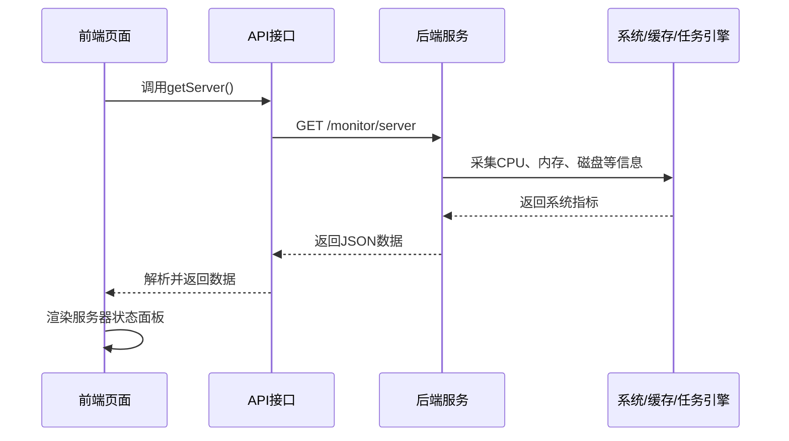
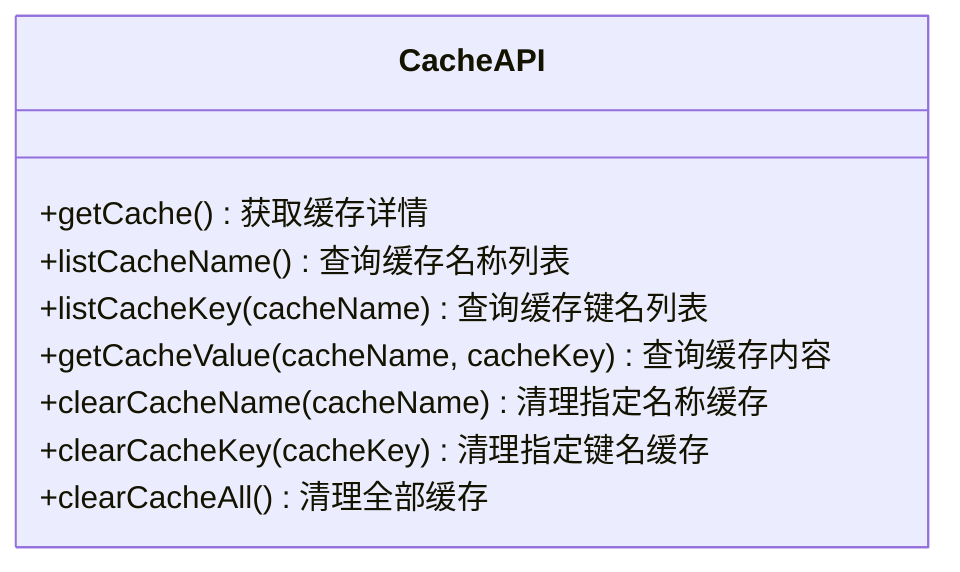
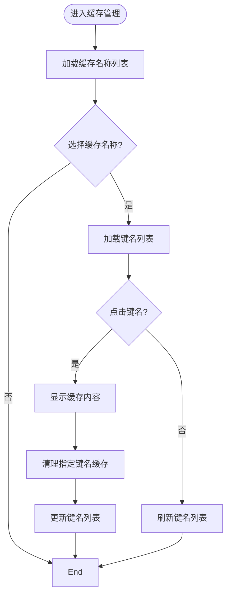
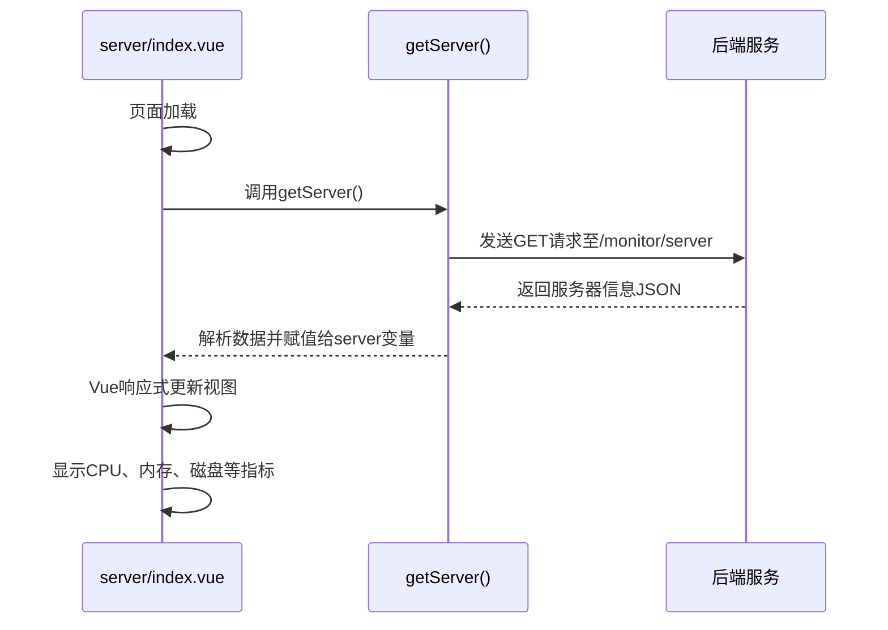
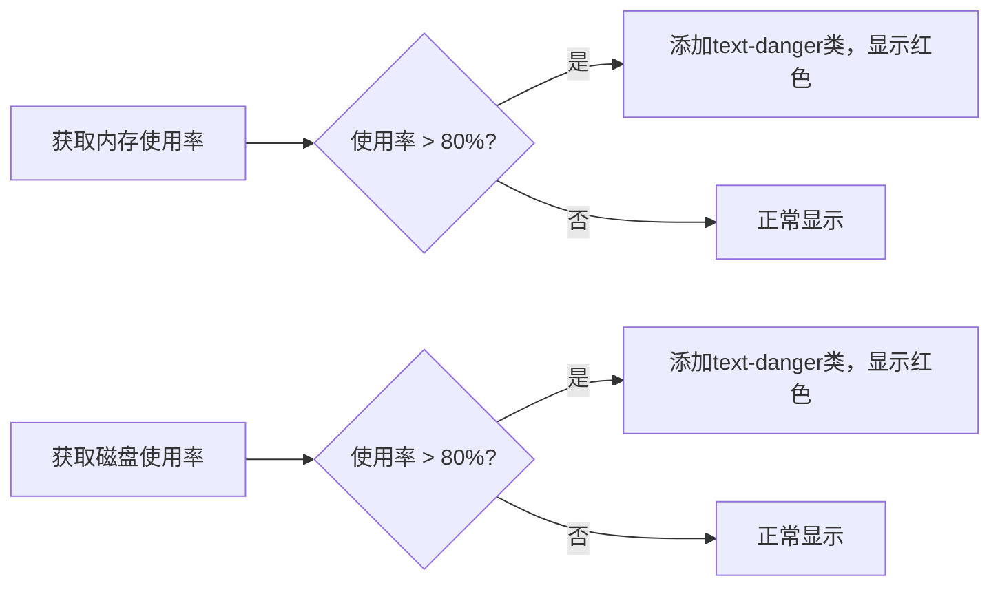

# 系统监控接口

<cite>
**本文档引用文件**  
- [cache.js](file://daoju/src/api/monitor/cache.js)
- [server.js](file://daoju/src/api/monitor/server.js)
- [online.js](file://daoju/src/api/monitor/online.js)
- [job.js](file://daoju/src/api/monitor/job.js)
- [index.vue](file://daoju/src/views/monitor/server/index.vue)
- [cache/index.vue](file://daoju/src/views/monitor/cache/index.vue)
- [cache/list.vue](file://daoju/src/views/monitor/cache/list.vue)
</cite>

## 目录
1. [简介](#简介)
2. [项目结构](#项目结构)
3. [核心组件](#核心组件)
4. [架构概览](#架构概览)
5. [详细组件分析](#详细组件分析)
6. [依赖分析](#依赖分析)
7. [性能考量](#性能考量)
8. [故障排除指南](#故障排除指南)
9. [结论](#结论)

## 简介
本文档详细说明了系统监控模块的API接口设计与功能实现，涵盖缓存监控、服务器状态、在线用户和定时任务四大核心监控功能。文档重点阐述各接口的数据采集方式、返回的关键性能指标（如CPU、内存、磁盘使用率、缓存命中率、任务执行状态等），并提供监控面板数据绑定示例与异常告警逻辑。

## 项目结构
系统监控模块位于 `daoju/src/api/monitor` 目录下，包含多个独立的监控功能文件，每个文件负责特定类型的系统指标采集。前端视图位于 `daoju/src/views/monitor` 目录，采用Vue3 + Element Plus构建，通过API调用实现数据展示与交互。



**图示来源**
- [server.js](file://daoju/src/api/monitor/server.js#L3-L8)
- [cache.js](file://daoju/src/api/monitor/cache.js#L3-L8)
- [index.vue](file://daoju/src/views/monitor/server/index.vue#L173-L187)
- [cache/index.vue](file://daoju/src/views/monitor/cache/index.vue#L68-L81)

**本节来源**
- [daoju/src/api/monitor/server.js](file://daoju/src/api/monitor/server.js)
- [daoju/src/api/monitor/cache.js](file://daoju/src/api/monitor/cache.js)
- [daoju/src/views/monitor/server/index.vue](file://daoju/src/views/monitor/server/index.vue)
- [daoju/src/views/monitor/cache/index.vue](file://daoju/src/views/monitor/cache/index.vue)

## 核心组件
系统监控模块由四个核心API文件构成：`cache.js` 负责Redis缓存状态监控，`server.js` 采集服务器硬件与JVM信息，`online.js` 管理在线用户会话，`job.js` 监控定时任务调度。这些接口通过统一的请求封装（`@/utils/request`）与后端通信，返回结构化数据供前端展示。

**本节来源**
- [cache.js](file://daoju/src/api/monitor/cache.js#L3-L57)
- [server.js](file://daoju/src/api/monitor/server.js#L3-L8)
- [online.js](file://daoju/src/api/monitor/online.js#L3-L18)
- [job.js](file://daoju/src/api/monitor/job.js#L3-L70)

## 架构概览
系统采用前后端分离架构，前端通过调用RESTful API获取监控数据。数据流为：前端页面 → API调用 → 后端服务 → 系统/缓存/任务引擎 → 返回指标数据 → 前端渲染。安全访问通过权限指令（`hasPermi`）控制，确保只有授权用户可访问监控功能。



**图示来源**
- [server.js](file://daoju/src/api/monitor/server.js#L3-L8)
- [index.vue](file://daoju/src/views/monitor/server/index.vue#L178-L184)

## 详细组件分析

### 缓存监控分析
`cache.js` 提供了对Redis缓存的全面监控能力，包括查询缓存详情、管理缓存键值、清理缓存等操作。前端通过 `cache/index.vue` 展示缓存基本信息与统计图表，通过 `cache/list.vue` 实现缓存键值的精细化管理。

#### 缓存监控接口


**图示来源**
- [cache.js](file://daoju/src/api/monitor/cache.js#L4-L57)

#### 缓存管理流程


**图示来源**
- [cache/list.vue](file://daoju/src/views/monitor/cache/list.vue#L170-L245)

**本节来源**
- [cache.js](file://daoju/src/api/monitor/cache.js#L3-L57)
- [cache/index.vue](file://daoju/src/views/monitor/cache/index.vue#L68-L129)
- [cache/list.vue](file://daoju/src/views/monitor/cache/list.vue#L158-L245)

### 服务器状态监控分析
`server.js` 提供服务器系统与JVM的实时监控数据。前端 `server/index.vue` 页面通过调用 `getServer()` 接口，获取CPU、内存、磁盘、Java虚拟机等关键指标，并以表格形式直观展示。页面在加载时自动调用接口，并支持手动刷新。

#### 服务器监控数据绑定


**图示来源**
- [server.js](file://daoju/src/api/monitor/server.js#L3-L8)
- [index.vue](file://daoju/src/views/monitor/server/index.vue#L178-L184)

#### 异常阈值告警逻辑
前端通过CSS类 `text-danger` 实现异常阈值告警。当内存或磁盘使用率超过80%时，对应数值的文本颜色会变为红色，实现视觉告警。


**图示来源**
- [index.vue](file://daoju/src/views/monitor/server/index.vue#L68-L70, L161-L162)

**本节来源**
- [server.js](file://daoju/src/api/monitor/server.js#L3-L8)
- [index.vue](file://daoju/src/views/monitor/server/index.vue#L172-L187)

### 在线用户监控分析
`online.js` 提供了在线用户会话的管理功能，包括查询在线用户列表和强制用户下线。该功能对于系统安全审计和异常会话处理至关重要。

**本节来源**
- [online.js](file://daoju/src/api/monitor/online.js#L3-L18)

### 定时任务监控分析
`job.js` 提供了对定时任务（Quartz调度器）的完整生命周期管理，包括查询、新增、修改、删除、启停和立即执行任务。该接口是系统自动化运维的核心。

**本节来源**
- [job.js](file://daoju/src/api/monitor/job.js#L3-L70)

## 依赖分析
系统监控模块依赖于前端框架（Vue3、Element Plus）、图表库（ECharts）和网络请求库（axios封装）。API层依赖 `@/utils/request` 进行统一的HTTP请求处理，确保了代码的可维护性和一致性。

```mermaid
graph TD
A[监控模块] --> B[Vue3]
A --> C[Element Plus]
A --> D[ECharts]
A --> E[@/utils/request]
E --> F[axios]
```

**图示来源**
- [cache/index.vue](file://daoju/src/views/monitor/cache/index.vue#L69)
- [server.js](file://daoju/src/api/monitor/server.js#L1)
- [cache.js](file://daoju/src/api/monitor/cache.js#L1)

**本节来源**
- [server.js](file://daoju/src/api/monitor/server.js#L1)
- [cache.js](file://daoju/src/api/monitor/cache.js#L1)
- [cache/index.vue](file://daoju/src/views/monitor/cache/index.vue#L69)

## 性能考量
监控接口设计为轻量级GET请求，数据采集频率由前端控制（通常为手动刷新或定时轮询）。ECharts图表在数据加载后初始化，并监听窗口大小变化以实现响应式布局。对于大数据量的缓存键值列表，前端采用虚拟滚动或分页策略可进一步优化性能。

## 故障排除指南
- **无法获取服务器信息**：检查后端 `/monitor/server` 接口是否正常运行，确认网络连接和权限配置。
- **缓存图表不显示**：确认Redis服务是否正常，检查前端ECharts初始化代码是否有错误。
- **在线用户列表为空**：确认用户登录会话机制是否正常工作。
- **定时任务无法执行**：检查Quartz调度器配置和任务状态。

**本节来源**
- [server.js](file://daoju/src/api/monitor/server.js#L3-L8)
- [cache.js](file://daoju/src/api/monitor/cache.js#L3-L57)
- [online.js](file://daoju/src/api/monitor/online.js#L3-L18)
- [job.js](file://daoju/src/api/monitor/job.js#L3-L70)

## 结论
本文档详细阐述了系统监控模块的API设计与实现。该模块通过清晰的接口划分和直观的前端展示，为系统管理员提供了强大的系统健康状况洞察力。通过实时监控关键性能指标和提供管理操作，有效保障了系统的稳定性和安全性。