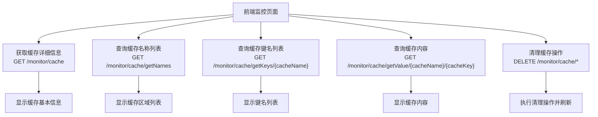
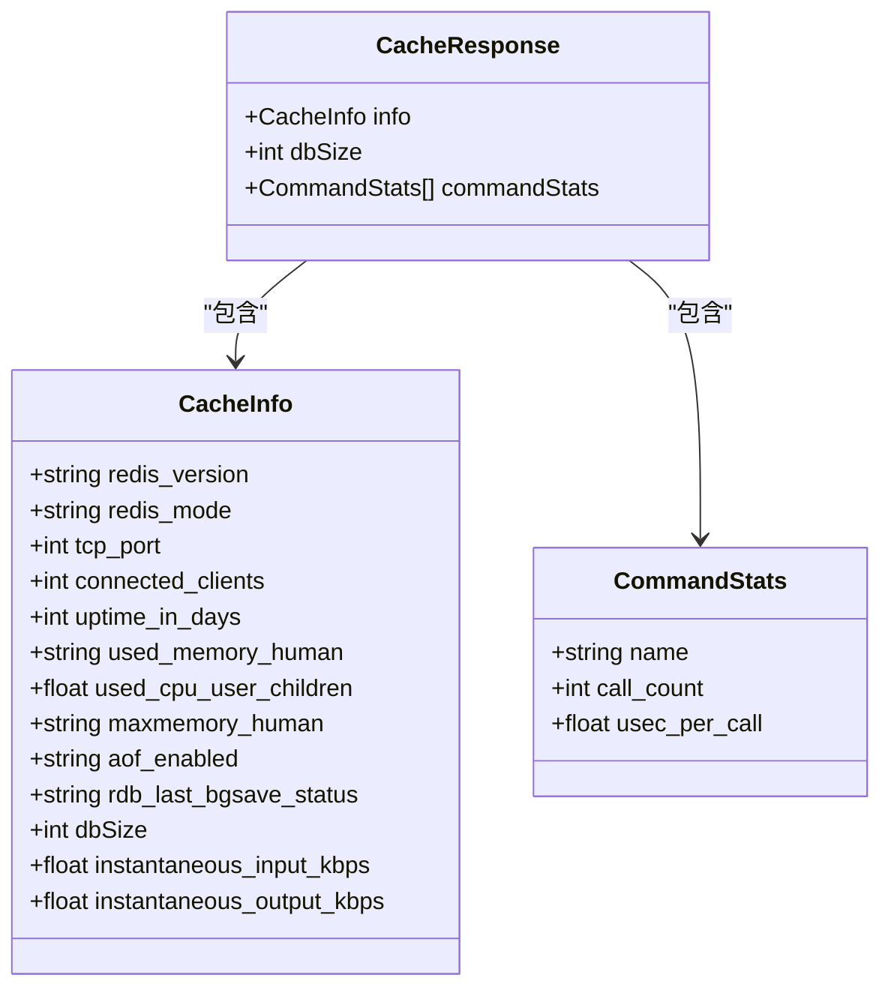
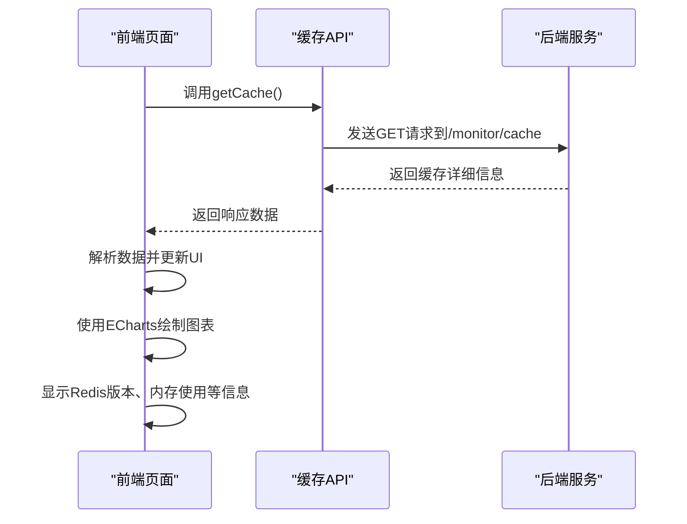
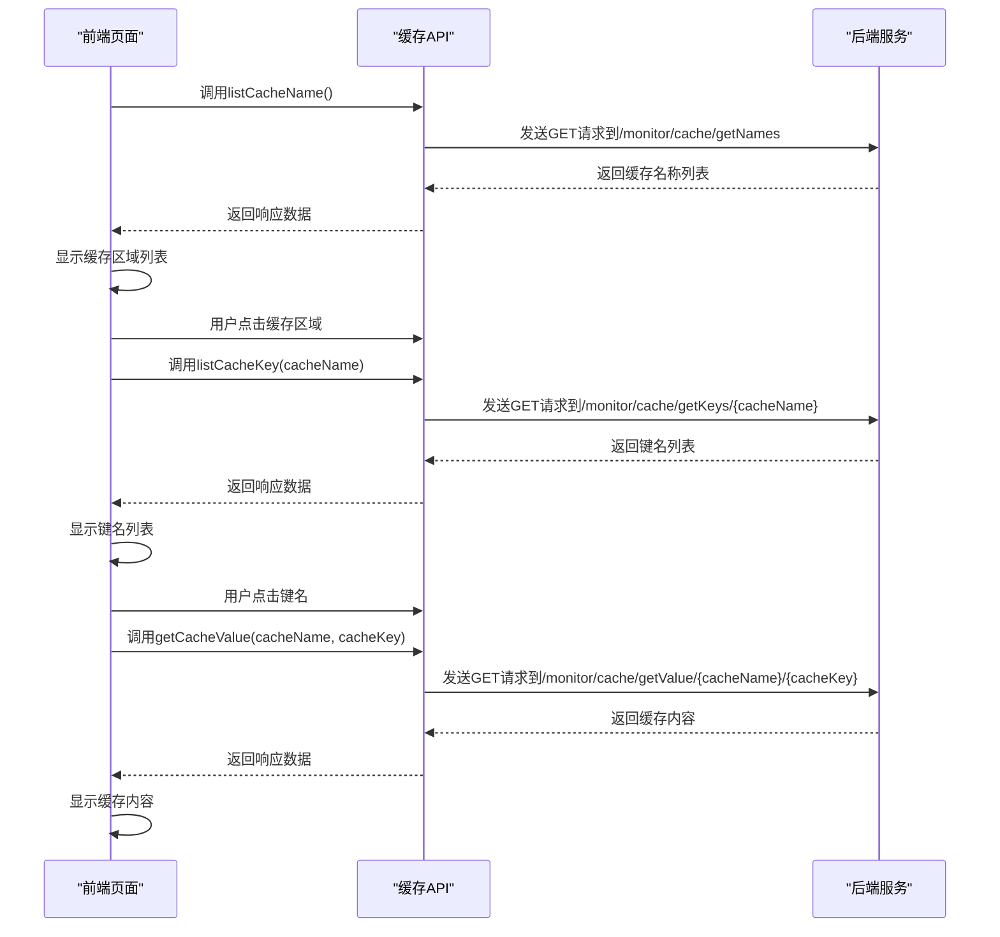
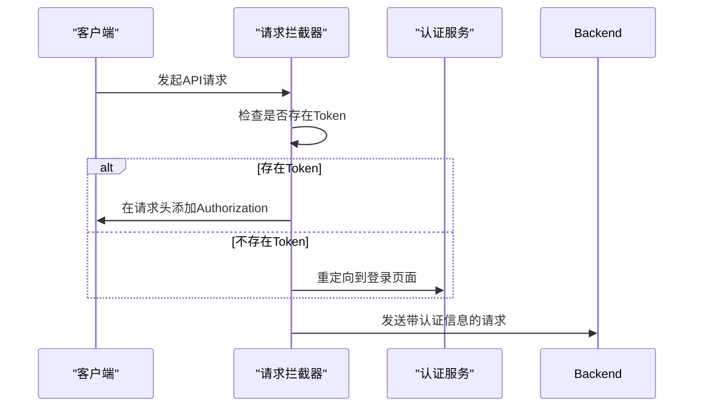

# 缓存监控接口

<cite>
**Referenced Files in This Document**   
- [cache.js](file://daoju/src/api/monitor/cache.js)
- [index.vue](file://daoju/src/views/monitor/cache/index.vue)
- [list.vue](file://daoju/src/views/monitor/cache/list.vue)
- [request.js](file://daoju/src/utils/request.js)
</cite>

## 目录
1. [简介](#简介)
2. [API接口定义](#api接口定义)
3. [关键指标字段说明](#关键指标字段说明)
4. [前端监控页面实现](#前端监控页面实现)
5. [数据刷新频率与性能权衡](#数据刷新频率与性能权衡)
6. [安全访问控制机制](#安全访问控制机制)
7. [高并发场景下的稳定性保障](#高并发场景下的稳定性保障)

## 简介
缓存监控接口为系统提供了全面的缓存状态监控能力，通过一系列RESTful API接口，系统管理员可以实时获取缓存的运行状态、性能指标和内存使用情况。该接口不仅支持查询缓存的基本信息，还提供了缓存清理功能，帮助维护系统的稳定运行。前端监控页面通过调用这些接口，实现了直观的可视化展示，使运维人员能够快速掌握缓存系统的健康状况。

**Section sources**
- [cache.js](file://daoju/src/api/monitor/cache.js#L1-L57)

## API接口定义

缓存监控接口提供了一系列HTTP端点，用于获取和管理缓存状态。以下是主要接口的详细定义：

### 获取缓存详细信息
- **HTTP方法**: GET
- **请求路径**: `/monitor/cache`
- **功能描述**: 获取缓存系统的详细信息，包括Redis版本、运行模式、内存使用情况、客户端连接数等核心指标。
- **响应结构**: 返回包含缓存系统详细信息的JSON对象。

### 查询缓存名称列表
- **HTTP方法**: GET
- **请求路径**: `/monitor/cache/getNames`
- **功能描述**: 获取系统中所有缓存区域的名称列表。
- **响应结构**: 返回包含缓存名称数组的JSON对象。

### 查询缓存键名列表
- **HTTP方法**: GET
- **请求路径**: `/monitor/cache/getKeys/{cacheName}`
- **功能描述**: 根据指定的缓存名称，获取该缓存区域内的所有键名列表。
- **参数**: `cacheName` (路径参数) - 指定要查询的缓存区域名称。
- **响应结构**: 返回包含键名数组的JSON对象。

### 查询缓存内容
- **HTTP方法**: GET
- **请求路径**: `/monitor/cache/getValue/{cacheName}/{cacheKey}`
- **功能描述**: 根据指定的缓存名称和键名，获取对应的缓存值。
- **参数**: 
  - `cacheName` (路径参数) - 缓存区域名称
  - `cacheKey` (路径参数) - 缓存键名
- **响应结构**: 返回包含缓存值信息的JSON对象。

### 清理缓存操作
系统提供了多种缓存清理操作，均通过DELETE方法实现：
- **清理指定名称缓存**: DELETE `/monitor/cache/clearCacheName/{cacheName}`
- **清理指定键名缓存**: DELETE `/monitor/cache/clearCacheKey/{cacheKey}`
- **清理全部缓存**: DELETE `/monitor/cache/clearCacheAll`



**Diagram sources**
- [cache.js](file://daoju/src/api/monitor/cache.js#L1-L57)

**Section sources**
- [cache.js](file://daoju/src/api/monitor/cache.js#L1-L57)

## 关键指标字段说明

缓存监控接口返回的数据包含多个关键指标字段，这些字段为系统性能分析提供了重要依据：

### 基本信息指标
- **Redis版本**: `redis_version` - 显示当前Redis服务器的版本号。
- **运行模式**: `redis_mode` - 标识Redis是单机模式("standalone")还是集群模式。
- **端口**: `tcp_port` - Redis服务器监听的TCP端口号。
- **客户端数**: `connected_clients` - 当前连接到Redis服务器的客户端数量。

### 性能指标
- **运行时间(天)**: `uptime_in_days` - Redis服务器已连续运行的天数。
- **使用内存**: `used_memory_human` - Redis当前使用的内存量，以人类可读格式显示（如"1.2G"）。
- **使用CPU**: `used_cpu_user_children` - Redis进程在用户态消耗的CPU时间。
- **内存配置**: `maxmemory_human` - Redis配置的最大内存限制。

### 健康状态指标
- **AOF是否开启**: `aof_enabled` - 标识AOF（Append Only File）持久化是否启用（0表示关闭，1表示开启）。
- **RDB是否成功**: `rdb_last_bgsave_status` - 上次RDB持久化操作的状态。
- **Key数量**: `dbSize` - 当前数据库中的键数量。
- **网络入口/出口**: `instantaneous_input_kbps`/`instantaneous_output_kbps` - 当前的网络输入/输出速率（kbps）。

### 命令统计指标
- **命令统计**: `commandStats` - 包含各类Redis命令的执行次数统计，用于分析缓存使用模式。



**Diagram sources**
- [index.vue](file://daoju/src/views/monitor/cache/index.vue#L1-L133)

**Section sources**
- [index.vue](file://daoju/src/views/monitor/cache/index.vue#L1-L133)

## 前端监控页面实现

前端监控页面通过调用缓存监控接口，实现了丰富的可视化功能。页面主要分为两个部分：基本信息展示和缓存管理。

### 基本信息展示页面
位于`index.vue`，该页面通过调用`getCache()`接口获取缓存详细信息，并使用ECharts库进行可视化展示：



**Diagram sources**
- [index.vue](file://daoju/src/views/monitor/cache/index.vue#L67-L132)

### 缓存管理页面
位于`list.vue`，该页面提供了完整的缓存管理功能，包括缓存区域列表、键名列表和缓存内容查看：



**Diagram sources**
- [list.vue](file://daoju/src/views/monitor/cache/list.vue#L157-L246)

**Section sources**
- [index.vue](file://daoju/src/views/monitor/cache/index.vue#L67-L132)
- [list.vue](file://daoju/src/views/monitor/cache/list.vue#L157-L246)

## 数据刷新频率与性能权衡

缓存监控接口的数据刷新频率需要在实时性和系统性能之间进行权衡。频繁的数据刷新虽然能提供更及时的监控信息，但也会增加系统负载。

### 刷新策略
- **手动刷新**: 用户可以通过点击刷新按钮手动获取最新数据，这是最常用的刷新方式。
- **定时刷新**: 系统可以配置定时任务，定期自动刷新数据，但需要谨慎设置刷新间隔。

### 性能影响
频繁调用缓存监控接口会对系统性能产生以下影响：
- **增加网络开销**: 每次请求都会产生网络传输开销。
- **增加服务器负载**: 后端需要处理更多的请求，消耗CPU和内存资源。
- **影响Redis性能**: 频繁的监控查询可能会影响Redis本身的性能。

### 推荐配置
根据系统负载情况，建议采用以下刷新策略：
- **生产环境**: 每5-10分钟刷新一次，避免对系统造成过大压力。
- **调试环境**: 可以设置为每1-2分钟刷新一次，以便及时发现问题。
- **关键监控**: 对于关键指标，可以设置较短的刷新间隔，但应限制同时监控的指标数量。

**Section sources**
- [index.vue](file://daoju/src/views/monitor/cache/index.vue#L76-L132)
- [list.vue](file://daoju/src/views/monitor/cache/list.vue#L170-L246)

## 安全访问控制机制

缓存监控接口实施了严格的安全访问控制机制，确保只有授权用户才能访问敏感的系统信息。

### 认证机制
系统通过JWT（JSON Web Token）进行身份验证，所有缓存监控接口都需要有效的认证令牌：



### 权限控制
- **角色权限**: 只有具有管理员权限的用户才能访问缓存监控接口。
- **操作权限**: 不同的缓存操作需要不同的权限级别，例如清理全部缓存需要更高的权限。
- **请求验证**: 系统会对每个请求进行验证，防止重复提交和恶意攻击。

### 实现细节
在`request.js`中实现了请求拦截器，自动在每个请求头中添加认证信息：

```javascript
// request拦截器
service.interceptors.request.use(config => {
  if (getToken() && !isToken) {
    config.headers['Authorization'] = 'Bearer ' + getToken()
  }
  return config
})
```

**Diagram sources**
- [request.js](file://daoju/src/utils/request.js#L23-L72)

**Section sources**
- [request.js](file://daoju/src/utils/request.js#L23-L72)

## 高并发场景下的稳定性保障

在高并发场景下，缓存监控接口通过多种机制确保系统的稳定性和可靠性。

### 请求限流
系统实现了请求限流机制，防止过多的监控请求影响正常业务：

- **防重复提交**: 对POST和PUT请求进行防重复提交验证，避免短时间内重复提交相同请求。
- **请求大小限制**: 限制单个请求的数据大小，防止大请求占用过多资源。

### 错误处理
完善的错误处理机制确保在异常情况下系统仍能正常运行：

- **网络异常处理**: 对网络连接异常、超时等情况进行捕获和处理。
- **服务端错误处理**: 对500等服务端错误进行友好提示。
- **认证过期处理**: 当认证令牌过期时，自动重定向到登录页面。

### 性能优化
- **响应缓存**: 对于不经常变化的监控数据，可以考虑在前端进行缓存，减少对后端的请求。
- **数据压缩**: 对于大数据量的响应，可以启用GZIP压缩，减少网络传输时间。
- **异步加载**: 采用异步加载方式，避免阻塞主线程，提升用户体验。

**Section sources**
- [request.js](file://daoju/src/utils/request.js#L39-L67)
- [index.vue](file://daoju/src/views/monitor/cache/index.vue#L77-L80)