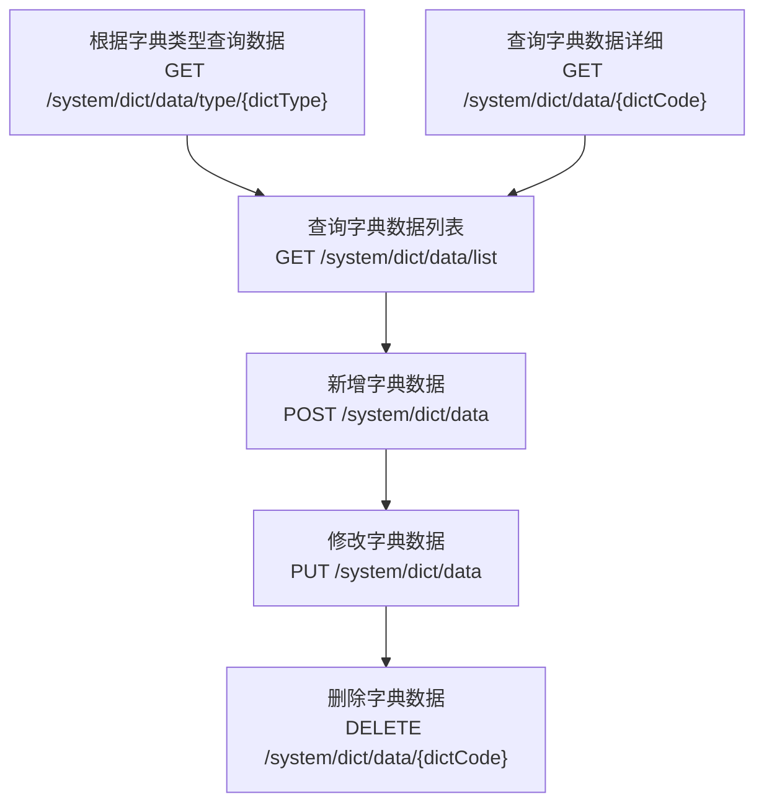
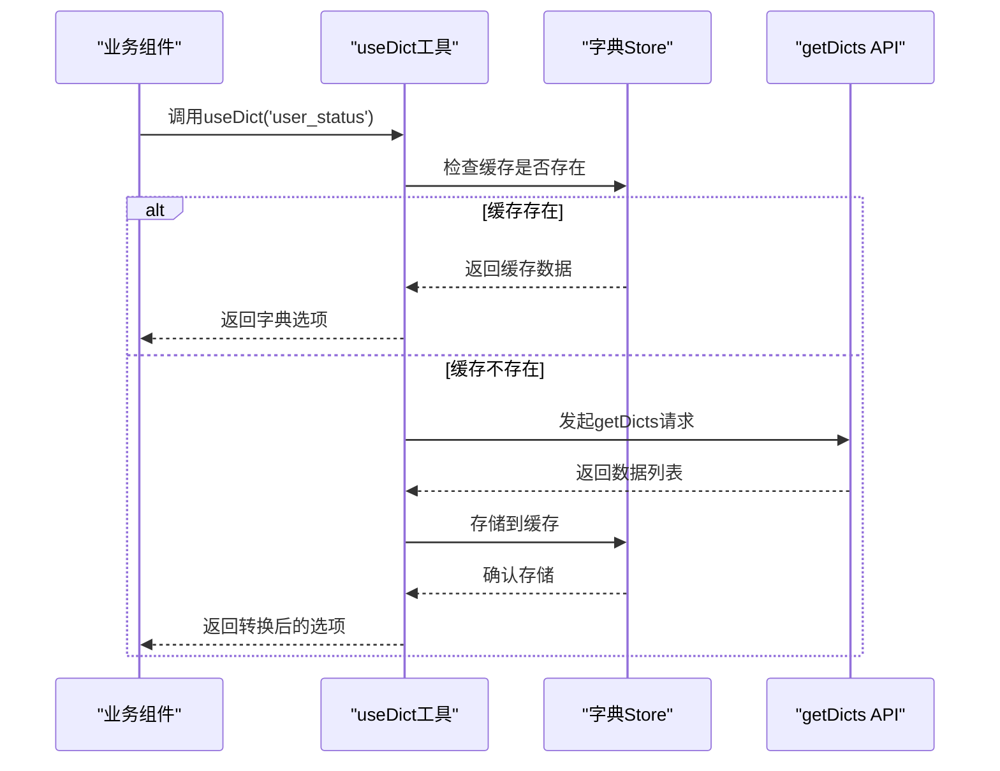
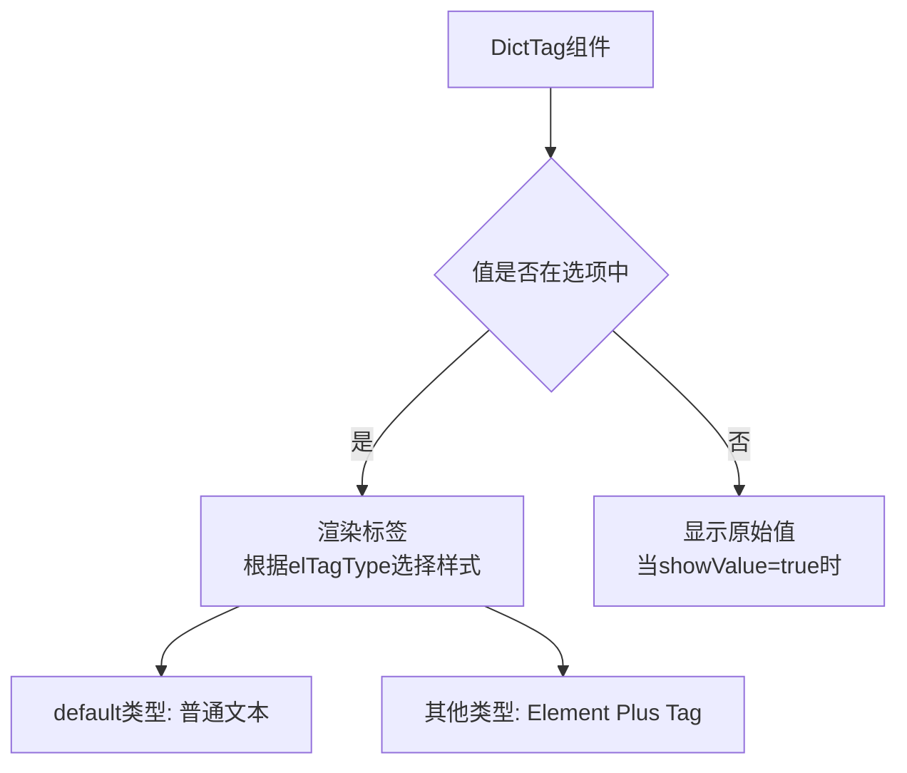

# 字典数据项管理接口

<cite>
**Referenced Files in This Document**  
- [data.js](file://daoju\src\api\system\dict\data.js)
- [DictTag/index.vue](file://daoju\src\components\DictTag\index.vue)
- [dict.js](file://daoju\src\utils\dict.js)
- [dictCollection/index.vue](file://daoju\src\views\dataDictionary\dictCollection\index.vue)
</cite>

## 目录
1. [简介](#简介)
2. [核心接口说明](#核心接口说明)
3. [请求参数与返回字段](#请求参数与返回字段)
4. [前端集成与使用](#前端集成与使用)
5. [调用示例](#调用示例)
6. [错误处理](#错误处理)
7. [状态控制与业务影响](#状态控制与业务影响)

## 简介
本API文档详细说明了系统中字典数据项管理的核心接口，主要实现在`data.js`文件中。这些接口为前端提供了对字典数据项的完整CRUD操作能力，包括根据字典类型查询数据列表、新增数据项、修改排序与状态、设置默认值等关键功能。通过这些接口，系统能够动态加载下拉选项、标签展示等UI元素，实现灵活的业务配置和展示需求。

**Section sources**
- [data.js](file://daoju\src\api\system\dict\data.js#L1-L53)

## 核心接口说明
字典数据项管理接口提供了一组RESTful API，用于操作字典数据。每个接口都有明确的HTTP方法、URL路径和功能描述。



**Diagram sources**
- [data.js](file://daoju\src\api\system\dict\data.js#L1-L53)

**Section sources**
- [data.js](file://daoju\src\api\system\dict\data.js#L1-L53)

### 查询接口
- **根据字典类型查询字典数据信息** (`getDicts(dictType)`)：通过字典类型（dictType）获取该类型下的所有字典数据项，常用于前端动态加载下拉选项。
- **查询字典数据列表** (`listData(query)`)：支持分页和条件查询的列表接口，可传入多种查询参数进行筛选。
- **查询字典数据详细** (`getData(dictCode)`)：根据字典编码（dictCode）获取单个字典数据项的详细信息。

### 操作接口
- **新增字典数据** (`addData(data)`)：创建新的字典数据项，需要提供完整的数据对象。
- **修改字典数据** (`updateData(data)`)：更新现有字典数据项，通过传递包含更新字段的数据对象实现。
- **删除字典数据** (`delData(dictCode)`)：根据字典编码删除指定的字典数据项。

**Section sources**
- [data.js](file://daoju\src\api\system\dict\data.js#L1-L53)

## 请求参数与返回字段
### 主要请求参数
- **dictType**：字典类型标识，用于区分不同业务场景的字典数据，如"用户状态"、"订单类型"等。
- **status**：字典数据项的状态，通常用于表示启用（1）或禁用（0），控制数据项是否在前端可见。
- **dictSort**：字典数据项的排序值，用于控制在下拉列表或选项组中的显示顺序，数值越小越靠前。

### 返回字段及其业务含义
接口返回的字典数据对象包含以下关键字段：
- **dictLabel**：字典标签，即在前端显示的文本内容。
- **dictValue**：字典值，通常作为实际存储或传输的值。
- **listClass**：列表样式类，用于定义在列表中显示时的视觉样式（如Element Plus的tag类型）。
- **cssClass**：自定义CSS类，用于应用特定的样式。
- **dictCode**：字典编码，唯一标识一个字典数据项。
- **dictSort**：排序字段，决定显示顺序。
- **status**：状态字段，控制数据项的启用/禁用状态。

**Section sources**
- [data.js](file://daoju\src\api\system\dict\data.js#L1-L53)

## 前端集成与使用
### 工具函数封装
系统通过`useDict`工具函数简化了字典数据的获取和管理。该函数利用`getDicts`接口获取数据，并将结果缓存在Vuex store中，避免重复请求。



**Diagram sources**
- [dict.js](file://daoju\src\utils\dict.js#L7-L24)
- [data.js](file://daoju\src\api\system\dict\data.js#L20-L25)

### DictTag组件
`DictTag`组件用于在表格或详情页中以标签形式展示字典数据。它接收`options`（字典选项）和`value`（当前值）作为输入，自动匹配并渲染相应的标签。



**Diagram sources**
- [DictTag/index.vue](file://daoju\src\components\DictTag\index.vue#L1-L83)

**Section sources**
- [dict.js](file://daoju\src\utils\dict.js#L7-L24)
- [DictTag/index.vue](file://daoju\src\components\DictTag\index.vue#L1-L83)

## 调用示例
### 获取用户状态字典
```javascript
// 调用getDicts接口
getDicts('user_status').then(response => {
  const options = response.data.map(item => ({
    label: item.dictLabel,
    value: item.dictValue,
    elTagType: item.listClass
  }));
  // 用于下拉框或标签展示
});
```

### 新增字典数据项
```javascript
const newData = {
  dictType: 'order_status',
  dictLabel: '已取消',
  dictValue: 'cancelled',
  dictSort: 3,
  status: 1,
  cssClass: 'tag-danger'
};
addData(newData).then(() => {
  // 刷新列表
});
```

**Section sources**
- [data.js](file://daoju\src\api\system\dict\data.js#L20-L34)

## 错误处理
### 常见错误场景
- **关联类型不存在**：当尝试操作一个不存在的字典类型时，后端会返回404或相应的错误码。
- **数据冲突**：新增或修改时，如果字典值（dictValue）在同类型中已存在，会返回400错误。
- **权限不足**：无权限用户尝试修改或删除数据时，返回403错误。

### 前端处理建议
应在调用接口时使用`.catch()`或`try-catch`捕获异常，并根据返回的错误码向用户展示友好的提示信息。

**Section sources**
- [data.js](file://daoju\src\api\system\dict\data.js#L1-L53)

## 状态控制与业务影响
字典数据项的状态（status）是控制业务逻辑的关键开关：
- **启用状态**（status=1）：数据项在前端下拉框、标签等组件中可见，业务流程中可以被选择和使用。
- **禁用状态**（status=0）：数据项从所有前端选项中隐藏，现有数据仍可显示但不可选择，用于逐步淘汰旧的业务状态。

这种软删除机制确保了历史数据的完整性，同时不影响新业务的开展。例如，将"订单状态"中的"已废弃"状态设为禁用后，新订单无法选择该状态，但历史订单仍能正确显示其状态。

**Section sources**
- [data.js](file://daoju\src\api\system\dict\data.js#L37-L43)
- [dictCollection/index.vue](file://daoju\src\views\dataDictionary\dictCollection\index.vue#L47-L58)