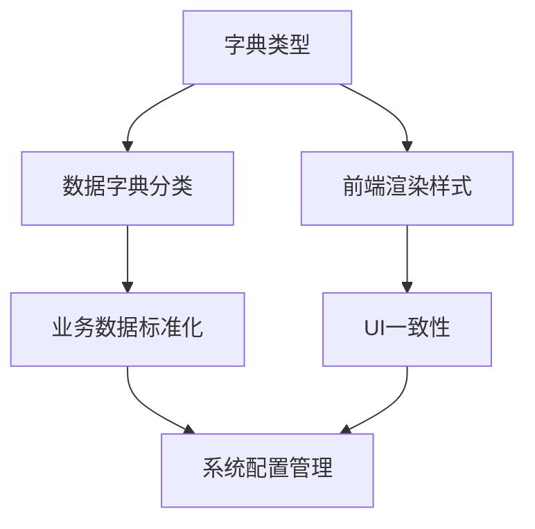
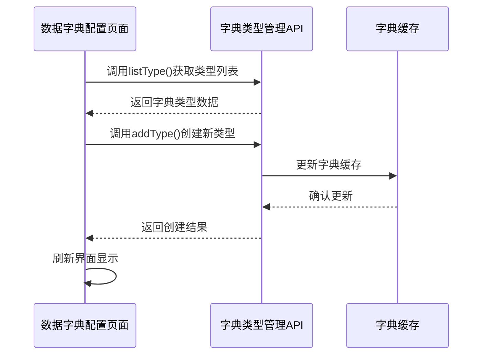

# 字典类型管理接口

<cite>
**Referenced Files in This Document**   
- [type.js](file://daoju/src/api/system/dict/type.js)
- [dictCollection.js](file://daoju/src/api/dataDictionary/dictCollection.js)
- [dict.js](file://daoju/src/store/modules/dict.js)
- [dict.js](file://daoju/src/utils/dict.js)
- [index.vue](file://daoju/src/views/dataDictionary/dictCollection/index.vue)
</cite>

## 目录
1. [简介](#简介)
2. [API接口定义](#api接口定义)
3. [系统作用范围](#系统作用范围)
4. [代码示例](#代码示例)
5. [错误处理机制](#错误处理机制)
6. [前端调用关系](#前端调用关系)

## 简介
字典类型管理接口是系统数据字典功能的核心组成部分，提供对字典类型的增删改查操作。该接口通过统一的RESTful API设计，实现了对系统中各类数据字典的分类管理，为前端渲染和业务逻辑提供基础数据支持。

**Section sources**
- [type.js](file://daoju/src/api/system/dict/type.js#L1-L60)

## API接口定义
字典类型管理接口提供完整的CRUD操作，支持对字典类型的全生命周期管理。

### 查询字典类型列表
- **请求方法**: GET
- **URL路径**: `/system/dict/type/list`
- **请求参数**: 
  - `query` (对象): 查询条件，包含分页信息和筛选条件
- **响应结构**: 分页的字典类型列表

### 查询字典类型详细信息
- **请求方法**: GET
- **URL路径**: `/system/dict/type/{dictId}`
- **请求参数**: 
  - `dictId` (路径参数): 字典类型ID
- **响应结构**: 单个字典类型的详细信息

### 新增字典类型
- **请求方法**: POST
- **URL路径**: `/system/dict/type`
- **请求参数**: 
  - `data` (对象): 字典类型数据，包含编码、名称、状态等属性
- **响应结构**: 操作结果状态

### 修改字典类型
- **请求方法**: PUT
- **URL路径**: `/system/dict/type`
- **请求参数**: 
  - `data` (对象): 更新后的字典类型数据
- **响应结构**: 操作结果状态

### 删除字典类型
- **请求方法**: DELETE
- **URL路径**: `/system/dict/type/{dictId}`
- **请求参数**: 
  - `dictId` (路径参数): 待删除的字典类型ID
- **响应结构**: 操作结果状态

### 刷新字典缓存
- **请求方法**: DELETE
- **URL路径**: `/system/dict/type/refreshCache`
- **请求参数**: 无
- **响应结构**: 缓存刷新结果

### 获取字典选择框列表
- **请求方法**: GET
- **URL路径**: `/system/dict/type/optionselect`
- **请求参数**: 无
- **响应结构**: 用于下拉选择的字典类型列表

**Section sources**
- [type.js](file://daoju/src/api/system/dict/type.js#L1-L60)

## 系统作用范围
字典类型在系统中具有广泛的影响力，主要体现在数据字典的分类管理和前端渲染行为两个方面。

### 数据字典分类管理
字典类型作为数据字典的分类标识，通过类型编码将相关字典数据进行逻辑分组。系统中的字典数据通过字典类型进行组织，形成层次化的数据管理体系。每个字典类型可以包含多个具体的字典数据项，实现对业务数据的标准化管理。

### 前端渲染行为
字典类型直接影响前端组件的渲染方式和交互行为。系统通过字典类型预定义前端展示样式，包括标签颜色、显示格式等属性。前端组件根据字典类型自动应用相应的渲染策略，确保数据展示的一致性和美观性。



**Diagram sources**
- [type.js](file://daoju/src/api/system/dict/type.js#L1-L60)
- [dict.js](file://daoju/src/utils/dict.js#L1-L24)

**Section sources**
- [type.js](file://daoju/src/api/system/dict/type.js#L1-L60)
- [dict.js](file://daoju/src/utils/dict.js#L1-L24)

## 代码示例
以下示例展示如何通过API创建新的字典类型：

```javascript
import { addType } from '@/api/system/dict/type'

// 创建字典类型数据
const dictTypeData = {
  dictName: '用户状态',
  dictType: 'user_status',
  status: '0',
  remark: '用户状态字典类型'
}

// 调用API创建字典类型
addType(dictTypeData).then(response => {
  console.log('字典类型创建成功:', response)
}).catch(error => {
  console.error('创建失败:', error)
})
```

新创建的字典类型会对系统配置产生全局影响：
1. 系统字典缓存将被更新，所有依赖该字典的组件将获取最新数据
2. 前端界面的字典选择组件将自动包含新类型
3. 相关业务模块的字典数据管理功能将支持该类型

**Section sources**
- [type.js](file://daoju/src/api/system/dict/type.js#L20-L27)

## 错误处理机制
系统提供了完善的错误处理机制，确保接口调用的稳定性和可靠性。

### 类型编码重复处理
当尝试创建已存在的字典类型编码时，系统将返回特定的错误响应：
- **HTTP状态码**: 500
- **错误码**: 500
- **提示信息**: "新增字典类型'XXX'失败，字典类型编码已存在"

系统通过唯一性约束确保字典类型编码的全局唯一性，防止数据冲突。

### 其他错误情况
- **参数验证失败**: 返回400状态码，提示具体参数错误信息
- **权限不足**: 返回403状态码，提示"当前操作没有权限"
- **资源不存在**: 返回404状态码，提示"访问资源不存在"
- **服务器内部错误**: 返回500状态码，提示"系统未知错误"

**Section sources**
- [type.js](file://daoju/src/api/system/dict/type.js#L20-L27)
- [errorCode.js](file://daoju/src/utils/errorCode.js#L1-L6)

## 前端调用关系
字典类型管理接口与前端组件存在紧密的调用关系，主要体现在数据字典配置页面的功能实现上。

### 数据字典配置页面
前端数据字典配置页面（dictCollection/index.vue）通过调用字典类型管理接口实现以下功能：
1. 初始化时获取字典类型列表，用于筛选条件
2. 创建新字典数据时选择所属字典类型
3. 编辑字典类型信息时进行更新操作
4. 删除字典类型时进行确认和执行

### 组件交互流程


**Diagram sources**
- [index.vue](file://daoju/src/views/dataDictionary/dictCollection/index.vue#L1-L439)
- [type.js](file://daoju/src/api/system/dict/type.js#L1-L60)

**Section sources**
- [index.vue](file://daoju/src/views/dataDictionary/dictCollection/index.vue#L1-L439)
- [type.js](file://daoju/src/api/system/dict/type.js#L1-L60)