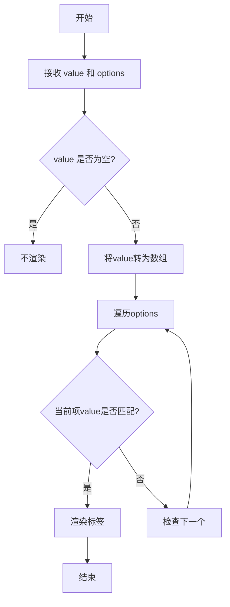
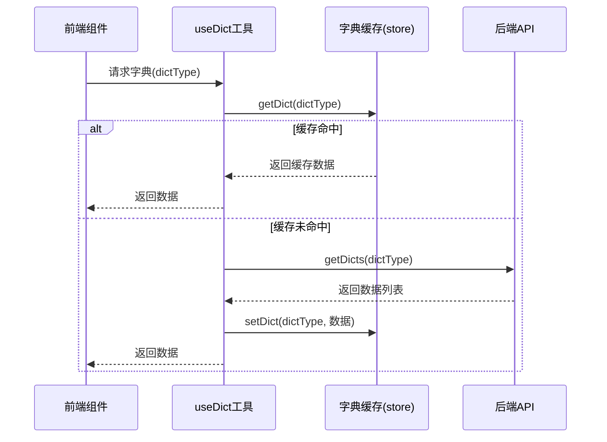

# 数据字典接口

<cite>
**Referenced Files in This Document**   
- [type.js](file://daoju/src/api/system/dict/type.js)
- [data.js](file://daoju/src/api/system/dict/data.js)
- [DictTag/index.vue](file://daoju/src/components/DictTag/index.vue)
- [dict.js](file://daoju/src/store/modules/dict.js)
- [dict.js](file://daoju/src/utils/dict.js)
</cite>

## 目录
1. [引言](#引言)
2. [字典类型管理](#字典类型管理)
3. [字典数据管理](#字典数据管理)
4. [前端组件集成](#前端组件集成)
5. [缓存机制](#缓存机制)
6. [总结](#总结)

## 引言
本文档详细说明了系统中数据字典功能的实现，重点区分字典类型（type.js）与字典数据（data.js）两个维度。文档涵盖了字典类型的增删改查操作、字典数据项的排序与状态控制、前端组件（如DictTag）的集成方式，以及系统的缓存机制。

## 字典类型管理

字典类型（Dict Type）是字典数据的分类标识，用于组织和管理不同类别的字典项。`type.js` 文件提供了对字典类型的完整CRUD操作。

### 字典类型操作
- **查询**：通过 `listType(query)` 方法获取字典类型列表，`getType(dictId)` 获取指定字典类型的详细信息。
- **新增**：使用 `addType(data)` 方法创建新的字典类型，成功后该类型可用于组织字典数据。
- **修改**：通过 `updateType(data)` 方法更新现有字典类型的属性。
- **删除**：调用 `delType(dictId)` 方法删除指定的字典类型。**注意**：删除字典类型将同时移除其下所有关联的字典数据，影响范围较大，需谨慎操作。

### 系统配置影响
字典类型的变更直接影响系统的配置结构。新增或删除字典类型会改变前端可选择的字典类别，可能影响到使用 `optionselect()` 接口获取字典选择框列表的功能。

**Section sources**
- [type.js](file://daoju/src/api/system/dict/type.js#L3-L61)

## 字典数据管理

字典数据（Dict Data）是具体的键值对条目，归属于特定的字典类型。`data.js` 文件提供了对字典数据的管理接口。

### 核心功能
- **查询**：`listData(query)` 用于分页查询字典数据列表，`getData(dictCode)` 获取单个字典数据详情。
- **按类型查询**：`getDicts(dictType)` 是关键方法，根据字典类型标识（dictType）一次性获取该类型下的所有字典数据项，返回一个包含 `dictLabel`（标签）和 `dictValue`（值）的数组。
- **增删改**：`addData(data)`、`updateData(data)` 和 `delData(dictCode)` 分别用于管理字典数据项。

### 高级功能
- **排序**：字典数据项在数据库中通常包含排序字段（如sort_order），确保在前端展示时按预设顺序排列。
- **状态控制**：每个字典数据项可设置启用/禁用状态，前端组件可根据此状态决定是否显示该选项。
- **默认值**：系统可通过配置指定某个字典值为默认值，在表单初始化时自动选中。

**Section sources**
- [data.js](file://daoju/src/api/system/dict/data.js#L3-L53)

## 前端组件集成

### DictTag 组件
`DictTag` 是一个用于展示字典标签的Vue组件，它通过字典值动态渲染对应的标签样式。

#### 工作流程
1. **接收参数**：组件接收 `options`（字典选项数组）、`value`（当前值）和 `showValue`（未匹配时是否显示原始值）等属性。
2. **值处理**：将传入的 `value` 转换为字符串数组，以便进行匹配。
3. **标签渲染**：遍历 `options` 数组，查找与 `value` 匹配的项，并根据 `elTagType` 和 `elTagClass` 属性渲染为 `el-tag` 或普通文本。
4. **未匹配处理**：如果 `value` 中的值在 `options` 中找不到，且 `showValue` 为真，则显示原始值。

**Diagram sources**
- [DictTag/index.vue](file://daoju/src/components/DictTag/index.vue#L1-L83)

## 缓存机制

系统采用客户端缓存策略来优化字典数据的访问性能，减少对后端API的频繁调用。

### 实现原理
1. **状态存储**：`dict.js` (store/modules) 使用Pinia定义了一个名为 `useDictStore` 的全局状态，其中 `dict` 数组用于缓存已获取的字典数据。
2. **缓存逻辑**：`useDict(...args)` 工具函数是缓存机制的核心。
   - 首先检查 `useDictStore().getDict(dictType)` 是否已存在缓存。
   - 如果存在，直接返回缓存数据。
   - 如果不存在，则调用 `getDicts(dictType)` API 从服务器获取数据，将结果转换为 `{label, value, elTagType, elTagClass}` 格式，并通过 `useDictStore().setDict()` 存入缓存。

### 加载策略
- **运行时按需获取**：这是主要策略。当某个组件首次需要特定字典类型的数据时，`useDict` 函数会触发一次API调用并缓存结果，后续请求直接使用缓存。
- **系统初始化预加载**：虽然当前 `initDict()` 方法为空，但这是一个预留的扩展点。未来可以在此处预加载系统最常用的核心字典（如用户状态、设备类型等），以提升首页加载速度。

**Diagram sources**
- [dict.js](file://daoju/src/store/modules/dict.js#L1-L58)
- [dict.js](file://daoju/src/utils/dict.js#L1-L24)

**Section sources**
- [dict.js](file://daoju/src/store/modules/dict.js#L1-L58)
- [dict.js](file://daoju/src/utils/dict.js#L1-L24)

## 总结
本系统通过 `type.js` 和 `data.js` 两个API模块清晰地分离了字典类型和字典数据的管理职责。前端通过 `DictTag` 组件实现了字典值的动态标签化展示。核心的缓存机制由 `useDict` 工具函数和Pinia状态管理共同实现，采用运行时按需加载的策略，在保证性能的同时避免了不必要的网络请求。未来可通过实现 `initDict()` 方法来支持系统启动时的关键字典预加载。所有字典操作均通过标准化的RESTful接口完成，确保了系统的可维护性和扩展性。