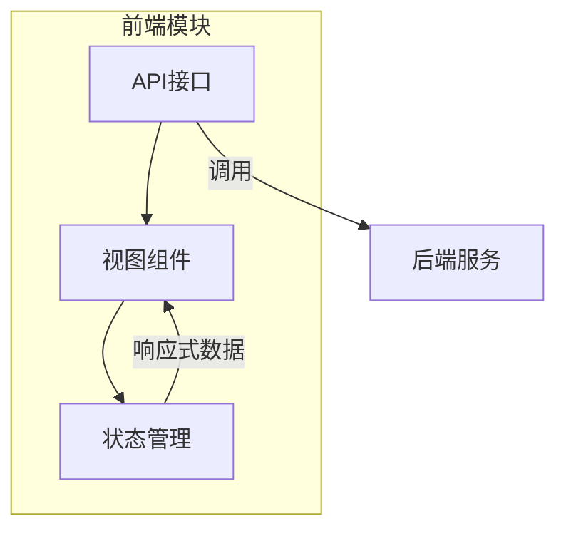
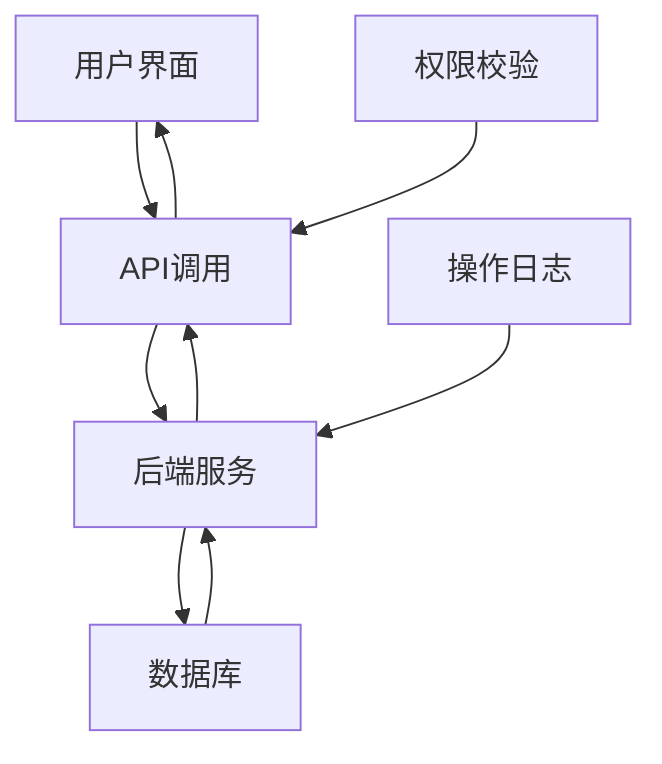
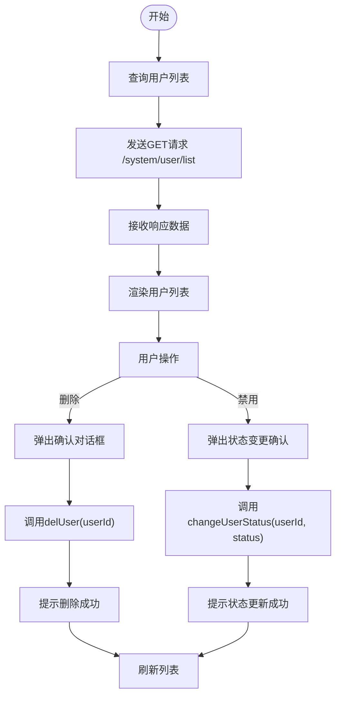
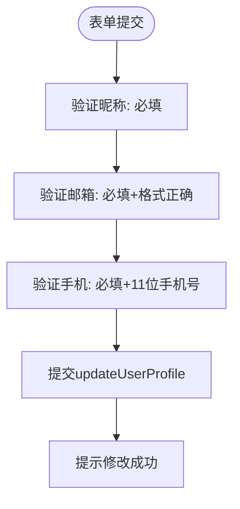
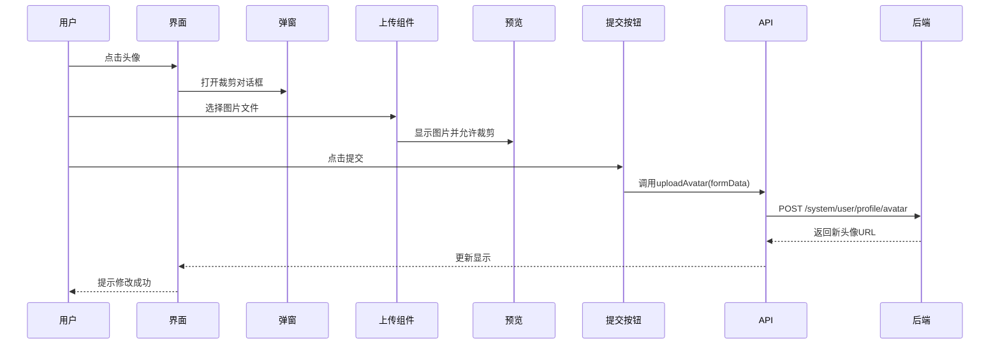
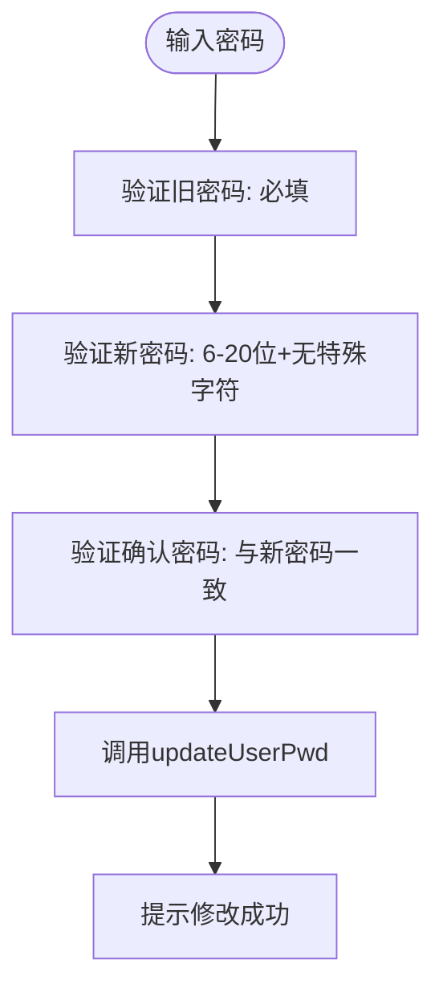
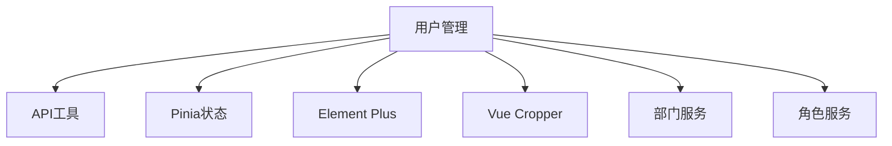

# 用户管理接口

<cite>
**本文档引用的文件**  
- [user.js](file://daoju/src/api/system/user.js)
- [dept.js](file://daoju/src/api/system/dept.js)
- [index.vue](file://daoju/src/views/system/user/index.vue)
- [userInfo.vue](file://daoju/src/views/system/user/profile/userInfo.vue)
- [userAvatar.vue](file://daoju/src/views/system/user/profile/userAvatar.vue)
- [resetPwd.vue](file://daoju/src/views/system/user/profile/resetPwd.vue)
- [validate.js](file://daoju/src/utils/validate.js)
- [user.js](file://daoju/src/store/modules/user.js)
</cite>

## 目录
1. [简介](#简介)
2. [项目结构](#项目结构)
3. [核心组件](#核心组件)
4. [架构概览](#架构概览)
5. [详细组件分析](#详细组件分析)
6. [依赖分析](#依赖分析)
7. [性能考虑](#性能考虑)
8. [故障排除指南](#故障排除指南)
9. [结论](#结论)

## 简介
本文档详细描述了用户管理API的功能，涵盖用户增删改查、状态变更、密码重置、部门分配等操作。重点说明用户创建时的字段验证规则、唯一性约束（如用户名、手机号、邮箱），以及敏感操作（如删除、禁用）的权限校验机制。同时提供分页查询接口的请求参数（pageNum, pageSize, keyword）和响应数据结构示例。解释用户头像上传与个人信息更新的接口调用流程，并结合前端调用示例说明如何处理二次确认弹窗与操作审计日志的联动。

## 项目结构
用户管理功能主要集中在`daoju/src`目录下，涉及API定义、视图组件和状态管理模块。核心功能分布在`api/system/user.js`中，前端界面由`views/system/user/`下的Vue组件实现，用户状态通过Pinia存储在`store/modules/user.js`中维护。

**图示来源**  
- [user.js](file://daoju/src/api/system/user.js#L1-L137)
- [index.vue](file://daoju/src/views/system/user/index.vue#L1-L333)
- [user.js](file://daoju/src/store/modules/user.js#L1-L92)

**本节来源**  
- [user.js](file://daoju/src/api/system/user.js#L1-L137)
- [index.vue](file://daoju/src/views/system/user/index.vue#L1-L333)

## 核心组件
核心功能包括用户列表查询、新增、修改、删除、状态变更、密码重置、个人信息更新和头像上传。所有操作通过封装的`request`方法与后端交互，前端使用Element Plus组件库实现UI交互，并通过Pinia进行全局状态管理。

**本节来源**  
- [user.js](file://daoju/src/api/system/user.js#L1-L137)
- [index.vue](file://daoju/src/views/system/user/index.vue#L1-L333)

## 架构概览
系统采用前后端分离架构，前端通过RESTful API与后端通信。用户管理模块包含用户信息维护、权限控制、部门关联等功能。前端通过模块化方式组织代码，API调用集中管理，视图组件复用度高，状态统一由Pinia管理。

**图示来源**  
- [user.js](file://daoju/src/api/system/user.js#L1-L137)
- [index.vue](file://daoju/src/views/system/user/index.vue#L1-L333)

## 详细组件分析

### 用户管理主界面分析
主界面提供用户列表展示、搜索、新增、修改、删除等完整CRUD功能。支持按部门树筛选、分页查询（pageNum, pageSize）、关键字搜索。敏感操作如删除和状态变更均需二次确认。

#### 接口调用流程图

**图示来源**  
- [user.js](file://daoju/src/api/system/user.js#L5-L45)
- [index.vue](file://daoju/src/views/system/user/index.vue#L144-L152)

**本节来源**  
- [user.js](file://daoju/src/api/system/user.js#L1-L137)
- [index.vue](file://daoju/src/views/system/user/index.vue#L1-L333)

### 用户信息更新分析
用户个人信息更新功能允许用户修改昵称、邮箱、手机号等基本信息，所有字段均进行前端验证，确保数据合法性。

#### 字段验证规则

**图示来源**  
- [userInfo.vue](file://daoju/src/views/system/user/profile/userInfo.vue#L36-L41)

**本节来源**  
- [userInfo.vue](file://daoju/src/views/system/user/profile/userInfo.vue#L1-L68)
- [user.js](file://daoju/src/api/system/user.js#L82-L88)

### 用户头像上传分析
头像上传功能集成图片裁剪组件，用户可上传、裁剪并提交头像图片。系统限制文件类型为图片格式，上传过程使用FormData编码。

#### 头像上传流程

**图示来源**  
- [userAvatar.vue](file://daoju/src/views/system/user/profile/userAvatar.vue#L64-L139)
- [user.js](file://daoju/src/api/system/user.js#L104-L111)

**本节来源**  
- [userAvatar.vue](file://daoju/src/views/system/user/profile/userAvatar.vue#L1-L180)
- [user.js](file://daoju/src/api/system/user.js#L104-L111)

### 密码重置分析
密码重置功能要求用户输入旧密码和新密码，前端进行一致性校验，确保两次输入的新密码相同，且符合安全规则（6-20字符，不含特殊字符）。

#### 密码修改验证逻辑

**图示来源**  
- [resetPwd.vue](file://daoju/src/views/system/user/profile/resetPwd.vue#L38-L42)

**本节来源**  
- [resetPwd.vue](file://daoju/src/views/system/user/profile/resetPwd.vue#L1-L60)
- [user.js](file://daoju/src/api/system/user.js#L91-L101)

## 依赖分析
用户管理模块依赖多个核心组件：API模块提供HTTP通信能力，Pinia存储管理用户状态，Element Plus提供UI组件，Vue Cropper实现图片裁剪功能。部门管理通过`dept.js`接口关联，权限控制依赖角色分配机制。

**图示来源**  
- [user.js](file://daoju/src/api/system/user.js#L1-L137)
- [dept.js](file://daoju/src/api/system/dept.js#L1-L52)
- [role.js](file://daoju/src/api/system/role.js#L1-L120)

**本节来源**  
- [user.js](file://daoju/src/api/system/user.js#L1-L137)
- [dept.js](file://daoju/src/api/system/dept.js#L1-L52)
- [role.js](file://daoju/src/api/system/role.js#L1-L120)

## 性能考虑
- 所有列表查询均支持分页（默认pageSize=10），避免一次性加载过多数据
- 部门树结构采用懒加载或缓存机制，减少重复请求
- 图片上传使用裁剪压缩，控制文件大小
- 前端验证减少无效请求，提升用户体验

## 故障排除指南
常见问题包括：
- 头像上传失败：检查文件类型是否为图片格式
- 密码修改失败：确认旧密码正确且新密码符合规则
- 用户无法保存：检查必填字段是否完整，手机号/邮箱格式是否正确
- 部门选择无数据：确认部门树接口返回正常

**本节来源**  
- [validate.js](file://daoju/src/utils/validate.js#L92-L95)
- [userInfo.vue](file://daoju/src/views/system/user/profile/userInfo.vue#L39-L40)

## 结论
用户管理接口设计完整，覆盖了企业级应用所需的各项功能。通过合理的前后端分离架构和组件化设计，实现了高内聚、低耦合的系统结构。前端交互友好，具备完善的验证机制和用户体验设计，适合在实际项目中应用和扩展。