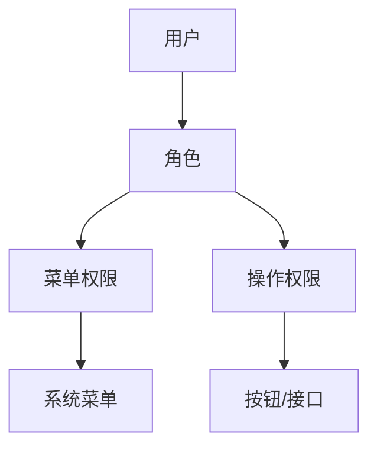
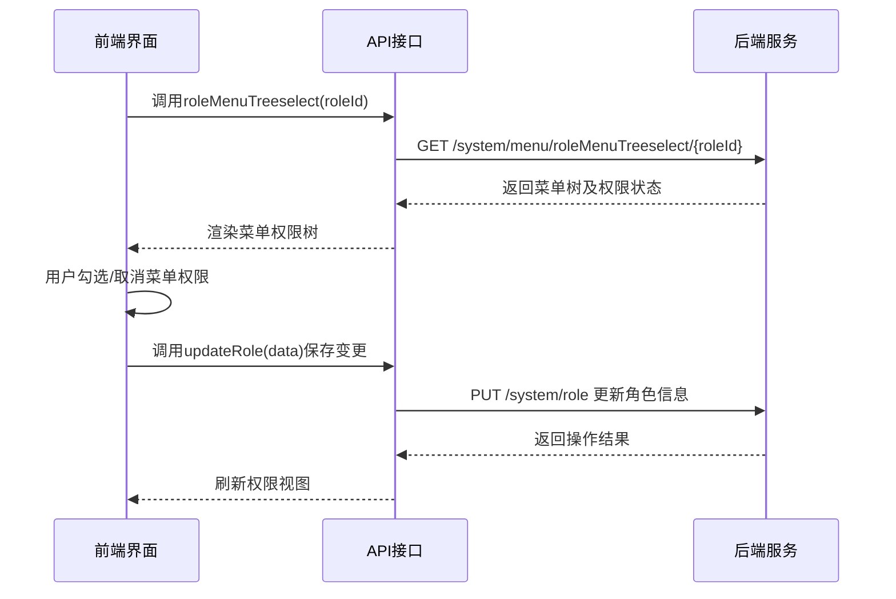
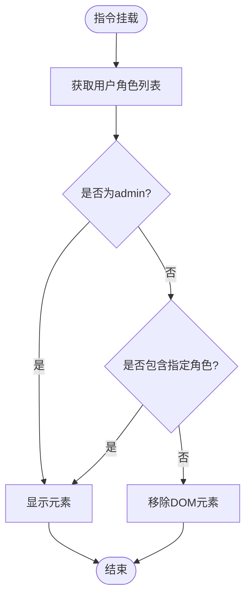
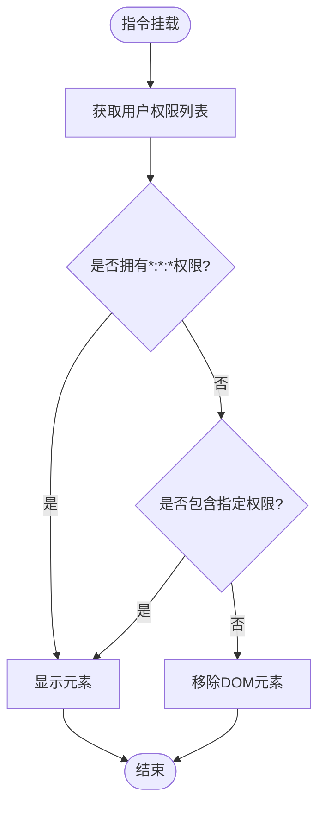
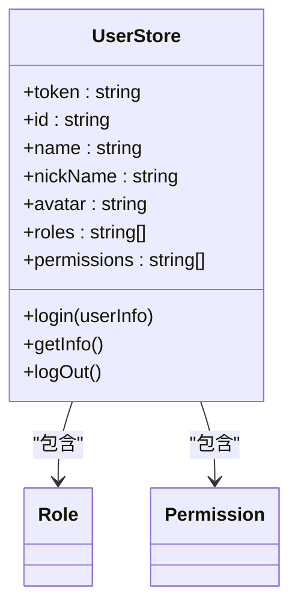
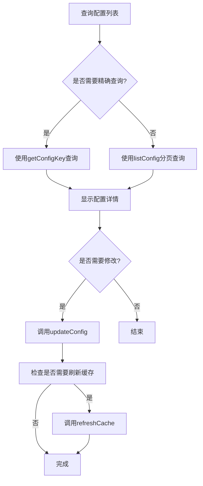
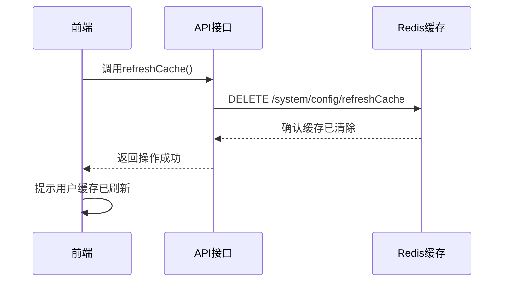
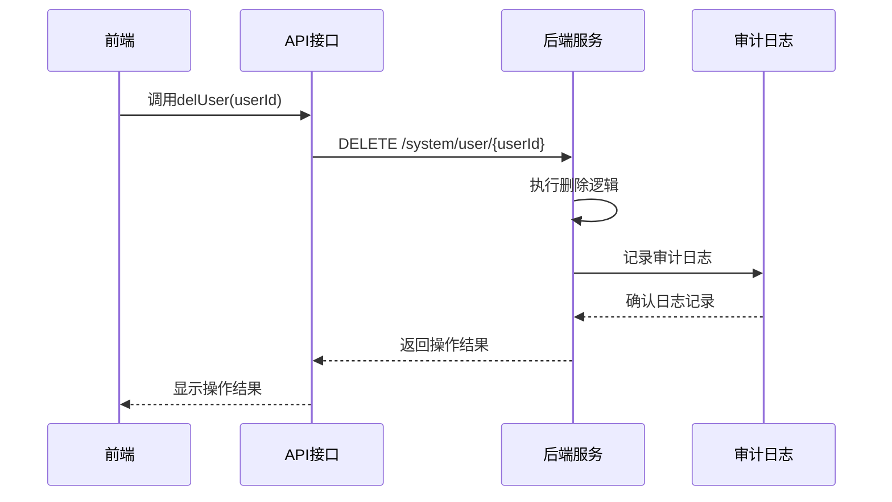
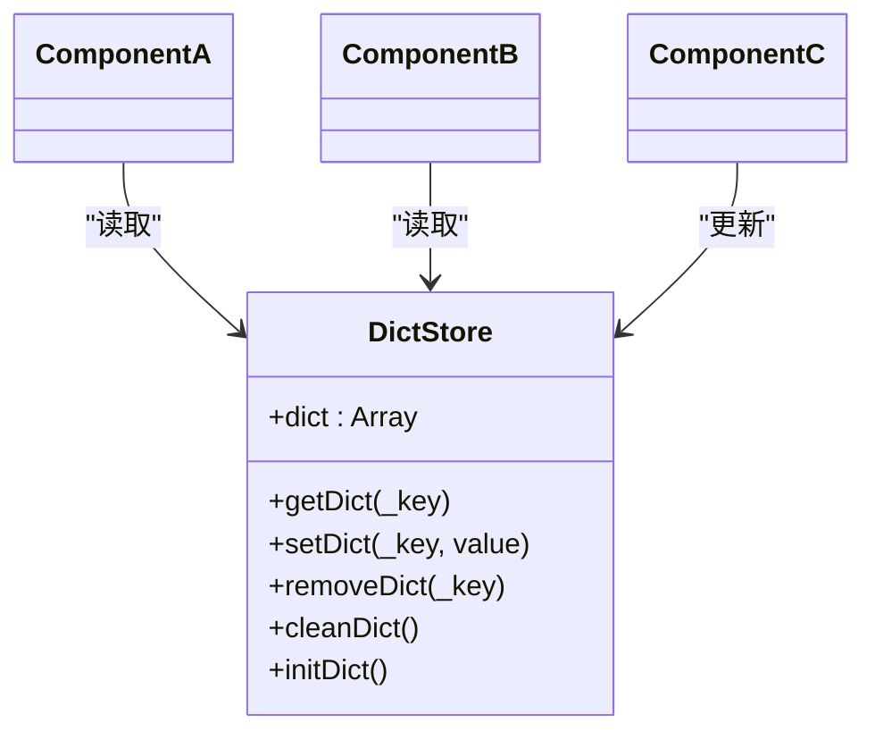

# 系统管理接口

<cite>
**本文档引用文件**  
- [user.js](file://daoju\src\api\system\user.js)
- [role.js](file://daoju\src\api\system\role.js)
- [dept.js](file://daoju\src\api\system\dept.js)
- [post.js](file://daoju\src\api\system\post.js)
- [menu.js](file://daoju\src\api\system\menu.js)
- [type.js](file://daoju\src\api\system\dict\type.js)
- [data.js](file://daoju\src\api\system\dict\data.js)
- [config.js](file://daoju\src\api\system\config.js)
- [notice.js](file://daoju\src\api\system\notice.js)
- [ruoyi.js](file://daoju\src\utils\ruoyi.js)
- [hasPermi.js](file://daoju\src\directive\permission\hasPermi.js)
- [hasRole.js](file://daoju\src\directive\permission\hasRole.js)
- [user.js](file://daoju\src\store\modules\user.js)
- [permission.js](file://daoju\src\store\modules\permission.js)
- [dict.js](file://daoju\src\store\modules\dict.js)
- [request.js](file://daoju\src\utils\request.js)
</cite>

## 目录
1. [简介](#简介)
2. [核心管理接口](#核心管理接口)
3. [RBAC权限模型实现](#rbac权限模型实现)
4. [系统配置管理](#系统配置管理)
5. [敏感操作与审计机制](#敏感操作与审计机制)
6. [数据字典动态加载](#数据字典动态加载)
7. [接口调用示例](#接口调用示例)
8. [总结](#总结)

## 简介
本API文档全面解析系统管理模块的核心接口，涵盖用户、角色、部门、岗位、菜单、字典、配置和通知等关键功能。文档详细说明基于RBAC（基于角色的访问控制）模型的权限管理机制，包括用户角色分配、菜单权限同步、数据字典动态加载等核心操作。同时提供系统配置管理的调用方式，并解释敏感操作（如用户删除）的二次确认机制与审计日志联动策略。

**文档引用文件**  
- [user.js](file://daoju\src\api\system\user.js)
- [role.js](file://daoju\src\api\system\role.js)
- [menu.js](file://daoju\src\api\system\menu.js)
- [dict.js](file://daoju\src\store\modules\dict.js)

## 核心管理接口

### 用户管理接口
提供用户全生命周期管理功能，包括查询、新增、修改、删除、密码重置、状态变更等操作。支持用户个人信息获取与更新，以及头像上传功能。

**接口功能说明**
- `listUser(query)`：分页查询用户列表
- `getUser(userId)`：获取指定用户详细信息
- `addUser(data)`：新增用户
- `updateUser(data)`：修改用户信息
- `delUser(userId)`：删除用户（需二次确认）
- `resetUserPwd(userId, password)`：管理员重置用户密码
- `changeUserStatus(userId, status)`：修改用户状态（启用/禁用）
- `getUserProfile()`：获取当前用户个人信息
- `updateUserProfile(data)`：更新当前用户个人信息
- `updateUserPwd(oldPassword, newPassword)`：用户自行修改密码
- `uploadAvatar(data)`：上传用户头像
- `getAuthRole(userId)`：查询用户已分配角色
- `updateAuthRole(data)`：为用户分配角色

**接口来源**
- [user.js](file://daoju\src\api\system\user.js#L4-L137)

### 角色管理接口
实现角色的增删改查及权限分配功能，支持角色状态管理、数据权限配置和用户授权管理。

**接口功能说明**
- `listRole(query)`：分页查询角色列表
- `getRole(roleId)`：获取角色详细信息
- `addRole(data)`：新增角色
- `updateRole(data)`：修改角色信息
- `dataScope(data)`：配置角色数据权限
- `changeRoleStatus(roleId, status)`：修改角色状态
- `delRole(roleId)`：删除角色
- `allocatedUserList(query)`：查询已授权用户列表
- `unallocatedUserList(query)`：查询未授权用户列表
- `authUserCancel(data)`：取消单个用户授权
- `authUserCancelAll(data)`：批量取消用户授权
- `authUserSelectAll(data)`：批量授权用户
- `deptTreeSelect(roleId)`：根据角色ID查询部门树结构

**接口来源**
- [role.js](file://daoju\src\api\system\role.js#L3-L120)

### 部门管理接口
提供部门组织架构的管理功能，支持树形结构展示和操作。

**接口功能说明**
- `listDept(query)`：查询部门列表
- `listDeptExcludeChild(deptId)`：查询部门列表（排除指定节点及其子节点）
- `getDept(deptId)`：获取部门详细信息
- `addDept(data)`：新增部门
- `updateDept(data)`：修改部门信息
- `delDept(deptId)`：删除部门

**接口来源**
- [dept.js](file://daoju\src\api\system\dept.js#L3-L52)

### 岗位管理接口
实现岗位信息的增删改查功能。

**接口功能说明**
- `listPost(query)`：查询岗位列表
- `getPost(postId)`：获取岗位详细信息
- `addPost(data)`：新增岗位
- `updatePost(data)`：修改岗位信息
- `delPost(postId)`：删除岗位

**接口来源**
- [post.js](file://daoju\src\api\system\post.js#L3-L45)

### 菜单管理接口
提供菜单资源的管理功能，支持树形结构操作和权限关联。

**接口功能说明**
- `listMenu(query)`：查询菜单列表
- `getMenu(menuId)`：获取菜单详细信息
- `treeselect()`：获取菜单下拉树结构
- `roleMenuTreeselect(roleId)`：根据角色ID查询菜单下拉树结构（含权限状态）
- `addMenu(data)`：新增菜单
- `updateMenu(data)`：修改菜单信息
- `delMenu(menuId)`：删除菜单

**接口来源**
- [menu.js](file://daoju\src\api\system\menu.js#L3-L60)

### 字典管理接口
实现数据字典的分类（type）和条目（data）两级管理。

**接口功能说明**
- `listType(query)`：查询字典类型列表
- `getType(dictId)`：获取字典类型详细信息
- `addType(data)`：新增字典类型
- `updateType(data)`：修改字典类型
- `delType(dictId)`：删除字典类型
- `refreshCache()`：刷新字典缓存
- `optionselect()`：获取字典选择框列表

**接口来源**
- [type.js](file://daoju\src\api\system\dict\type.js#L3-L61)

### 字典数据接口
管理具体字典数据条目。

**接口功能说明**
- `listData(query)`：查询字典数据列表
- `getData(dictCode)`：获取字典数据详细信息
- `getDicts(dictType)`：根据字典类型查询所有数据
- `addData(data)`：新增字典数据
- `updateData(data)`：修改字典数据
- `delData(dictCode)`：删除字典数据

**接口来源**
- [data.js](file://daoju\src\api\system\dict\data.js#L3-L53)

### 配置管理接口
提供系统参数的配置管理功能。

**接口功能说明**
- `listConfig(query)`：查询参数列表
- `getConfig(configId)`：获取参数详细信息
- `getConfigKey(configKey)`：根据参数键名查询参数值
- `addConfig(data)`：新增参数配置
- `updateConfig(data)`：修改参数配置
- `delConfig(configId)`：删除参数配置
- `refreshCache()`：刷新参数缓存

**接口来源**
- [config.js](file://daoju\src\api\system\config.js#L3-L61)

### 通知管理接口
实现系统公告的管理功能。

**接口功能说明**
- `listNotice(query)`：查询公告列表
- `getNotice(noticeId)`：获取公告详细信息
- `addNotice(data)`：新增公告
- `updateNotice(data)`：修改公告
- `delNotice(noticeId)`：删除公告

**接口来源**
- [notice.js](file://daoju\src\api\system\notice.js#L3-L44)

## RBAC权限模型实现

### 权限控制架构
系统采用标准的RBAC（基于角色的访问控制）模型，通过用户-角色-权限三级结构实现精细化权限管理。用户通过分配角色获得相应权限，权限具体表现为菜单访问权和操作按钮权。



**图表来源**  
- [user.js](file://daoju\src\api\system\user.js#L113-L127)
- [role.js](file://daoju\src\api\system\role.js#L3-L9)
- [menu.js](file://daoju\src\api\system\menu.js#L20-L33)

### 角色与菜单权限同步
当角色权限发生变更时，系统自动同步更新其可访问的菜单列表。前端通过`roleMenuTreeselect`接口获取角色对应的菜单树，显示当前权限状态。

**权限同步流程**


**图表来源**  
- [menu.js](file://daoju\src\api\system\menu.js#L28-L33)
- [role.js](file://daoju\src\api\system\role.js#L30-L35)

### 前端权限指令实现
系统通过Vue指令实现前端元素级权限控制，确保无权限用户无法看到或操作特定功能。

**hasRole指令（角色权限）**


**图表来源**  
- [hasRole.js](file://daoju\src\directive\permission\hasRole.js#L7-L27)

**hasPermi指令（操作权限）**


**图表来源**  
- [hasPermi.js](file://daoju\src\directive\permission\hasPermi.js#L7-L27)

### 用户权限存储
用户登录后，系统将用户的角色和权限信息存储在Vuex状态管理中，供全局权限判断使用。



**图表来源**  
- [user.js](file://daoju\src\store\modules\user.js#L8-L92)

## 系统配置管理

### 配置项操作接口
系统提供完整的配置项管理API，支持配置的增删改查和缓存刷新。

**配置管理流程**


**接口来源**
- [config.js](file://daoju\src\api\system\config.js#L3-L61)

### 缓存管理机制
关键配置和字典数据采用缓存机制提升性能，当数据变更时需手动刷新缓存以确保一致性。

**缓存刷新流程**


**接口来源**
- [config.js](file://daoju\src\api\system\config.js#L54-L60)
- [type.js](file://daoju\src\api\system\dict\type.js#L46-L52)

## 敏感操作与审计机制

### 二次确认机制
对于删除用户等敏感操作，系统实施二次确认机制，防止误操作。

**用户删除流程**
```mermaid
flowchart TD
A[用户点击删除] --> B[弹出确认对话框]
B --> C{用户确认?}
C --> |否| D[取消操作]
C --> |是| E[调用delUser(userId)]
E --> F[检查操作结果]
F --> |成功| G[记录审计日志]
F --> |失败| H[显示错误信息]
G --> I[刷新用户列表]
H --> I
I --> J[结束]
```

**接口来源**
- [user.js](file://daoju\src\api\system\user.js#L39-L45)

### 审计日志联动
所有敏感操作均与审计日志系统联动，记录操作详情供后续追溯。

**审计日志记录流程**


**接口来源**
- [user.js](file://daoju\src\api\system\user.js#L39-L45)
- [request.js](file://daoju\src\utils\request.js#L74-L122)

## 数据字典动态加载

### 字典数据加载机制
系统采用动态加载机制获取字典数据，确保前端展示的实时性和准确性。

**字典加载流程**
```mermaid
flowchart TD
A[组件初始化] --> B[检查本地缓存]
B --> C{缓存中存在?}
C --> |是| D[使用缓存数据]
C --> |否| E[调用getDicts(dictType)]
E --> F[获取字典数据]
F --> G[存入Vuex状态]
G --> H[更新组件显示]
D --> H
H --> I[结束]
```

**接口来源**
- [data.js](file://daoju\src\api\system\dict\data.js#L20-L25)
- [dict.js](file://daoju\src\store\modules\dict.js#L1-L58)

### 字典状态管理
使用Vuex集中管理字典数据，实现跨组件共享和状态持久化。



**图表来源**  
- [dict.js](file://daoju\src\store\modules\dict.js#L1-L58)

## 接口调用示例

### 用户角色分配示例
```javascript
// 1. 获取用户当前角色
getAuthRole(userId).then(response => {
  const currentRoles = response.roles;
  // 显示角色选择界面
});

// 2. 保存新的角色分配
const data = {
  userId: userId,
  roleIds: selectedRoleIds
};
updateAuthRole(data).then(() => {
  ElMessage.success('角色分配成功');
  // 刷新用户权限
});
```

**代码来源**
- [user.js](file://daoju\src\api\system\user.js#L113-L127)

### 菜单权限查询示例
```javascript
// 根据角色ID获取菜单权限树
roleMenuTreeselect(roleId).then(response => {
  const menuTree = response.menus;
  // 渲染菜单树，显示当前权限状态
  this.menuOptions = menuTree;
});
```

**代码来源**
- [menu.js](file://daoju\src\api\system\menu.js#L28-L33)

### 字典数据使用示例
```javascript
// 动态加载特定类型的字典数据
getDicts('user_status').then(response => {
  this.statusOptions = response.data;
  // 用于下拉框等组件的数据源
});
```

**代码来源**
- [data.js](file://daoju\src\api\system\dict\data.js#L20-L25)

### 配置项获取示例
```javascript
// 根据配置键名获取配置值
getConfigKey('system_name').then(response => {
  const systemName = response.configValue;
  // 用于动态设置页面标题等
  document.title = systemName;
});
```

**代码来源**
- [config.js](file://daoju\src\api\system\config.js#L20-L25)

## 总结
本文档全面解析了系统管理模块的核心API接口，重点阐述了RBAC权限模型的实现细节，包括用户角色分配、菜单权限同步、数据字典动态加载等关键机制。同时详细说明了系统配置管理的调用方式，以及敏感操作的二次确认和审计日志联动策略。开发者可基于本文档快速掌握系统管理功能的集成与使用方法。