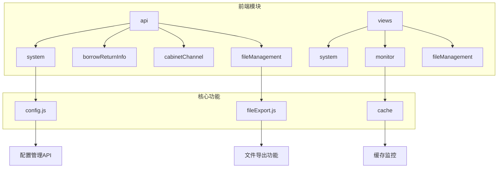
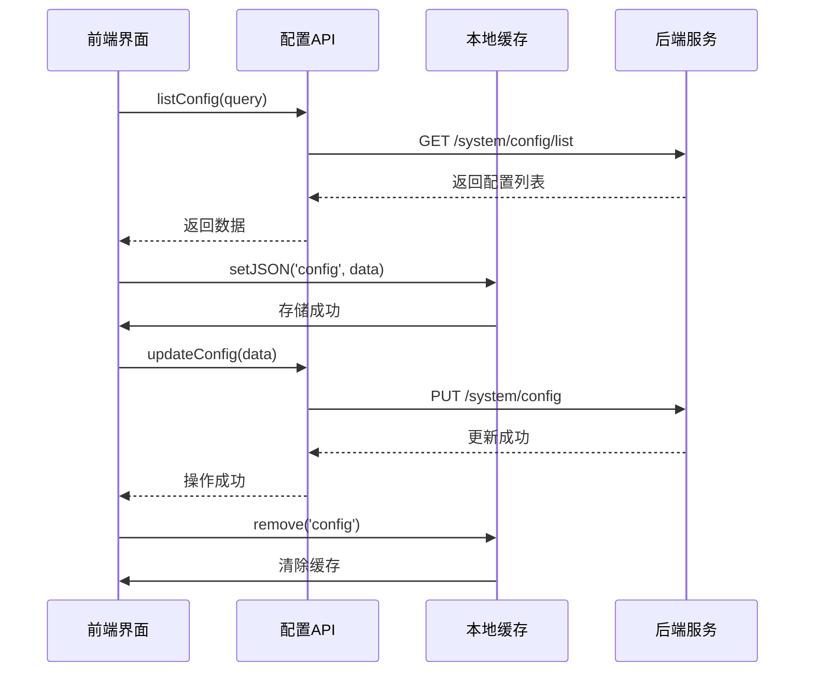
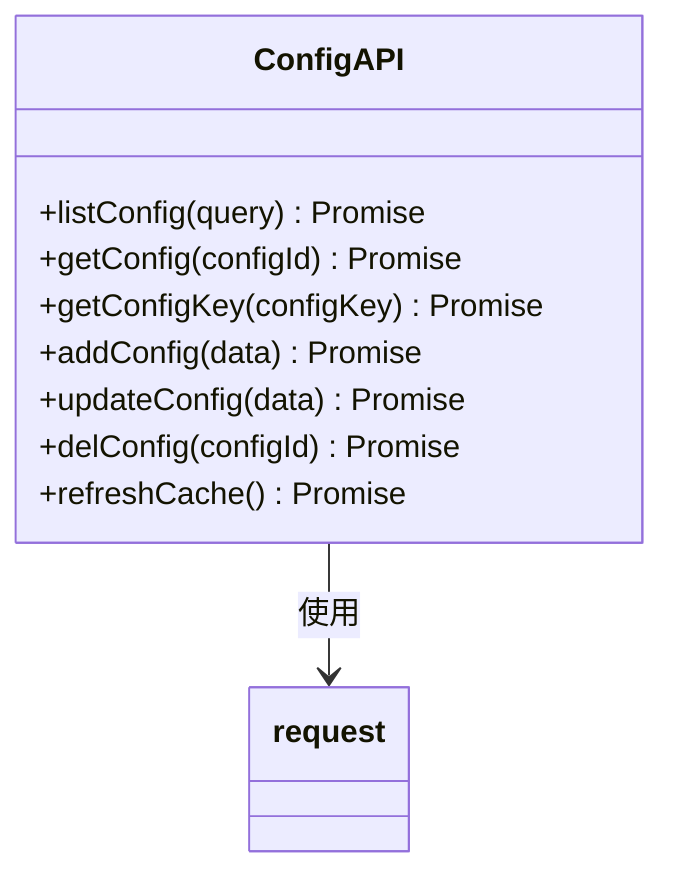
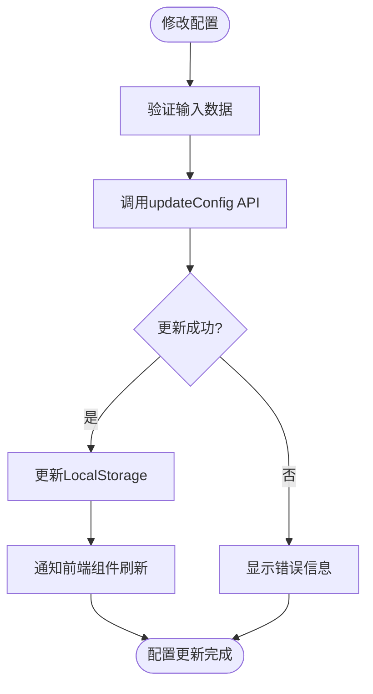
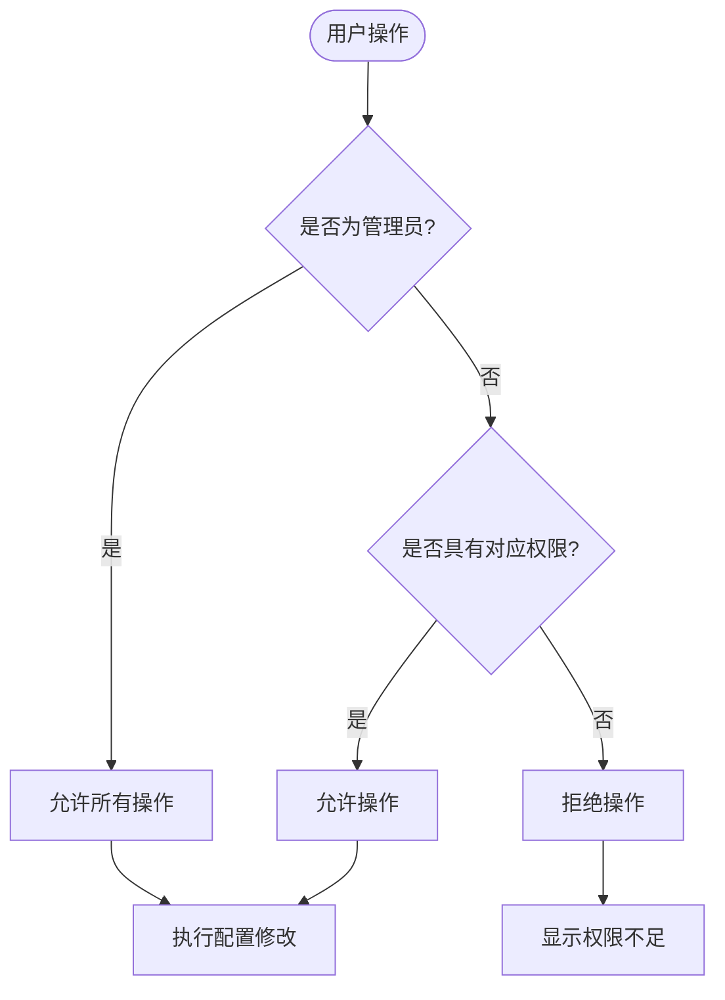
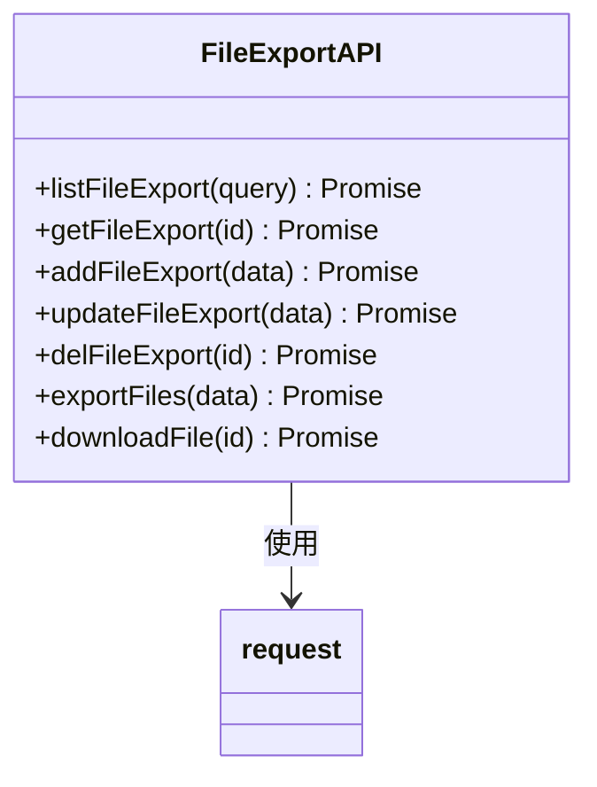
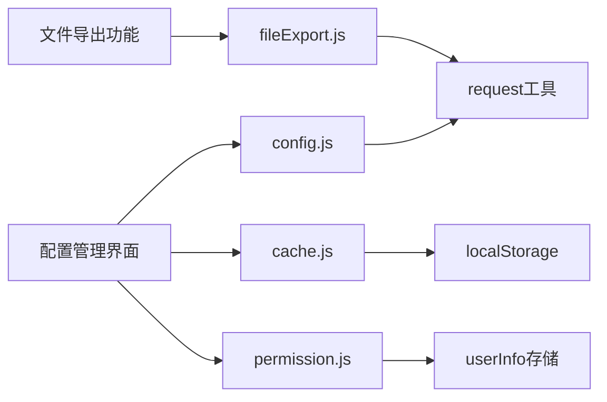

# 系统配置接口

<cite>
**本文档引用文件**  
- [config.js](file://daoju/src/api/system/config.js)
- [cache.js](file://daoju/src/plugins/cache.js)
- [permission.js](file://daoju/src/utils/permission.js)
- [fileExport.js](file://daoju/src/api/fileManagement/fileExport.js)
- [README.md](file://README.md)
</cite>

## 目录
1. [简介](#简介)
2. [项目结构](#项目结构)
3. [核心组件](#核心组件)
4. [架构概述](#架构概述)
5. [详细组件分析](#详细组件分析)
6. [依赖分析](#依赖分析)
7. [性能考虑](#性能考虑)
8. [故障排除指南](#故障排除指南)
9. [结论](#结论)

## 简介
本系统配置管理API文档旨在全面说明刀具管理系统中的配置项管理功能，涵盖配置分类、参数维护、缓存同步、权限控制、导入导出及审计日志等核心机制。系统采用三权分立的权限管理模式，确保配置管理的安全性与可追溯性。

## 项目结构
项目采用模块化设计，前端基于Vue 3 + Element Plus构建，通过清晰的目录结构组织功能模块。

**Diagram sources**
- [daoju/src/api/system/config.js](file://daoju/src/api/system/config.js#L1-L60)
- [daoju/src/api/fileManagement/fileExport.js](file://daoju/src/api/fileManagement/fileExport.js#L1-L63)

**Section sources**
- [daoju/src/api/system/config.js](file://daoju/src/api/system/config.js#L1-L60)
- [daoju/src/api/fileManagement/fileExport.js](file://daoju/src/api/fileManagement/fileExport.js#L1-L63)

## 核心组件
核心组件包括系统配置API、本地缓存管理、权限校验机制和文件导出服务，共同支撑配置管理的完整生命周期。

**Section sources**
- [config.js](file://daoju/src/api/system/config.js#L1-L60)
- [cache.js](file://daoju/src/plugins/cache.js#L1-L80)

## 架构概述
系统采用前后端分离架构，前端通过API调用与后端交互，实现配置的增删改查、缓存刷新和数据导出。

**Diagram sources**
- [config.js](file://daoju/src/api/system/config.js#L3-L60)
- [cache.js](file://daoju/src/plugins/cache.js#L1-L80)

## 详细组件分析

### 配置管理组件分析
该组件提供完整的配置项管理功能，包括查询、修改、删除和缓存刷新。

#### 配置API接口

**Diagram sources**
- [config.js](file://daoju/src/api/system/config.js#L1-L60)

#### 配置缓存同步机制

**Diagram sources**
- [config.js](file://daoju/src/api/system/config.js#L37-L43)
- [cache.js](file://daoju/src/plugins/cache.js#L36-L68)

**Section sources**
- [config.js](file://daoju/src/api/system/config.js#L1-L60)
- [cache.js](file://daoju/src/plugins/cache.js#L1-L80)

### 权限控制组件分析
系统通过三权分立模式实现精细化的权限控制，确保敏感配置的安全。

#### 权限校验流程

**Diagram sources**
- [permission.js](file://daoju/src/utils/permission.js#L64-L84)

**Section sources**
- [permission.js](file://daoju/src/utils/permission.js#L49-L110)

### 配置导入导出功能
系统提供配置数据的导入导出功能，便于数据迁移和备份。

#### 文件导出接口

**Diagram sources**
- [fileExport.js](file://daoju/src/api/fileManagement/fileExport.js#L1-L63)

**Section sources**
- [fileExport.js](file://daoju/src/api/fileManagement/fileExport.js#L1-L63)

## 依赖分析
系统各组件间存在明确的依赖关系，确保功能的完整性和一致性。

**Diagram sources**
- [config.js](file://daoju/src/api/system/config.js#L1-L60)
- [cache.js](file://daoju/src/plugins/cache.js#L1-L80)
- [permission.js](file://daoju/src/utils/permission.js#L1-L175)

**Section sources**
- [config.js](file://daoju/src/api/system/config.js#L1-L60)
- [cache.js](file://daoju/src/plugins/cache.js#L1-L80)
- [permission.js](file://daoju/src/utils/permission.js#L1-L175)

## 性能考虑
- 配置数据采用本地缓存，减少重复请求
- 批量操作支持，提高数据处理效率
- 接口响应时间优化，确保用户体验

## 故障排除指南
- 配置更新后未生效：检查是否调用了缓存刷新接口
- 权限不足：确认当前用户角色和权限设置
- 导出失败：检查文件大小和格式是否符合要求

**Section sources**
- [config.js](file://daoju/src/api/system/config.js#L54-L59)
- [permission.js](file://daoju/src/utils/permission.js#L64-L84)

## 结论
本系统配置管理API设计合理，功能完整，通过完善的权限控制和缓存机制，确保了配置管理的安全性和高效性，为系统的稳定运行提供了有力保障。