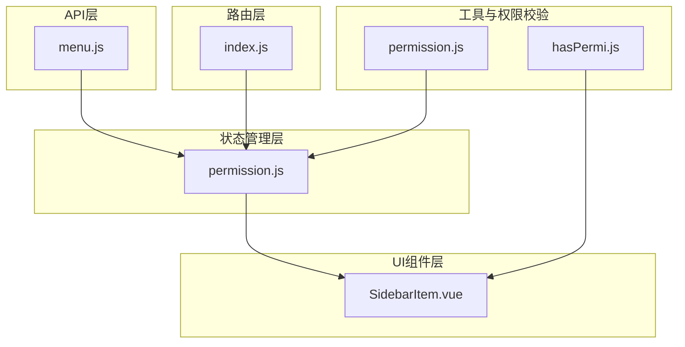
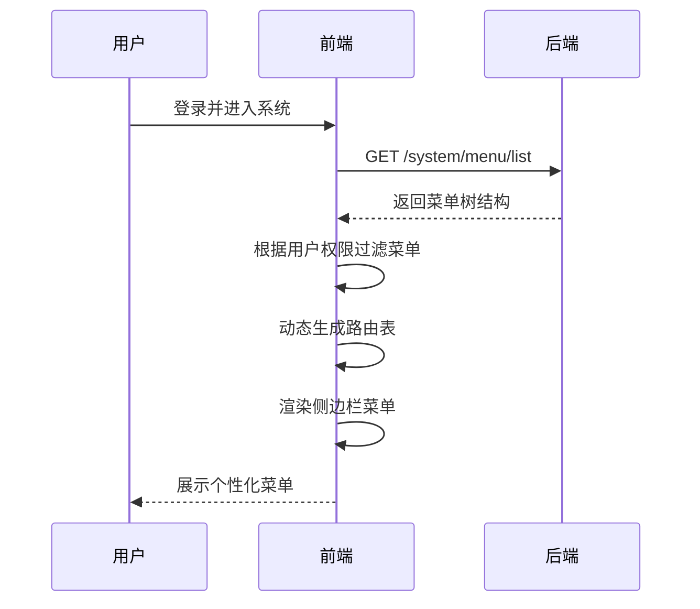
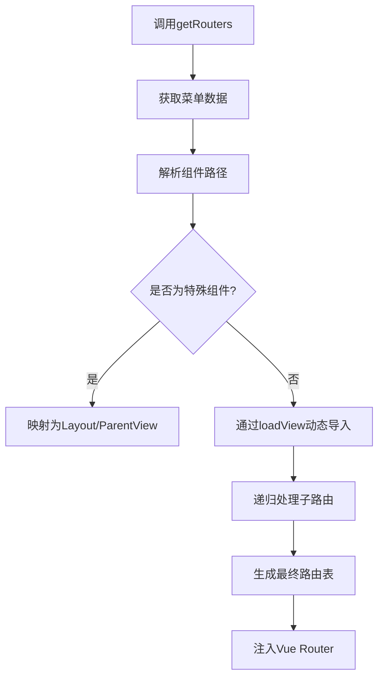
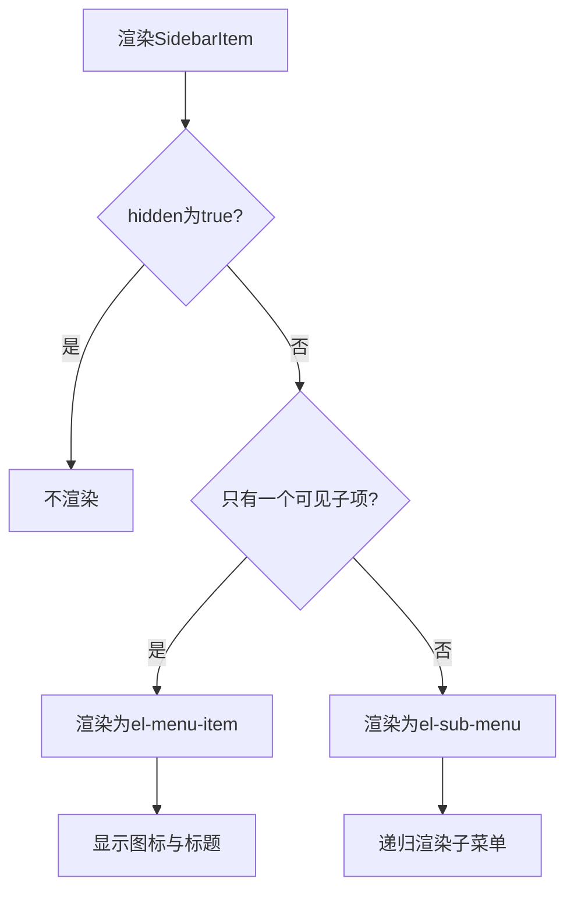
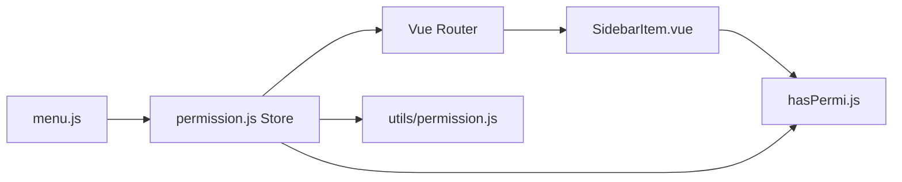

# 菜单权限接口

<cite>
**本文档引用文件**  
- [menu.js](file://daoju/src/api/system/menu.js)
- [index.js](file://daoju/src/router/index.js)
- [permission.js](file://daoju/src/store/modules/permission.js)
- [permission.js](file://daoju/src/utils/permission.js)
- [SidebarItem.vue](file://daoju/src/layout/components/Sidebar/SidebarItem.vue)
- [hasPermi.js](file://daoju/src/directive/permission/hasPermi.js)
</cite>

## 目录
1. [简介](#简介)
2. [项目结构](#项目结构)
3. [核心组件](#核心组件)
4. [架构概览](#架构概览)
5. [详细组件分析](#详细组件分析)
6. [依赖分析](#依赖分析)
7. [性能考虑](#性能考虑)
8. [故障排除指南](#故障排除指南)
9. [结论](#结论)

## 简介
本文档全面解析菜单管理API的设计与实现，涵盖菜单的层级结构维护、类型区分（目录、菜单、按钮）、权限标识（perms）配置、菜单与角色的关联机制，以及前端动态生成侧边栏路由的核心逻辑。同时详细说明菜单排序、隐藏设置、路由路径与组件路径的映射规则，并提供菜单树形数据接口的响应结构，解释如何通过`visible`字段控制菜单在前端的展示逻辑。

## 项目结构
本项目采用典型的Vue.js前端架构，基于模块化设计组织代码。核心功能模块包括API接口调用、路由配置、状态管理、权限校验、侧边栏渲染等。菜单管理功能主要分布在`api/system/menu.js`中，路由由`router/index.js`定义，权限逻辑由`store/modules/permission.js`和`utils/permission.js`共同处理，侧边栏展示逻辑位于`layout/components/Sidebar`目录下。

**图示来源**  
- [menu.js](file://daoju/src/api/system/menu.js)
- [index.js](file://daoju/src/router/index.js)
- [permission.js](file://daoju/src/store/modules/permission.js)
- [permission.js](file://daoju/src/utils/permission.js)
- [SidebarItem.vue](file://daoju/src/layout/components/Sidebar/SidebarItem.vue)
- [hasPermi.js](file://daoju/src/directive/permission/hasPermi.js)

**本节来源**  
- [menu.js](file://daoju/src/api/system/menu.js)
- [index.js](file://daoju/src/router/index.js)
- [permission.js](file://daoju/src/store/modules/permission.js)

## 核心组件
系统通过API接口获取菜单数据，结合用户角色与权限信息，动态生成可访问的路由表，并在前端侧边栏中渲染出对应的菜单树。菜单类型分为目录、菜单和按钮，分别对应不同的展示层级与交互行为。权限标识（perms）用于细粒度控制按钮级操作权限，通过`hasPermi`指令实现DOM元素的条件渲染。

**本节来源**  
- [menu.js](file://daoju/src/api/system/menu.js#L3-L60)
- [permission.js](file://daoju/src/utils/permission.js#L8-L25)
- [hasPermi.js](file://daoju/src/directive/permission/hasPermi.js#L1-L28)

## 架构概览
系统采用前后端分离架构，前端通过调用`/system/menu/list`等接口获取菜单结构，结合用户权限动态构建路由与侧边栏。权限控制分为路由级（roles）和操作级（permissions），分别在路由守卫和指令中进行校验。菜单树的展示依赖于递归组件`SidebarItem`，通过`hidden`和`visible`字段控制显示逻辑。

**图示来源**  
- [menu.js](file://daoju/src/api/system/menu.js#L4-L60)
- [permission.js](file://daoju/src/store/modules/permission.js#L38-L51)
- [SidebarItem.vue](file://daoju/src/layout/components/Sidebar/SidebarItem.vue#L2-L27)

## 详细组件分析

### 菜单API分析
`menu.js`文件定义了菜单管理的所有API接口，包括查询菜单列表、获取菜单详情、新增、修改、删除菜单等操作。其中`listMenu`接口用于获取完整的菜单树结构，`treeselect`用于下拉选择，`roleMenuTreeselect`则根据角色ID返回对应的菜单树，支持权限分配场景。

**本节来源**  
- [menu.js](file://daoju/src/api/system/menu.js#L3-L60)

### 路由与权限生成分析
`permission.js`（store模块）通过调用`getRouters()`获取菜单数据，并使用`filterAsyncRouter`函数将后端返回的字符串组件路径转换为实际的Vue组件引用。该过程支持`Layout`、`ParentView`等特殊布局组件的识别，并递归处理子路由。最终生成的路由表会注入到Vue Router中，实现动态路由。

**图示来源**  
- [permission.js](file://daoju/src/store/modules/permission.js#L38-L48)
- [permission.js](file://daoju/src/store/modules/permission.js#L59-L83)

**本节来源**  
- [permission.js](file://daoju/src/store/modules/permission.js#L1-L127)

### 权限校验工具分析
`utils/permission.js`提供了`checkPermi`和`checkRole`两个核心函数，用于在JavaScript中进行权限判断。此外还定义了`PAGE_PERMISSIONS`对象，将页面路径与所需权限一一映射，通过`canAccessPage(path)`方法实现页面级访问控制。管理员（admin）拥有通配符权限，可访问所有页面。

**本节来源**  
- [permission.js](file://daoju/src/utils/permission.js#L8-L175)

### 侧边栏渲染逻辑分析
`SidebarItem.vue`是递归渲染菜单的核心组件。它通过`v-if="!item.hidden"`控制菜单项的显示，结合`hasOneShowingChild`判断是否仅有一个可见子菜单，决定是否折叠显示。图标通过`svg-icon`组件渲染，文本过长时自动显示title提示。路由跳转通过`AppLink`组件完成。

**图示来源**  
- [SidebarItem.vue](file://daoju/src/layout/components/Sidebar/SidebarItem.vue#L2-L27)

**本节来源**  
- [SidebarItem.vue](file://daoju/src/layout/components/Sidebar/SidebarItem.vue#L1-L101)

### 指令级权限控制分析
`hasPermi.js`是一个Vue指令，用于控制DOM元素的显示。在`mounted`钩子中读取绑定的权限数组，与用户权限进行比对。若用户不具备任一所需权限，则从父节点中移除该元素，实现按钮级别的权限隐藏。

**本节来源**  
- [hasPermi.js](file://daoju/src/directive/permission/hasPermi.js#L1-L28)

## 依赖分析
系统各模块之间存在明确的依赖关系。API层依赖`request.js`进行HTTP通信；权限模块依赖用户状态（user store）获取权限数据；路由生成依赖API返回的菜单结构；侧边栏组件依赖路由数据进行渲染。整体形成“API → Store → Router → View”的数据流。

**图示来源**  
- [menu.js](file://daoju/src/api/system/menu.js)
- [permission.js](file://daoju/src/store/modules/permission.js)
- [index.js](file://daoju/src/router/index.js)
- [SidebarItem.vue](file://daoju/src/layout/components/Sidebar/SidebarItem.vue)
- [hasPermi.js](file://daoju/src/directive/permission/hasPermi.js)
- [permission.js](file://daoju/src/utils/permission.js)

**本节来源**  
- [menu.js](file://daoju/src/api/system/menu.js)
- [permission.js](file://daoju/src/store/modules/permission.js)
- [index.js](file://daoju/src/router/index.js)

## 性能考虑
- 菜单数据在用户登录后仅请求一次，减少重复请求开销。
- 动态路由通过`import()`实现懒加载，提升首屏性能。
- `filterAsyncRouter`对组件路径进行缓存匹配，避免重复查找。
- 侧边栏递归渲染深度有限，不会导致栈溢出。
- 权限校验使用`some()`方法尽早返回，提高判断效率。

## 故障排除指南
- **菜单不显示**：检查`hidden`字段是否为`true`，或用户是否缺少对应权限。
- **路由无法访问**：确认`meta.permissions`是否配置正确，用户是否拥有该权限。
- **按钮未隐藏**：确保使用了`v-hasPermi`指令，并检查权限字符串拼写。
- **图标不显示**：确认`meta.icon`值与`src/assets/icons/svg`目录下的文件名一致。
- **子菜单未折叠**：检查`alwaysShow`和子菜单数量，确保符合显示逻辑。

**本节来源**  
- [SidebarItem.vue](file://daoju/src/layout/components/Sidebar/SidebarItem.vue#L53-L76)
- [hasPermi.js](file://daoju/src/directive/permission/hasPermi.js#L16-L18)
- [permission.js](file://daoju/src/store/modules/permission.js#L116-L124)

## 结论
本系统实现了完整的菜单权限管理体系，支持多层级菜单结构、细粒度权限控制、动态路由生成和个性化侧边栏展示。通过API接口、状态管理、路由配置和UI组件的协同工作，构建了一个灵活、安全、可扩展的前端权限框架。建议在新增页面时同步配置`PAGE_PERMISSIONS`，并在敏感操作上使用`v-hasPermi`指令，以保障系统安全性。