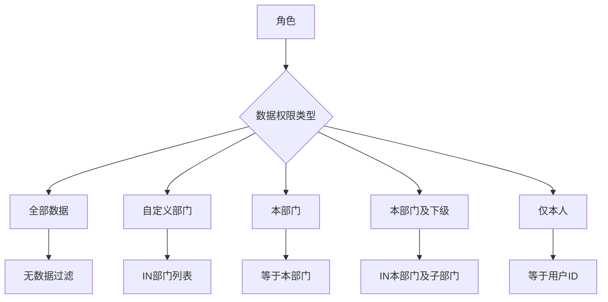
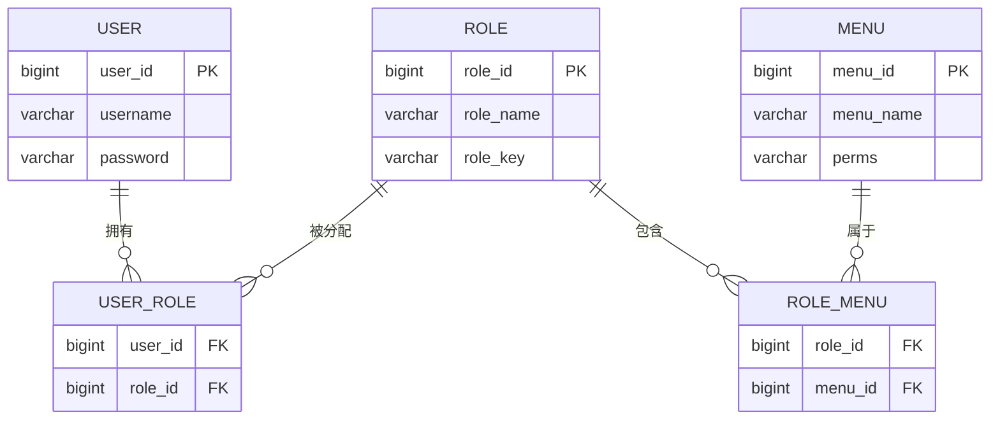
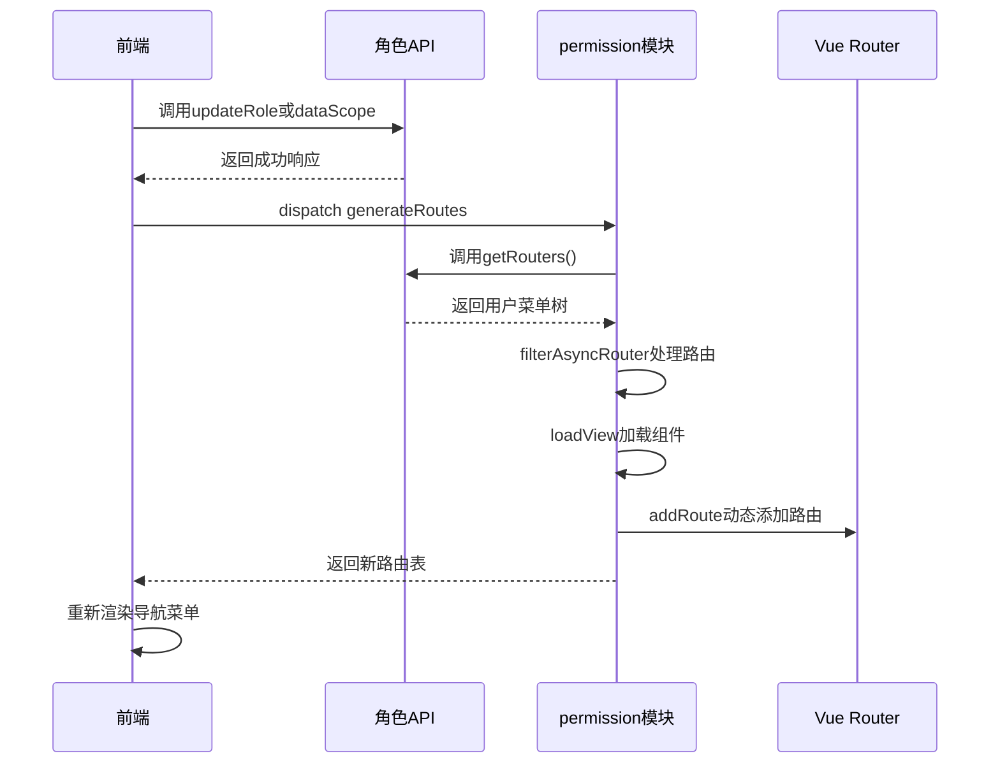
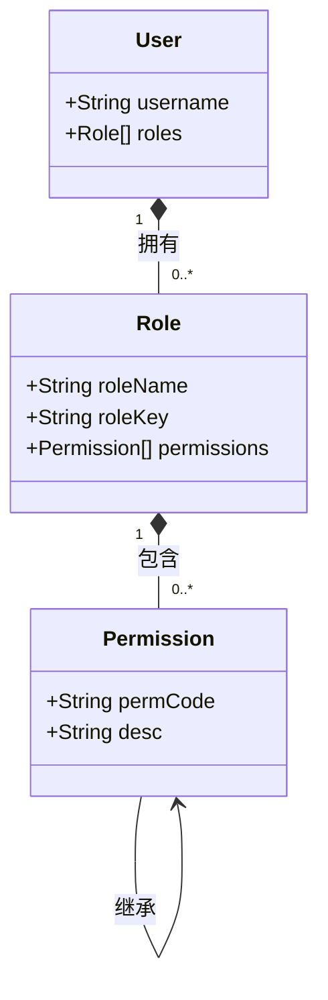

# 角色管理接口

<cite>
**本文档引用文件**  
- [role.js](file://daoju/src/api/system/role.js)
- [selectUser.vue](file://daoju/src/views/system/role/selectUser.vue)
- [permission.js](file://daoju/src/store/modules/permission.js)
- [permission.js](file://daoju/src/utils/permission.js)
- [hasRole.js](file://daoju/src/directive/permission/hasRole.js)
</cite>

## 目录
1. [简介](#简介)
2. [核心功能概述](#核心功能概述)
3. [角色增删改查接口](#角色增删改查接口)
4. [权限分配机制](#权限分配机制)
5. [角色与用户、菜单的多对多关系实现](#角色与用户菜单的多对多关系实现)
6. [角色权限更新后前端路由动态刷新逻辑](#角色权限更新后前端路由动态刷新逻辑)
7. [批量绑定用户接口说明](#批量绑定用户接口说明)
8. [RBAC权限模型中的角色继承与权限聚合实现](#rbac权限模型中的角色继承与权限聚合实现)

## 简介
本接口文档详细描述了系统中角色管理模块的核心功能，涵盖角色的增删改查、权限分配（菜单权限、数据权限）、状态控制等操作。同时说明了角色与用户、菜单之间的多对多关系实现机制，重点解析角色权限变更后前端路由的动态刷新流程。文档还提供了角色批量绑定用户的接口定义及错误处理策略，并结合代码逻辑展示如何通过API实现RBAC权限模型中的角色继承与权限聚合。

## 核心功能概述
角色管理模块提供完整的RBAC权限控制能力，支持：
- 角色的创建、查询、修改和删除
- 菜单权限与数据权限的独立配置
- 角色状态启用/禁用控制
- 角色与用户的批量授权与取消授权
- 前端路由基于角色权限的动态加载

系统通过前后端协同机制实现细粒度权限控制，确保不同角色用户只能访问其被授权的功能模块。

**Section sources**
- [role.js](file://daoju/src/api/system/role.js#L3-L120)

## 角色增删改查接口
角色管理提供标准RESTful风格的CRUD接口，所有请求均通过`/system/role`路径进行。

| 操作 | 方法 | 接口路径 | 参数类型 |
|------|------|----------|---------|
| 查询角色列表 | GET | `/system/role/list` | query参数 |
| 获取角色详情 | GET | `/system/role/{roleId}` | 路径参数 |
| 新增角色 | POST | `/system/role` | JSON body |
| 修改角色 | PUT | `/system/role` | JSON body |
| 删除角色 | DELETE | `/system/role/{roleId}` | 路径参数 |
| 修改角色状态 | PUT | `/system/role/changeStatus` | JSON body |

新增和修改角色时需提交包含角色名称、权限字符、数据范围、菜单ID列表等字段的JSON对象。

**Section sources**
- [role.js](file://daoju/src/api/system/role.js#L3-L66)

## 权限分配机制
系统支持两种类型的权限分配：菜单权限（功能权限）和数据权限。

### 菜单权限
通过角色与菜单的多对多关联表实现。每个菜单项具有唯一的权限标识（如`system:user:add`），角色被授予该标识后即可访问对应功能。

### 数据权限
通过`dataScope`接口实现，支持以下五种数据范围：
- 全部数据权限
- 自定义数据权限
- 本部门数据权限
- 本部门及以下数据权限
- 仅本人数据权限

数据权限控制通过SQL条件动态拼接实现，确保用户只能查看其权限范围内的数据记录。



**Diagram sources**
- [role.js](file://daoju/src/api/system/role.js#L38-L45)

## 角色与用户、菜单的多对多关系实现
系统采用关系型数据库设计，通过中间表实现角色与用户、角色与菜单的多对多关联。

### 数据库结构


### 实现机制
- **角色-用户关系**：通过`USER_ROLE`中间表维护，支持一个用户拥有多个角色，一个角色分配给多个用户。
- **角色-菜单关系**：通过`ROLE_MENU`中间表维护，角色被授予菜单权限后，其拥有的所有用户均可访问该菜单。

前端通过`/system/role/authUser/unallocatedList`和`/system/role/authUser/allocatedList`接口分别获取未授权和已授权用户列表，实现可视化授权管理。

**Diagram sources**
- [role.js](file://daoju/src/api/system/role.js#L68-L119)
- [selectUser.vue](file://daoju/src/views/system/role/selectUser.vue#L64-L138)

## 角色权限更新后前端路由动态刷新逻辑
当角色权限发生变更后，系统通过以下机制实现前端路由的动态刷新：

### 流程说明


### 关键实现
1. **权限变更后触发**：角色修改成功后，调用`usePermissionStore().generateRoutes()`重新生成路由。
2. **获取菜单数据**：通过`getRouters()`接口从后端获取当前用户有权限访问的菜单树。
3. **路由过滤**：`filterAsyncRouter`函数将后端返回的菜单结构转换为Vue Router可识别的路由对象。
4. **组件懒加载**：`loadView`函数根据组件路径动态导入Vue组件。
5. **动态注册**：使用`router.addRoute()`将新路由注册到Vue Router中。

此机制确保用户在权限变更后无需刷新页面即可看到更新后的菜单结构。

**Diagram sources**
- [permission.js](file://daoju/src/store/modules/permission.js#L35-L52)
- [role.js](file://daoju/src/api/system/role.js#L20-L36)

## 批量绑定用户接口说明
系统提供角色与用户的批量绑定与解绑接口，支持高效的大规模权限分配操作。

### 接口定义
| 接口 | 方法 | 路径 | 请求体结构 |
|------|------|------|-----------|
| 批量授权用户 | PUT | `/system/role/authUser/selectAll` | `roleId`, `userIds`（逗号分隔） |
| 批量取消授权 | PUT | `/system/role/authUser/cancelAll` | `roleId`, `userIds`（逗号分隔） |

### 请求体示例
```json
{
  "roleId": 100,
  "userIds": "101,102,103"
}
```

### 错误处理策略
- **参数校验失败**：返回400状态码，提示"角色ID和用户ID不能为空"
- **权限不足**：返回403状态码，提示"当前用户无权操作该角色"
- **角色不存在**：返回404状态码，提示"角色不存在"
- **数据库异常**：返回500状态码，记录错误日志并提示"操作失败，请重试"

前端在`selectUser.vue`组件中实现了用户选择弹窗，通过`unallocatedUserList`接口分页加载可授权用户，并在确认时调用`authUserSelectAll`完成批量绑定。

**Section sources**
- [role.js](file://daoju/src/api/system/role.js#L95-L111)
- [selectUser.vue](file://daoju/src/views/system/role/selectUser.vue#L127-L138)

## RBAC权限模型中的角色继承与权限聚合实现
系统通过权限标识的层级设计和前端指令实现了RBAC模型中的角色继承与权限聚合。

### 角色继承实现
通过权限标识的通配符机制实现：
- `*:*:*` 表示超级管理员，拥有所有权限
- `module:*` 表示模块级通配权限
- `module:action` 表示具体操作权限



### 权限聚合逻辑
权限判断在多个层级实现：

#### 前端指令级
```javascript
// hasRole.js
const hasRole = roles.some(role => {
  return super_admin === role || roleFlag.includes(role)
})
```

#### 工具函数级
```javascript
// permission.js
export function hasPermission(permission) {
  const user = getCurrentUser()
  if (user.permissions.includes('*')) return true
  return user.permissions.some(p => {
    if (p.endsWith(':*')) {
      const module = p.replace(':*', '')
      return permission.startsWith(module + ':')
    }
    return p === permission
  })
}
```

#### Vue模板使用
```vue
<el-button v-hasRole="['admin','editor']">编辑</el-button>
<el-button v-hasPermi="['system:user:add']">新增</el-button>
```

当用户拥有多个角色时，系统会将其所有权限进行聚合，只要任一角色包含所需权限即可访问对应功能。这种设计既保证了权限控制的灵活性，又避免了权限爆炸问题。

**Section sources**
- [hasRole.js](file://daoju/src/directive/permission/hasRole.js#L1-L28)
- [permission.js](file://daoju/src/utils/permission.js#L1-L175)