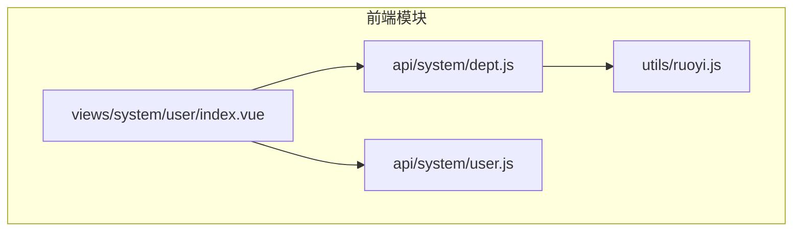
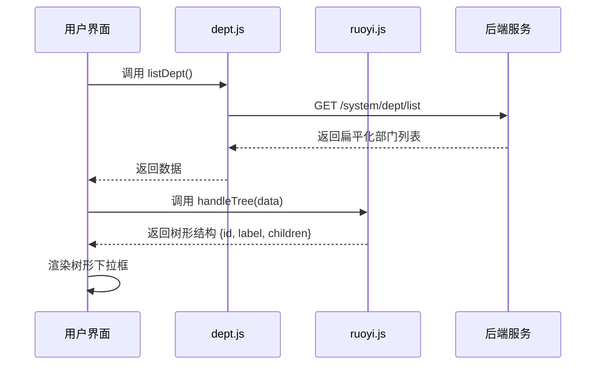
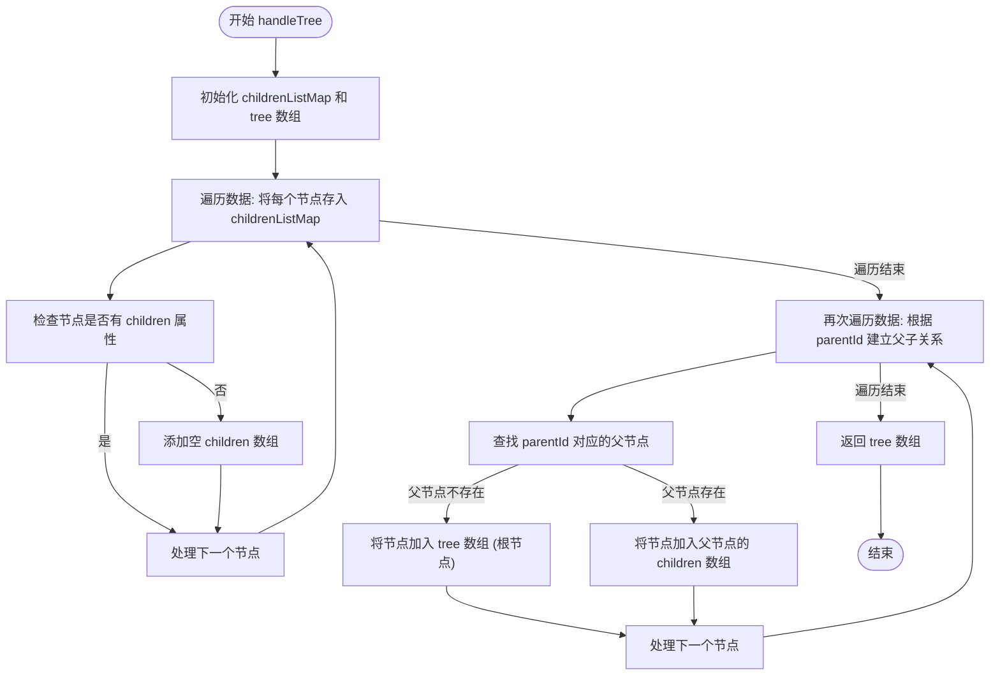
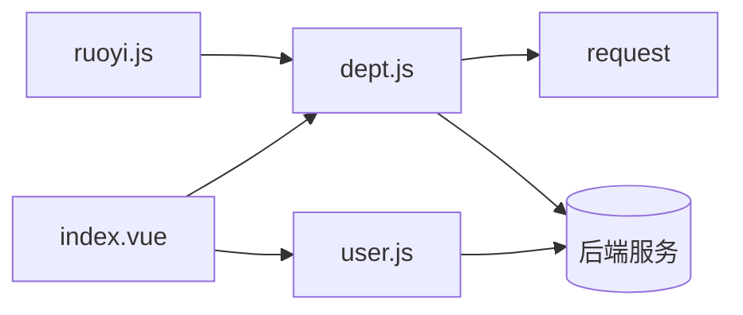

# 部门管理接口

<cite>
**本文档引用文件**  
- [dept.js](file://daoju/src/api/system/dept.js)
- [ruoyi.js](file://daoju/src/utils/ruoyi.js)
- [user.js](file://daoju/src/api/system/user.js)
- [index.vue](file://daoju/src/views/system/user/index.vue)
</cite>

## 目录
1. [简介](#简介)
2. [项目结构](#项目结构)
3. [核心组件](#核心组件)
4. [架构概览](#架构概览)
5. [详细组件分析](#详细组件分析)
6. [依赖分析](#依赖分析)
7. [性能考虑](#性能考虑)
8. [故障排除指南](#故障排除指南)
9. [结论](#结论)

## 简介
本接口文档详细说明了部门管理模块的功能，涵盖部门树形结构的构建、增删改查、排序与层级管理。文档还阐述了部门与用户、岗位之间的关联关系，以及在用户管理界面中部门下拉树的加载逻辑。新增部门时的编码规则生成策略、父级部门约束条件，以及删除部门时的级联校验机制（如是否存在子部门或关联用户）均被明确描述。此外，文档提供了树形结构接口的响应数据格式（id, label, children）及前端递归渲染示例。

## 项目结构
部门管理功能主要分布在前端项目的 `system` 模块中，涉及 API 接口定义、工具函数和视图组件。核心逻辑位于 `api/system/dept.js` 和通用工具 `utils/ruoyi.js` 中，用户管理界面通过调用部门树接口实现下拉选择功能。



**Diagram sources**
- [dept.js](file://daoju/src/api/system/dept.js#L1-L52)
- [ruoyi.js](file://daoju/src/utils/ruoyi.js#L157-L184)
- [user.js](file://daoju/src/api/system/user.js#L130-L135)
- [index.vue](file://daoju/src/views/system/user/index.vue#L101-L106)

**Section sources**
- [dept.js](file://daoju/src/api/system/dept.js#L1-L52)
- [ruoyi.js](file://daoju/src/utils/ruoyi.js#L157-L184)

## 核心组件
核心组件包括部门管理 API 接口（`dept.js`）、树形结构构造工具（`handleTree` 函数）以及用户管理界面中用于加载部门树的逻辑。这些组件共同实现了部门的增删改查、树形展示和与用户的关联管理。

**Section sources**
- [dept.js](file://daoju/src/api/system/dept.js#L1-L52)
- [ruoyi.js](file://daoju/src/utils/ruoyi.js#L157-L184)
- [user.js](file://daoju/src/api/system/user.js#L130-L135)

## 架构概览
系统采用前后端分离架构，前端通过 RESTful API 与后端交互。部门管理功能的核心是树形结构的构建与维护，前端通过调用 `/system/dept/list` 获取扁平化的部门列表，再利用 `handleTree` 工具函数将其转换为嵌套的树形结构，最终在用户界面中以树形下拉框的形式展示。



**Diagram sources**
- [dept.js](file://daoju/src/api/system/dept.js#L3-L9)
- [ruoyi.js](file://daoju/src/utils/ruoyi.js#L157-L184)

## 详细组件分析

### 部门树形结构构建分析
部门树形结构的构建依赖于 `handleTree` 工具函数。该函数接收一个扁平化的部门数据数组，通过 `id` 和 `parentId` 字段建立父子关系，最终生成一个具有 `children` 属性的嵌套对象数组，符合前端树形控件的数据要求。

#### 树形结构构造函数


**Diagram sources**
- [ruoyi.js](file://daoju/src/utils/ruoyi.js#L157-L184)

#### 部门增删改查接口分析
部门的增删改查操作通过 `dept.js` 中定义的 API 函数实现，这些函数封装了对后端 RESTful 接口的 HTTP 请求。

```mermaid
classDiagram
class DeptAPI {
+listDept(query) Promise
+getDept(deptId) Promise
+addDept(data) Promise
+updateDept(data) Promise
+delDept(deptId) Promise
}
class UserManagement {
+getDeptTree() void
+handleNodeClick(data) void
}
class TreeUtil {
+handleTree(data, id, parentId, children) Array
}
UserManagement --> DeptAPI : "调用"
UserManagement --> TreeUtil : "调用"
DeptAPI ..> "HTTP GET" : "/system/dept/list"
DeptAPI ..> "HTTP POST" : "/system/dept"
DeptAPI ..> "HTTP DELETE" : "/system/dept/{id}"
```

**Diagram sources**
- [dept.js](file://daoju/src/api/system/dept.js#L1-L52)
- [index.vue](file://daoju/src/views/system/user/index.vue#L101-L106)

**Section sources**
- [dept.js](file://daoju/src/api/system/dept.js#L1-L52)
- [index.vue](file://daoju/src/views/system/user/index.vue#L101-L106)

### 用户管理界面中的部门加载逻辑
在用户管理界面中，部门下拉树的加载流程如下：组件挂载时调用 `getDeptTree` 函数，该函数内部调用 `deptTreeSelect` API 获取部门数据，然后使用 `handleTree` 将其转换为树形结构并赋值给 `deptOptions`，最终在 `<el-tree>` 或类似组件中渲染。

**Section sources**
- [index.vue](file://daoju/src/views/system/user/index.vue#L101-L106)
- [user.js](file://daoju/src/api/system/user.js#L130-L135)

## 依赖分析
部门管理功能依赖于 `request` 工具进行 HTTP 通信，并依赖 `handleTree` 工具函数进行数据结构转换。用户管理界面组件依赖部门 API 来获取数据。整个功能模块与用户（User）、岗位（Post）模块存在数据关联。



**Diagram sources**
- [dept.js](file://daoju/src/api/system/dept.js#L1)
- [ruoyi.js](file://daoju/src/utils/ruoyi.js#L157-L184)
- [index.vue](file://daoju/src/views/system/user/index.vue#L8)
- [user.js](file://daoju/src/api/system/user.js#L1)

**Section sources**
- [dept.js](file://daoju/src/api/system/dept.js#L1-L52)
- [ruoyi.js](file://daoju/src/utils/ruoyi.js#L157-L184)
- [index.vue](file://daoju/src/views/system/user/index.vue#L1-L333)

## 性能考虑
树形结构的构建在前端进行，避免了后端进行复杂递归查询的压力。`handleTree` 函数通过两次遍历和哈希映射（childrenListMap）实现，时间复杂度为 O(n)，效率较高。对于超大型部门结构，可考虑分页加载或懒加载策略。

## 故障排除指南
- **部门树无法显示**：检查 `deptTreeSelect` 接口是否返回数据，确认 `handleTree` 的 `id` 和 `parentId` 字段名是否匹配。
- **新增/修改部门失败**：检查 API 请求的 `data` 参数是否包含正确的 `parentId` 和其他必填字段。
- **删除部门提示有子部门**：后端应实现级联校验，确保在删除前检查 `children` 数组是否为空。

**Section sources**
- [dept.js](file://daoju/src/api/system/dept.js#L46-L52)
- [index.vue](file://daoju/src/views/system/user/index.vue#L144-L152)

## 结论
本部门管理接口设计清晰，通过前后端协作实现了完整的树形结构管理功能。前端利用通用工具函数高效地将扁平数据转换为树形结构，为用户提供了直观的部门选择体验。接口设计遵循 RESTful 规范，易于维护和扩展。