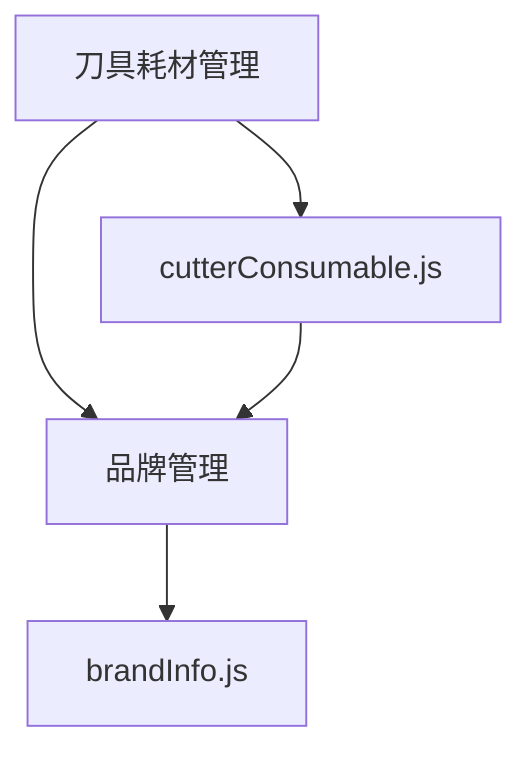

# 刀具耗材管理接口

<cite>
**本文档引用文件**  
- [cutterConsumable.js](file://daoju\src\api\consumableService\cutterConsumable.js)
- [brandInfo.js](file://daoju\src\api\consumableService\brandInfo.js)
- [stockInOutInfo.js](file://daoju\src\api\consumableService\stockInOutInfo.js)
- [cutterType.js](file://daoju\src\api\dataDictionary\cutterType.js)
- [index.vue](file://daoju\src\views\consumableService\cutterConsumable\index.vue)
</cite>

## 目录
1. [简介](#简介)
2. [核心接口功能](#核心接口功能)
3. [请求体结构与字段约束](#请求体结构与字段约束)
4. [响应格式与状态码](#响应格式与状态码)
5. [业务场景应用](#业务场景应用)
6. [典型调用示例](#典型调用示例)
7. [性能优化策略](#性能优化策略)
8. [模块集成关系](#模块集成关系)
9. [附录](#附录)

## 简介
刀具耗材管理接口是刀具管理系统中的核心模块之一，负责对刀具耗材的全生命周期进行管理。该接口基于 `cutterConsumable.js` 实现，支持刀具耗材的创建、更新、查询和状态变更等操作。通过此接口，用户可以实现新刀具入库初始化、使用次数记录更新、库存预警设置等功能。系统还提供了与品牌管理、库存出入库模块的深度集成，确保数据一致性与业务流程的完整性。

**Section sources**
- [cutterConsumable.js](file://daoju\src\api\consumableService\cutterConsumable.js#L1-L158)

## 核心接口功能
刀具耗材管理接口提供了一系列完整的 CRUD 操作，涵盖从新增到删除的全过程，并支持批量操作与数据导入导出。

### 增删改查操作
- **查询列表**：`listCutterConsumable(query)` 支持分页和多条件筛选，如品牌名称、刀具型号、物料类型等。
- **查询详情**：`getCutterConsumable(id)` 根据主键获取单个刀具耗材的详细信息。
- **新增耗材**：`addCutterConsumable(data)` 创建新的刀具耗材记录，包含基础信息、库存信息及关联刀具柜。
- **修改耗材**：`updateCutterConsumable(data)` 更新现有刀具耗材信息，支持字段级更新。
- **删除操作**：`delCutterConsumable(id)` 删除指定 ID 的耗材；`batchDelCutterConsumable(ids)` 支持批量删除。

### 数据导入导出
- **导出数据**：`exportCutterConsumable(query)` 将符合条件的数据导出为文件。
- **批量导入**：`importCutterConsumable(data)` 支持通过 Excel 文件批量导入刀具耗材信息。
- **下载模板**：`downloadTemplate()` 提供标准导入模板，确保数据格式统一。

### 辅助功能
- **获取下拉选项**：提供品牌、刀具柜、物料类型、刀具类型等列表，用于前端下拉选择。
- **图片管理**：支持上传和删除刀具相关图片。
- **库存管理**：`updateStock(data)` 更新库存数量，`setInventoryWarning(data)` 设置库存预警阈值。
- **统计信息**：`getStockStatistics()` 获取库存统计信息，辅助决策分析。

**Section sources**
- [cutterConsumable.js](file://daoju\src\api\consumableService\cutterConsumable.js#L3-L158)

## 请求体结构与字段约束
刀具耗材管理接口的请求体结构设计严谨，包含多个关键字段，确保数据完整性与业务逻辑正确性。

### 新增与修改请求体结构
```json
{
  "brandCode": "品牌编码",
  "brandName": "品牌名称",
  "cutterCode": "刀具型号",
  "materialCode": "物料编码",
  "materialType": "物料类型",
  "specification": "规格",
  "price": 0.0,
  "stockNum": 0,
  "packQty": 1,
  "packUnit": "包装单位",
  "numberLife": 0,
  "timeLife": 0,
  "isUniqueCode": 0,
  "status": "active",
  "cabinetList": [
    {
      "cabinetCode": "刀具柜编码",
      "cabinetName": "刀具柜名称",
      "stockLoc": "库位号",
      "locSurplus": 0
    }
  ]
}
```

### 字段约束说明
| 字段名 | 类型 | 是否必填 | 约束说明 |
|--------|------|----------|----------|
| `brandCode` | String | 是 | 品牌编码，需唯一 |
| `cutterCode` | String | 是 | 刀具型号，系统内唯一 |
| `materialType` | String | 是 | 物料类型，枚举值：硬质合金、高速钢、陶瓷、立方氮化硼、金刚石 |
| `price` | Number | 是 | 单价，≥0，保留两位小数 |
| `stockNum` | Number | 是 | 当前库存，≥0 |
| `isUniqueCode` | Integer | 是 | 是否一刀一码，0：否，1：是 |
| `status` | String | 是 | 业务状态，active：启用，inactive：禁用 |
| `cabinetList` | Array | 否 | 关联刀具柜信息，可为空 |

**Section sources**
- [cutterConsumable.js](file://daoju\src\api\consumableService\cutterConsumable.js#L20-L35)
- [index.vue](file://daoju\src\views\consumableService\cutterConsumable\index.vue#L1372-L1393)

## 响应格式与状态码
接口返回统一的响应格式，便于前端解析处理。

### 响应格式
```json
{
  "code": 200,
  "msg": "操作成功",
  "data": {}
}
```
- `code`：状态码，200 表示成功，其他为错误码。
- `msg`：提示信息。
- `data`：返回的具体数据，查询接口返回对象或数组，操作接口可能为空。

### 状态码含义
| 状态码 | 含义 | 说明 |
|--------|------|------|
| 200 | OK | 请求成功 |
| 400 | Bad Request | 参数校验失败 |
| 401 | Unauthorized | 未授权访问 |
| 404 | Not Found | 资源不存在 |
| 500 | Internal Server Error | 服务器内部错误 |

**Section sources**
- [cutterConsumable.js](file://daoju\src\api\consumableService\cutterConsumable.js#L3-L158)

## 业务场景应用
刀具耗材管理接口广泛应用于实际业务场景中，支持刀具全生命周期管理。

### 新刀具入库初始化
当新采购的刀具到货时，通过 `addCutterConsumable` 接口完成入库初始化。需填写品牌、型号、规格、单价、初始库存等信息，并绑定存放的刀具柜及库位。系统自动校验型号唯一性，防止重复录入。

### 使用次数记录更新
对于支持寿命管理的刀具（如铣刀、钻头），每次使用后可通过 `updateCutterConsumable` 接口更新已使用次数（`numberLife`）或使用时长（`timeLife`）。系统可根据预设寿命值提醒更换。

### 库存预警与调拨
通过 `setInventoryWarning` 设置库存预警值，当库存低于该值时系统发出预警。支持通过 `updateStock` 进行库存调整，或通过出入库模块联动实现自动更新。

**Section sources**
- [cutterConsumable.js](file://daoju\src\api\consumableService\cutterConsumable.js#L20-L35)
- [index.vue](file://daoju\src\views\consumableService\cutterConsumable\index.vue#L2291-L2327)

## 典型调用示例
### 根据刀具类型筛选可用耗材列表
```javascript
listCutterConsumable({
  cutterType: '铣刀',
  stockStatus: 'normal',
  pageNum: 1,
  pageSize: 10
})
```
此调用将返回所有类型为“铣刀”且库存正常的耗材，用于生产准备或库存盘点。

### 批量导入刀具耗材
```javascript
const formData = new FormData();
formData.append('file', file);
importCutterConsumable(formData);
```
结合 `downloadTemplate` 获取模板，用户填写后上传，系统解析并批量插入数据，提升数据录入效率。

**Section sources**
- [cutterConsumable.js](file://daoju\src\api\consumableService\cutterConsumable.js#L4-L9)
- [index.vue](file://daoju\src\views\consumableService\cutterConsumable\index.vue#L2365-L2392)

## 性能优化策略
为提升系统响应速度与用户体验，采用以下性能优化策略：

### 懒加载
在列表页中，仅加载当前页数据，避免一次性加载全部记录。通过分页参数 `pageNum` 和 `pageSize` 控制数据量。

### 字段投影
查询接口支持字段过滤，仅返回前端需要的字段，减少网络传输数据量。例如详情页可选择性加载图片列表或刀具柜信息。

### 缓存机制
对下拉选项数据（如品牌、物料类型）进行本地缓存，减少重复请求。首次加载后存入 Vuex 或 localStorage，后续直接读取。

**Section sources**
- [cutterConsumable.js](file://daoju\src\api\consumableService\cutterConsumable.js#L82-L110)
- [index.vue](file://daoju\src\views\consumableService\cutterConsumable\index.vue#L1921-L1955)

## 模块集成关系
刀具耗材管理模块与多个系统模块紧密集成，确保数据一致性与业务协同。

### 与品牌管理模块集成
通过 `getBrandList()` 获取品牌信息，确保品牌编码与名称一致。品牌信息变更时，耗材模块同步更新下拉选项。



**Diagram sources**
- [cutterConsumable.js](file://daoju\src\api\consumableService\cutterConsumable.js#L82-L87)
- [brandInfo.js](file://daoju\src\api\consumableService\brandInfo.js#L4-L87)

### 与库存出入库模块集成
通过 `stockInOutInfo.js` 实现出入库记录联动。每次出入库操作后，自动调用 `updateStock` 更新耗材库存。


**Diagram sources**
- [stockInOutInfo.js](file://daoju\src\api\consumableService\stockInOutInfo.js#L4-L80)
- [cutterConsumable.js](file://daoju\src\api\consumableService\cutterConsumable.js#L134-L139)

**Section sources**
- [cutterConsumable.js](file://daoju\src\api\consumableService\cutterConsumable.js#L134-L148)
- [stockInOutInfo.js](file://daoju\src\api\consumableService\stockInOutInfo.js#L21-L26)

## 附录
### 接口清单
| 方法 | 接口路径 | 功能 |
|------|--------|------|
| GET | /consumableService/cutterConsumable/list | 查询列表 |
| GET | /consumableService/cutterConsumable/{id} | 查询详情 |
| POST | /consumableService/cutterConsumable | 新增耗材 |
| PUT | /consumableService/cutterConsumable | 修改耗材 |
| DELETE | /consumableService/cutterConsumable/{id} | 删除耗材 |
| DELETE | /consumableService/cutterConsumable/batch | 批量删除 |
| GET | /consumableService/cutterConsumable/export | 导出数据 |
| POST | /consumableService/cutterConsumable/import | 批量导入 |
| GET | /consumableService/cutterConsumable/template | 下载模板 |

**Section sources**
- [cutterConsumable.js](file://daoju\src\api\consumableService\cutterConsumable.js#L3-L158)