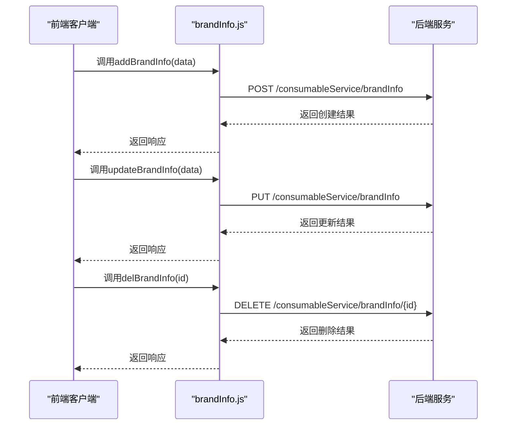
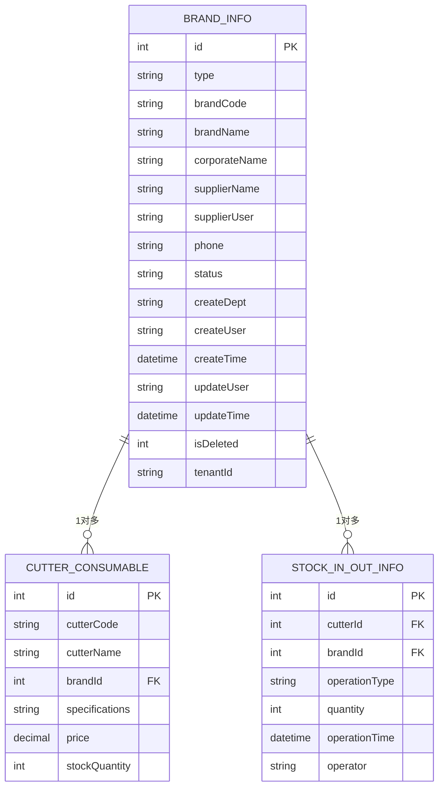
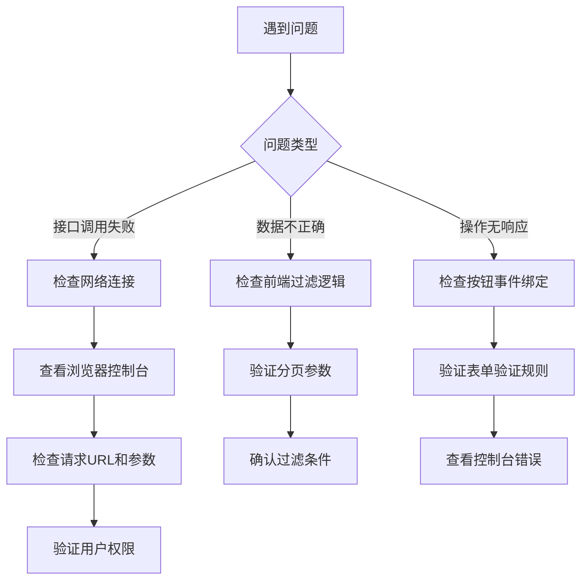

# 品牌管理接口

<cite>
**Referenced Files in This Document**   
- [brandInfo.js](file://daoju/src/api/consumableService/brandInfo.js)
- [CuttingToolBrand.vue](file://daoju/src/views/consumableService/brandInfo/CuttingToolBrand.vue)
- [ToolholderBrand.vue](file://daoju/src/views/consumableService/brandInfo/ToolholderBrand.vue)
- [index.vue](file://daoju/src/views/consumableService/brandInfo/index.vue)
- [errorCode.js](file://daoju/src/utils/errorCode.js)
</cite>

## 目录
1. [简介](#简介)
2. [核心CRUD操作](#核心crud操作)
3. [分页与过滤机制](#分页与过滤机制)
4. [数据结构与关联](#数据结构与关联)
5. [错误处理与调试](#错误处理与调试)

## 简介

品牌管理接口是刀具耗材管理系统中的核心模块之一，负责对刀具和刀柄品牌信息进行全生命周期的管理。该接口通过统一的API设计，支持对品牌信息的增删改查（CRUD）操作，为系统的库存管理、采购管理和设备管理提供基础数据支持。系统通过`brandInfo.js`文件定义了所有API接口，并在前端通过`CuttingToolBrand.vue`和`ToolholderBrand.vue`等组件进行调用和展示。

**Section sources**
- [brandInfo.js](file://daoju/src/api/consumableService/brandInfo.js#L1-L87)
- [index.vue](file://daoju/src/views/consumableService/brandInfo/index.vue#L1-L800)

## 核心CRUD操作

品牌管理接口提供了完整的增删改查功能，所有操作均通过RESTful风格的HTTP请求实现。接口定义在`brandInfo.js`文件中，通过封装的`request`方法与后端进行通信。

### 查询操作
查询操作支持多种方式，包括列表查询、详情查询和按编码查询。

```mermaid
flowchart TD
A[客户端] --> B[发起GET请求]
B --> C{请求路径}
C --> |/consumableService/brandInfo/list| D[获取品牌列表]
C --> |/consumableService/brandInfo/{id}| E[获取品牌详情]
C --> |/consumableService/brandInfo/code/{code}| F[按编码查询]
D --> G[返回分页数据]
E --> H[返回单个品牌]
F --> I[返回匹配品牌]
```

**Diagram sources**
- [brandInfo.js](file://daoju/src/api/consumableService/brandInfo.js#L4-L69)

**Section sources**
- [brandInfo.js](file://daoju/src/api/consumableService/brandInfo.js#L4-L69)

### 增删改操作
增删改操作通过POST、PUT和DELETE方法实现，支持单个和批量操作。



**Diagram sources**
- [brandInfo.js](file://daoju/src/api/consumableService/brandInfo.js#L20-L53)

**Section sources**
- [brandInfo.js](file://daoju/src/api/consumableService/brandInfo.js#L20-L53)

## 分页与过滤机制

品牌管理接口实现了完善的分页和过滤功能，支持用户高效地查找和管理品牌信息。

### 分页参数
接口使用标准的分页参数，允许客户端控制数据的分页显示：

- **pageNum**: 当前页码，从1开始，默认值为1
- **pageSize**: 每页显示数量，支持10、20、50、100等选项，默认值为10

前端组件通过`pagination`对象管理分页状态，当用户切换页码或调整每页数量时，会自动更新`current`和`size`属性并重新请求数据。

### 过滤条件
系统支持多种过滤条件，实现精准查询：

- **品牌名称**: 支持模糊匹配，不区分大小写
- **品牌编码**: 支持模糊匹配，用于精确查找特定品牌
- **公司名称**: 支持模糊匹配，便于按供应商公司筛选
- **供应商名称**: 精确匹配，从预设列表中选择
- **业务状态**: 精确匹配，支持"启用"和"禁用"状态筛选
- **创建人**: 支持模糊匹配，便于追踪操作人员
- **创建时间**: 支持时间范围筛选，精确到天

过滤条件通过`queryParams`对象传递给后端，前端在用户提交搜索表单时，会将`formInline`中的条件复制到`queryParams`中，并触发数据刷新。

```mermaid
flowchart TD
A[用户输入搜索条件] --> B[复制到queryParams]
B --> C[设置分页为第一页]
C --> D[调用getList()]
D --> E[前端过滤数据]
E --> F[应用品牌类型筛选]
F --> G[应用其他过滤条件]
G --> H[分页处理]
H --> I[更新表格显示]
```

**Diagram sources**
- [index.vue](file://daoju/src/views/consumableService/brandInfo/index.vue#L628-L688)
- [CuttingToolBrand.vue](file://daoju/src/views/consumableService/brandInfo/CuttingToolBrand.vue#L574-L636)

**Section sources**
- [index.vue](file://daoju/src/views/consumableService/brandInfo/index.vue#L628-L688)
- [CuttingToolBrand.vue](file://daoju/src/views/consumableService/brandInfo/CuttingToolBrand.vue#L574-L636)

## 数据结构与关联

品牌管理接口处理的数据结构包含了品牌的核心信息和管理属性，与系统的其他模块有着紧密的关联。

### 请求参数格式
新增和修改品牌时，需要提供完整的品牌信息对象：

```javascript
{
  type: 'cuttingTool', // 品牌类型：cuttingTool(刀具)或toolholder(刀柄)
  brandCode: 'CT001', // 品牌编码
  brandName: '山特维克', // 品牌名称
  corporateName: '山特维克集团', // 公司名称
  supplierName: '北京山特维克工具有限公司', // 供应商名称
  supplierUser: '陈经理', // 供应商联系人
  phone: '010-87654321', // 联系方式
  status: 'active', // 业务状态：active(启用)或inactive(禁用)
  createDept: '采购部', // 创建部门
  createUser: '张三', // 创建人
  isDeleted: 0 // 删除状态：0(正常)或1(已删除)
}
```

### 响应数据结构
查询接口返回的品牌信息包含完整的业务数据：

```javascript
{
  id: 1, // 品牌ID
  type: 'toolholder', // 品牌类型
  brandCode: 'TH001', // 品牌编码
  brandName: '三菱刀柄', // 品牌名称
  corporateName: '三菱材料株式会社', // 公司名称
  supplierName: '上海三菱工具有限公司', // 供应商名称
  supplierUser: '李经理', // 供应商联系人
  phone: '021-12345678', // 联系方式
  status: 'active', // 业务状态
  createDept: '采购部', // 创建部门
  createUser: '张采购', // 创建人
  createTime: '2024-12-20 09:00:00', // 创建时间
  updateUser: '王主管', // 更新人
  updateTime: '2024-12-25 14:30:00', // 更新时间
  isDeleted: 0, // 删除状态
  tenantId: 'T001' // 租户ID
}
```

### 系统关联
品牌管理模块与系统的多个功能模块存在数据关联：

- **刀具耗材管理**: 品牌信息是刀具耗材的基础属性，所有刀具都必须关联一个品牌
- **库存信息管理**: 库存记录中的刀具信息包含品牌字段，用于统计不同品牌的库存情况
- **采购管理**: 采购订单中的刀具信息需要引用品牌数据，确保采购的刀具品牌正确
- **供应商管理**: 品牌信息中的供应商字段与供应商管理模块关联，便于维护供应商信息



**Diagram sources**
- [brandInfo.js](file://daoju/src/api/consumableService/brandInfo.js#L1-L87)
- [CuttingToolBrand.vue](file://daoju/src/views/consumableService/brandInfo/CuttingToolBrand.vue#L534-L571)

**Section sources**
- [brandInfo.js](file://daoju/src/api/consumableService/brandInfo.js#L1-L87)
- [CuttingToolBrand.vue](file://daoju/src/views/consumableService/brandInfo/CuttingToolBrand.vue#L534-L571)

## 错误处理与调试

系统实现了完善的错误处理机制，帮助用户快速定位和解决问题。

### 常见错误码
当API请求出现异常时，系统会返回相应的错误码和提示信息：

- **400**: 请求参数错误，如必填字段缺失或格式不正确
- **401**: 认证失败，无法访问系统资源
- **403**: 当前操作没有权限
- **404**: 访问的资源不存在
- **409**: 品牌重复，尝试添加已存在的品牌
- **500**: 服务器内部错误

前端通过`ElMessage`组件展示错误信息，提升用户体验。

### 调试技巧
以下是常见的调试建议：

1. **参数缺失检查**: 确保新增品牌时所有必填字段都已填写，特别是品牌编码、品牌名称、公司名称等关键字段
2. **品牌重复处理**: 在添加新品牌前，先通过列表查询或按编码查询确认品牌是否已存在
3. **网络请求监控**: 使用浏览器开发者工具的Network面板，检查API请求的URL、方法、参数和响应
4. **权限验证**: 确认当前用户具有品牌管理的相应权限，避免出现403错误
5. **数据格式验证**: 确保提交的数据格式正确，特别是日期格式和数字类型



**Diagram sources**
- [errorCode.js](file://daoju/src/utils/errorCode.js#L1-L6)
- [CuttingToolBrand.vue](file://daoju/src/views/consumableService/brandInfo/CuttingToolBrand.vue#L631-L635)

**Section sources**
- [errorCode.js](file://daoju/src/utils/errorCode.js#L1-L6)
- [CuttingToolBrand.vue](file://daoju/src/views/consumableService/brandInfo/CuttingToolBrand.vue#L631-L635)