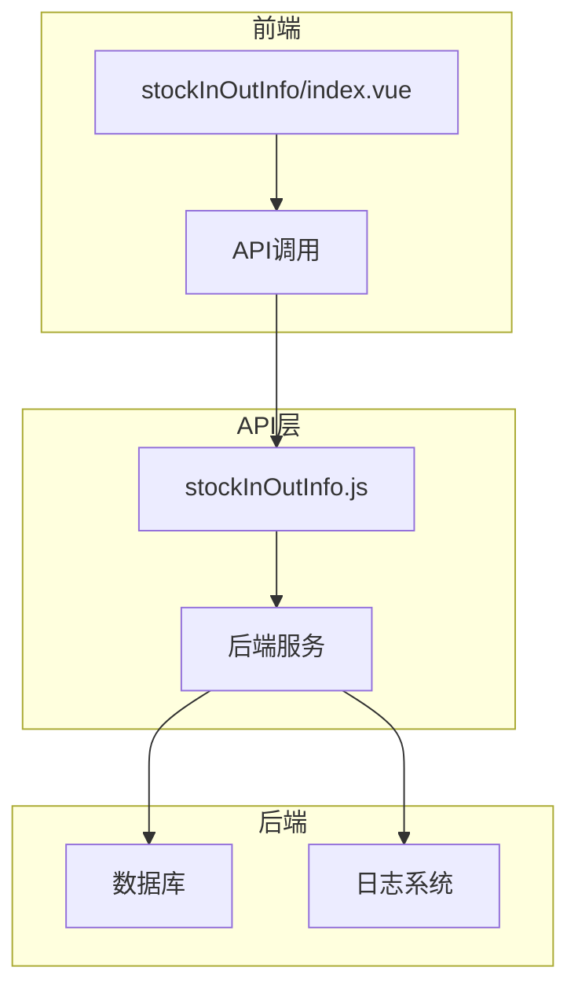
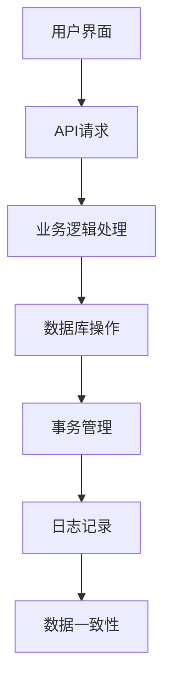
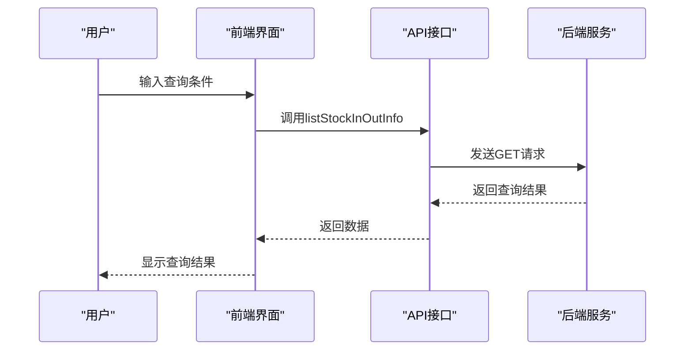
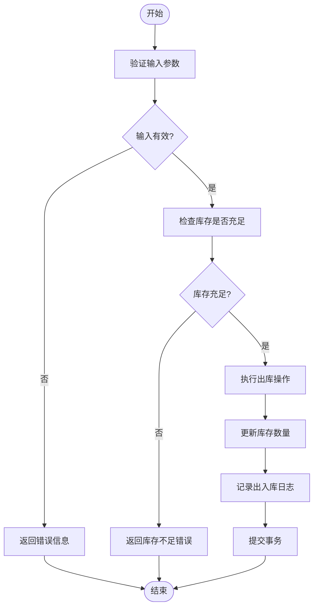
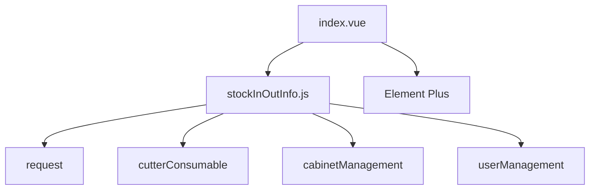

# 库存出入库接口

<cite>
**本文档引用文件**  
- [stockInOutInfo.js](file://daoju\src\api\consumableService\stockInOutInfo.js)
- [index.vue](file://daoju\src\views\consumableService\stockInOutInfo\index.vue)
- [stockRecord.js](file://daoju\src\api\historyRecord\stockRecord.js)
- [cutterConsumable\index.vue](file://daoju\src\views\consumableService\cutterConsumable\index.vue)
- [stockRecord\index.vue](file://daoju\src\views\historyRecord\stockRecord\index.vue)
</cite>

## 目录
1. [简介](#简介)
2. [项目结构](#项目结构)
3. [核心组件](#核心组件)
4. [架构概述](#架构概述)
5. [详细组件分析](#详细组件分析)
6. [依赖分析](#依赖分析)
7. [性能考虑](#性能考虑)
8. [故障排除指南](#故障排除指南)
9. [结论](#结论)

## 简介
本文档详细描述了库存管理系统中出入库信息接口的技术实现，重点围绕 `stockInOutInfo.js` 文件中的定义展开。文档涵盖出入库记录的新增、查询和统计接口，包括请求参数（如操作类型、时间范围、操作人）、分页机制和返回数据结构（包含操作时间、数量、前后库存量等）。同时提供典型业务流程示例，如一次耗材领用操作触发的出入库流水生成逻辑。解释数据一致性保障机制，如事务性操作或日志追踪。文档化高性能查询建议（如索引字段、时间范围优化），并列出常见问题（如重复提交、库存不足）的解决方案。

## 项目结构
库存出入库信息接口主要位于 `daoju/src/api/consumableService/` 目录下，核心文件为 `stockInOutInfo.js`，负责定义所有与出入库相关的API接口。前端视图位于 `daoju/src/views/consumableService/stockInOutInfo/index.vue`，提供用户界面用于查询和管理出入库记录。相关统计和历史记录功能则分布在 `historyRecord` 模块中。

**图表来源**  
- [stockInOutInfo.js](file://daoju\src\api\consumableService\stockInOutInfo.js)
- [index.vue](file://daoju\src\views\consumableService\stockInOutInfo\index.vue)

**章节来源**  
- [stockInOutInfo.js](file://daoju\src\api\consumableService\stockInOutInfo.js)
- [index.vue](file://daoju\src\views\consumableService\stockInOutInfo\index.vue)

## 核心组件
`stockInOutInfo.js` 文件定义了出入库信息的核心API接口，包括查询列表、获取详情、上传图片、导出数据等功能。`index.vue` 文件实现了前端用户界面，支持多条件查询、分页显示和详情查看。`cutterConsumable/index.vue` 文件中包含了耗材管理的出库逻辑，与出入库接口紧密关联。

**章节来源**  
- [stockInOutInfo.js](file://daoju\src\api\consumableService\stockInOutInfo.js)
- [index.vue](file://daoju\src\views\consumableService\stockInOutInfo\index.vue)
- [cutterConsumable\index.vue](file://daoju\src\views\consumableService\cutterConsumable\index.vue)

## 架构概述
系统采用前后端分离架构，前端通过API调用与后端交互。出入库信息的增删改查操作通过RESTful API实现，前端使用Vue.js框架构建用户界面，后端提供数据服务。数据一致性通过事务性操作和日志追踪保障。

**图表来源**  
- [stockInOutInfo.js](file://daoju\src\api\consumableService\stockInOutInfo.js)
- [stockRecord.js](file://daoju\src\api\historyRecord\stockRecord.js)

## 详细组件分析

### 出入库信息查询分析
出入库信息查询功能支持多条件筛选，包括耗材主键、品牌名称、刀具型号、操作类型、操作人、工厂名称、车间名称和创建时间范围。查询结果支持分页显示，每页可显示10、20、50或100条记录。

#### 对于API/服务组件：

**图表来源**  
- [stockInOutInfo.js](file://daoju\src\api\consumableService\stockInOutInfo.js)
- [index.vue](file://daoju\src\views\consumableService\stockInOutInfo\index.vue)

**章节来源**  
- [stockInOutInfo.js](file://daoju\src\api\consumableService\stockInOutInfo.js)
- [index.vue](file://daoju\src\views\consumableService\stockInOutInfo\index.vue)

### 出入库记录新增分析
出入库记录的新增操作通常由耗材领用、归还等业务流程触发。系统通过事务性操作确保数据一致性，记录操作前后的库存变化，并生成相应的出入库流水。

#### 对于复杂逻辑组件：

**图表来源**  
- [cutterConsumable\index.vue](file://daoju\src\views\consumableService\cutterConsumable\index.vue)
- [stockInOutInfo.js](file://daoju\src\api\consumableService\stockInOutInfo.js)

**章节来源**  
- [cutterConsumable\index.vue](file://daoju\src\views\consumableService\cutterConsumable\index.vue)
- [stockInOutInfo.js](file://daoju\src\api\consumableService\stockInOutInfo.js)

## 依赖分析
出入库信息接口依赖于耗材管理、刀具柜管理、用户管理等多个模块。前端界面依赖于Element Plus组件库，API调用依赖于`request`工具。系统通过模块化设计降低耦合度，提高可维护性。

**图表来源**  
- [stockInOutInfo.js](file://daoju\src\api\consumableService\stockInOutInfo.js)
- [index.vue](file://daoju\src\views\consumableService\stockInOutInfo\index.vue)

**章节来源**  
- [stockInOutInfo.js](file://daoju\src\api\consumableService\stockInOutInfo.js)
- [index.vue](file://daoju\src\views\consumableService\stockInOutInfo\index.vue)

## 性能考虑
为提高查询性能，建议在数据库中对常用查询字段（如操作时间、操作类型、耗材主键等）建立索引。对于大数据量的导出操作，建议使用分页查询和异步处理机制，避免长时间阻塞。

## 故障排除指南
常见问题包括重复提交、库存不足、网络超时等。解决方案包括前端增加提交按钮禁用机制、库存检查前置、增加网络请求重试机制等。对于数据不一致问题，可通过日志追踪和事务回滚机制进行排查和修复。

**章节来源**  
- [cutterConsumable\index.vue](file://daoju\src\views\consumableService\cutterConsumable\index.vue)
- [stockInOutInfo.js](file://daoju\src\api\consumableService\stockInOutInfo.js)

## 结论
库存出入库信息接口设计合理，功能完整，能够满足日常业务需求。通过事务性操作和日志追踪保障了数据一致性，通过索引优化和分页机制提高了查询性能。建议在实际使用中注意库存检查和重复提交问题，确保系统稳定运行。