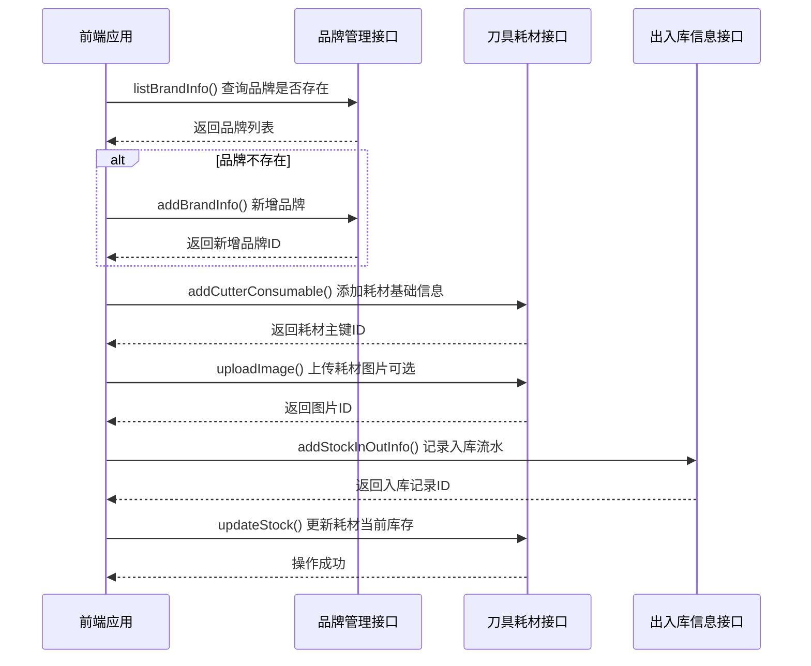

# 耗材服务接口

<cite>
**本文档引用文件**  
- [brandInfo.js](file://daoju\src\api\consumableService\brandInfo.js)
- [cutterConsumable.js](file://daoju\src\api\consumableService\cutterConsumable.js)
- [stockInOutInfo.js](file://daoju\src\api\consumableService\stockInOutInfo.js)
</cite>

## 目录
1. [简介](#简介)
2. [品牌管理接口](#品牌管理接口)
3. [刀具耗材接口](#刀具耗材接口)
4. [出入库信息接口](#出入库信息接口)
5. [典型业务流程示例](#典型业务流程示例)
6. [分页与查询参数说明](#分页与查询参数说明)
7. [性能优化建议](#性能优化建议)

## 简介
本文档全面说明耗材服务模块中的核心接口，涵盖品牌管理、刀具耗材信息维护及出入库流水记录三大功能模块。详细描述各接口的请求方式、参数结构、响应模式及使用场景，为系统集成与二次开发提供完整的技术参考。

**Section sources**
- [brandInfo.js](file://daoju\src\api\consumableService\brandInfo.js#L1-L87)
- [cutterConsumable.js](file://daoju\src\api\consumableService\cutterConsumable.js#L1-L158)
- [stockInOutInfo.js](file://daoju\src\api\consumableService\stockInOutInfo.js#L1-L80)

## 品牌管理接口
提供品牌信息的增删改查、批量操作及数据导出功能，支持按品牌编码精确查询，并可获取关联的供应商与公司列表。

### 查询品牌信息列表
**接口路径**: `GET /consumableService/brandInfo/list`  
**功能说明**: 分页查询品牌信息列表，支持多条件过滤。  
**请求参数**: query对象包含分页及筛选条件。  
**响应格式**: 返回分页的品牌信息集合。

### 查询品牌详情
**接口路径**: `GET /consumableService/brandInfo/{id}`  
**功能说明**: 根据主键ID获取品牌详细信息。

### 新增品牌信息
**接口路径**: `POST /consumableService/brandInfo`  
**功能说明**: 创建新的品牌记录。  
**请求体**: 品牌信息数据对象。

### 修改品牌信息
**接口路径**: `PUT /consumableService/brandInfo`  
**功能说明**: 更新现有品牌信息。  
**请求体**: 包含ID的完整品牌数据对象。

### 删除品牌信息
**接口路径**: `DELETE /consumableService/brandInfo/{id}`  
**功能说明**: 根据ID删除指定品牌。

### 批量删除品牌信息
**接口路径**: `DELETE /consumableService/brandInfo/batch`  
**功能说明**: 批量删除多个品牌记录。  
**请求体**: ID数组。

### 导出品牌信息
**接口路径**: `GET /consumableService/brandInfo/export`  
**功能说明**: 导出符合条件的品牌数据为文件。

### 根据品牌编码查询
**接口路径**: `GET /consumableService/brandInfo/code/{brandCode}`  
**功能说明**: 通过品牌编码精确查询品牌信息。

### 获取供应商列表
**接口路径**: `GET /consumableService/brandInfo/suppliers`  
**功能说明**: 获取所有供应商名称列表，用于下拉选择。

### 获取公司列表
**接口路径**: `GET /consumableService/brandInfo/corporates`  
**功能说明**: 获取所有公司名称列表，用于数据关联。

**Section sources**
- [brandInfo.js](file://daoju\src\api\consumableService\brandInfo.js#L3-L87)

## 刀具耗材接口
实现刀具耗材全生命周期管理，包括基础信息维护、库存变动、图片管理及统计分析等功能。

### 查询刀具耗材列表
**接口路径**: `GET /consumableService/cutterConsumable/list`  
**功能说明**: 分页查询刀具耗材列表，支持多维度筛选。

### 查询刀具耗材详情
**接口路径**: `GET /consumableService/cutterConsumable/{id}`  
**功能说明**: 获取指定耗材的完整信息。

### 新增刀具耗材
**接口路径**: `POST /consumableService/cutterConsumable`  
**功能说明**: 添加新的刀具耗材记录。  
**请求体**: 耗材完整信息对象。

### 修改刀具耗材
**接口路径**: `PUT /consumableService/cutterConsumable`  
**功能说明**: 更新耗材信息。  
**请求体**: 包含ID的耗材数据对象。

### 删除刀具耗材
**接口路径**: `DELETE /consumableService/cutterConsumable/{id}`  
**功能说明**: 删除指定耗材记录。

### 批量删除刀具耗材
**接口路径**: `DELETE /consumableService/cutterConsumable/batch`  
**功能说明**: 批量删除多个耗材。  
**请求体**: ID数组。

### 导出刀具耗材
**接口路径**: `GET /consumableService/cutterConsumable/export`  
**功能说明**: 导出耗材数据。

### 批量导入刀具耗材
**接口路径**: `POST /consumableService/cutterConsumable/import`  
**功能说明**: 通过文件批量导入耗材数据。  
**请求体**: 表单数据，包含文件。

### 下载导入模板
**接口路径**: `GET /consumableService/cutterConsumable/template`  
**功能说明**: 下载标准导入模板文件。

### 获取关联数据列表
提供以下关联数据获取接口：
- **品牌列表**: `GET /consumableService/cutterConsumable/brands`
- **刀具柜列表**: `GET /consumableService/cutterConsumable/cabinets`
- **物料类型列表**: `GET /consumableService/cutterConsumable/materialTypes`
- **刀具类型列表**: `GET /consumableService/cutterConsumable/cutterTypes`

### 图片管理
- **上传图片**: `POST /consumableService/cutterConsumable/upload`（multipart/form-data）
- **删除图片**: `DELETE /consumableService/cutterConsumable/image/{imageId}`

### 库存管理
- **更新库存**: `PUT /consumableService/cutterConsumable/stock`  
  **功能说明**: 调整指定耗材的库存数量。
- **库存预警设置**: `PUT /consumableService/cutterConsumable/warning`  
  **功能说明**: 配置库存预警阈值。
- **获取库存统计**: `GET /consumableService/cutterConsumable/statistics`  
  **功能说明**: 获取库存汇总统计数据。

**Section sources**
- [cutterConsumable.js](file://daoju\src\api\consumableService\cutterConsumable.js#L3-L158)

## 出入库信息接口
管理耗材的出入库流水记录，支持按耗材主键查询、图片附件管理及操作类型获取。

### 查询出入库信息列表
**接口路径**: `GET /consumableService/stockInOutInfo/list`  
**功能说明**: 分页查询出入库流水记录。

### 查询出入库详情
**接口路径**: `GET /consumableService/stockInOutInfo/{id}`  
**功能说明**: 获取单条出入库记录的详细信息。

### 按耗材主键查询出入库记录
**接口路径**: `GET /consumableService/stockInOutInfo/cutter/{cutterId}`  
**功能说明**: 查询指定耗材的所有出入库历史。

### 图片管理
- **上传图片**: `POST /consumableService/stockInOutInfo/upload`（multipart/form-data）
- **删除图片**: `DELETE /consumableService/stockInOutInfo/image/{imageId}`

### 导出出入库信息
**接口路径**: `GET /consumableService/stockInOutInfo/export`  
**功能说明**: 导出出入库流水数据。

### 获取基础数据列表
- **操作类型列表**: `GET /consumableService/stockInOutInfo/stockTypes`（入库/出库）
- **工厂列表**: `GET /consumableService/stockInOutInfo/factories`
- **车间列表**: `GET /consumableService/stockInOutInfo/workshops`

**Section sources**
- [stockInOutInfo.js](file://daoju\src\api\consumableService\stockInOutInfo.js#L3-L80)

## 典型业务流程示例
### 新耗材入库多接口调用序列
当新增一种刀具耗材并完成入库时，需按以下顺序调用接口：

**Diagram sources**
- [brandInfo.js](file://daoju\src\api\consumableService\brandInfo.js#L4)
- [cutterConsumable.js](file://daoju\src\api\consumableService\cutterConsumable.js#L20)
- [stockInOutInfo.js](file://daoju\src\api\consumableService\stockInOutInfo.js#L4)

### 数据一致性保障机制
1. **事务性操作**: 关键业务流程（如入库）应在服务端使用数据库事务，确保耗材信息创建、库存更新、出入库记录写入三个操作的原子性。
2. **前端校验**: 在调用接口前进行数据完整性校验，如品牌存在性检查。
3. **状态同步**: 库存变更后立即调用`updateStock`接口，避免库存数据不一致。
4. **错误回滚**: 前端在调用序列中任一环节失败时，应提示用户并记录日志，必要时触发人工干预。

## 分页与查询参数说明
所有列表查询接口均遵循统一的分页查询规范：

### 分页参数
- **pageNum**: 当前页码（从1开始）
- **pageSize**: 每页记录数（通常为10, 20, 50, 100）

### 通用过滤条件
- **品牌名称**: 支持模糊匹配
- **刀具型号**: 支持模糊匹配
- **品牌编码**: 支持精确匹配
- **操作时间范围**: createTimeStart 与 createTimeEnd

### 排序规则
默认按创建时间倒序排列，可通过额外参数指定排序字段和方向。

**Section sources**
- [brandInfo.js](file://daoju\src\api\consumableService\brandInfo.js#L4)
- [cutterConsumable.js](file://daoju\src\api\consumableService\cutterConsumable.js#L4)
- [stockInOutInfo.js](file://daoju\src\api\consumableService\stockInOutInfo.js#L4)

## 性能优化建议
1. **合理设置分页大小**: 避免一次性获取过多数据，建议首次加载使用较小页码（如10-20条）。
2. **精准过滤**: 尽量使用精确查询条件（如品牌编码）替代模糊查询，减少数据集大小。
3. **懒加载**: 对于图片等大文件，采用懒加载策略，仅在需要时请求。
4. **缓存机制**: 
   - 将静态数据（如品牌列表、刀具类型）在前端缓存
   - 对频繁查询但变化不频繁的数据设置合理缓存时间
5. **批量操作**: 对于大量数据导入，使用`importCutterConsumable`接口而非逐条调用新增接口。
6. **避免重复请求**: 在用户连续操作时，对相同参数的查询进行去重处理。

**Section sources**
- [cutterConsumable.js](file://daoju\src\api\consumableService\cutterConsumable.js#L64)
- [brandInfo.js](file://daoju\src\api\consumableService\brandInfo.js#L55)
- [stockInOutInfo.js](file://daoju\src\api\consumableService\stockInOutInfo.js#L48)