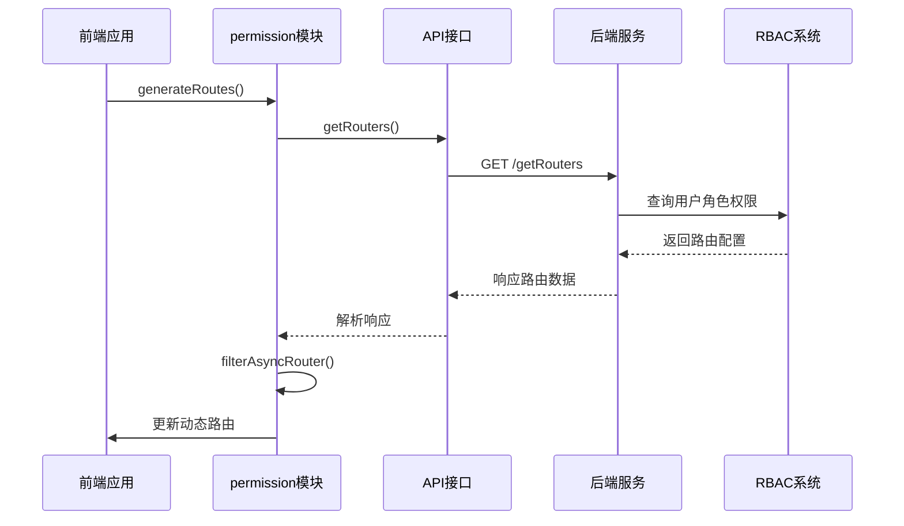
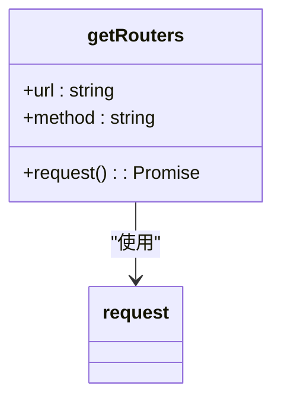
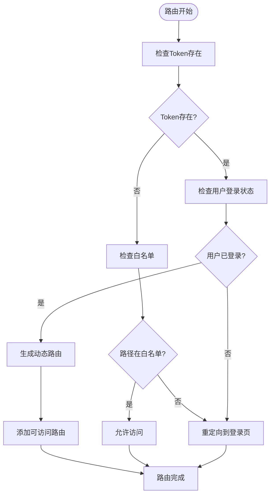
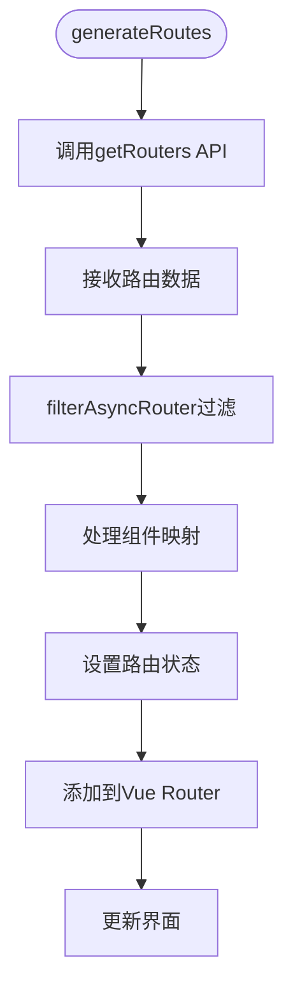
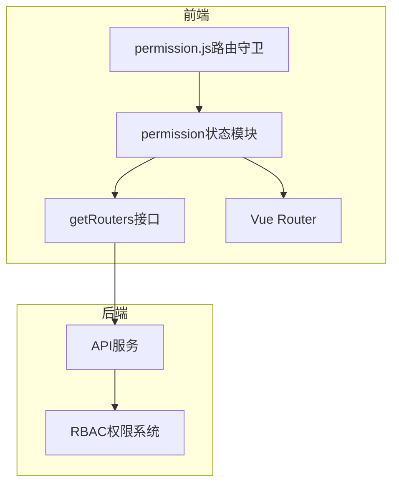

# 动态菜单接口

<cite>
**本文档引用的文件**   
- [menu.js](file://daoju\src\api\menu.js)
- [permission.js](file://daoju\src\store\modules\permission.js)
- [index.js](file://daoju\src\router\index.js)
- [permission.js](file://daoju\src\permission.js)
- [utils/permission.js](file://daoju\src\utils\permission.js)
</cite>

## 目录
1. [简介](#简介)
2. [核心组件](#核心组件)
3. [架构概述](#架构概述)
4. [详细组件分析](#详细组件分析)
5. [依赖分析](#依赖分析)
6. [性能考虑](#性能考虑)
7. [故障排除指南](#故障排除指南)
8. [结论](#结论)

## 简介
本文档详细说明了`getRouters`函数通过GET请求`/getRouters`端点获取当前用户权限范围内可访问路由列表的机制。该接口与后端RBAC权限系统集成，根据用户角色动态返回差异化的菜单结构数据，支撑前端动态路由生成。文档还解释了响应数据格式、权限控制实现方式以及如何与状态管理模块协同工作，以支持细粒度的菜单级权限管理。

## 核心组件

`getRouters`接口是动态菜单加载的核心，它通过调用后端API获取当前用户的可访问路由列表。该功能由`api/menu.js`中的`getRouters`函数实现，并在`store/modules/permission.js`中被调用以生成动态路由。此机制确保只有经过授权的用户才能看到相应的菜单项和路由。

**本节来源**
- [menu.js](file://daoju\src\api\menu.js#L3-L8)
- [permission.js](file://daoju\src\store\modules\permission.js#L38-L51)

## 架构概述

动态菜单加载机制涉及多个组件的协同工作：前端通过`getRouters`接口向后端请求路由数据，后端基于RBAC权限系统返回对应角色的路由配置，前端接收到数据后通过`filterAsyncRouter`等函数处理并生成动态路由，最终更新到Vue Router实例中。

**图表来源**
- [menu.js](file://daoju\src\api\menu.js#L3-L8)
- [permission.js](file://daoju\src\store\modules\permission.js#L38-L51)

## 详细组件分析

### getRouters接口分析

`getRouters`接口是动态菜单加载的起点，负责从后端获取当前用户的可访问路由列表。

#### 接口实现

**图表来源**
- [menu.js](file://daoju\src\api\menu.js#L3-L8)

#### 响应数据格式
接口返回的路由数据包含以下关键字段：
- `path`: 路由路径
- `name`: 路由名称
- `component`: 组件映射
- `meta`: 元信息（包含标题、图标等）
- `children`: 子路由列表

这些数据用于前端动态生成路由表和菜单结构。

**本节来源**
- [menu.js](file://daoju\src\api\menu.js#L3-L8)

### 权限控制分析

权限控制机制通过`permission.js`路由守卫实现，确保用户只能访问其权限范围内的路由。

#### 路由守卫流程

**图表来源**
- [permission.js](file://daoju\src\permission.js#L22-L86)

### 状态管理分析

`store/modules/permission.js`模块负责管理动态路由的状态，包括路由列表、侧边栏路由、顶部栏路由等。

#### 状态管理流程

**图表来源**
- [permission.js](file://daoju\src\store\modules\permission.js#L38-L51)

**本节来源**
- [permission.js](file://daoju\src\store\modules\permission.js#L1-L127)

## 依赖分析

动态菜单加载机制依赖于多个模块的协同工作，形成了一个完整的权限控制体系。

**图表来源**
- [menu.js](file://daoju\src\api\menu.js#L3-L8)
- [permission.js](file://daoju\src\store\modules\permission.js#L38-L51)
- [permission.js](file://daoju\src\permission.js#L22-L86)

**本节来源**
- [menu.js](file://daoju\src\api\menu.js#L3-L8)
- [permission.js](file://daoju\src\store\modules\permission.js#L1-L127)
- [permission.js](file://daoju\src\permission.js#L1-L105)

## 性能考虑

动态菜单加载机制在设计时考虑了性能优化，通过合理的数据处理和缓存策略确保快速响应。

- **路由懒加载**：使用`() => import()`语法实现组件的懒加载，减少初始加载时间
- **权限缓存**：用户权限信息存储在localStorage中，避免重复请求
- **路由过滤**：在客户端进行路由过滤，减少后端计算压力
- **状态管理**：使用Pinia进行状态管理，确保路由状态的一致性和可预测性

这些优化措施共同保证了动态菜单加载的高效性和响应速度。

## 故障排除指南

### 常见问题及解决方案

1. **菜单项不显示**
   - 检查用户角色和权限配置
   - 确认后端返回的路由数据是否正确
   - 检查前端路由过滤逻辑

2. **路由无法访问**
   - 验证用户是否具有相应权限
   - 检查`PAGE_PERMISSIONS`配置是否正确
   - 确认路由守卫逻辑是否正常执行

3. **动态路由未生效**
   - 检查`generateRoutes`是否被正确调用
   - 确认`router.addRoute`是否成功添加路由
   - 验证状态管理模块是否正确更新

**本节来源**
- [utils/permission.js](file://daoju\src\utils\permission.js#L157-L175)
- [permission.js](file://daoju\src\permission.js#L22-L86)

## 结论

动态菜单加载接口`getRouters`通过与后端RBAC权限系统的集成，实现了基于用户角色的差异化菜单展示。该机制通过前端路由守卫、状态管理模块和API接口的协同工作，支持细粒度的菜单级权限管理。系统能够根据用户权限动态返回路由配置，前端据此生成相应的菜单结构和路由表，确保了安全性与灵活性的平衡。这种设计不仅提高了系统的安全性，也为不同角色的用户提供了个性化的使用体验。