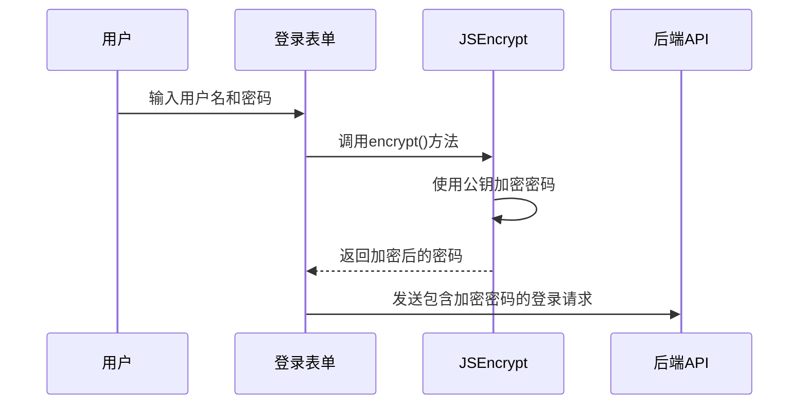
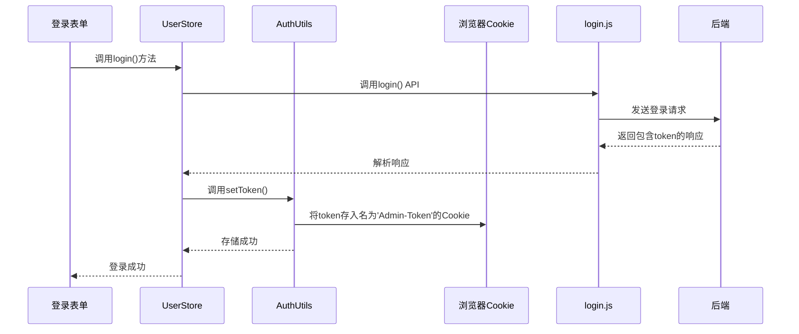
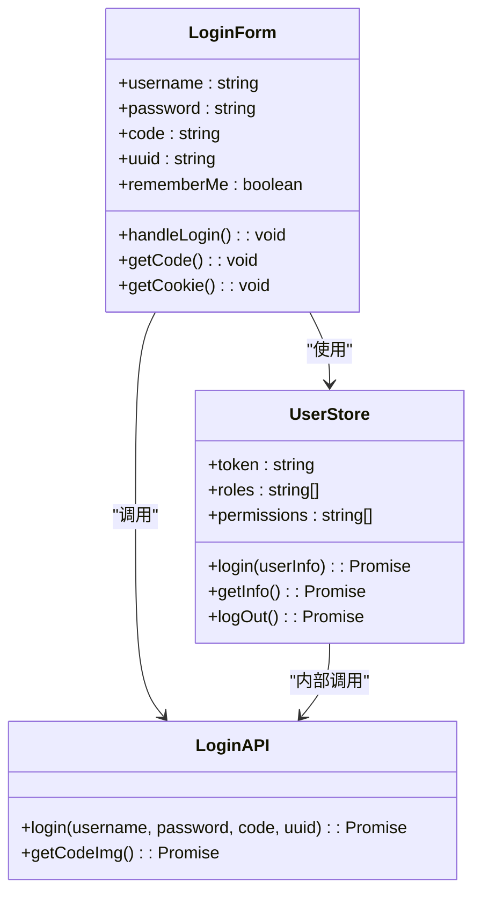

# 登录认证接口

<cite>
**Referenced Files in This Document**   
- [login.js](file://daoju\src\api\login.js)
- [request.js](file://daoju\src\utils\request.js)
- [jsencrypt.js](file://daoju\src\utils\jsencrypt.js)
- [user.js](file://daoju\src\store\modules\user.js)
- [login.vue](file://daoju\src\views\login.vue)
- [auth.js](file://daoju\src\utils\auth.js)
- [permission.js](file://daoju\src\permission.js)
- [validate.js](file://daoju\src\utils\validate.js)
- [errorCode.js](file://daoju\src\utils\errorCode.js)
</cite>

## 目录
1. [简介](#简介)
2. [API接口定义](#api接口定义)
3. [前端实现机制](#前端实现机制)
4. [安全上下文与JWT令牌管理](#安全上下文与jwt令牌管理)
5. [调用示例](#调用示例)
6. [错误处理策略](#错误处理策略)

## 简介
本文档详细阐述了刀具管理系统中的登录认证接口实现。该系统采用前后端分离架构，通过标准化的API接口实现用户身份验证。登录流程结合了RSA非对称加密、验证码校验和防重复提交等多重安全机制，确保用户凭证在传输过程中的安全性。系统使用JWT（JSON Web Token）作为身份认证令牌，实现了无状态的会话管理。

**Section sources**
- [login.js](file://daoju\src\api\login.js#L1-L60)
- [login.vue](file://daoju\src\views\login.vue#L1-L369)

## API接口定义

### 登录接口
登录接口是系统身份认证的核心，通过POST请求向服务器提交用户凭证。

| 属性 | 说明 |
| :--- | :--- |
| **请求URL** | `/login` |
| **请求方法** | `POST` |
| **是否需要Token** | `false` (通过自定义请求头`isToken: false`指定) |
| **防重复提交** | `false` (通过自定义请求头`repeatSubmit: false`指定) |

#### 请求参数
请求体（data）为JSON对象，包含以下字段：

| 参数名 | 类型 | 必填 | 说明 |
| :--- | :--- | :--- | :--- |
| `username` | string | 是 | 用户名 |
| `password` | string | 是 | 经过RSA+SHA256加密后的密码 |
| `code` | string | 是 | 验证码 |
| `uuid` | string | 是 | 验证码的唯一标识符 |

#### 响应数据结构
成功响应返回包含用户信息和JWT令牌的JSON对象。

| 字段 | 类型 | 说明 |
| :--- | :--- | :--- |
| `code` | number | 响应状态码 (200表示成功) |
| `msg` | string | 响应消息 |
| `token` | string | JWT认证令牌 |
| `user` | object | 用户详细信息对象 |

**Section sources**
- [login.js](file://daoju\src\api\login.js#L4-L19)

## 前端实现机制

### 密码加密传输
系统采用RSA非对称加密算法保护密码在传输过程中的安全。前端使用`jsencrypt.js`工具对用户输入的密码进行加密。



**Diagram sources**
- [jsencrypt.js](file://daoju\src\utils\jsencrypt.js#L17-L22)
- [login.js](file://daoju\src\api\login.js#L4-L19)

### 验证码校验流程
验证码机制用于防止自动化脚本的暴力破解攻击。流程如下：

1.  用户访问登录页面时，前端自动调用`getCodeImg()` API获取验证码图片和UUID。
2.  用户在输入验证码后，该验证码和对应的UUID将与用户名、密码一同提交。
3.  后端根据UUID查找对应的验证码进行比对。

```mermaid
flowchart TD
A[用户访问登录页] --> B[前端调用getCodeImg()]
B --> C[后端生成验证码图片和UUID]
C --> D[前端显示验证码图片]
D --> E[用户输入验证码]
E --> F[用户提交登录表单]
F --> G[后端根据UUID校验验证码]
G --> H{验证码正确?}
H --> |是| I[继续身份认证]
H --> |否| J[返回错误信息]
```

**Diagram sources**
- [login.vue](file://daoju\src\views\login.vue#L277-L284)
- [login.js](file://daoju\src\api\login.js#L50-L59)

### 防重复提交机制
为防止用户因网络延迟而重复点击登录按钮导致的重复请求，系统在`request.js`中实现了防重复提交逻辑。

```mermaid
flowchart TD
A[用户点击登录] --> B[前端发起POST/PUT请求]
B --> C{请求头repeatSubmit为false?}
C --> |是| D[计算请求数据的唯一标识]
D --> E[检查session中是否存在相同标识]
E --> F{存在且时间间隔<1秒?}
F --> |是| G[拒绝请求, 提示"数据正在处理，请勿重复提交"]
F --> |否| H[将请求标识存入session]
H --> I[发送请求]
C --> |否| I
```

**Diagram sources**
- [request.js](file://daoju\src\utils\request.js#L39-L67)

**Section sources**
- [request.js](file://daoju\src\utils\request.js#L23-L68)

## 安全上下文与JWT令牌管理

### JWT令牌的获取与存储
用户成功登录后，后端会签发一个JWT令牌。前端通过`store/modules/user.js`中的Vuex store来管理用户状态。



**Diagram sources**
- [user.js](file://daoju\src\store\modules\user.js#L27-L36)
- [auth.js](file://daoju\src\utils\auth.js#L9-L11)

### JWT令牌的失效机制
系统的令牌失效机制由前端路由守卫和响应拦截器共同维护。

```mermaid
graph TB
A[用户访问受保护页面] --> B{路由守卫}
B --> C{存在Token?}
C --> |否| D[重定向到登录页]
C --> |是| E[继续访问]
F[后端返回401] --> G{响应拦截器}
G --> H[弹出重新登录提示]
H --> I[调用logOut()方法]
I --> J[清除Cookie中的Token]
J --> K[重定向到登录页]
```

**Diagram sources**
- [permission.js](file://daoju\src\permission.js#L22-L87)
- [request.js](file://daoju\src\utils\request.js#L84-L97)
- [user.js](file://daoju\src\store\modules\user.js#L76-L88)

**Section sources**
- [permission.js](file://daoju\src\permission.js#L1-L105)
- [request.js](file://daoju\src\utils\request.js#L74-L97)
- [auth.js](file://daoju\src\utils\auth.js#L13-L15)

## 调用示例

### 在Vue组件中集成登录API
以下是在`login.vue`组件中集成登录功能的简化示例：



**Diagram sources**
- [login.vue](file://daoju\src\views\login.vue#L113-L215)
- [user.js](file://daoju\src\store\modules\user.js#L8-L92)
- [login.js](file://daoju\src\api\login.js#L4-L19)

## 错误处理策略

### 响应状态码处理
前端通过`request.js`中的响应拦截器统一处理各类错误。

| 状态码 | 处理方式 |
| :--- | :--- |
| **401 (未授权)** | 弹出重新登录对话框，清除用户状态，重定向到登录页。 |
| **500 (服务器错误)** | 显示错误消息"系统接口异常"。 |
| **601 (警告)** | 显示警告消息。 |
| **其他非200状态码** | 显示通用错误通知。 |
| **网络错误** | 显示"后端接口连接异常"。 |
| **请求超时** | 显示"系统接口请求超时"。 |

**Section sources**
- [request.js](file://daoju\src\utils\request.js#L74-L122)
- [errorCode.js](file://daoju\src\utils\errorCode.js#L1-L7)