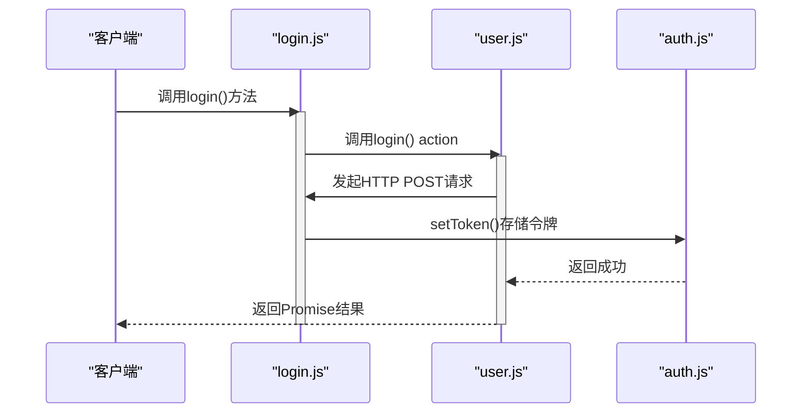
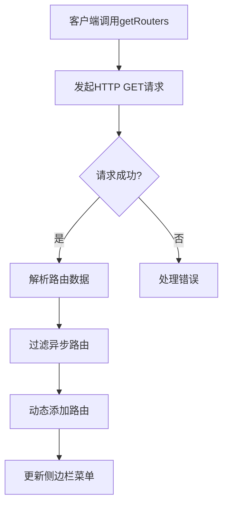
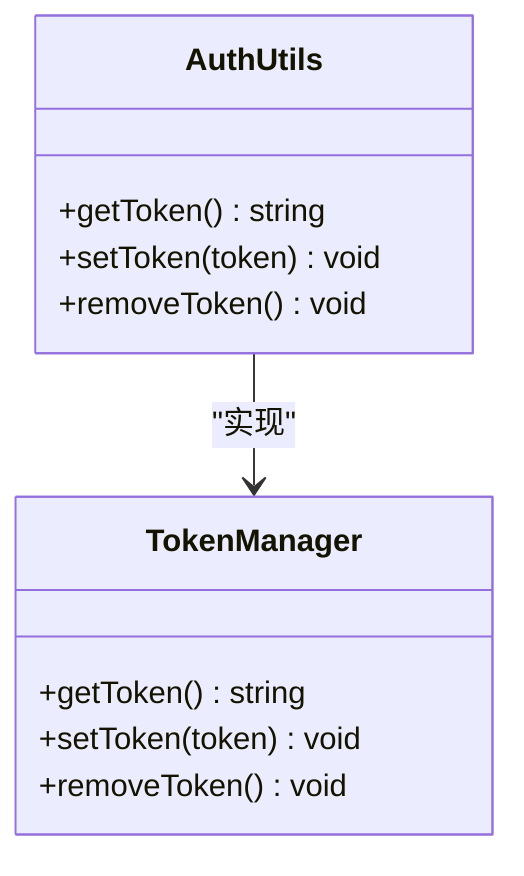
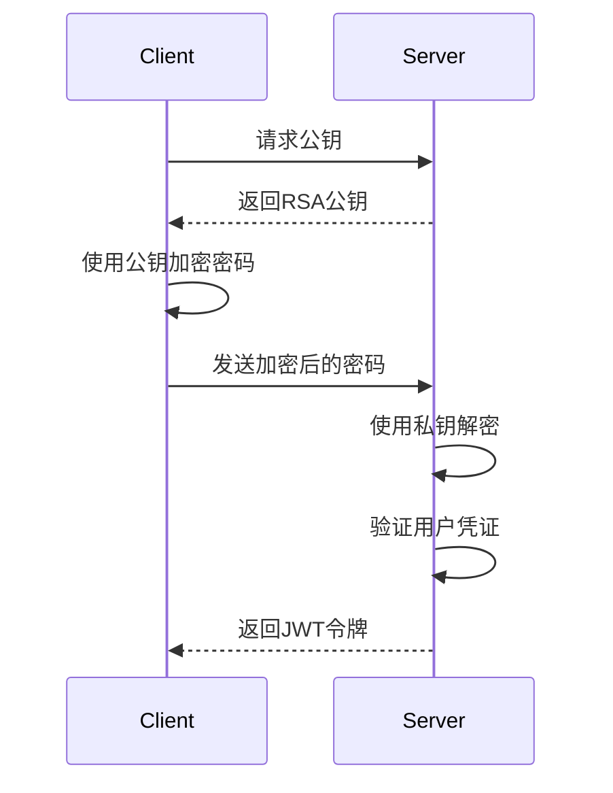

# 认证与菜单接口

<cite>
**Referenced Files in This Document**  
- [login.js](file://daoju\src\api\login.js)
- [menu.js](file://daoju\src\api\menu.js)
- [jsencrypt.js](file://daoju\src\utils\jsencrypt.js)
- [user.js](file://daoju\src\store\modules\user.js)
- [permission.js](file://daoju\store\modules\permission.js)
- [router/index.js](file://daoju\src\router\index.js)
- [auth.js](file://daoju\src\utils\auth.js)
- [permission.js](file://daoju\src\permission.js)
</cite>

## 目录
1. [简介](#简介)
2. [认证接口](#认证接口)
3. [菜单接口](#菜单接口)
4. [会话与令牌管理](#会话与令牌管理)
5. [前端集成示例](#前端集成示例)
6. [安全策略](#安全策略)

## 简介
本文档详细描述了刀具管理系统中的用户认证与动态菜单加载机制。系统采用前后端分离架构，通过JWT令牌实现无状态认证，并基于用户角色动态生成菜单路由。登录接口采用RSA非对称加密保护用户密码，确保传输安全。菜单接口根据用户权限返回差异化的路由配置，实现细粒度的访问控制。

**Section sources**
- [login.js](file://daoju\src\api\login.js)
- [menu.js](file://daoju\src\api\menu.js)

## 认证接口

### 用户登录流程
用户登录接口通过`/login`端点处理认证请求。客户端在提交用户名和密码前，需先获取验证码并使用RSA公钥对密码进行加密。



**Diagram sources**
- [login.js](file://daoju\src\api\login.js#L4-L20)
- [user.js](file://daoju\src\store\modules\user.js#L21-L37)

### 接口参数
| 参数 | 类型 | 必需 | 描述 |
|------|------|------|------|
| username | string | 是 | 用户名 |
| password | string | 是 | RSA加密后的密码 |
| code | string | 是 | 验证码 |
| uuid | string | 是 | 验证码唯一标识 |

**Section sources**
- [login.js](file://daoju\src\api\login.js#L4-L20)

## 菜单接口

### 动态菜单加载机制
菜单接口通过`/getRouters`端点获取用户的路由配置。系统根据用户角色和权限，从后端返回个性化的菜单结构。



**Diagram sources**
- [menu.js](file://daoju\src\api\menu.js#L4-L8)
- [permission.js](file://daoju\src\store\modules\permission.js#L35-L51)

### 路由生成流程
1. 调用`getRouters()` API获取原始路由数据
2. 使用`filterAsyncRouter`函数处理路由组件映射
3. 通过`filterDynamicRoutes`验证路由权限
4. 调用`router.addRoute()`动态注册路由
5. 更新Vuex中的菜单状态

**Section sources**
- [permission.js](file://daoju\src\store\modules\permission.js#L35-L51)

## 会话与令牌管理

### JWT令牌管理
系统使用JWT（JSON Web Token）实现无状态会话管理。令牌通过HTTP-only Cookie存储，防止XSS攻击。



**Diagram sources**
- [auth.js](file://daoju\src\utils\auth.js#L5-L15)

### 会话生命周期
- **登录成功**: 服务器返回JWT令牌，客户端存储在Cookie中
- **请求认证**: 每个API请求自动携带令牌
- **令牌刷新**: 系统未实现自动刷新机制，依赖令牌有效期
- **退出登录**: 清除本地令牌并调用/logout接口

**Section sources**
- [auth.js](file://daoju\src\utils\auth.js)
- [user.js](file://daoju\src\store\modules\user.js#L75-L88)

## 前端集成示例

### 权限路由生成
前端通过Vuex store管理路由状态，实现权限路由的动态生成。

```mermaid
graph TB
subgraph "Vuex Store"
UserStore[User Module]
PermissionStore[Permission Module]
end
subgraph "Vue Router"
Router[Router Instance]
end
UserStore --> |dispatch| PermissionStore: generateRoutes
PermissionStore --> |API Call| Backend: getRouters
Backend --> |Response| PermissionStore: 路由数据
PermissionStore --> Router: addRoute()
Router --> |Render| UI: 动态菜单
```

**Diagram sources**
- [permission.js](file://daoju\src\store\modules\permission.js)
- [router/index.js](file://daoju\src\router\index.js)

### 路由守卫实现
系统通过Vue Router的全局前置守卫实现访问控制。

```javascript
// 伪代码示例
router.beforeEach((to, from, next) => {
  if (getToken()) {
    if (to.path === '/login') {
      next({ path: '/' })
    } else {
      const user = getCurrentUser()
      if (!user) {
        next('/login')
      } else {
        next()
      }
    }
  } else {
    if (isWhiteList(to.path)) {
      next()
    } else {
      next(`/login?redirect=${to.fullPath}`)
    }
  }
})
```

**Section sources**
- [permission.js](file://daoju\src\permission.js#L22-L86)

## 安全策略

### 密码加密传输
系统采用RSA非对称加密保护用户密码，确保传输过程中的安全性。



**Diagram sources**
- [jsencrypt.js](file://daoju\src\utils\jsencrypt.js)
- [login.js](file://daoju\src\api\login.js)

### 加密实现细节
- **公钥**: 用于客户端加密密码
- **私钥**: 服务器端解密密码
- **算法**: RSA 2048位
- **填充模式**: PKCS#1 v1.5

系统通过`jsencrypt.js`工具类封装加密解密逻辑，确保密码在传输过程中不被窃取。

**Section sources**
- [jsencrypt.js](file://daoju\src\utils\jsencrypt.js#L1-L31)