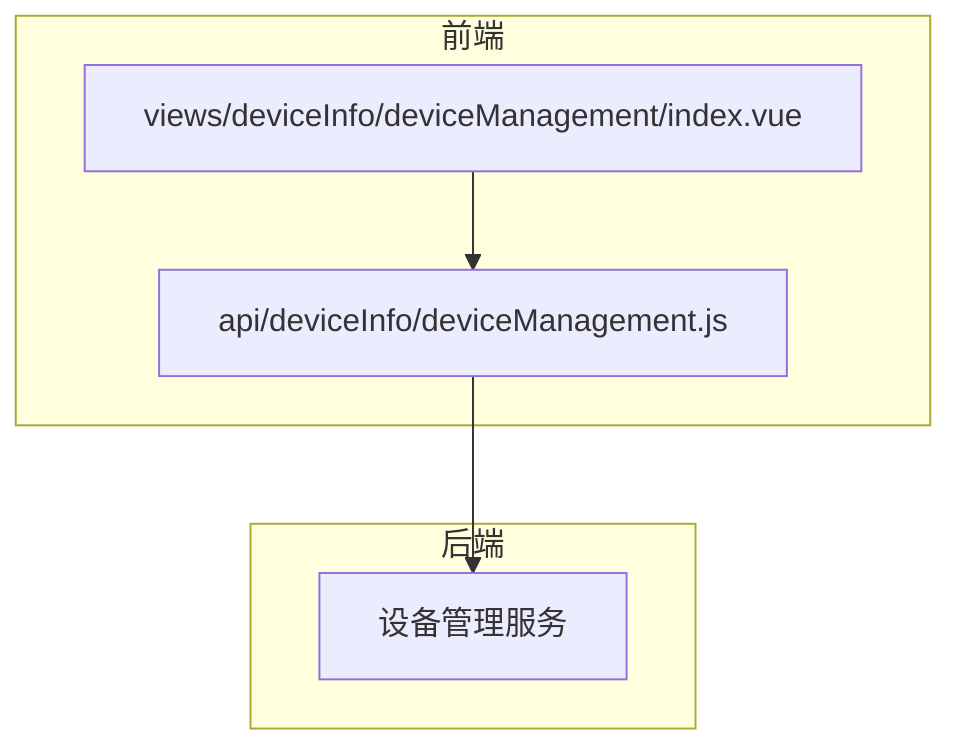
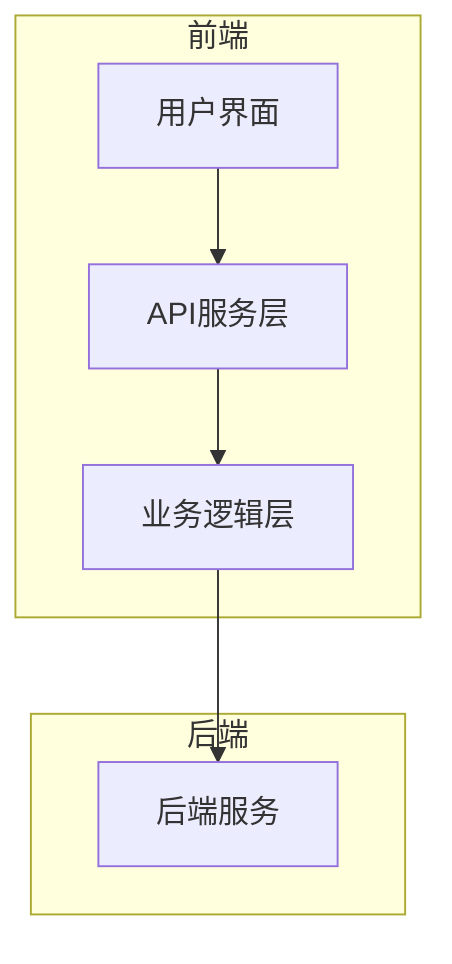
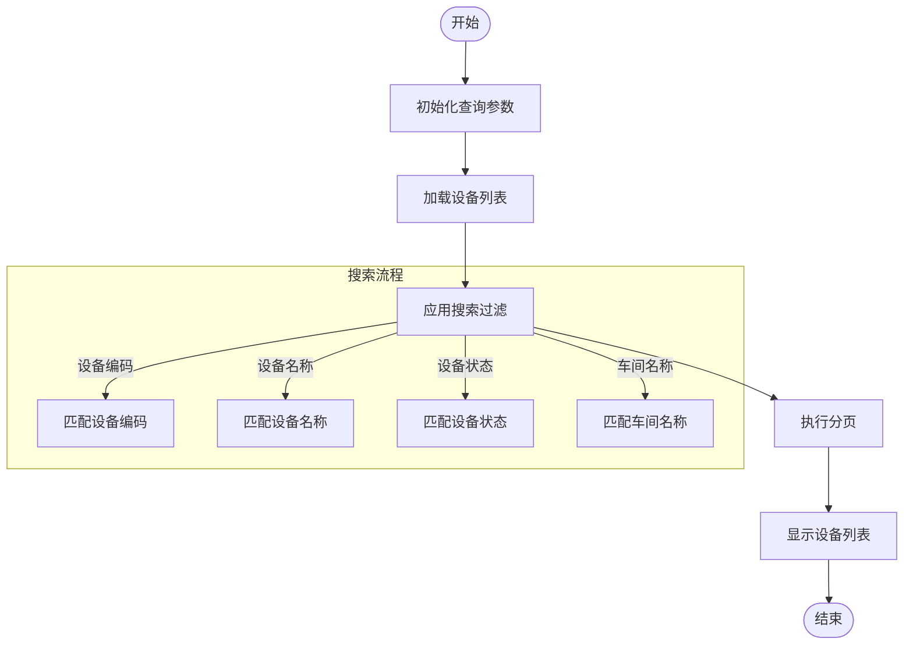
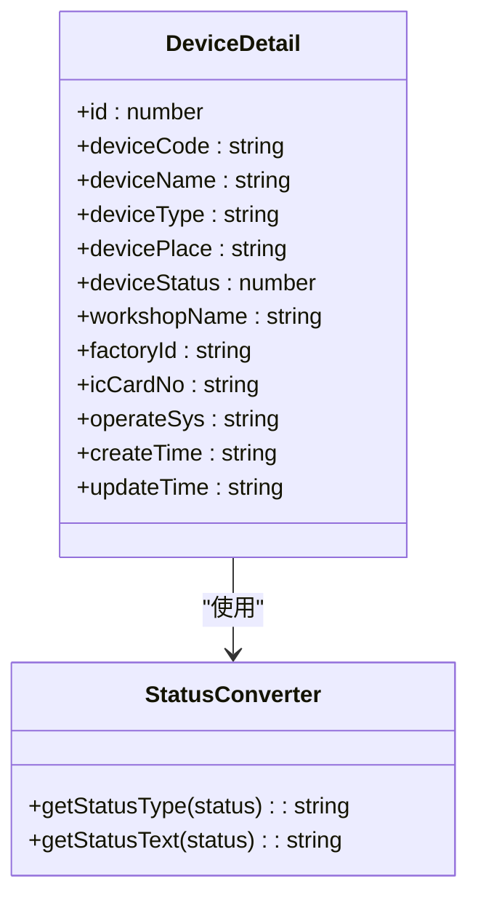
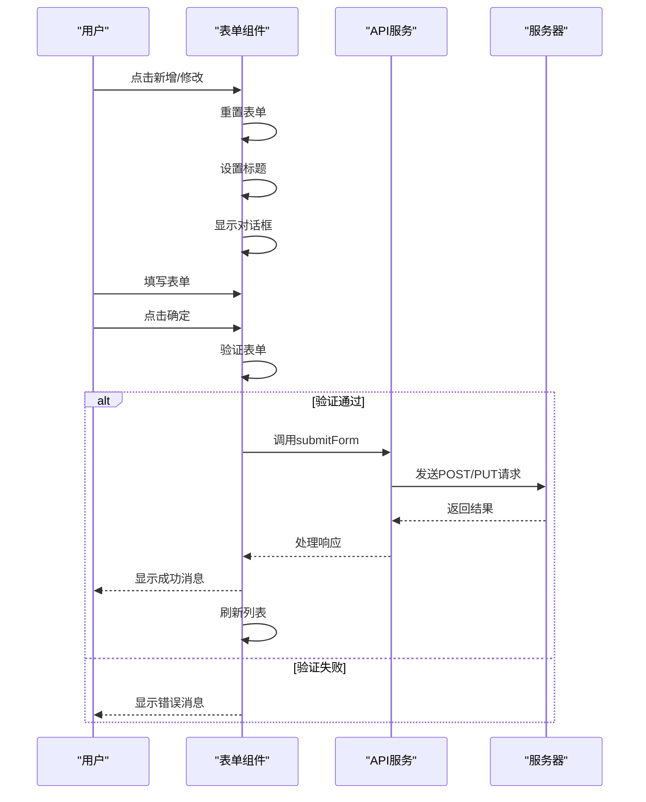
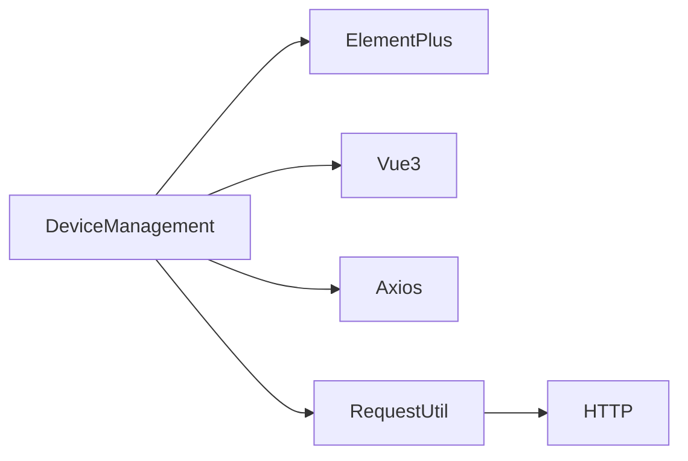

# 设备信息接口

<cite>
**本文档引用文件**  
- [deviceManagement.js](file://daoju\src\api\deviceInfo\deviceManagement.js)
- [index.vue](file://daoju\src\views\deviceInfo\deviceManagement\index.vue)
</cite>

## 目录
1. [简介](#简介)
2. [项目结构](#项目结构)
3. [核心组件](#核心组件)
4. [架构概述](#架构概述)
5. [详细组件分析](#详细组件分析)
6. [依赖分析](#依赖分析)
7. [性能考虑](#性能考虑)
8. [故障排除指南](#故障排除指南)
9. [结论](#结论)
10. [附录](#附录)（如有必要）

## 简介
本文档详细描述了刀具管理系统中设备管理模块的API接口，重点涵盖设备信息查询、状态监控和配置更新功能。系统支持多种设备类型，包括智能刀柜、RFID读写器等工业设备，并提供完整的设备生命周期管理能力。文档说明了设备列表展示、详情查看、分页加载、搜索过滤和实时状态刷新的实现方式，同时涵盖了设备注册流程和权限校验机制，为开发人员和系统管理员提供全面的技术参考。

## 项目结构
设备管理模块采用前后端分离架构，前端位于`daoju/src/views/deviceInfo/deviceManagement/`目录下，包含视图组件和业务逻辑，后端API接口定义在`daoju/src/api/deviceInfo/`目录中。模块通过标准化RESTful接口与后端服务通信，实现了设备信息的增删改查、状态监控和配置管理功能。系统采用Vue3组合式API和Element Plus组件库构建用户界面，确保了良好的用户体验和可维护性。

**图示来源**  
- [index.vue](file://daoju\src\views\deviceInfo\deviceManagement\index.vue)
- [deviceManagement.js](file://daoju\src\api\deviceInfo\deviceManagement.js)

**本节来源**
- [index.vue](file://daoju\src\views\deviceInfo\deviceManagement\index.vue)
- [deviceManagement.js](file://daoju\src\api\deviceInfo\deviceManagement.js)

## 核心组件
设备管理模块的核心组件包括设备信息查询接口、设备状态监控服务和设备配置更新功能。通过`listDevice`接口实现设备列表的分页查询，支持按设备编码、名称、状态和车间名称进行过滤。`getDevice`接口提供设备详情查询，返回完整的设备信息，包括设备ID、编码、名称、类型、位置、状态、车间信息等关键属性。`changeDeviceStatus`接口支持远程控制设备的启用和禁用状态，实现对设备的远程管理。

**本节来源**
- [deviceManagement.js](file://daoju\src\api\deviceInfo\deviceManagement.js#L4-L65)
- [index.vue](file://daoju\src\views\deviceInfo\deviceManagement\index.vue#L63-L87)

## 架构概述
设备管理模块采用分层架构设计，前端视图层负责用户界面展示和交互，API服务层封装HTTP请求，业务逻辑层处理数据转换和验证，后端服务层提供数据持久化和业务规则执行。系统通过Axios库的request实例实现与后端的通信，所有API请求都遵循统一的格式和错误处理机制。前端组件通过组合式API组织业务逻辑，使用响应式数据绑定实现视图的动态更新。

**图示来源**  
- [deviceManagement.js](file://daoju\src\api\deviceInfo\deviceManagement.js)
- [index.vue](file://daoju\src\views\deviceInfo\deviceManagement\index.vue)

## 详细组件分析
设备管理模块的详细组件分析涵盖了设备列表展示、详情查看、新增修改和删除功能的实现细节。系统支持智能刀柜、RFID读写器等多种设备类型，通过设备状态字段（在线/离线、故障码）实现对设备运行状态的全面监控。远程控制指令通过标准化API接口实现，确保了操作的安全性和可靠性。

### 设备列表分析
设备列表组件实现了分页加载、搜索过滤和实时状态刷新功能。通过`queryParams`对象管理查询条件，包括设备编码、设备名称、设备状态和车间名称。分页功能通过`pagination`对象控制，支持每页显示10、20、50或100条记录。状态显示使用Element Plus的Tag组件，根据设备状态值（0表示启动，1表示禁用）显示不同的颜色和文本。

**图示来源**  
- [index.vue](file://daoju\src\views\deviceInfo\deviceManagement\index.vue#L253-L265)
- [deviceManagement.js](file://daoju\src\api\deviceInfo\deviceManagement.js#L4-L8)

**本节来源**
- [index.vue](file://daoju\src\views\deviceInfo\deviceManagement\index.vue#L1-L580)
- [deviceManagement.js](file://daoju\src\api\deviceInfo\deviceManagement.js#L1-L82)

### 设备详情分析
设备详情组件通过模态对话框展示设备的完整信息，包括基础信息、位置信息、状态信息和系统信息。信息展示采用Element Plus的Descriptions组件，以两列布局清晰呈现各项属性。状态字段通过`getStatusType`和`getStatusText`函数转换为可读的文本和颜色标识，便于用户快速识别设备状态。组件支持从列表页点击"详情"按钮打开，显示选中设备的详细信息。

**图示来源**  
- [index.vue](file://daoju\src\views\deviceInfo\deviceManagement\index.vue#L104-L138)
- [index.vue](file://daoju\src\views\deviceInfo\deviceManagement\index.vue#L376-L392)

**本节来源**
- [index.vue](file://daoju\src\views\deviceInfo\deviceManagement\index.vue#L104-L138)
- [index.vue](file://daoju\src\views\deviceInfo\deviceManagement\index.vue#L376-L392)

### 设备操作分析
设备操作组件提供了新增、修改和删除设备的功能。表单验证通过rules对象定义，确保关键字段（设备编码、名称、类型、位置、车间名称）不能为空。新增设备时，系统自动填充创建人和更新人信息；修改设备时，从服务器获取现有数据填充表单。删除操作通过确认对话框防止误操作，确保数据安全。

**图示来源**  
- [index.vue](file://daoju\src\views\deviceInfo\deviceManagement\index.vue#L142-L233)
- [index.vue](file://daoju\src\views\deviceInfo\deviceManagement\index.vue#L489-L511)

**本节来源**
- [index.vue](file://daoju\src\views\deviceInfo\deviceManagement\index.vue#L142-L233)
- [index.vue](file://daoju\src\views\deviceInfo\deviceManagement\index.vue#L489-L511)

## 依赖分析
设备管理模块依赖于系统核心服务和UI组件库。前端依赖Element Plus组件库提供UI组件，依赖Vue3的组合式API组织业务逻辑，依赖Axios库处理HTTP请求。模块通过`@/utils/request`封装的请求实例与后端通信，确保了请求的一致性和可维护性。系统权限校验通过全局拦截器实现，确保只有授权用户才能访问设备管理功能。

**图示来源**  
- [deviceManagement.js](file://daoju\src\api\deviceInfo\deviceManagement.js#L1)
- [index.vue](file://daoju\src\views\deviceInfo\deviceManagement\index.vue#L238-L239)

**本节来源**
- [deviceManagement.js](file://daoju\src\api\deviceInfo\deviceManagement.js#L1)
- [index.vue](file://daoju\src\views\deviceInfo\deviceManagement\index.vue#L238-L239)

## 性能考虑
设备管理模块在性能方面进行了多项优化。列表查询支持分页加载，避免一次性加载大量数据导致页面卡顿。搜索过滤在前端实现，减少了不必要的网络请求。状态刷新采用按需加载策略，只有在用户操作时才重新获取数据。表单验证在客户端完成，提高了用户交互的响应速度。系统还实现了请求节流和防抖机制，防止频繁操作导致服务器压力过大。

## 故障排除指南
设备管理模块的常见问题包括接口调用失败、数据加载异常和权限不足等。接口调用失败通常由网络问题或服务器异常引起，可通过检查网络连接和服务器状态来解决。数据加载异常可能由于查询参数错误或数据格式不匹配导致，建议检查请求参数和响应数据结构。权限不足问题需要联系系统管理员确认用户角色和权限配置是否正确。

**本节来源**
- [deviceManagement.js](file://daoju\src\api\deviceInfo\deviceManagement.js)
- [index.vue](file://daoju\src\views\deviceInfo\deviceManagement\index.vue)

## 结论
设备管理模块提供了完整的设备生命周期管理功能，支持多种设备类型的统一管理。系统通过标准化API接口和友好的用户界面，实现了设备信息查询、状态监控和配置更新的核心功能。模块设计合理，代码结构清晰，具有良好的可维护性和扩展性。未来可进一步优化实时状态监控功能，增加设备健康度分析和预测性维护能力，提升系统的智能化水平。

## 附录
### API接口列表
| 接口名称 | 方法 | 路径 | 参数 | 描述 |
|---------|------|------|------|------|
| 查询设备列表 | GET | /deviceInfo/device/list | query | 分页查询设备列表，支持过滤 |
| 查询设备详情 | GET | /deviceInfo/device/{id} | id | 获取指定设备的详细信息 |
| 新增设备 | POST | /deviceInfo/device | data | 创建新设备 |
| 修改设备 | PUT | /deviceInfo/device | data | 更新设备信息 |
| 删除设备 | DELETE | /deviceInfo/device/{id} | id | 删除指定设备 |
| 导出设备 | GET | /deviceInfo/device/export | query | 导出设备数据 |
| 启用/禁用设备 | PUT | /deviceInfo/device/changeStatus | id, status | 修改设备状态 |
| 获取设备类型列表 | GET | /deviceInfo/device/types | 无 | 获取支持的设备类型 |
| 获取车间列表 | GET | /deviceInfo/device/workshops | 无 | 获取车间信息 |

**本节来源**
- [deviceManagement.js](file://daoju\src\api\deviceInfo\deviceManagement.js#L4-L82)