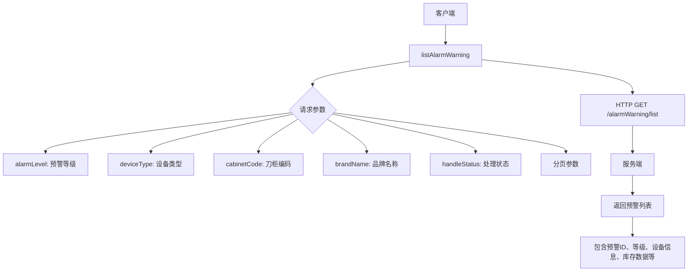
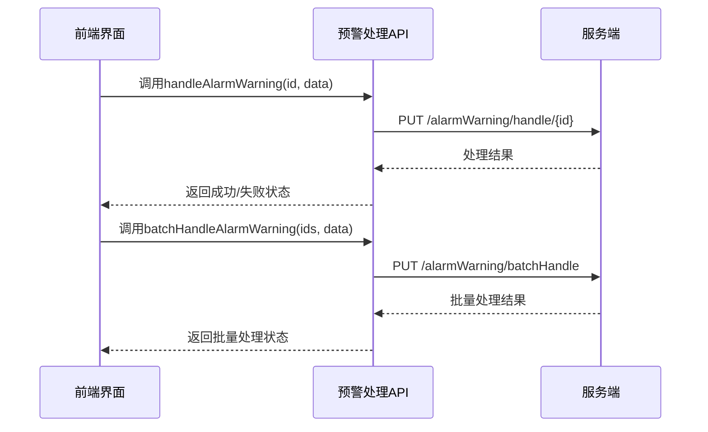
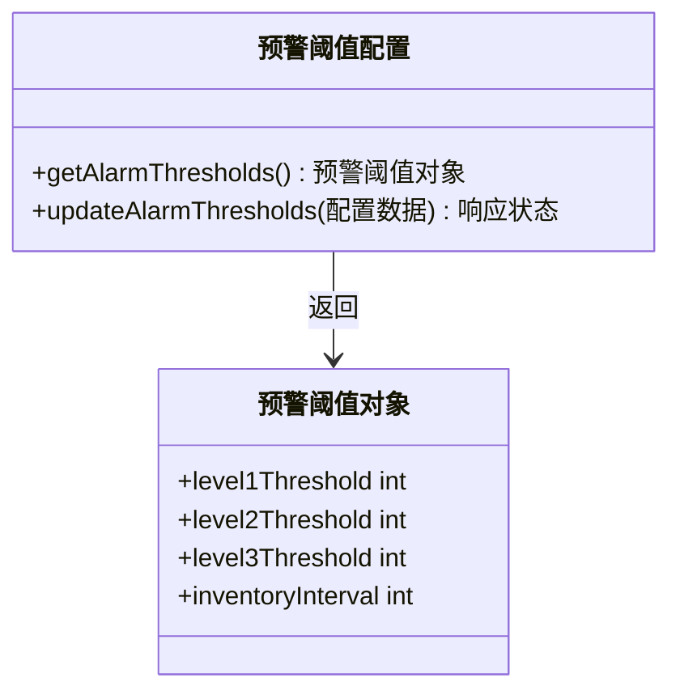
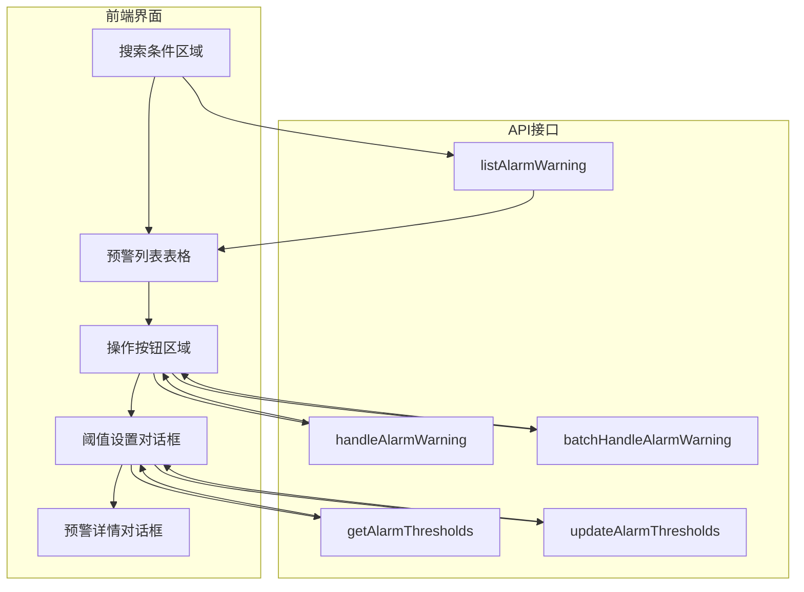
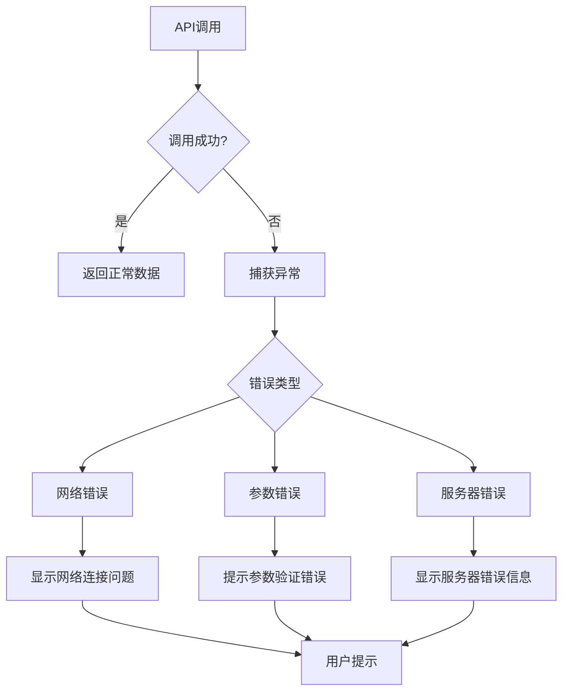

# 预警报警接口

<cite>
**Referenced Files in This Document**   
- [index.js](file://daoju/src/api/alarmWarning/index.js)
- [index.vue](file://daoju/src/views/alarmWarning/index.vue)
- [index.vue](file://daoju/src/views/WarningAlarmRecord/index.vue)
</cite>

## 目录
1. [简介](#简介)
2. [API接口定义](#api接口定义)
3. [前端集成与使用](#前端集成与使用)
4. [错误处理与常见问题](#错误处理与常见问题)
5. [总结](#总结)

## 简介

KnifeManager预警报警模块为刀具管理系统提供关键的库存预警、逾期提醒和异常告警功能。该模块通过一系列RESTful API接口，实现了对刀具库存状态的实时监控和预警管理。系统能够根据预设的阈值自动检测库存异常，并通过前端界面及时通知相关人员进行处理。

本API文档详细说明了`index.js`中定义的核心接口，包括获取预警列表、处理告警状态、配置预警阈值等功能。文档还解释了这些接口如何与前端告警页面集成，提供了实际调用示例，并涵盖了错误处理机制和常见问题解决方案。

**Section sources**
- [index.js](file://daoju/src/api/alarmWarning/index.js#L1-L131)

## API接口定义

### 预警列表与查询接口

预警列表接口提供了获取和查询预警信息的核心功能，支持分页、过滤和导出操作。



**接口说明：**
- **HTTP方法**: GET
- **请求路径**: `/alarmWarning/list`
- **请求参数**:
  - `alarmLevel`: 预警等级 (1: 安全库存量预警, 2: 采集阈值存储量预警, 3: 紧急补货存储量报警)
  - `deviceType`: 设备类型 (cutter: 刀具柜, handle: 刀柄柜)
  - `cabinetCode`: 刀柜编码
  - `brandName`: 品牌名称
  - `handleStatus`: 处理状态 (0: 未处理, 1: 已处理, 2: 已忽略)
  - 分页参数 (pageNum, pageSize)
- **响应数据结构**:
  - 预警列表数组
  - 每个预警对象包含: ID、预警等级、设备类型、刀柜编码、库位号、品牌名称、物品编码、当前库存、阈值、预警信息、处理状态、预警时间等字段
  - 分页信息 (总记录数、当前页码等)

**Section sources**
- [index.js](file://daoju/src/api/alarmWarning/index.js#L3-L9)

### 预警处理接口

预警处理接口用于更新预警的处理状态，支持单个和批量处理操作。



**接口说明：**
- **单个处理接口**:
  - **HTTP方法**: PUT
  - **请求路径**: `/alarmWarning/handle/{id}`
  - **请求参数**: 路径参数`id`表示预警ID，请求体包含处理信息(处理备注等)
  - **响应**: 处理成功或失败的状态码

- **批量处理接口**:
  - **HTTP方法**: PUT
  - **请求路径**: `/alarmWarning/batchHandle`
  - **请求参数**: 请求体包含`ids`数组和处理数据
  - **响应**: 批量处理结果状态

**Section sources**
- [index.js](file://daoju/src/api/alarmWarning/index.js#L81-L96)

### 预警阈值配置接口

预警阈值配置接口用于获取和更新系统的预警阈值设置。



**接口说明：**
- **获取阈值接口**:
  - **HTTP方法**: GET
  - **请求路径**: `/alarmWarning/thresholds`
  - **响应**: 包含各级预警阈值和自动盘存间隔的配置对象

- **更新阈值接口**:
  - **HTTP方法**: PUT
  - **请求路径**: `/alarmWarning/thresholds`
  - **请求参数**: 包含新的阈值配置的JSON对象
  - **响应**: 更新成功或失败的状态码

**Section sources**
- [index.js](file://daoju/src/api/alarmWarning/index.js#L64-L78)

### 其他辅助接口

系统还提供了一系列辅助接口，支持完整的预警管理功能。

| 接口功能 | HTTP方法 | 请求路径 | 主要用途 |
|--------|--------|--------|--------|
| 获取预警详情 | GET | /alarmWarning/{id} | 获取单个预警的详细信息 |
| 删除预警 | DELETE | /alarmWarning/{id} | 删除指定的预警记录 |
| 批量删除预警 | DELETE | /alarmWarning/batch | 批量删除多个预警记录 |
| 导出预警数据 | GET | /alarmWarning/export | 导出预警列表为文件 |
| 获取预警统计 | GET | /alarmWarning/statistics | 获取预警统计数据 |
| 获取刀柜列表 | GET | /alarmWarning/cabinets | 获取可用刀柜列表 |
| 获取品牌列表 | GET | /alarmWarning/brands | 获取可用品牌列表 |
| 自动盘存 | POST | /alarmWarning/autoInventory | 触发自动盘存操作 |

**Section sources**
- [index.js](file://daoju/src/api/alarmWarning/index.js#L1-L131)

## 前端集成与使用

### 告警页面集成

预警报警接口与前端`alarmWarning/index.vue`页面紧密集成，实现了完整的用户交互体验。



**集成要点：**
- 页面初始化时调用`listAlarmWarning`获取预警列表
- 搜索功能通过传递查询参数调用`listAlarmWarning`
- "处理"、"忽略"等操作按钮调用`handleAlarmWarning`
- "批量处理"按钮调用`batchHandleAlarmWarning`
- "阈值设置"对话框使用`getAlarmThresholds`和`updateAlarmThresholds`

**Section sources**
- [index.vue](file://daoju/src/views/alarmWarning/index.vue#L1-L800)

### 实际调用示例

#### 获取未处理告警列表

```javascript
// 获取未处理的预警列表
listAlarmWarning({
  handleStatus: 0, // 未处理
  alarmLevel: '',   // 所有等级
  pageNum: 1,
  pageSize: 10
}).then(response => {
  console.log('未处理预警列表:', response.data)
}).catch(error => {
  console.error('获取预警列表失败:', error)
})
```

#### 确认告警状态

```javascript
// 处理单个预警
handleAlarmWarning(alarmId, {
  handleRemark: '已安排补货'
}).then(response => {
  ElMessage.success('预警处理成功!')
  // 刷新列表
  getList()
}).catch(error => {
  ElMessage.error('处理失败，请重试')
})

// 批量处理多个预警
batchHandleAlarmWarning(selectedAlarmIds, {
  handleRemark: '批量处理完成'
}).then(response => {
  ElMessage.success(`成功处理 ${selectedAlarmIds.length} 个预警!`)
  // 刷新列表
  getList()
}).catch(error => {
  ElMessage.error('批量处理失败')
})
```

**Section sources**
- [index.js](file://daoju/src/api/alarmWarning/index.js#L3-L9)
- [index.js](file://daoju/src/api/alarmWarning/index.js#L81-L96)
- [index.vue](file://daoju/src/views/alarmWarning/index.vue#L758-L799)

## 错误处理与常见问题

### 错误处理机制

系统实现了完善的错误处理机制，确保API调用的稳定性和可靠性。



**错误处理策略：**
- 前端使用try-catch捕获异步操作异常
- 使用Element Plus的`ElMessage`组件显示友好的错误提示
- 对不同类型的错误进行分类处理
- 提供重试机制和用户指导

**Section sources**
- [index.vue](file://daoju/src/views/alarmWarning/index.vue#L661-L665)

### 常见问题解决方案

#### 轮询频率配置

系统通过`inventoryInterval`参数配置自动盘存的轮询频率：

- **默认值**: 60分钟
- **可配置范围**: 1-1440分钟(1天)
- **配置方式**: 通过阈值设置界面修改`自动盘存设置`中的`盘存间隔`

```javascript
// 获取当前轮询配置
getAlarmThresholds().then(response => {
  const interval = response.data.inventoryInterval
  console.log(`当前盘存间隔: ${interval}分钟`)
})
```

#### 告警去重策略

系统采用以下策略避免重复告警：

1. **状态管理**: 每个预警有明确的处理状态(未处理、已处理、已忽略)
2. **阈值检查**: 只有当库存变化跨越阈值时才生成新预警
3. **时间窗口**: 相同条件的预警在一定时间内不会重复生成
4. **手动控制**: 用户可以主动忽略或删除不需要的预警

**Section sources**
- [index.js](file://daoju/src/api/alarmWarning/index.js#L72-L78)
- [index.vue](file://daoju/src/views/alarmWarning/index.vue#L281-L289)

## 总结

KnifeManager预警报警模块提供了一套完整的API接口，实现了对刀具库存的全面监控和管理。通过`index.js`中定义的接口，系统能够有效地处理库存预警、逾期提醒和异常告警等各种场景。

核心功能包括：
- 多维度的预警列表查询和过滤
- 灵活的预警处理和状态管理
- 可配置的预警阈值和轮询策略
- 完善的前端集成和用户交互

这些接口与前端页面紧密结合，为用户提供了直观、高效的预警管理体验，确保生产过程中的刀具供应安全可靠。

**Section sources**
- [index.js](file://daoju/src/api/alarmWarning/index.js#L1-L131)
- [index.vue](file://daoju/src/views/alarmWarning/index.vue#L1-L800)