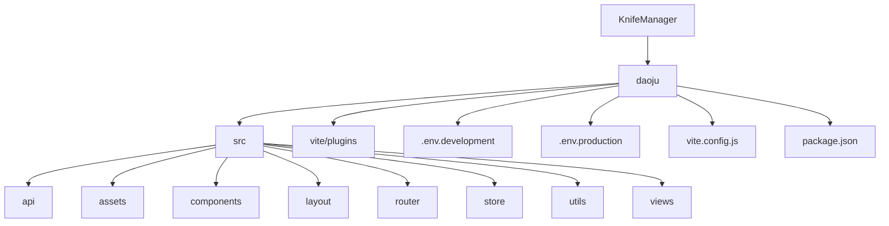

# 开发者指南

<cite>
**本文档中引用的文件**  
- [vite.config.js](file://daoju/vite.config.js)
- [main.js](file://daoju/src/main.js)
- [router/index.js](file://daoju/src/router/index.js)
- [utils/auth.js](file://daoju/src/utils/auth.js)
- [utils/dict.js](file://daoju/src/utils/dict.js)
- [utils/validate.js](file://daoju/src/utils/validate.js)
- [utils/request.js](file://daoju/src/utils/request.js)
- [utils/ruoyi.js](file://daoju/src/utils/ruoyi.js)
- [utils/index.js](file://daoju/src/utils/index.js)
- [vite/plugins/index.js](file://daoju/vite/plugins/index.js)
- [vite/plugins/auto-import.js](file://daoju/vite/plugins/auto-import.js)
- [vite/plugins/compression.js](file://daoju/vite/plugins/compression.js)
- [vite/plugins/setup-extend.js](file://daoju/vite/plugins/setup-extend.js)
- [vite/plugins/svg-icon.js](file://daoju/vite/plugins/svg-icon.js)
</cite>

## 目录
1. [介绍](#介绍)
2. [项目结构](#项目结构)
3. [代码规范](#代码规范)
4. [Git提交规范](#git提交规范)
5. [调试技巧](#调试技巧)
6. [新增功能开发流程](#新增功能开发流程)
7. [可维护代码编写建议](#可维护代码编写建议)
8. [通用工具函数使用](#通用工具函数使用)
9. [Vite插件扩展机制](#vite插件扩展机制)
10. [结论](#结论)

## 介绍
本指南旨在为参与KnifeManager开发的工程师提供全面的技术指导，涵盖代码规范、Git提交规范、调试技巧、新增功能开发流程、可维护代码编写建议以及项目中提供的通用工具函数和Vite插件扩展机制的使用方法。通过本指南，新成员可以快速融入开发团队并高效贡献代码。

## 项目结构
KnifeManager项目采用典型的Vue 3 + Vite架构，项目结构清晰，模块化程度高。主要目录包括`src`（源代码）、`vite/plugins`（自定义Vite插件）、`.env`文件（环境配置）等。`src`目录下包含`api`（API接口定义）、`assets`（静态资源）、`components`（通用组件）、`layout`（布局组件）、`router`（路由配置）、`store`（状态管理）、`utils`（工具函数）和`views`（页面组件）等子目录，便于开发人员快速定位和理解代码结构。



**图示来源**
- [vite.config.js](file://daoju/vite.config.js#L1-L86)
- [main.js](file://daoju/src/main.js#L1-L88)
- [router/index.js](file://daoju/src/router/index.js#L1-L800)

**本节来源**
- [vite.config.js](file://daoju/vite.config.js#L1-L86)
- [main.js](file://daoju/src/main.js#L1-L88)
- [router/index.js](file://daoju/src/router/index.js#L1-L800)

## 代码规范
### JavaScript规范
项目遵循ESLint + Prettier的代码规范，确保代码风格统一。主要规范包括：
- 使用ES6+语法，如箭头函数、解构赋值、模板字符串等。
- 变量命名采用驼峰式命名法，常量全大写。
- 函数和类命名采用大驼峰式命名法。
- 代码缩进使用2个空格。
- 字符串使用单引号。
- 每行代码长度不超过110个字符。
- 使用`const`和`let`代替`var`。
- 异步操作优先使用`async/await`。

### SCSS规范
项目使用SCSS作为CSS预处理器，主要规范包括：
- 使用`@import`引入SCSS文件。
- 变量命名采用`$`前缀，如`$primary-color`。
- 混合（mixin）命名采用`@mixin`关键字，如`@mixin button-style`。
- 嵌套层级不超过3层，避免过度嵌套。
- 使用`%`占位符选择器定义可复用的样式。
- 遵循BEM命名规范，提高样式的可维护性。

**本节来源**
- [main.js](file://daoju/src/main.js#L1-L88)
- [utils/index.js](file://daoju/src/utils/index.js#L1-L391)
- [assets/styles/index.scss](file://daoju/src/assets/styles/index.scss)

## Git提交规范
项目采用Angular团队的Git提交规范，确保提交信息清晰、一致。提交信息格式如下：
```
<type>(<scope>): <subject>
<BLANK LINE>
<body>
<BLANK LINE>
<footer>
```
其中，`type`表示提交类型，包括`feat`（新功能）、`fix`（修复bug）、`docs`（文档更新）、`style`（代码格式调整）、`refactor`（代码重构）、`test`（测试相关）、`chore`（构建过程或辅助工具的变动）等。`scope`表示影响范围，如`router`、`store`等。`subject`是对变更的简短描述。`body`是对变更的详细描述。`footer`是备注，通常用于关联issue或breaking change。

**本节来源**
- [main.js](file://daoju/src/main.js#L1-L88)
- [router/index.js](file://daoju/src/router/index.js#L1-L800)

## 调试技巧
### 浏览器开发者工具
利用浏览器开发者工具可以高效地调试前端应用。主要技巧包括：
- 使用Console面板查看日志输出，设置断点进行调试。
- 使用Network面板监控API请求，查看请求和响应的详细信息。
- 使用Elements面板检查DOM结构和CSS样式，实时修改样式。
- 使用Sources面板设置断点，逐步执行代码，查看变量值。
- 使用Performance面板分析应用性能，识别性能瓶颈。

### Vue Devtools
Vue Devtools是Vue.js的官方调试工具，提供强大的组件树查看、状态管理、事件监听等功能。主要技巧包括：
- 查看组件树结构，了解组件的层级关系。
- 查看组件的props、data、computed、methods等属性。
- 监听组件的事件，查看事件的触发和处理过程。
- 查看Vuex store的状态，了解状态的变化过程。
- 使用时间旅行调试，回溯到任意状态。

**本节来源**
- [main.js](file://daoju/src/main.js#L1-L88)
- [store/index.js](file://daoju/src/store/index.js)
- [router/index.js](file://daoju/src/router/index.js#L1-L800)

## 新增功能开发流程
### 路由配置
新增功能的第一步是配置路由。在`src/router/index.js`中定义新的路由规则。路由配置项包括`path`（路径）、`component`（组件）、`name`（名称）、`meta`（元信息）等。`meta`中可以设置`title`（标题）、`icon`（图标）、`roles`（角色权限）等。

```javascript
{
  path: '/new-feature',
  component: Layout,
  children: [
    {
      path: '',
      component: () => import('@/views/new-feature/index.vue'),
      name: 'NewFeature',
      meta: { title: '新功能', icon: 'new-icon', roles: ['admin'] }
    }
  ]
}
```

### 组件实现
路由配置完成后，创建对应的Vue组件。组件实现包括模板（template）、脚本（script）和样式（style）三部分。模板部分使用Vue的模板语法，脚本部分使用Composition API或Options API，样式部分使用SCSS。

**本节来源**
- [router/index.js](file://daoju/src/router/index.js#L1-L800)
- [views/index.vue](file://daoju/src/views/index.vue)

## 可维护代码编写建议
### 组件化
将功能模块拆分为独立的组件，提高代码的复用性和可维护性。组件应具有单一职责，避免功能过于复杂。

### 状态管理
使用Vuex进行状态管理，将应用的状态集中管理。避免在组件中直接修改状态，通过actions和mutations进行状态变更。

### 错误处理
合理处理异常，避免应用崩溃。使用try-catch捕获同步异常，使用catch捕获异步异常。在全局错误处理中记录错误日志，便于问题排查。

### 文档注释
为关键函数和组件添加详细的文档注释，说明其功能、参数、返回值等。使用JSDoc格式，便于生成API文档。

**本节来源**
- [main.js](file://daoju/src/main.js#L1-L88)
- [store/index.js](file://daoju/src/store/index.js)
- [utils/index.js](file://daoju/src/utils/index.js#L1-L391)

## 通用工具函数使用
### auth.js
`auth.js`提供了与认证相关的工具函数，包括`getToken`、`setToken`和`removeToken`，用于操作存储在Cookies中的认证令牌。

```javascript
import { getToken, setToken, removeToken } from '@/utils/auth'

// 获取认证令牌
const token = getToken()

// 设置认证令牌
setToken('new-token')

// 移除认证令牌
removeToken()
```

### dict.js
`dict.js`提供了与数据字典相关的工具函数，包括`useDict`，用于获取字典数据。字典数据通常用于下拉框、单选框等控件的选项。

```javascript
import { useDict } from '@/utils/dict'

// 获取字典数据
const { cutterType } = useDict('cutterType')
```

### validate.js
`validate.js`提供了多种验证函数，包括`isPathMatch`（路径匹配）、`isEmpty`（空值判断）、`isHttp`（HTTP协议判断）、`isExternal`（外链判断）、`validUsername`（用户名验证）、`validURL`（URL验证）、`validEmail`（邮箱验证）等。

```javascript
import { validEmail } from '@/utils/validate'

// 验证邮箱
if (validEmail('user@example.com')) {
  console.log('邮箱格式正确')
}
```

**本节来源**
- [utils/auth.js](file://daoju/src/utils/auth.js#L1-L16)
- [utils/dict.js](file://daoju/src/utils/dict.js#L1-L24)
- [utils/validate.js](file://daoju/src/utils/validate.js#L1-L115)

## Vite插件扩展机制
### 自定义Vite插件
项目在`vite/plugins`目录下定义了多个自定义Vite插件，包括`auto-import.js`（自动导入）、`compression.js`（压缩）、`setup-extend.js`（setup扩展）、`svg-icon.js`（SVG图标）等。这些插件通过`vite.config.js`中的`plugins`配置项引入。

```javascript
import createVitePlugins from './vite/plugins'

export default defineConfig(({ mode, command }) => {
  const env = loadEnv(mode, process.cwd())
  return {
    plugins: createVitePlugins(env, command === 'build'),
    // 其他配置...
  }
})
```

### 插件功能
- `auto-import.js`：自动导入Vue、Vue Router、Pinia等常用模块，减少手动导入的繁琐。
- `compression.js`：在构建时对静态资源进行Gzip或Brotli压缩，减少文件大小，提高加载速度。
- `setup-extend.js`：扩展Vue 3的setup语法，支持更灵活的组件定义。
- `svg-icon.js`：将SVG图标文件注册为Vue组件，方便在项目中使用SVG图标。

**本节来源**
- [vite.config.js](file://daoju/vite.config.js#L1-L86)
- [vite/plugins/index.js](file://daoju/vite/plugins/index.js#L1-L16)
- [vite/plugins/auto-import.js](file://daoju/vite/plugins/auto-import.js#L1-L13)
- [vite/plugins/compression.js](file://daoju/vite/plugins/compression.js#L1-L29)
- [vite/plugins/setup-extend.js](file://daoju/vite/plugins/setup-extend.js#L1-L6)
- [vite/plugins/svg-icon.js](file://daoju/vite/plugins/svg-icon.js#L1-L11)

## 结论
通过遵循本指南中的代码规范、Git提交规范、调试技巧、新增功能开发流程、可维护代码编写建议以及正确使用通用工具函数和Vite插件扩展机制，开发人员可以高效地参与KnifeManager项目的开发，确保代码质量和项目可维护性。希望本指南能帮助新成员快速融入团队，为项目的发展贡献力量。