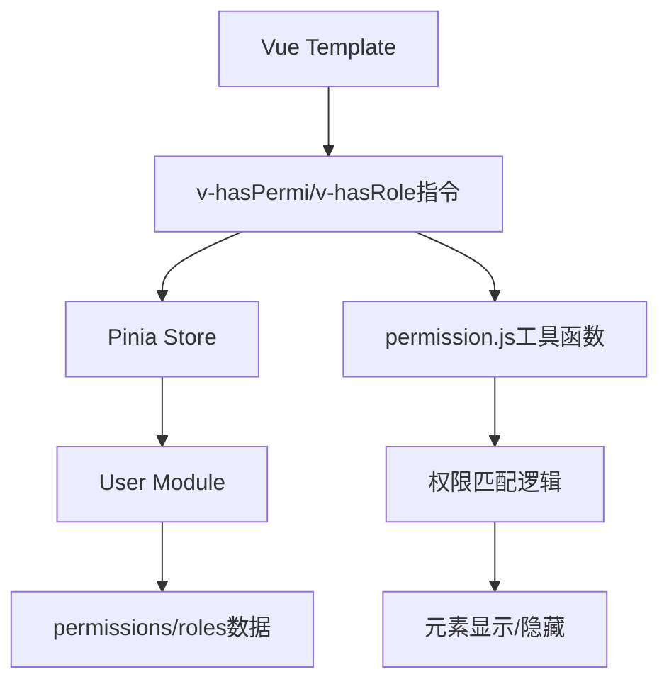
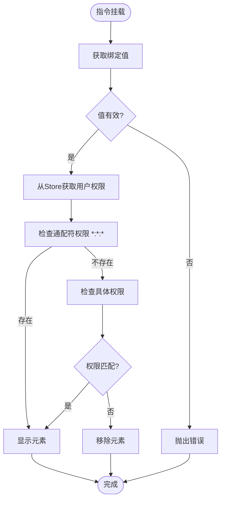
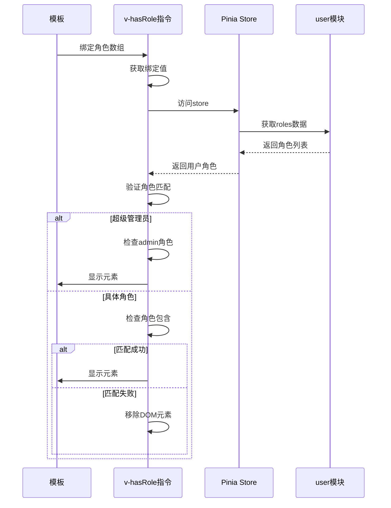
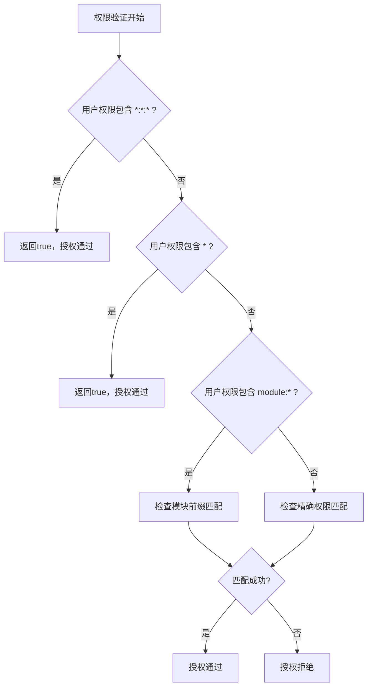
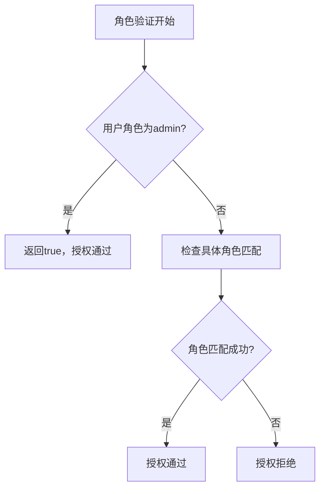
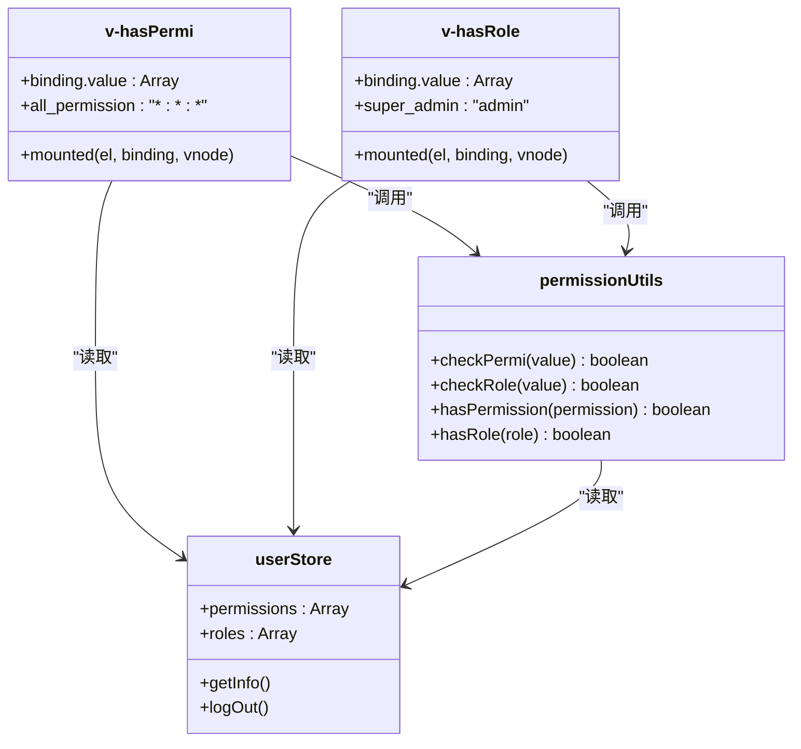
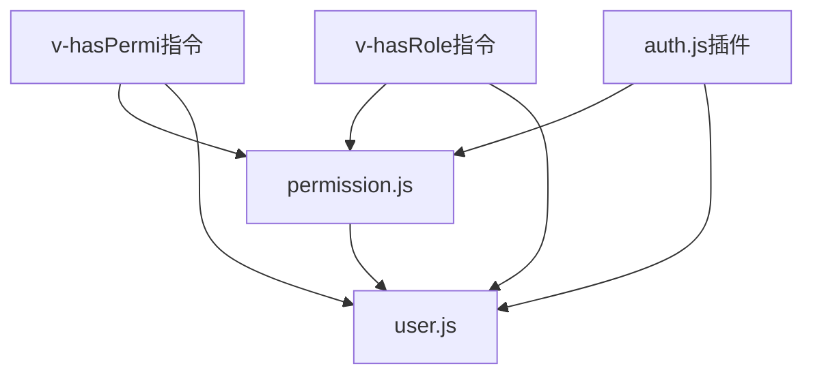

# 按钮级权限控制

<cite>
**Referenced Files in This Document**   
- [hasPermi.js](file://daoju\src\directive\permission\hasPermi.js)
- [hasRole.js](file://daoju\src\directive\permission\hasRole.js)
- [permission.js](file://daoju\src\utils\permission.js)
- [user.js](file://daoju\src\store\modules\user.js)
- [auth.js](file://daoju\src\plugins\auth.js)
</cite>

## 目录
1. [引言](#引言)
2. [核心组件分析](#核心组件分析)
3. [权限控制架构](#权限控制架构)
4. [详细组件分析](#详细组件分析)
5. [依赖关系分析](#依赖关系分析)
6. [性能考虑](#性能考虑)
7. [故障排除指南](#故障排除指南)
8. [结论](#结论)

## 引言
KnifeManager系统实现了基于Vue自定义指令的细粒度按钮级别权限控制机制。该系统通过`v-hasPermi`和`v-hasRole`两个核心指令，结合Pinia状态管理，为前端界面提供了灵活而安全的操作权限验证功能。本文档将深入分析这两个指令的实现原理、工作流程以及与相关工具函数的协同关系，为开发者提供完整的权限控制实现方案。

## 核心组件分析
系统权限控制的核心组件包括两个自定义指令：`v-hasPermi`用于操作权限验证，`v-hasRole`用于角色权限验证。这两个指令均在元素挂载时执行权限检查，通过访问Pinia store中的用户权限数据，决定是否显示或隐藏特定的UI元素。指令的实现遵循了简洁高效的设计原则，确保了权限验证的准确性和性能。

**Section sources**
- [hasPermi.js](file://daoju\src\directive\permission\hasPermi.js#L1-L27)
- [hasRole.js](file://daoju\src\directive\permission\hasRole.js#L1-L27)

## 权限控制架构
KnifeManager的权限控制架构采用分层设计，将权限验证逻辑与UI展示分离。自定义指令作为权限验证的入口点，调用底层工具函数进行实际的权限匹配。用户权限数据统一存储在Pinia store中，确保了数据的一致性和可维护性。这种架构设计使得权限控制既灵活又可靠，能够适应复杂的业务场景需求。

**Diagram sources **
- [hasPermi.js](file://daoju\src\directive\permission\hasPermi.js#L1-L27)
- [hasRole.js](file://daoju\src\directive\permission\hasRole.js#L1-L27)
- [user.js](file://daoju\src\store\modules\user.js#L1-L92)
- [permission.js](file://daoju\src\utils\permission.js#L1-L175)

## 详细组件分析

### v-hasPermi指令分析
`v-hasPermi`指令实现了基于权限字符串的细粒度操作权限控制。该指令在`mounted`钩子函数中获取绑定的权限值，从Pinia store中读取当前用户的权限列表，并执行权限匹配逻辑。

#### 权限匹配逻辑

**Diagram sources **
- [hasPermi.js](file://daoju\src\directive\permission\hasPermi.js#L1-L27)
- [permission.js](file://daoju\src\utils\permission.js#L8-L25)

**Section sources**
- [hasPermi.js](file://daoju\src\directive\permission\hasPermi.js#L1-L27)

### v-hasRole指令分析
`v-hasRole`指令实现了基于用户角色的权限控制。与`v-hasPermi`类似，该指令也在`mounted`钩子中执行角色验证，但其验证逻辑侧重于用户的角色属性。

#### 角色验证逻辑

**Diagram sources **
- [hasRole.js](file://daoju\src\directive\permission\hasRole.js#L1-L27)
- [user.js](file://daoju\src\store\modules\user.js#L1-L92)

**Section sources**
- [hasRole.js](file://daoju\src\directive\permission\hasRole.js#L1-L27)

### 通配符权限处理机制
系统实现了灵活的通配符权限处理机制，其中`*:*:*`权限具有最高优先级。当用户拥有此通配符权限时，将被授予系统所有操作权限。

#### 通配符权限处理流程

**Diagram sources **
- [permission.js](file://daoju\src\utils\permission.js#L63-L83)
- [hasPermi.js](file://daoju\src\directive\permission\hasPermi.js#L10-L18)

**Section sources**
- [permission.js](file://daoju\src\utils\permission.js#L63-L83)

### 超级管理员特权实现
系统为`admin`角色赋予了超级管理员特权，使其能够访问所有功能，无论具体的权限配置如何。

#### 超级管理员特权逻辑

**Diagram sources **
- [hasRole.js](file://daoju\src\directive\permission\hasRole.js#L10-L17)
- [permission.js](file://daoju\src\utils\permission.js#L38-L40)

**Section sources**
- [hasRole.js](file://daoju\src\directive\permission\hasRole.js#L10-L17)

### 指令与工具函数协同关系
自定义指令与工具函数之间存在紧密的协同关系。`checkPermi`和`checkRole`工具函数提供了通用的权限验证逻辑，而自定义指令则将其应用于具体的UI元素控制。

#### 协同关系图

**Diagram sources **
- [hasPermi.js](file://daoju\src\directive\permission\hasPermi.js#L1-L27)
- [hasRole.js](file://daoju\src\directive\permission\hasRole.js#L1-L27)
- [permission.js](file://daoju\src\utils\permission.js#L1-L56)
- [user.js](file://daoju\src\store\modules\user.js#L1-L92)

**Section sources**
- [permission.js](file://daoju\src\utils\permission.js#L1-L56)

## 依赖关系分析
权限控制系统各组件之间存在明确的依赖关系。自定义指令依赖于Pinia store中的用户数据和工具函数中的验证逻辑，形成了清晰的调用链。

**Diagram sources **
- [hasPermi.js](file://daoju\src\directive\permission\hasPermi.js#L1-L27)
- [hasRole.js](file://daoju\src\directive\permission\hasRole.js#L1-L27)
- [permission.js](file://daoju\src\utils\permission.js#L1-L175)
- [user.js](file://daoju\src\store\modules\user.js#L1-L92)
- [auth.js](file://daoju\src\plugins\auth.js#L1-L60)

**Section sources**
- [auth.js](file://daoju\src\plugins\auth.js#L1-L60)

## 性能考虑
权限控制系统的性能表现良好，主要体现在以下几个方面：
- 权限验证在元素挂载时一次性完成，避免了重复计算
- 使用数组的`some`方法进行权限匹配，具有良好的时间复杂度
- 通配符权限的优先级处理减少了不必要的匹配操作
- DOM操作仅在权限不匹配时执行，最小化了对页面渲染的影响

## 故障排除指南
在使用权限控制功能时，可能会遇到以下常见问题及解决方案：

**Section sources**
- [hasPermi.js](file://daoju\src\directive\permission\hasPermi.js#L24-L25)
- [hasRole.js](file://daoju\src\directive\permission\hasRole.js#L24-L25)
- [permission.js](file://daoju\src\utils\permission.js#L23-L24)

## 结论
KnifeManager的按钮级权限控制方案通过`v-hasPermi`和`v-hasRole`两个自定义指令，实现了灵活而安全的操作权限管理。系统采用分层架构，将权限验证逻辑与UI展示分离，确保了代码的可维护性和可扩展性。通配符权限和超级管理员特权的设计，为系统提供了必要的灵活性和管理便利性。开发者可以基于此方案，轻松实现细粒度的操作权限控制，保障系统的安全性。