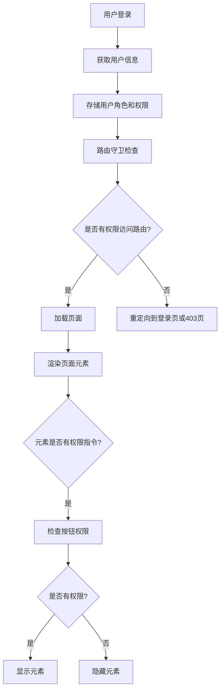
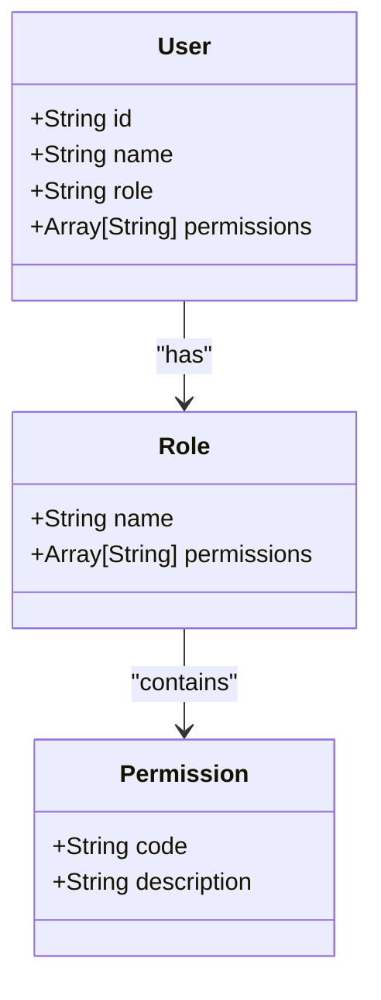
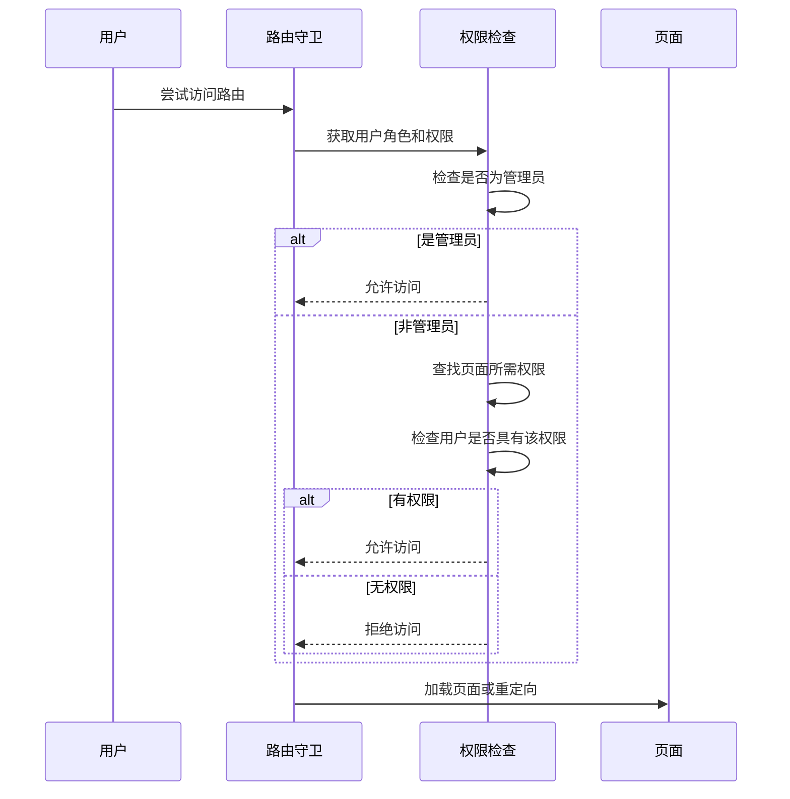
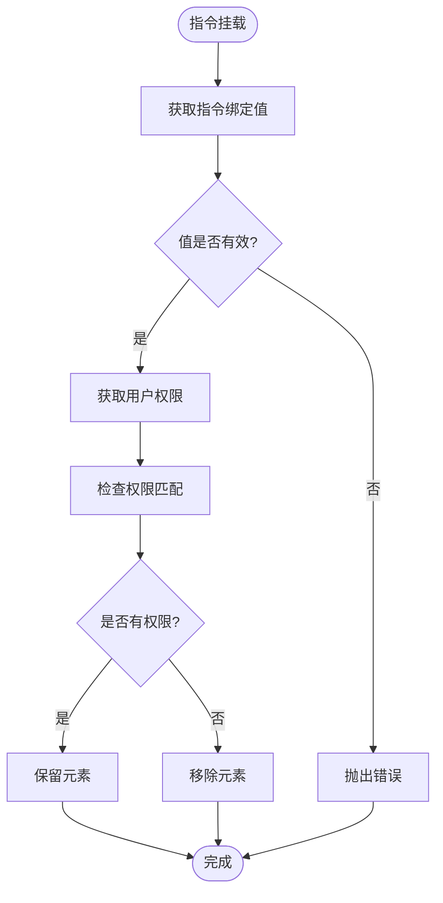
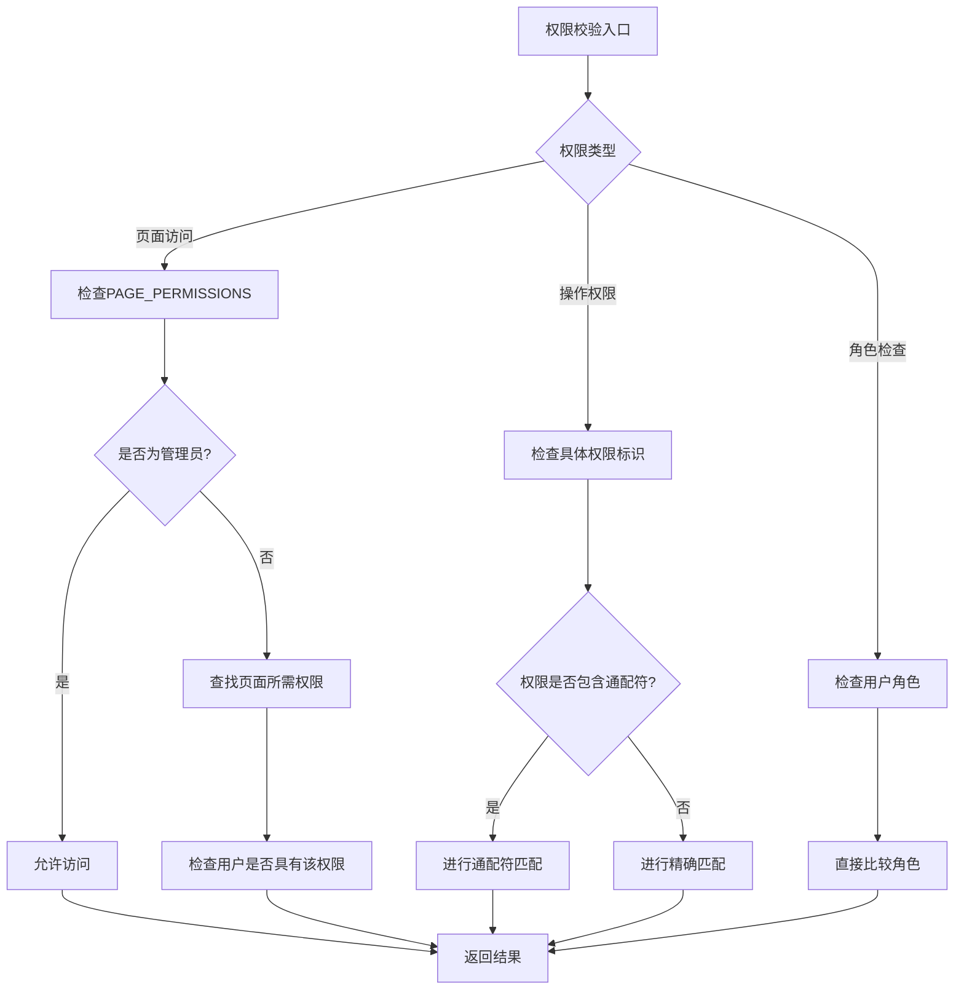
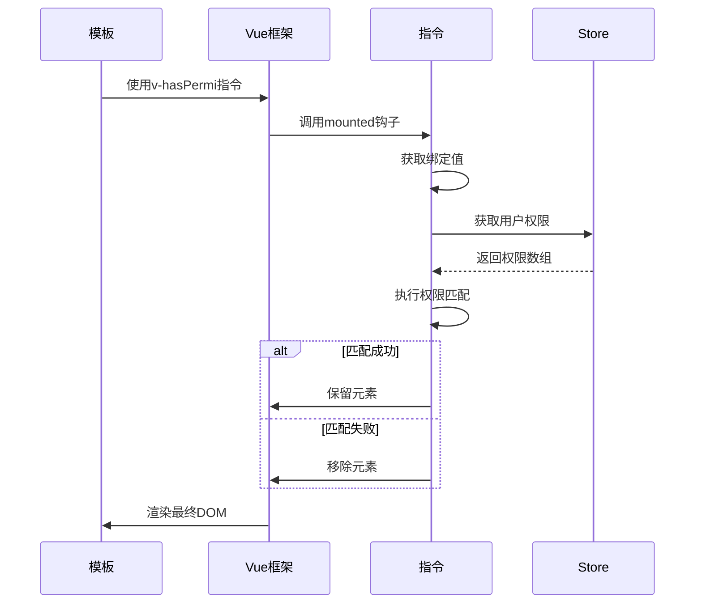
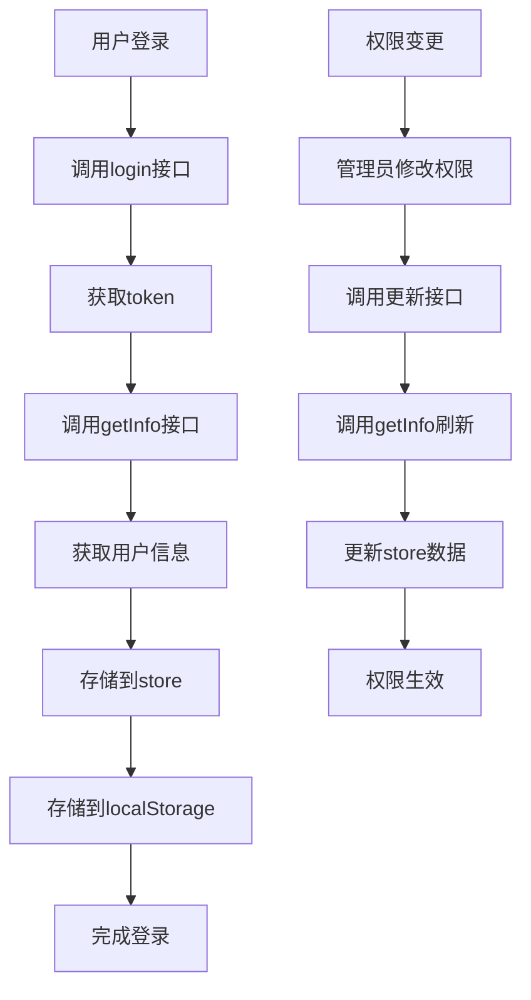

# 权限控制实现

<cite>
**本文档引用的文件**
- [hasPermi.js](file://daoju\src\directive\permission\hasPermi.js)
- [hasRole.js](file://daoju\src\directive\permission\hasRole.js)
- [permission.js](file://daoju\src\utils\permission.js)
- [user.js](file://daoju\src\store\modules\user.js)
- [login.vue](file://daoju\src\views\login.vue)
- [index.vue](file://daoju\src\layout\components\Sidebar\index.vue)
- [permission.js](file://daoju\src\permission.js)
- [auth.js](file://daoju\src\plugins\auth.js)
- [role.js](file://daoju\src\api\system\role.js)
</cite>

## 目录
1. [引言](#引言)
2. [权限控制系统架构](#权限控制系统架构)
3. [基于角色的访问控制（RBAC）模型](#基于角色的访问控制rbac模型)
4. [路由级别的权限控制](#路由级别的权限控制)
5. [按钮级别的权限控制](#按钮级别的权限控制)
6. [权限校验逻辑分析](#权限校验逻辑分析)
7. [自定义指令实现原理](#自定义指令实现原理)
8. [用户权限数据的获取、存储与更新](#用户权限数据的获取存储与更新)
9. [权限配置最佳实践](#权限配置最佳实践)
10. [常见问题与解决方案](#常见问题与解决方案)
11. [结论](#结论)

## 引言
KnifeManager系统采用基于角色的访问控制（RBAC）模型，实现了细粒度的权限管理机制。本系统通过路由级别和按钮级别的双重权限控制，确保不同角色的用户只能访问其被授权的功能模块和操作按钮。权限控制系统不仅保障了系统的安全性，还提供了灵活的权限配置能力，支持管理员根据业务需求动态调整用户权限。

## 权限控制系统架构
KnifeManager的权限控制系统由多个核心组件构成，包括用户状态管理、权限校验工具、路由守卫、自定义指令等。系统通过Vuex store中的user模块管理用户身份和权限信息，利用Vue Router的导航守卫实现路由级别的访问控制，并通过自定义指令v-hasPermi和v-hasRole实现按钮级别的权限控制。

**图示来源**
- [user.js](file://daoju\src\store\modules\user.js#L1-L92)
- [permission.js](file://daoju\src\permission.js#L1-L105)
- [hasPermi.js](file://daoju\src\directive\permission\hasPermi.js#L1-L28)

## 基于角色的访问控制（RBAC）模型
KnifeManager系统实现了标准的RBAC权限模型，定义了多种用户角色及其对应的权限集合。系统主要包含以下角色：

- **操作员（operator）**：负责日常的借出管理操作
- **管理员（admin）**：拥有系统核心业务权限
- **审计员（auditor）**：具有审计和查看权限
- **主管（headman）**：结合了管理员和审计员的权限

每个角色都关联一组具体的权限标识，这些权限标识采用"模块:功能:操作"的命名规范，如"borrowManagement:borrow"表示借出管理模块的借出操作权限。

**图示来源**
- [login.vue](file://daoju\src\views\login.vue#L240-L277)
- [user.js](file://daoju\src\store\modules\user.js#L18-L19)

## 路由级别的权限控制
系统通过路由元信息（meta.roles）实现路由级别的权限控制。在路由配置中，每个路由可以设置meta字段来指定访问该路由所需的角色或权限。

路由级别的权限控制主要通过`permission.js`中的路由守卫实现。当用户尝试访问某个路由时，系统会检查用户是否具有访问该路由的权限。如果是管理员角色，则可以直接访问所有路由；对于其他角色，系统会根据PAGE_PERMISSIONS配置检查具体的权限要求。

**图示来源**
- [permission.js](file://daoju\src\permission.js#L22-L87)
- [permission.js](file://daoju\src\utils\permission.js#L157-L175)

## 按钮级别的权限控制
系统通过自定义指令v-hasPermi和v-hasRole实现按钮级别的权限控制。这些指令在DOM元素挂载时检查用户的权限或角色，如果没有相应权限，则从DOM中移除该元素。

### v-hasPermi指令
v-hasPermi指令用于检查用户是否具有特定的操作权限。它接收一个权限标识数组作为参数，只要用户具有数组中的任意一个权限，该指令就会允许元素显示。

### v-hasRole指令
v-hasRole指令用于检查用户是否具有特定的角色。与v-hasPermi类似，它也接收一个角色数组作为参数，只要用户具有数组中的任意一个角色，该指令就会允许元素显示。

**图示来源**
- [hasPermi.js](file://daoju\src\directive\permission\hasPermi.js#L1-L28)
- [hasRole.js](file://daoju\src\directive\permission\hasRole.js#L1-L28)

## 权限校验逻辑分析
系统的权限校验逻辑主要在`utils/permission.js`文件中实现，包含多个核心函数：

### 权限检查函数
- `hasPermission(permission)`: 检查用户是否具有指定权限
- `hasRole(role)`: 检查用户是否具有指定角色
- `canAccessPage(path)`: 检查用户是否有权限访问指定页面

权限检查支持通配符匹配，如"*"表示所有权限，":*"表示模块级所有权限。这种设计既保证了权限控制的灵活性，又简化了权限配置。

### 三权分立权限管理
系统实现了三权分立的权限管理机制，通过角色和权限的分离设计，确保了权限管理的安全性和灵活性。管理员可以独立管理用户角色和具体权限，实现了职责分离。

**图示来源**
- [permission.js](file://daoju\src\utils\permission.js#L64-L175)

## 自定义指令实现原理
KnifeManager系统通过Vue的自定义指令机制实现了v-hasPermi和v-hasRole指令。这些指令的实现遵循Vue 3的指令API规范，使用mounted钩子函数在元素挂载时进行权限检查。

### 指令注册
系统在`directive/index.js`中注册了所有自定义指令，包括权限相关的指令和通用指令。这些指令通过app.directive()方法注册到Vue应用实例中，使其可以在模板中使用。

### 执行流程
1. 指令绑定到DOM元素
2. 在mounted钩子中获取绑定的权限或角色值
3. 从store中获取当前用户的权限或角色信息
4. 进行权限或角色匹配检查
5. 根据检查结果决定是否保留或移除DOM元素

**图示来源**
- [hasPermi.js](file://daoju\src\directive\permission\hasPermi.js#L1-L28)
- [hasRole.js](file://daoju\src\directive\permission\hasRole.js#L1-L28)
- [index.js](file://daoju\src\directive\index.js#L1-L9)

## 用户权限数据的获取、存储与更新
系统的用户权限数据管理遵循标准的流程，确保权限信息的准确性和实时性。

### 权限获取
用户权限数据在用户登录后通过getInfo接口获取。系统调用`useUserStore().getInfo()`方法从后端获取用户信息，包括用户的基本信息、角色列表和权限列表。

### 权限存储
获取的权限数据存储在Vuex store的user模块中，具体存储在state的permissions和roles字段中。同时，系统也将用户信息存储在localStorage中，以便在页面刷新后能够快速恢复用户状态。

### 权限更新
当用户权限发生变化时（如管理员修改了用户的角色或权限），系统需要重新获取最新的权限数据。通常在相关操作完成后，会调用getInfo方法刷新用户信息，确保权限状态的同步。

**图示来源**
- [user.js](file://daoju\src\store\modules\user.js#L38-L73)
- [login.vue](file://daoju\src\views\login.vue#L240-L277)

## 权限配置最佳实践
为了确保系统的安全性和可维护性，建议遵循以下权限配置最佳实践：

### 权限命名规范
采用"模块:功能:操作"的三级命名规范，如"system:user:add"。这种命名方式清晰地表达了权限的层级关系和具体含义，便于权限管理和维护。

### 最小权限原则
遵循最小权限原则，只为用户分配完成其工作所需的最小权限集合。避免过度授权，降低安全风险。

### 模块化权限设计
将权限按功能模块进行组织，便于批量管理和分配。例如，可以为某个模块定义":*"通配符权限，表示该模块的所有操作权限。

### 角色与权限分离
保持角色和权限的分离设计，通过角色关联权限的方式实现权限管理。这样可以灵活地调整角色的权限，而不需要修改代码。

### 权限审计
定期审计系统中的权限分配情况，检查是否存在过度授权或权限滥用的情况。建议记录关键权限操作的日志，便于追溯和审计。

## 常见问题与解决方案
### 权限不生效
**问题描述**：配置了权限指令但元素仍然显示或隐藏。

**解决方案**：
1. 检查指令语法是否正确，确保权限标识与后端定义一致
2. 确认用户登录后是否成功获取了权限数据
3. 检查store中的permissions数组是否包含预期的权限标识

### 路由访问被拒绝
**问题描述**：用户无法访问有权限的页面。

**解决方案**：
1. 检查路由的meta配置是否正确
2. 确认PAGE_PERMISSIONS中是否定义了该路由的权限要求
3. 验证用户权限数据是否正确加载

### 权限缓存问题
**问题描述**：修改权限后需要刷新页面才能生效。

**解决方案**：
1. 在权限变更操作后调用getInfo方法刷新用户信息
2. 清除localStorage中的用户信息缓存
3. 重新触发路由守卫检查

### 通配符权限冲突
**问题描述**：通配符权限与其他权限产生冲突。

**解决方案**：
1. 合理规划通配符权限的使用范围
2. 避免在不同层级使用冲突的通配符
3. 优先使用精确权限匹配，通配符作为补充

## 结论
KnifeManager的权限控制系统通过RBAC模型实现了细粒度的访问控制，结合路由级别和按钮级别的双重权限检查，确保了系统的安全性和灵活性。系统采用模块化的权限设计，支持灵活的权限配置和管理，同时通过自定义指令机制实现了前端的动态权限控制。建议在使用过程中遵循最佳实践，定期审计权限配置，确保系统的安全稳定运行。