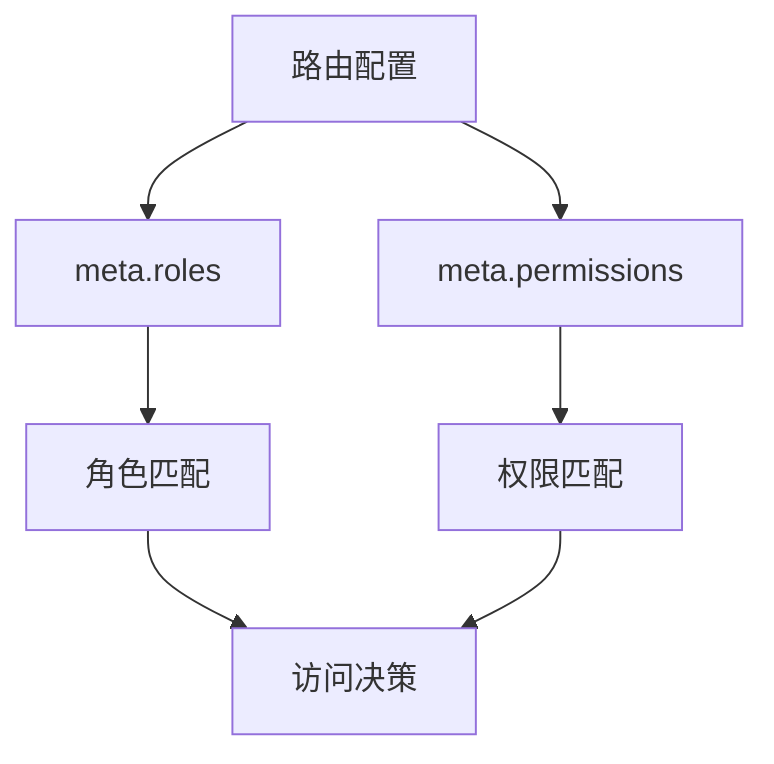
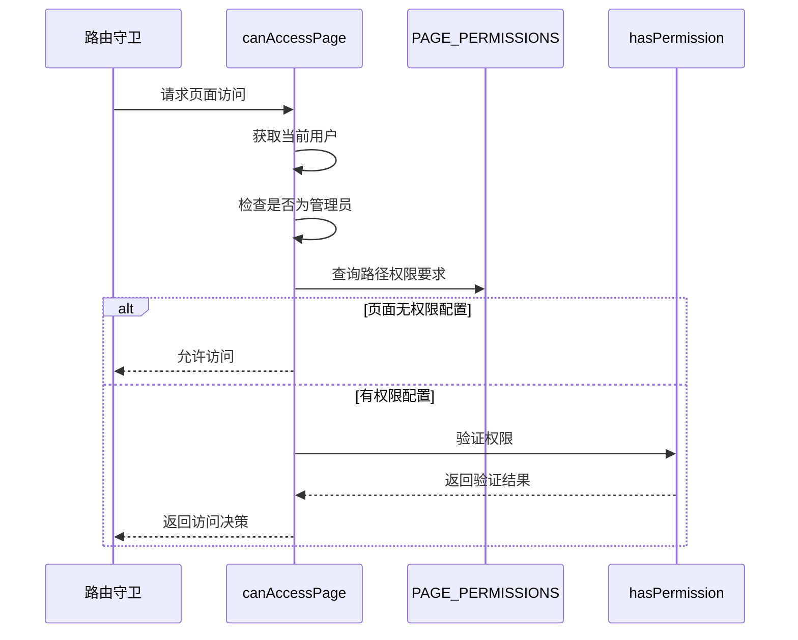
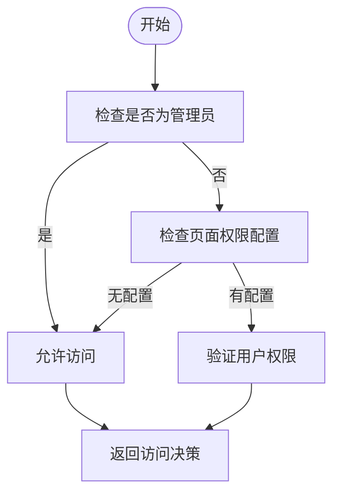
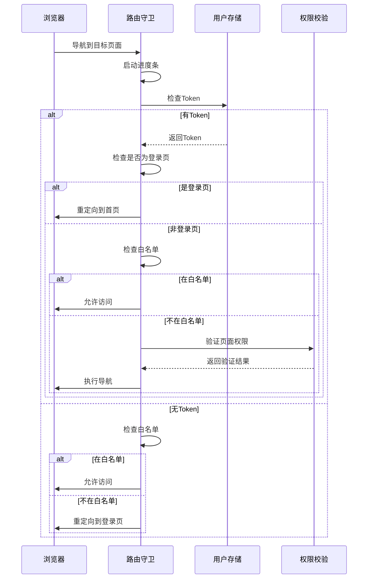

# 路由权限控制

<cite>
**本文档引用文件**  
- [router/index.js](file://daoju/src/router/index.js)
- [permission.js](file://daoju/src/permission.js)
- [utils/permission.js](file://daoju/src/utils/permission.js)
- [directive/permission/hasRole.js](file://daoju/src/directive/permission/hasRole.js)
- [directive/permission/hasPermi.js](file://daoju/src/directive/permission/hasPermi.js)
- [store/modules/permission.js](file://daoju/src/store/modules/permission.js)
- [store/modules/user.js](file://daoju/src/store/modules/user.js)
</cite>

## 目录
1. [简介](#简介)
2. [路由配置与权限元信息](#路由配置与权限元信息)
3. [权限校验核心机制](#权限校验核心机制)
4. [管理员特权与默认策略](#管理员特权与默认策略)
5. [路由守卫执行流程](#路由守卫执行流程)
6. [权限校验顺序与异常处理](#权限校验顺序与异常处理)
7. [实际应用示例](#实际应用示例)
8. [常见配置错误及解决方案](#常见配置错误及解决方案)
9. [总结](#总结)

## 简介
KnifeManager系统通过基于角色和权限的访问控制机制，实现了细粒度的路由级别权限管理。该机制结合路由元信息（meta.roles和meta.permissions）、用户角色数据以及权限映射表，确保不同角色的用户只能访问其被授权的页面和功能。本文档深入解析该权限控制体系的实现原理、执行流程和配置方法。

## 路由配置与权限元信息

KnifeManager在`router/index.js`中定义了路由配置，通过`meta`字段实现权限控制。每个路由可配置以下权限相关属性：

- **roles**: 字符串数组，定义可访问该路由的角色列表
- **permissions**: 字符串数组，定义访问该路由所需的权限标识
- **hidden**: 布尔值，控制路由是否在侧边栏显示
- **alwaysShow**: 布尔值，控制多子路由时的显示行为

路由权限通过`meta.roles`字段与用户角色进行匹配。例如，管理员管理页面配置了`roles: ['admin']`，表示只有管理员角色的用户才能访问。



**Diagram sources**
- [router/index.js](file://daoju/src/router/index.js#L16-L24)

**Section sources**
- [router/index.js](file://daoju/src/router/index.js#L1-L800)

## 权限校验核心机制

系统通过`utils/permission.js`中的`canAccessPage`函数实现页面级权限校验。该函数基于`PAGE_PERMISSIONS`映射表进行权限检查，映射表定义了每个页面路径与所需权限标识的对应关系。

权限校验流程如下：
1. 获取当前用户信息
2. 检查用户角色是否为管理员（特权处理）
3. 查找目标页面在`PAGE_PERMISSIONS`中的权限要求
4. 若页面无权限配置，则允许访问（默认策略）
5. 调用`hasPermission`函数验证用户是否具备所需权限



**Diagram sources**
- [utils/permission.js](file://daoju/src/utils/permission.js#L157-L174)
- [utils/permission.js](file://daoju/src/utils/permission.js#L108-L154)

**Section sources**
- [utils/permission.js](file://daoju/src/utils/permission.js#L1-L175)

## 管理员特权与默认策略

系统实现了管理员特权处理逻辑，`admin`角色用户可访问所有页面，无需进行额外的权限校验。这一机制通过在`canAccessPage`函数中优先检查用户角色实现。

当页面未在`PAGE_PERMISSIONS`映射表中配置权限要求时，系统采用允许访问的默认策略。这种设计确保了新添加的页面在未配置权限时仍可被访问，同时允许后续通过添加权限配置来加强安全控制。



**Diagram sources**
- [utils/permission.js](file://daoju/src/utils/permission.js#L163-L166)

## 路由守卫执行流程

系统在`permission.js`中定义了全局前置路由守卫，控制整个权限验证流程。守卫执行流程如下：

1. 启动进度条显示
2. 检查用户是否已登录（通过token）
3. 处理白名单路径（如登录、注册页）
4. 验证用户身份和权限
5. 执行导航决策

路由守卫首先检查用户token，然后根据目标路径是否在白名单中决定是否需要权限验证。对于需要验证的路径，系统会获取当前用户信息并进行权限检查。



**Diagram sources**
- [permission.js](file://daoju/src/permission.js#L22-L87)

**Section sources**
- [permission.js](file://daoju/src/permission.js#L1-L105)

## 权限校验顺序与异常处理

权限校验遵循特定的执行顺序：首先检查管理员特权，然后检查具体权限要求。这种顺序确保了管理员的访问不会被后续的权限检查所阻止。

系统实现了完善的异常处理机制：
- 用户未登录时重定向到登录页
- 权限不足时阻止访问并可能显示提示
- 网络或服务异常时提供错误反馈
- 使用进度条提升用户体验

在路由守卫中，系统通过try-catch模式处理异步操作异常，确保应用的稳定性。当获取用户信息失败时，系统会执行登出操作并重定向到登录页。

## 实际应用示例

以管理员管理模块为例，其路由配置如下：
```javascript
{
    name: "AdminManagement",
    path: "/adminManagement",
    meta: {
        title: "管理员管理",
        icon: "user",
        roles: ['admin']
    },
    children: [...]
}
```

该配置表明只有`admin`角色的用户才能访问管理员管理模块。当非管理员用户尝试访问时，`canAccessPage`函数会返回`false`，路由守卫将阻止导航。

另一个示例是操作员的借出管理模块：
```javascript
{
    name: "BorrowManagement",
    path: "/borrowManagement",
    meta: {
        title: "工具管理",
        icon: "shopping-cart",
        roles: ['common']
    },
    children: [...]
}
```

此配置允许`common`角色（操作员）访问工具管理功能，体现了基于角色的访问控制。

**Section sources**
- [router/index.js](file://daoju/src/router/index.js#L584-L611)
- [router/index.js](file://daoju/src/router/index.js#L487-L553)

## 常见配置错误及解决方案

### 1. 角色名称不匹配
**问题**：路由配置中的角色名称与用户实际角色不一致
**解决方案**：确保`roles`数组中的角色名称与用户管理系统中的角色标识完全匹配

### 2. 权限映射遗漏
**问题**：新页面未在`PAGE_PERMISSIONS`中配置权限
**解决方案**：添加相应的权限映射，如`'/newPage': 'newPage:view'`

### 3. 管理员权限失效
**问题**：管理员无法访问某些页面
**解决方案**：检查`canAccessPage`函数中的管理员特权逻辑是否正确执行

### 4. 白名单配置错误
**问题**：登录页等公共页面无法访问
**解决方案**：确保公共路径已添加到`whiteList`数组中

### 5. 动态路由加载问题
**问题**：权限路由未正确添加到路由系统
**解决方案**：检查`permissionStore.generateRoutes`的执行流程和错误处理

## 总结
KnifeManager的路由权限控制机制通过路由元信息、用户角色和权限映射表的有机结合，实现了灵活而安全的访问控制。系统优先考虑管理员特权，采用合理的默认策略，并通过全局路由守卫统一管理访问决策。该机制既保证了系统的安全性，又提供了良好的可维护性和扩展性，为不同角色的用户提供恰当的功能访问权限。