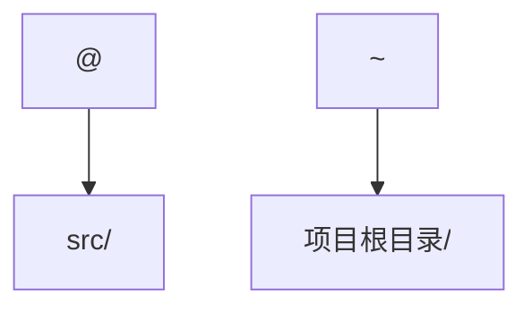
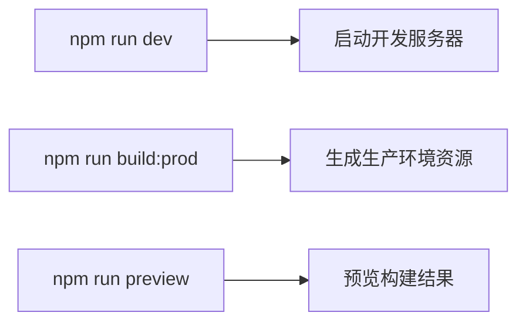

# 构建与部署流程

<cite>
**Referenced Files in This Document**   
- [vite.config.js](file://daoju/vite.config.js)
- [package.json](file://daoju/package.json)
- [.env.development](file://daoju/.env.development)
- [.env.production](file://daoju/.env.production)
- [vite/plugins/index.js](file://daoju/vite/plugins/index.js)
- [vite/plugins/compression.js](file://daoju/vite/plugins/compression.js)
- [src/main.js](file://daoju/src/main.js)
</cite>

## 目录
1. [构建配置详解](#构建配置详解)
2. [构建脚本与执行流程](#构建脚本与执行流程)
3. [多环境配置管理](#多环境配置管理)
4. [资源优化与压缩](#资源优化与压缩)
5. [部署上线流程](#部署上线流程)
6. [完整构建部署流程](#完整构建部署流程)

## 构建配置详解

本节详细说明 `vite.config.js` 文件中的核心构建配置，该文件是 KnifeManager 项目构建过程的中心配置。

### 基础路径与部署配置

`vite.config.js` 文件通过 `base` 配置项定义了应用的部署基础路径。该配置根据当前环境动态设置，确保应用在不同部署场景下都能正确加载资源。当环境变量 `VITE_APP_ENV` 为 `production` 时，基础路径设置为根路径 `/`，适用于生产环境的部署。

**Section sources**
- [vite.config.js](file://daoju/vite.config.js#L15)

### 路径别名配置

为了简化模块导入并提高代码可读性，项目配置了路径别名。`@` 别名指向 `src` 目录，使得开发者可以使用 `@/components/Button` 这样的简洁路径来导入组件，而不是使用冗长的相对路径。`~` 别名则指向项目根目录，方便在样式文件中引用全局资源。

**Diagram sources**
- [vite.config.js](file://daoju/vite.config.js#L23)

### 开发服务器与代理设置

开发服务器配置了关键的代理功能，以解决开发过程中的跨域问题。通过 `server.proxy` 配置，所有以 `/dev-api` 开头的请求都会被代理到后端服务 `http://localhost:8080`。代理规则还包含 `rewrite` 函数，用于在转发请求前移除 `/dev-api` 前缀，确保后端服务接收到正确的API路径。此外，配置还支持对 `v3/api-docs` 的代理，用于集成Swagger文档。

**Section sources**
- [vite.config.js](file://daoju/vite.config.js#L48-L59)

### 构建输出配置

`build` 配置对象定义了生产环境构建的输出行为。`outDir` 指定了构建产物的输出目录为 `dist`，这是标准的前端构建输出目录。`assetsDir` 设置了静态资源的子目录为 `assets`。`rollupOptions` 进一步细化了输出文件的命名规则，将JavaScript文件、入口文件和静态资源分别输出到 `static/js/` 和 `static/[ext]/` 目录下，并使用 `[name]-[hash]` 的命名模式，以实现缓存失效和资源优化。

**Section sources**
- [vite.config.js](file://daoju/vite.config.js#L29-L41)

## 构建脚本与执行流程

`package.json` 文件中的 `scripts` 字段定义了项目可用的构建命令，这些脚本是启动开发服务器和执行生产构建的入口。

### 核心构建脚本

- `dev`: 启动开发服务器，使用 Vite 的热重载功能，提供快速的开发体验。
- `build:prod`: 执行生产环境的构建，生成用于部署的静态文件。
- `build:stage`: 执行预发布环境的构建，通过 `--mode staging` 参数指定构建模式。
- `preview`: 启动一个本地服务器来预览 `dist` 目录中的构建产物，用于在部署前验证构建结果。

**Section sources**
- [package.json](file://daoju/package.json#L9-L12)

## 多环境配置管理

KnifeManager 项目采用基于 `.env` 文件的环境配置管理策略，确保不同环境（开发、测试、生产）的配置隔离和可靠性。

### 环境变量文件

项目根目录下的 `.env.development` 和 `.env.production` 文件分别定义了开发环境和生产环境的专属配置。Vite 会根据启动时的 `mode` 参数自动加载对应的文件。例如，`VITE_APP_TITLE` 在开发环境中设置为“刀具柜管理系统”，而在生产环境中则为“若依管理系统”。

### 环境变量加载机制

`vite.config.js` 中的 `loadEnv(mode, process.cwd())` 函数负责加载环境变量。它会读取以 `VITE_` 为前缀的变量，并将其注入到构建过程中。这些变量可以在代码中通过 `import.meta.env.VITE_APP_TITLE` 的方式安全访问，确保了配置的可维护性和安全性。

**Section sources**
- [.env.development](file://daoju/.env.development)
- [.env.production](file://daoju/.env.production)
- [vite.config.js](file://daoju/vite.config.js#L9-L10)

## 资源优化与压缩

项目通过插件系统实现了高级的资源优化，特别是在生产构建时启用文件压缩以减小包体积。

### 压缩插件配置

`vite/plugins/compression.js` 文件定义了压缩插件的创建逻辑。该插件根据环境变量 `VITE_BUILD_COMPRESS` 的值来决定是否启用压缩以及使用何种压缩算法（gzip 或 brotli）。当 `build` 模式为 `true` 时，`createVitePlugins` 函数会将压缩插件添加到插件列表中。

**Diagram sources**
- [vite/plugins/compression.js](file://daoju/vite/plugins/compression.js)
- [vite/plugins/index.js](file://daoju/vite/plugins/index.js#L13)

## 部署上线流程

完成构建后，生成的 `dist` 目录包含了所有静态资源，可以部署到任何静态文件服务器上。

### 部署到 Nginx

1.  将 `dist` 目录中的所有文件复制到 Nginx 的 `html` 目录下。
2.  配置 Nginx 服务器块，确保 `root` 指令指向 `dist` 目录。
3.  为单页应用（SPA）配置 `try_files` 指令，将所有非资源请求重定向到 `index.html`，以支持前端路由。
4.  如果启用了压缩，确保 Nginx 配置能正确服务 `.gz` 或 `.br` 文件。

### 部署到云服务器

1.  通过 SSH 连接到云服务器。
2.  使用 `scp` 或 `rsync` 命令将 `dist` 目录同步到服务器的指定位置。
3.  在服务器上配置 Web 服务器（如 Nginx、Apache）或使用 Node.js 的 `serve` 包来托管静态文件。
4.  配置域名和 SSL 证书以实现 HTTPS 访问。

## 完整构建部署流程

以下是 KnifeManager 从代码到上线的完整流程：

1.  **开发与测试**: 开发者在本地运行 `npm run dev`，通过代理与后端交互进行开发。
2.  **环境配置**: 根据目标环境，确认 `.env` 文件中的配置项（如 `VITE_APP_ENV` 和 `VITE_BUILD_COMPRESS`）已正确设置。
3.  **执行构建**: 运行 `npm run build:prod` 命令。Vite 会：
    *   读取 `vite.config.js` 配置。
    *   加载 `production` 环境变量。
    *   应用路径别名和代理规则（构建时代理不生效）。
    *   执行打包、代码分割和资源优化。
    *   根据配置生成 `dist` 目录。
4.  **预览验证**: 运行 `npm run preview`，在本地检查 `dist` 目录的内容，确保应用功能正常。
5.  **部署上线**: 将 `dist` 目录上传至 Nginx 或云服务器，并完成服务器配置。
6.  **访问验证**: 通过浏览器访问部署地址，验证应用是否成功上线。

此流程确保了构建和部署过程的可重复性和可靠性，是 KnifeManager 项目持续交付的基础。

**Section sources**
- [vite.config.js](file://daoju/vite.config.js)
- [package.json](file://daoju/package.json)
- [vite/plugins/index.js](file://daoju/vite/plugins/index.js)