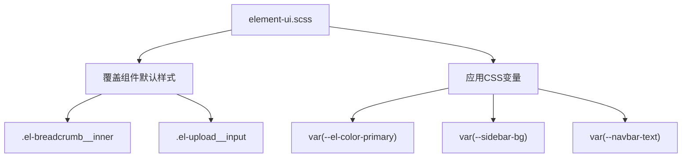
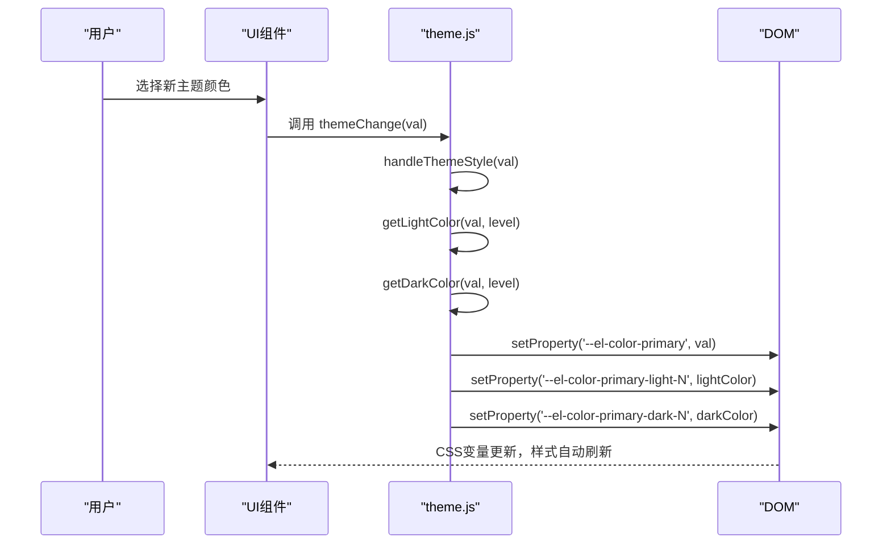
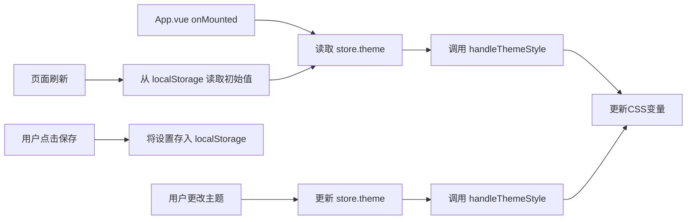

# 主题定制与动态切换

<cite>
**Referenced Files in This Document**   
- [element-ui.scss](file://daoju/src/assets/styles/element-ui.scss)
- [theme.js](file://daoju/src/utils/theme.js)
- [settings.js](file://daoju/src/settings.js)
- [settings.js](file://daoju/src/store/modules/settings.js)
- [index.vue](file://daoju/src/layout/components/Settings/index.vue)
- [variables.module.scss](file://daoju/src/assets/styles/variables.module.scss)
- [App.vue](file://daoju/src/App.vue)
</cite>

## 目录
1. [主题管理机制概述](#主题管理机制概述)
2. [静态主题配置：element-ui.scss](#静态主题配置element-uiscss)
3. [动态主题切换：theme.js](#动态主题切换themejs)
4. [主题状态管理与持久化](#主题状态管理与持久化)
5. [业务组件适配指南](#业务组件适配指南)
6. [常见问题与优化](#常见问题与优化)

## 主题管理机制概述

KnifeManager 的主题管理机制采用 CSS 变量（CSS Custom Properties）与 JavaScript 运行时控制相结合的方式，实现了对 Element Plus 组件库的深度视觉定制。该机制分为两个核心部分：静态的 SCSS 变量覆盖与动态的 CSS 变量运行时更新。系统通过 `element-ui.scss` 文件定义全局样式覆盖规则，通过 `theme.js` 提供动态主题切换的逻辑，并利用 Vuex 状态管理（`settings.js`）和 `localStorage` 实现主题配置的持久化存储，确保用户偏好在页面刷新后得以保留。

**Section sources**
- [element-ui.scss](file://daoju/src/assets/styles/element-ui.scss#L1-L96)
- [theme.js](file://daoju/src/utils/theme.js#L1-L49)
- [settings.js](file://daoju/src/settings.js#L1-L58)

## 静态主题配置：element-ui.scss

`element-ui.scss` 文件是主题视觉定制的基石，它通过覆盖 Element Plus 的默认样式来实现统一的设计系统。该文件主要包含两类配置：

1.  **组件样式覆盖**：文件中直接定义了对特定 Element Plus 组件的样式修改。例如，通过 `.el-breadcrumb__inner` 和 `.el-breadcrumb__inner a` 选择器移除了面包屑导航的粗体样式（`font-weight: 400 !important`），通过 `.el-upload__input` 选择器隐藏了上传组件的默认文件输入框。
2.  **CSS 变量应用**：文件中大量使用了 CSS 变量，如 `.el-dropdown .el-dropdown-link{ color: var(--el-color-primary) !important; }`。这表明组件的最终样式并非由硬编码的值决定，而是由在 `:root` 或 `html` 元素上定义的 `--el-color-primary` 等变量动态控制。这种设计将样式定义与具体值分离，为后续的动态主题切换提供了基础。

**Diagram sources**
- [element-ui.scss](file://daoju/src/assets/styles/element-ui.scss#L1-L96)
- [variables.module.scss](file://daoju/src/assets/styles/variables.module.scss#L69-L222)

**Section sources**
- [element-ui.scss](file://daoju/src/assets/styles/element-ui.scss#L1-L96)

## 动态主题切换：theme.js

`theme.js` 文件是动态主题功能的核心，它提供了在运行时修改应用主题的 JavaScript API。

### 核心函数 `handleThemeStyle`

该函数接收一个十六进制颜色字符串（如 `#409EFF`）作为参数，通过 `document.documentElement.style.setProperty()` 方法，动态地修改根元素上的 CSS 变量。其主要逻辑包括：
1.  **设置主色调**：直接将传入的颜色值赋给 `--el-color-primary` 变量。
2.  **生成明暗色阶**：调用 `getLightColor` 和 `getDarkColor` 函数，基于主色调生成从 `--el-color-primary-light-1` 到 `--el-color-primary-light-9` 以及 `--el-color-primary-dark-1` 到 `--el-color-primary-dark-9` 的色阶。这些色阶被 Element Plus 用于按钮悬停、背景填充等不同场景，确保了色彩系统的和谐统一。

### 颜色计算工具

`theme.js` 还包含了 `hexToRgb`、`rgbToHex`、`getLightColor` 和 `getDarkColor` 等辅助函数，用于在十六进制颜色和 RGB 颜色之间进行转换，并实现颜色的变浅和变深算法。

**Diagram sources**
- [theme.js](file://daoju/src/utils/theme.js#L1-L49)
- [index.vue](file://daoju/src/layout/components/Settings/index.vue#L124-L127)

**Section sources**
- [theme.js](file://daoju/src/utils/theme.js#L1-L49)

## 主题状态管理与持久化

主题的配置状态由 Vuex store 统一管理，并通过 `localStorage` 实现持久化。

### 状态定义

在 `store/modules/settings.js` 中，定义了 `theme` 和 `sideTheme` 等状态。`theme` 存储主色调的十六进制值，`sideTheme` 存储侧边栏是深色还是浅色主题。这些状态的初始值优先从 `localStorage` 中读取（`storageSetting.theme || '#409EFF'`），若无则使用默认值。

### 持久化流程

1.  **初始化**：在 `App.vue` 的 `onMounted` 生命周期钩子中，应用启动时会立即调用 `handleThemeStyle` 函数，根据 store 中的 `theme` 值初始化全局样式。
2.  **用户更改**：当用户在“系统布局配置”面板中更改主题颜色时，会触发 `themeChange` 函数。该函数首先更新 store 中的 `theme` 状态，然后立即调用 `handleThemeStyle` 更新 CSS 变量，实现即时的视觉反馈。
3.  **保存配置**：用户点击“保存配置”按钮时，`saveSetting` 函数会将当前所有的布局设置（包括 `theme` 和 `sideTheme`）序列化为 JSON 字符串，并存入 `localStorage` 的 `layout-setting` 键中。
4.  **重置配置**：用户点击“重置配置”时，会清除 `localStorage` 中的 `layout-setting`，并刷新页面，使应用恢复到默认设置。

**Diagram sources**
- [App.vue](file://daoju/src/App.vue#L1-L15)
- [settings.js](file://daoju/src/store/modules/settings.js#L1-L52)
- [index.vue](file://daoju/src/layout/components/Settings/index.vue#L134-L148)

**Section sources**
- [settings.js](file://daoju/src/settings.js#L1-L58)
- [settings.js](file://daoju/src/store/modules/settings.js#L1-L52)
- [index.vue](file://daoju/src/layout/components/Settings/index.vue#L1-L221)
- [App.vue](file://daoju/src/App.vue#L1-L15)

## 业务组件适配指南

在业务组件中适配主题非常简单，开发者应遵循以下原则：

1.  **使用 CSS 变量**：避免在组件样式中使用硬编码的颜色值。应优先使用项目中定义的 CSS 变量，如 `color: var(--el-color-primary);` 或 `background-color: var(--sidebar-bg);`。这样，当主题切换时，组件样式会自动随之改变。
2.  **响应式设计**：确保组件在深色模式和浅色模式下都具有良好的可读性和视觉效果。可以利用 `html.dark` 这个类选择器来为深色模式编写特定的覆盖样式。
3.  **集成设置面板**：如果业务组件需要独立的视觉配置，可以参考 `Settings/index.vue` 的实现，创建自己的设置面板，并将配置状态纳入全局 store 管理，同时考虑是否需要持久化。

**Section sources**
- [variables.module.scss](file://daoju/src/assets/styles/variables.module.scss#L69-L222)
- [index.vue](file://daoju/src/layout/components/Settings/index.vue#L1-L221)

## 常见问题与优化

### 常见问题排查

*   **主题切换后样式未生效**：检查业务组件的样式是否使用了 `!important` 规则或内联样式，这些可能会覆盖 CSS 变量。确保 `handleThemeStyle` 函数被正确调用，且传入的颜色值格式正确（如 `#RRGGBB`）。
*   **主题切换时出现闪烁**：这是由于 CSS 样式重新计算导致的。优化方法是确保主题切换逻辑在 DOM 渲染完成前执行，或使用 CSS 过渡动画来平滑过渡。

### 性能优化建议

*   **预加载主题样式**：对于支持的主题（如深色/浅色），可以预先在 CSS 中定义好所有变量，而不是在运行时通过 JavaScript 动态注入。这可以减少 JavaScript 执行时间，提升切换速度。
*   **减少不必要的重绘**：`handleThemeStyle` 函数会触发整个页面的重绘。如果只修改了少数几个变量，可以考虑更精细的控制，但通常 Element Plus 的设计已足够高效。

**Section sources**
- [theme.js](file://daoju/src/utils/theme.js#L1-L49)
- [variables.module.scss](file://daoju/src/assets/styles/variables.module.scss#L84-L222)