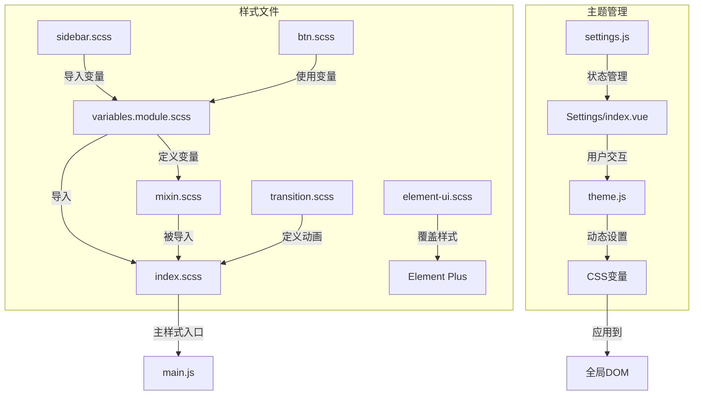
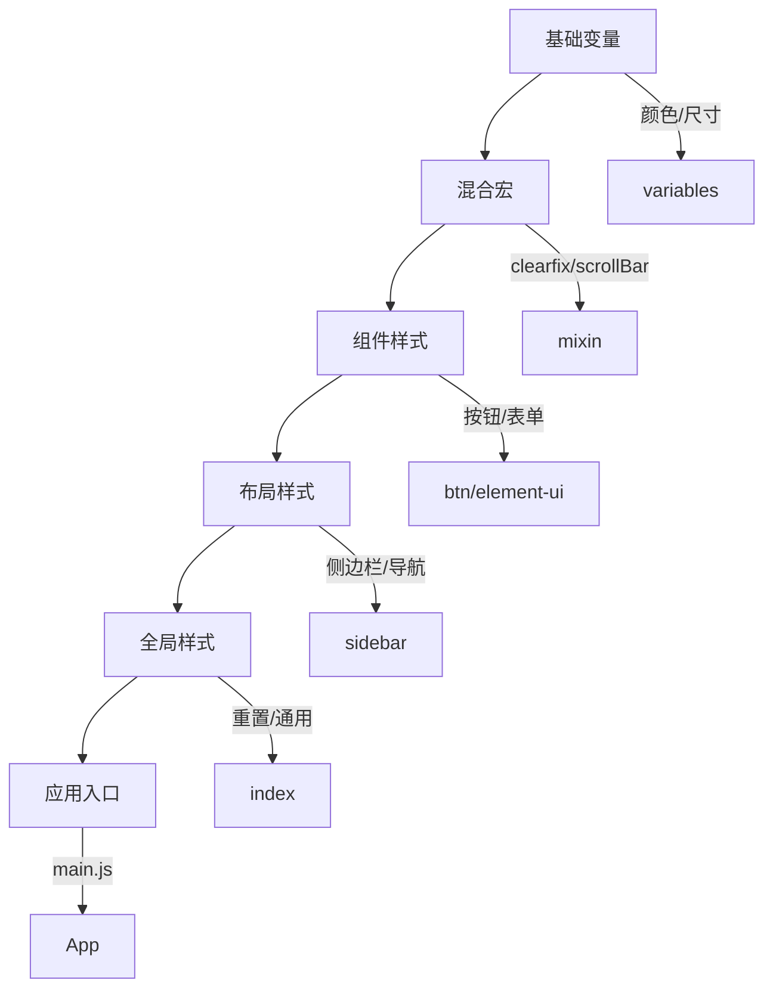
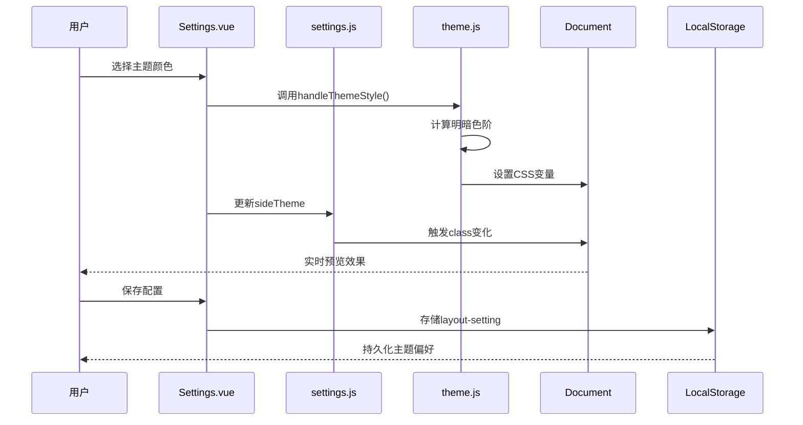
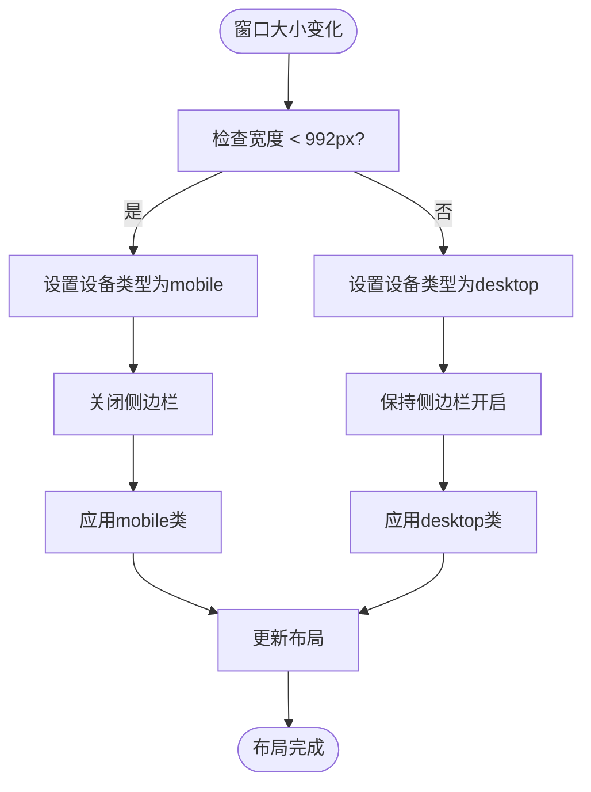

# 样式策略与主题

<cite>
**本文档引用文件**   
- [variables.module.scss](file://daoju/src/assets/styles/variables.module.scss)
- [mixin.scss](file://daoju/src/assets/styles/mixin.scss)
- [index.scss](file://daoju/src/assets/styles/index.scss)
- [sidebar.scss](file://daoju/src/assets/styles/sidebar.scss)
- [element-ui.scss](file://daoju/src/assets/styles/element-ui.scss)
- [btn.scss](file://daoju/src/assets/styles/btn.scss)
- [transition.scss](file://daoju/src/assets/styles/transition.scss)
- [theme.js](file://daoju/src/utils/theme.js)
- [Settings/index.vue](file://daoju/src/layout/components/Settings/index.vue)
- [settings.js](file://daoju/src/store/modules/settings.js)
- [Navbar.vue](file://daoju/src/layout/components/Navbar.vue)
- [index.vue](file://daoju/src/layout/index.vue)
</cite>

## 目录
1. [项目结构](#项目结构)
2. [核心组件](#核心组件)
3. [架构概览](#架构概览)
4. [详细组件分析](#详细组件分析)
5. [依赖分析](#依赖分析)
6. [性能考虑](#性能考虑)
7. [故障排除指南](#故障排除指南)
8. [结论](#结论)

## 项目结构

KnifeManager前端项目的样式架构采用模块化SCSS设计，所有样式文件集中存放在`src/assets/styles`目录下。项目通过SCSS变量、混合宏和模块化组织实现统一的视觉风格和高效的样式管理。



**图示来源**
- [variables.module.scss](file://daoju/src/assets/styles/variables.module.scss)
- [mixin.scss](file://daoju/src/assets/styles/mixin.scss)
- [index.scss](file://daoju/src/assets/styles/index.scss)
- [theme.js](file://daoju/src/utils/theme.js)
- [Settings/index.vue](file://daoju/src/layout/components/Settings/index.vue)

**本节来源**
- [variables.module.scss](file://daoju/src/assets/styles/variables.module.scss#L1-L222)
- [mixin.scss](file://daoju/src/assets/styles/mixin.scss#L1-L67)
- [index.scss](file://daoju/src/assets/styles/index.scss#L1-L180)

## 核心组件

项目的核心样式组件包括SCSS变量定义、混合宏封装、Element Plus组件库覆盖以及动态主题管理系统。通过`variables.module.scss`文件统一管理所有颜色和尺寸变量，`mixin.scss`提供可复用的样式片段，`element-ui.scss`专门用于覆盖Element Plus组件的默认样式。

**本节来源**
- [variables.module.scss](file://daoju/src/assets/styles/variables.module.scss#L1-L222)
- [mixin.scss](file://daoju/src/assets/styles/mixin.scss#L1-L67)
- [element-ui.scss](file://daoju/src/assets/styles/element-ui.scss#L1-L96)

## 架构概览

KnifeManager的样式架构采用分层设计模式，从基础变量到组件样式再到布局样式逐层构建。最底层是`variables.module.scss`定义的设计系统变量，中间层是`mixin.scss`提供的功能型样式混合宏，上层是具体组件和布局的样式文件，最终通过`index.scss`统一导入应用。



**图示来源**
- [variables.module.scss](file://daoju/src/assets/styles/variables.module.scss#L1-L222)
- [mixin.scss](file://daoju/src/assets/styles/mixin.scss#L1-L67)
- [btn.scss](file://daoju/src/assets/styles/btn.scss#L1-L100)
- [sidebar.scss](file://daoju/src/assets/styles/sidebar.scss#L1-L239)

## 详细组件分析

### SCSS变量与混合宏分析

项目通过SCSS模块化系统实现了高效的样式管理。`variables.module.scss`不仅定义了Sass变量，还通过`:export`语法将变量导出为JavaScript可用的对象，实现了样式与逻辑的双向通信。

```mermaid
classDiagram
class Variables {
+$blue : #324157
+$menuText : #bfcbd9
+$sideBarWidth : 200px
+$--color-primary : #409EFF
+--sidebar-bg : #304156
+--navbar-bg : #ffffff
}
class Mixins {
+clearfix()
+scrollBar()
+relative()
+pct($pct)
+triangle($w,$h,$c,$d)
}
class CSSVariables {
+--sidebar-bg
+--sidebar-text
+--menu-hover
+--navbar-bg
+--navbar-text
+--tags-bg
+--tags-item-bg
}
Variables --> CSSVariables : "编译为"
Mixins --> Variables : "使用"
CSSVariables --> "DOM元素" : "应用"
```

**图示来源**
- [variables.module.scss](file://daoju/src/assets/styles/variables.module.scss#L1-L222)
- [mixin.scss](file://daoju/src/assets/styles/mixin.scss#L1-L67)

### 主题管理方案分析

KnifeManager实现了完整的主题管理系统，支持亮色、暗色两种主题模式以及自定义主色调。系统通过CSS变量和JavaScript动态修改相结合的方式实现即时主题切换。



**图示来源**
- [theme.js](file://daoju/src/utils/theme.js#L1-L50)
- [Settings/index.vue](file://daoju/src/layout/components/Settings/index.vue#L1-L221)
- [settings.js](file://daoju/src/store/modules/settings.js#L1-L52)

### 响应式设计实现

项目通过CSS媒体查询和Vue响应式系统相结合的方式实现多设备适配。当屏幕宽度小于992px时，自动切换为移动端布局，侧边栏默认收起，导航栏布局调整。



**图示来源**
- [index.vue](file://daoju/src/layout/index.vue#L1-L112)
- [settings.js](file://daoju/src/store/modules/settings.js#L1-L52)

## 依赖分析

项目样式系统的依赖关系清晰，形成了从基础到应用的完整链条。SCSS文件之间通过`@use`指令建立模块化依赖，JavaScript与样式系统通过CSS变量进行通信，Vue组件则通过class绑定应用样式。

```mermaid
dependencyDiagram
variables.module.scss --> mixin.scss : "@use"
variables.module.scss --> sidebar.scss : "@use"
variables.module.scss --> btn.scss : "@use"
mixin.scss --> index.scss : "@use"
element-ui.scss --> index.scss : "@use"
transition.scss --> index.scss : "@use"
sidebar.scss --> index.scss : "@use"
btn.scss --> index.scss : "@use"
theme.js --> DOM : "document.documentElement.style.setProperty"
Settings.vue --> theme.js : "import"
Settings.vue --> settings.js : "import"
index.vue --> settings.js : "import"
```

**图示来源**
- [variables.module.scss](file://daoju/src/assets/styles/variables.module.scss)
- [mixin.scss](file://daoju/src/assets/styles/mixin.scss)
- [index.scss](file://daoju/src/assets/styles/index.scss)
- [theme.js](file://daoju/src/utils/theme.js)
- [Settings/index.vue](file://daoju/src/layout/components/Settings/index.vue)
- [settings.js](file://daoju/src/store/modules/settings.js)

**本节来源**
- [variables.module.scss](file://daoju/src/assets/styles/variables.module.scss#L1-L222)
- [mixin.scss](file://daoju/src/assets/styles/mixin.scss#L1-L67)
- [index.scss](file://daoju/src/assets/styles/index.scss#L1-L180)
- [theme.js](file://daoju/src/utils/theme.js#L1-L50)

## 性能考虑

项目在样式性能方面做了多项优化：使用SCSS模块化减少重复代码，通过CSS变量实现主题切换避免样式重载，利用Vue的响应式系统最小化DOM操作。动画效果采用CSS3 transition而非JavaScript实现，确保流畅的用户体验。

## 故障排除指南

当遇到主题切换无效的问题时，应检查`theme.js`中的CSS变量设置是否正确执行，确认`settingsStore`状态是否同步更新。若样式显示异常，需验证SCSS文件的导入顺序，确保`variables.module.scss`在其他样式文件之前加载。

**本节来源**
- [theme.js](file://daoju/src/utils/theme.js#L1-L50)
- [settings.js](file://daoju/src/store/modules/settings.js#L1-L52)
- [Settings/index.vue](file://daoju/src/layout/components/Settings/index.vue#L1-L221)

## 结论

KnifeManager的前端样式架构体现了现代化Vue应用的最佳实践。通过SCSS模块化设计实现了样式的可维护性，利用CSS变量和JavaScript结合的方式提供了灵活的主题定制能力，配合Vue的响应式系统确保了良好的用户体验。该架构既满足了当前项目的需求，也为未来的扩展留下了充足的空间。