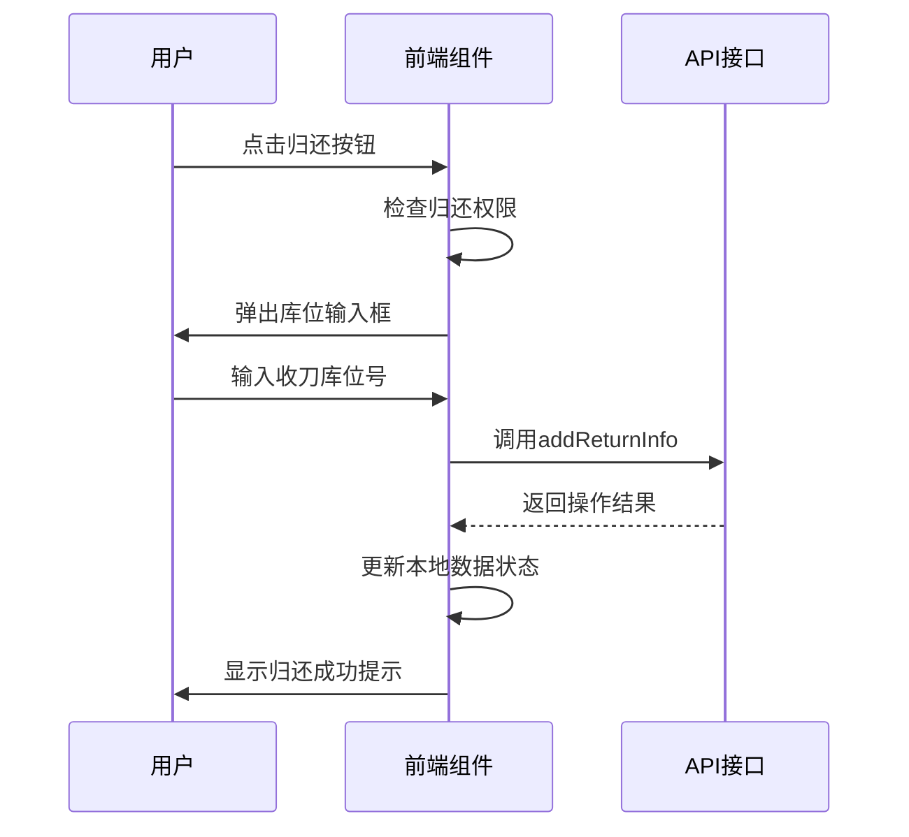
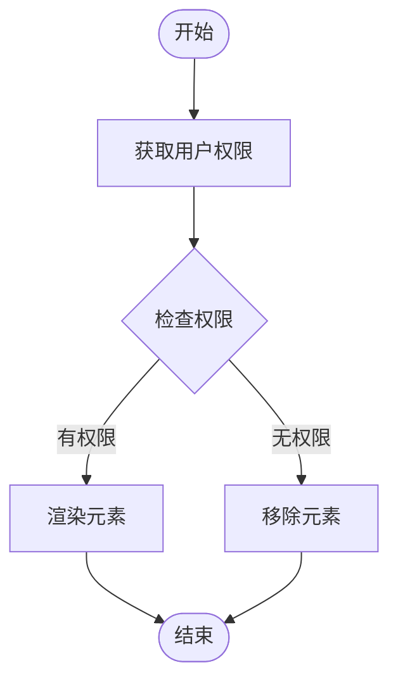

# 借还管理

<cite>
**本文档引用文件**  
- [daoBingBorrow/index.vue](file://daoju\src\views\borrowManagement\daoBingBorrow\index.vue)
- [daoTouBorrow/index.vue](file://daoju\src\views\borrowManagement\daoTouBorrow\index.vue)
- [returnInfo.js](file://daoju\src\api\borrowReturnInfo\returnInfo.js)
- [collectInfo.js](file://daoju\src\api\borrowReturnInfo\collectInfo.js)
- [hasPermi.js](file://daoju\src\directive\permission\hasPermi.js)
- [permission.js](file://daoju\src\utils\permission.js)
</cite>

## 目录
1. [借出与归还流程概述](#借出与归还流程概述)
2. [表单数据绑定与校验机制](#表单数据绑定与校验机制)
3. [借出申请提交处理逻辑](#借出申请提交处理逻辑)
4. [归还操作实现机制](#归还操作实现机制)
5. [状态转换与重复操作拦截](#状态转换与重复操作拦截)
6. [异常情况处理](#异常情况处理)
7. [权限指令hasPermi应用](#权限指令haspermi应用)

## 借出与归还流程概述

刀头与刀柄的借出归还流程通过`daoTouBorrow`和`daoBingBorrow`页面组件实现，用户可发起借出请求并完成归还操作。系统通过`returnInfo`和`collectInfo`API接口处理借还业务数据，形成完整的业务链路。借出流程包括表单填写、数据校验、提交处理等环节；归还流程则包含归还确认、库位分配、状态更新等步骤。

**本节来源**  
- [daoTouBorrow/index.vue](file://daoju\src\views\borrowManagement\daoTouBorrow\index.vue#L1-L846)
- [daoBingBorrow/index.vue](file://daoju\src\views\borrowManagement\daoBingBorrow\index.vue#L1-L683)

## 表单数据绑定与校验机制

借出表单通过`v-model`实现双向数据绑定，将用户输入与`borrowForm`响应式对象关联。表单包含借出人、品牌、规格、数量、预计归还时间等字段，其中借出人信息自动填充当前登录用户数据。校验规则配置在`borrowFormRules`中，采用Element Plus的验证机制，对必填项、数值范围等进行约束。例如，借出数量需大于0，预计归还时间不能为空。

**本节来源**  
- [daoTouBorrow/index.vue](file://daoju\src\views\borrowManagement\daoTouBorrow\index.vue#L401-L429)
- [daoBingBorrow/index.vue](file://daoju\src\views\borrowManagement\daoBingBorrow\index.vue#L401-L420)

## 借出申请提交处理逻辑

借出申请提交通过`submitBorrowForm`方法处理。该方法首先调用表单验证，验证通过后构造提交数据，包含借出单号、借出人信息、工具规格、数量、借出日期及状态等。借出单号由`generateBorrowCode`函数生成，采用前缀加日期加序号的格式（刀头为BOR，刀柄为HBR）。提交时根据是否为编辑状态决定新增或修改操作，最终调用相应API完成数据持久化。

**本节来源**  
- [daoTouBorrow/index.vue](file://daoju\src\views\borrowManagement\daoTouBorrow\index.vue#L502-L534)
- [daoBingBorrow/index.vue](file://daoju\src\views\borrowManagement\daoBingBorrow\index.vue#L489-L520)

## 归还操作实现机制

归还操作通过`handleReturn`方法实现，支持单条和批量归还。执行归还前会检查权限，确保只能归还本人借出的工具。归还时弹出对话框收集收刀库位号信息，构建包含柜体编码、库位列表、操作类型等参数的请求体。对于批量归还，采用轮询分配策略将归还项分配至不同库位。实际归还时间在提交时自动生成，并更新记录状态。

**图示来源**  
- [daoTouBorrow/index.vue](file://daoju\src\views\borrowManagement\daoTouBorrow\index.vue#L568-L632)
- [returnInfo.js](file://daoju\src\api\borrowReturnInfo\returnInfo.js#L20-L27)

**本节来源**  
- [daoTouBorrow/index.vue](file://daoju\src\views\borrowManagement\daoTouBorrow\index.vue#L568-L632)
- [returnInfo.js](file://daoju\src\api\borrowReturnInfo\returnInfo.js#L20-L27)

## 状态转换与重复操作拦截

系统定义了多种借还状态：已借出(borrowed)、已归还(returned)、逾期未还(overdue)、报废(scrapped)、已暂存(temp_stored)。状态转换遵循严格规则，如已归还的记录不能再执行归还操作。通过`canReturn`函数拦截重复归还，检查记录状态和借出人身份。批量操作时会筛选出符合条件的可归还项，避免对已归还或他人借出的记录进行操作。

**本节来源**  
- [daoTouBorrow/index.vue](file://daoju\src\views\borrowManagement\daoTouBorrow\index.vue#L703-L706)
- [daoBingBorrow/index.vue](file://daoju\src\views\borrowManagement\daoBingBorrow\index.vue#L551-L554)

## 异常情况处理

系统对库存不足等异常情况进行预判和处理。虽然当前代码主要为前端逻辑，但通过表单校验和业务规则约束来防范异常。例如，在借出时会检查可用刀具列表，确保选择的规格存在。归还时若输入的库位号无效，后端API会返回错误。对于网络异常或API调用失败，前端通过try-catch捕获错误并给出友好提示。

**本节来源**  
- [daoTouBorrow/index.vue](file://daoju\src\views\borrowManagement\daoTouBorrow\index.vue#L529-L531)
- [daoBingBorrow/index.vue](file://daoju\src\views\borrowManagement\daoBingBorrow\index.vue#L514-L517)

## 权限指令hasPermi应用

`hasPermi`指令用于控制借还按钮的显示权限。该指令在`hasPermi.js`中定义，通过比对用户权限集合与所需权限标识来决定是否渲染元素。若用户无相应权限，指令会将元素从DOM中移除。权限校验基于用户角色和权限码，支持通配符匹配。例如，`*:*:*`表示所有权限，`:*`表示模块级通配权限。

**图示来源**  
- [hasPermi.js](file://daoju\src\directive\permission\hasPermi.js#L1-L28)
- [permission.js](file://daoju\src\utils\permission.js#L63-L83)

**本节来源**  
- [hasPermi.js](file://daoju\src\directive\permission\hasPermi.js#L1-L28)
- [permission.js](file://daoju\src\utils\permission.js#L63-L83)