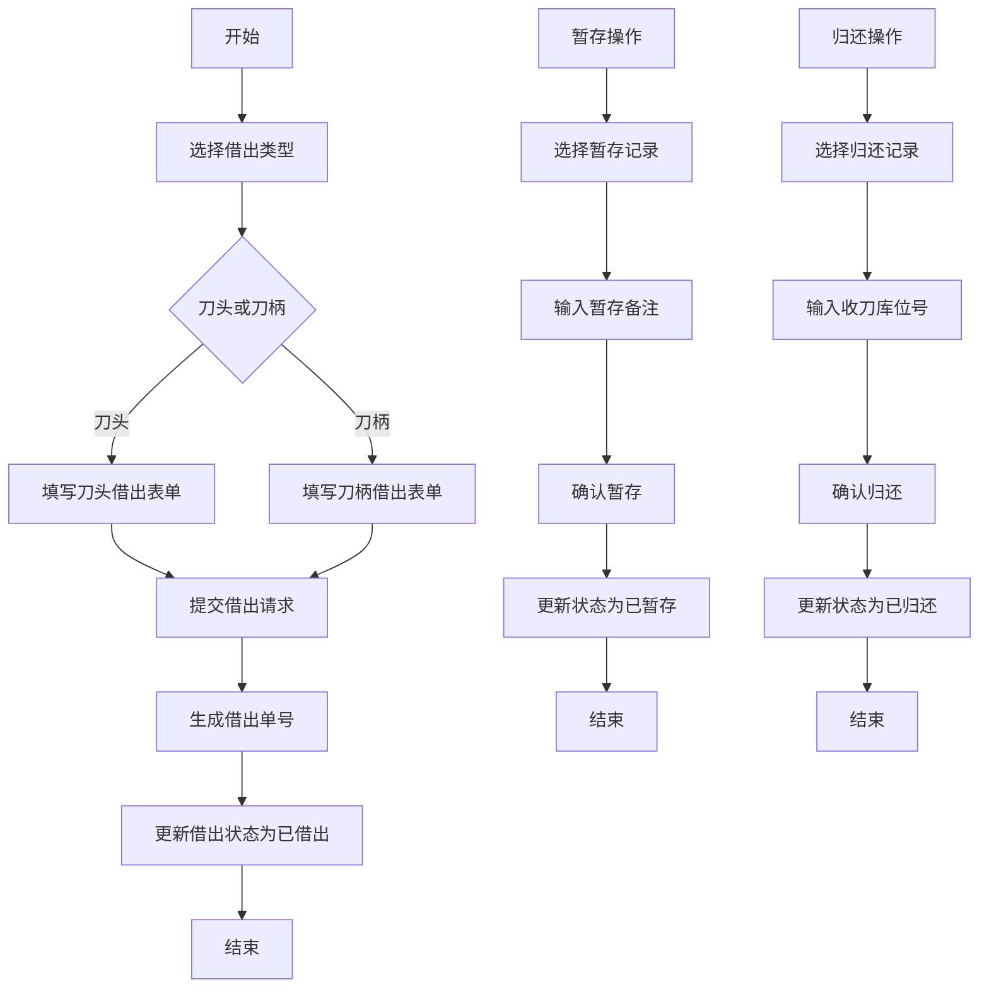
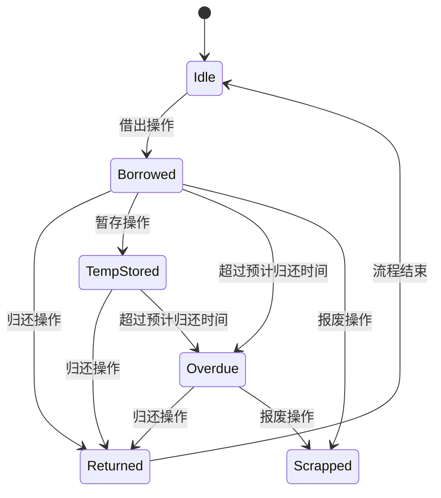
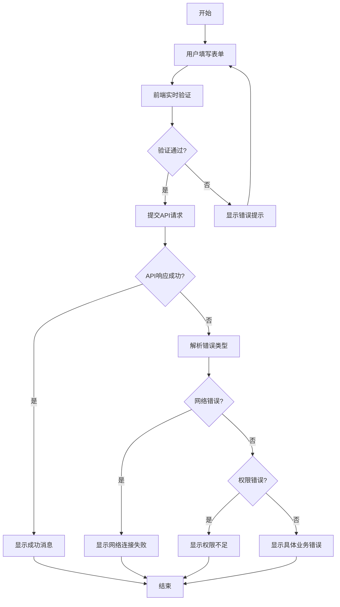
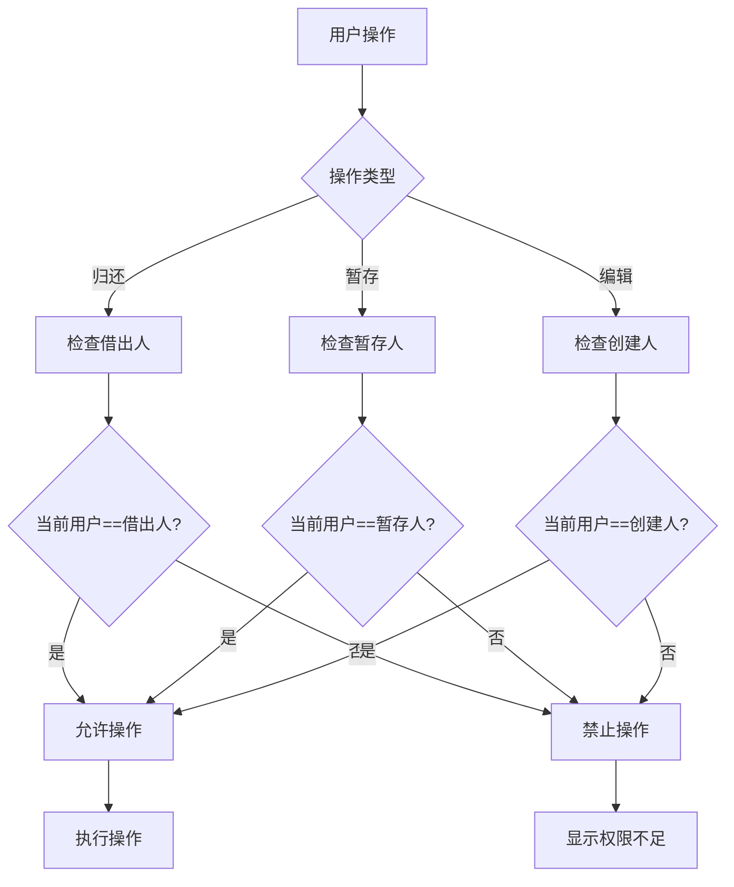

# 工具管理

<cite>
**本文档引用文件**   
- [daoTouBorrow/index.vue](file://daoju\src\views\borrowManagement\daoTouBorrow\index.vue)
- [daoBingBorrow/index.vue](file://daoju\src\views\borrowManagement\daoBingBorrow\index.vue)
- [daoTouTemporaryStorage/index.vue](file://daoju\src\views\borrowManagement\daoTouTemporaryStorage\index.vue)
- [daoBingTemporaryStorage/index.vue](file://daoju\src\views\borrowManagement\daoBingTemporaryStorage\index.vue)
- [collectInfo.js](file://daoju\src\api\borrowReturnInfo\collectInfo.js)
- [returnInfo.js](file://daoju\src\api\borrowReturnInfo\returnInfo.js)
</cite>

## 目录
1. [功能概述](#功能概述)
2. [借出与暂存操作流程](#借出与暂存操作流程)
3. [状态机设计](#状态机设计)
4. [表单验证与异常处理](#表单验证与异常处理)
5. [权限控制机制](#权限控制机制)
6. [典型问题解决方案](#典型问题解决方案)

## 功能概述

KnifeManager系统提供完整的工具管理功能，涵盖刀头借出、刀柄借出、收刀、还刀及暂存等核心操作。系统通过Vue前端组件与后端API接口协同工作，实现用户操作与服务端的完整交互链路。主要功能模块包括刀头借出管理、刀柄借出管理、暂存管理以及归还流程管理，支持搜索、批量操作和记录导出等辅助功能。

**Section sources**
- [daoTouBorrow/index.vue](file://daoju\src\views\borrowManagement\daoTouBorrow\index.vue#L1-L846)
- [daoBingBorrow/index.vue](file://daoju\src\views\borrowManagement\daoBingBorrow\index.vue#L1-L683)

## 借出与暂存操作流程

系统提供独立的刀头和刀柄借出管理界面，用户可通过新增借出按钮发起借出请求。借出表单包含借出人信息、工具品牌、型号、数量、预计归还时间等必填字段。系统自动生成借出单号，并自动填充当前登录用户信息。暂存操作允许用户将已借出的工具临时存放，支持个人暂存和公共暂存两种类型。归还操作需要指定收刀库位号，系统支持单个或批量归还功能。

**Diagram sources **
- [daoTouBorrow/index.vue](file://daoju\src\views\borrowManagement\daoTouBorrow\index.vue#L1-L846)
- [daoBingBorrow/index.vue](file://daoju\src\views\borrowManagement\daoBingBorrow\index.vue#L1-L683)
- [daoTouTemporaryStorage/index.vue](file://daoju\src\views\borrowManagement\daoTouTemporaryStorage\index.vue#L1-L888)
- [daoBingTemporaryStorage/index.vue](file://daoju\src\views\borrowManagement\daoBingTemporaryStorage\index.vue#L1-L882)

**Section sources**
- [daoTouBorrow/index.vue](file://daoju\src\views\borrowManagement\daoTouBorrow\index.vue#L1-L846)
- [daoBingBorrow/index.vue](file://daoju\src\views\borrowManagement\daoBingBorrow\index.vue#L1-L683)
- [daoTouTemporaryStorage/index.vue](file://daoju\src\views\borrowManagement\daoTouTemporaryStorage\index.vue#L1-L888)
- [daoBingTemporaryStorage/index.vue](file://daoju\src\views\borrowManagement\daoBingTemporaryStorage\index.vue#L1-L882)

## 状态机设计

系统采用基于状态的管理机制，定义了完整的工具生命周期状态。借出状态包括"已借出"、"已归还"、"逾期未还"、"报废"和"已暂存"五种状态。状态转换遵循严格的业务规则：只有借出人本人才能执行归还操作；暂存状态可由借出状态转换而来；归还操作会将状态从"已借出"或"已暂存"变为"已归还"。系统通过状态标签直观展示当前工具状态，并在操作按钮上根据状态和权限进行动态控制。

**Diagram sources **
- [daoTouBorrow/index.vue](file://daoju\src\views\borrowManagement\daoTouBorrow\index.vue#L63-L75)
- [daoBingBorrow/index.vue](file://daoju\src\views\borrowManagement\daoBingBorrow\index.vue#L63-L73)

**Section sources**
- [daoTouBorrow/index.vue](file://daoju\src\views\borrowManagement\daoTouBorrow\index.vue#L23-L28)
- [daoBingBorrow/index.vue](file://daoju\src\views\borrowManagement\daoBingBorrow\index.vue#L23-L28)

## 表单验证与异常处理

系统实现了完善的表单验证机制，确保数据的完整性和准确性。借出表单对品牌、型号、数量和预计归还时间等关键字段进行必填验证和格式校验。数量字段限制为1-99之间的整数，预计归还时间必须为有效日期。系统采用前端验证与后端验证相结合的方式，在用户提交表单前进行实时验证，并在API调用时进行二次验证。异常处理策略包括输入验证失败提示、网络请求错误处理、权限不足提示等，通过Element Plus的消息组件向用户反馈操作结果。

**Diagram sources **
- [daoTouBorrow/index.vue](file://daoju\src\views\borrowManagement\daoTouBorrow\index.vue#L414-L429)
- [daoBingBorrow/index.vue](file://daoju\src\views\borrowManagement\daoBingBorrow\index.vue#L402-L419)

**Section sources**
- [daoTouBorrow/index.vue](file://daoju\src\views\borrowManagement\daoTouBorrow\index.vue#L414-L429)
- [daoBingBorrow/index.vue](file://daoju\src\views\borrowManagement\daoBingBorrow\index.vue#L402-L419)

## 权限控制机制

系统实施细粒度的权限控制，确保操作的安全性。按钮级权限控制基于用户角色和操作上下文动态显示或禁用。核心权限规则包括：只有借出人本人才能归还工具，系统通过比对当前登录用户编号与借出记录中的借出人编号来验证权限；暂存操作同样遵循此规则。权限校验在前端界面和后端API两个层面同时进行，前端根据权限状态控制按钮的可点击性，后端在接收到请求时再次验证权限，防止绕过前端验证的非法操作。

**Diagram sources **
- [daoTouBorrow/index.vue](file://daoju\src\views\borrowManagement\daoTouBorrow\index.vue#L84-L95)
- [daoBingBorrow/index.vue](file://daoju\src\views\borrowManagement\daoBingBorrow\index.vue#L82-L93)

**Section sources**
- [daoTouBorrow/index.vue](file://daoju\src\views\borrowManagement\daoTouBorrow\index.vue#L704-L706)
- [daoBingBorrow/index.vue](file://daoju\src\views\borrowManagement\daoBingBorrow\index.vue#L552-L554)

## 典型问题解决方案

针对重复借出等典型问题，系统采用多种策略进行预防和处理。对于同一工具的重复借出请求，系统在提交时会检查当前用户的未归还记录，若存在相同工具的借出记录则阻止新的借出操作。暂存机制为用户提供灵活的工具管理方式，避免因临时中断工作而导致的资源浪费。系统还提供批量归还功能，支持用户一次性归还多个工具，提高操作效率。对于逾期未还的情况，系统会在列表中突出显示，并可通过预警系统发送提醒。

**Section sources**
- [daoTouBorrow/index.vue](file://daoju\src\views\borrowManagement\daoTouBorrow\index.vue#L716-L734)
- [daoBingBorrow/index.vue](file://daoju\src\views\borrowManagement\daoBingBorrow\index.vue#L615-L633)