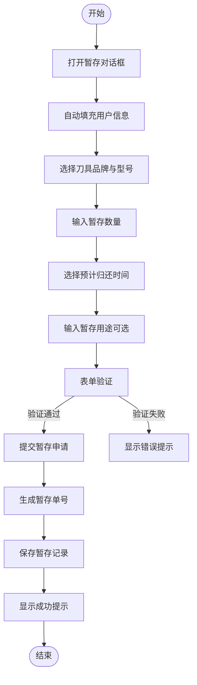
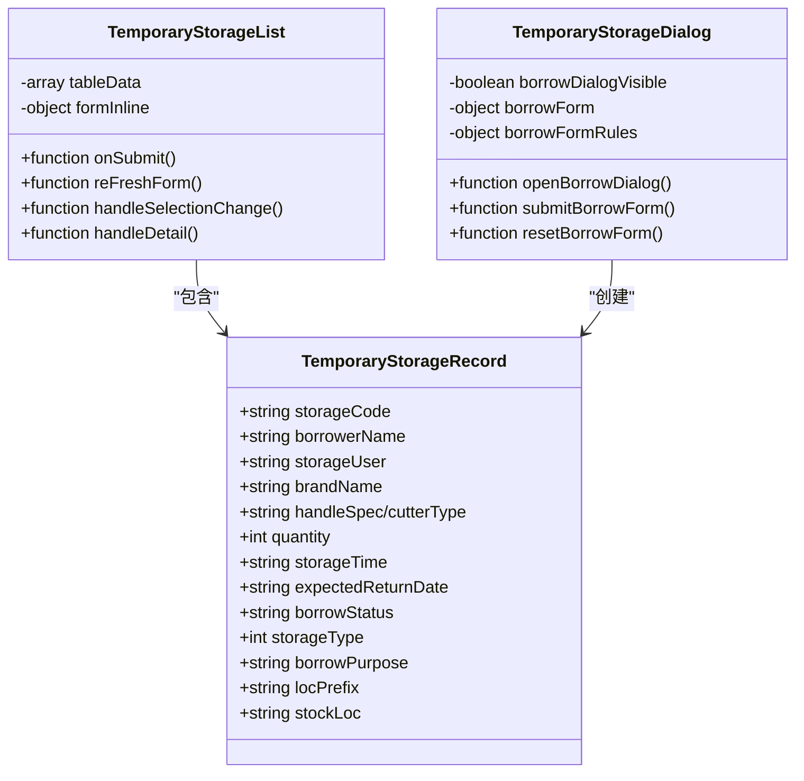
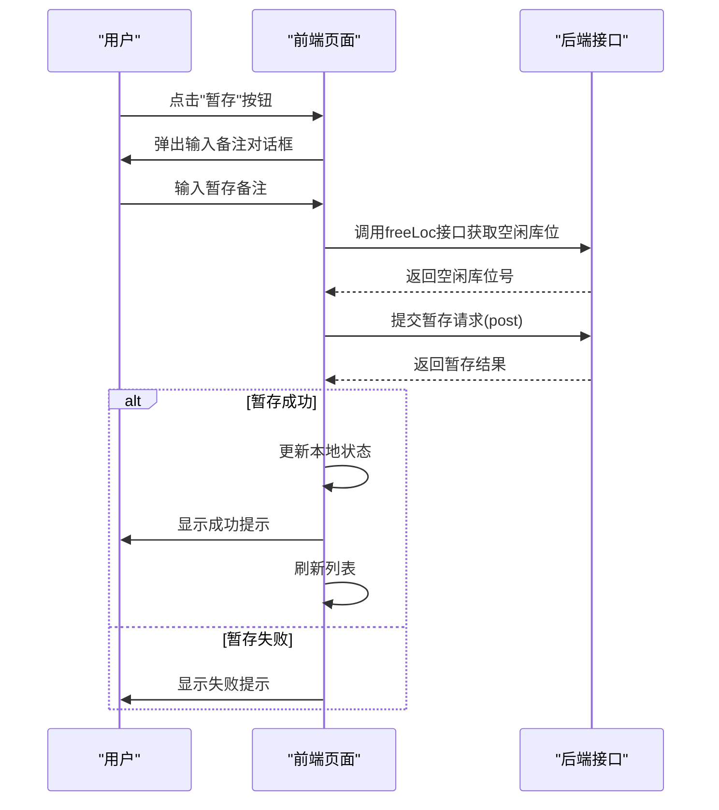

# 暂存管理

<cite>
**本文档引用文件**   
- [daoBingTemporaryStorage/index.vue](file://daoju\src\views\borrowManagement\daoBingTemporaryStorage\index.vue)
- [daoTouTemporaryStorage/index.vue](file://daoju\src\views\borrowManagement\daoTouTemporaryStorage\index.vue)
- [collectInfo.js](file://daoju\src\api\borrowReturnInfo\collectInfo.js)
- [publicStorage.js](file://daoju\src\api\historyRecord\publicStorage.js)
- [publicStorage/index.vue](file://daoju\src\views\historyRecord\publicStorage\index.vue)
</cite>

## 目录
1. [功能概述](#功能概述)
2. [暂存申请流程](#暂存申请流程)
3. [暂存列表展示](#暂存列表展示)
4. [暂存恢复操作](#暂存恢复操作)
5. [数据提交与查询机制](#数据提交与查询机制)
6. [业务逻辑规则](#业务逻辑规则)
7. [权限控制实现](#权限控制实现)
8. [错误处理策略](#错误处理策略)

## 功能概述

本系统提供刀头与刀柄的暂存管理功能，涵盖暂存申请、列表展示及恢复操作。通过 `daoBingTemporaryStorage` 和 `daoTouTemporaryStorage` 页面组件实现对刀柄和刀头的暂存管理，结合 `collectInfo` API 接口完成数据的提交、查询与状态更新。系统支持公共暂存和个人暂存两种模式，并具备完善的权限控制机制。

**Section sources**
- [daoBingTemporaryStorage/index.vue](file://daoju\src\views\borrowManagement\daoBingTemporaryStorage\index.vue#L1-L882)
- [daoTouTemporaryStorage/index.vue](file://daoju\src\views\borrowManagement\daoTouTemporaryStorage\index.vue#L1-L888)

## 暂存申请流程

用户可通过点击“新增暂存”按钮打开暂存申请对话框。系统自动填充当前登录用户信息，包括暂存人姓名和编号。用户需选择刀具品牌、型号、暂存数量及预计归还时间等信息。表单包含完整的验证规则，确保输入数据的完整性与准确性。

对于刀柄暂存，用户还需选择刀柄类型（如BT、HSK等）；对于刀头暂存，则直接选择刀头型号。暂存用途为可选字段，允许输入最多200字符的备注信息。提交后，系统生成唯一的暂存单号（以HBR或BOR开头），并记录暂存时间。



**Diagram sources**
- [daoBingTemporaryStorage/index.vue](file://daoju\src\views\borrowManagement\daoBingTemporaryStorage\index.vue#L131-L292)
- [daoTouTemporaryStorage/index.vue](file://daoju\src\views\borrowManagement\daoTouTemporaryStorage\index.vue#L129-L271)

**Section sources**
- [daoBingTemporaryStorage/index.vue](file://daoju\src\views\borrowManagement\daoBingTemporaryStorage\index.vue#L450-L462)
- [daoTouTemporaryStorage/index.vue](file://daoju\src\views\borrowManagement\daoTouTemporaryStorage\index.vue#L452-L468)

## 暂存列表展示

暂存列表以表格形式展示所有暂存记录，包含暂存单号、暂存人、刀具信息、暂存数量、时间等关键字段。支持按暂存单号、暂存人、品牌、型号、状态和时间进行搜索过滤。表格提供多选功能，便于批量操作。

暂存类型以标签形式显示，“公共暂存”为灰色标签，“个人暂存”为黄色标签。暂存状态同样使用标签区分：已暂存（黄色）、已归还（绿色）、逾期未还（红色）、报废（蓝色）。操作列包含编辑、归还、暂存和详情按钮，根据用户权限和记录状态动态显示。



**Diagram sources**
- [daoBingTemporaryStorage/index.vue](file://daoju\src\views\borrowManagement\daoBingTemporaryStorage\index.vue#L58-L127)
- [daoTouTemporaryStorage/index.vue](file://daoju\src\views\borrowManagement\daoTouTemporaryStorage\index.vue#L58-L126)

**Section sources**
- [daoBingTemporaryStorage/index.vue](file://daoju\src\views\borrowManagement\daoBingTemporaryStorage\index.vue#L60-L96)
- [daoTouTemporaryStorage/index.vue](file://daoju\src\views\borrowManagement\daoTouTemporaryStorage\index.vue#L60-L95)

## 暂存恢复操作

暂存恢复操作通过“暂存”按钮触发，用户需输入暂存备注。系统调用接口 `/qw/knife/app/from/mes/cabinet/freeLoc` 获取空闲库位号，确保刀具存放位置的有效性。暂存成功后，记录状态更新为“已暂存”，并记录暂存时间和备注信息。

批量归还功能允许用户选择多条记录进行统一处理。系统会校验所选记录是否均为当前用户本人暂存的项目，若存在非本人暂存的记录将给出提示。归还时需指定收刀库位号，支持多个库位号以逗号分隔输入，系统将平均分配数量。



**Diagram sources**
- [daoBingTemporaryStorage/index.vue](file://daoju\src\views\borrowManagement\daoBingTemporaryStorage\index.vue#L649-L716)
- [daoTouTemporaryStorage/index.vue](file://daoju\src\views\borrowManagement\daoTouTemporaryStorage\index.vue#L655-L722)

**Section sources**
- [daoBingTemporaryStorage/index.vue](file://daoju\src\views\borrowManagement\daoBingTemporaryStorage\index.vue#L649-L738)
- [daoTouTemporaryStorage/index.vue](file://daoju\src\views\borrowManagement\daoTouTemporaryStorage\index.vue#L655-L744)

## 数据提交与查询机制

暂存数据通过 `axios.post` 方法提交至后端接口，请求参数包含柜子编码、库位号、暂存类型、物品列表、数量、备注、操作时间等信息。系统使用统一的 `request` 工具进行API调用，确保请求的一致性和可维护性。

查询功能通过 `listCollectInfo` 接口实现，支持分页查询和条件过滤。参数包括刀柜编码、库位号集合、还刀码、收刀人、状态和时间范围。公共暂存记录可通过 `getPublicStorageList` 接口获取，支持按时间范围、记录状态、排序类型等条件查询。

```mermaid
flowchart LR
A[前端页面] --> B[API服务层]
B --> C[后端接口]
C --> D[数据库]
subgraph "数据提交"
A1((暂存申请)) --> |POST| B1[collectInfo/confirm]
B1 --> C1[/qw/knife/web/from/mes/record/publicStorage/confirm/collect/confirm]
end
subgraph "数据查询"
A2((暂存列表)) --> |GET| B2[listCollectInfo]
B2 --> C2[/borrowReturnInfo/collectInfo/list]
A3((公共暂存)) --> |GET| B3[getPublicStorageList]
B3 --> C3[/qw/knife/web/from/mes/record/publicStorage]
end
style A1 fill:#f9f,stroke:#333
style A2 fill:#f9f,stroke:#333
style A3 fill:#f9f,stroke:#333
```

**Diagram sources**
- [collectInfo.js](file://daoju\src\api\borrowReturnInfo\collectInfo.js#L1-L89)
- [publicStorage.js](file://daoju\src\api\historyRecord\publicStorage.js#L1-L74)

**Section sources**
- [collectInfo.js](file://daoju\src\api\borrowReturnInfo\collectInfo.js#L3-L27)
- [publicStorage.js](file://daoju\src\api\historyRecord\publicStorage.js#L3-L74)

## 业务逻辑规则

系统实施严格的业务逻辑控制，确保暂存操作的合规性。暂存时限由用户在申请时设定预计归还时间，系统不强制限制但会在列表中标识逾期记录。暂存数量限制在1-99之间，由表单验证规则保证。

暂存与借还操作互斥：同一刀具在同一时间段内不能同时处于借出和暂存状态。归还权限控制为“仅本人可归还”，通过 `canReturn` 函数校验暂存人编号与当前用户编号是否一致。批量归还时，系统会筛选出符合条件的记录，并对不符合条件的记录给出明确提示。

公共暂存记录的状态码为3，日志类型为1，这些状态在 `publicStorage/index.vue` 中有明确的映射关系，用于在列表和详情页中正确显示状态标签。

**Section sources**
- [daoBingTemporaryStorage/index.vue](file://daoju\src\views\borrowManagement\daoBingTemporaryStorage\index.vue#L739-L772)
- [daoTouTemporaryStorage/index.vue](file://daoju\src\views\borrowManagement\daoTouTemporaryStorage\index.vue#L745-L777)
- [publicStorage/index.vue](file://daoju\src\views\historyRecord\publicStorage\index.vue#L456-L497)

## 权限控制实现

系统通过前端组件和逻辑判断实现细粒度的权限控制。普通用户只能查看和操作自己暂存的记录，归还按钮仅在记录状态为“已暂存”或“逾期未还”且暂存人为当前用户时才可点击。管理员角色可能拥有查看所有记录和强制归还的权限，但具体实现需结合用户角色管理模块。

权限控制主要通过 `canReturn` 函数实现，比较 `storageUser` 字段与当前用户编号。在批量操作前，系统会再次校验权限，防止越权操作。不同用户角色下的功能可见性由路由配置和菜单权限共同控制，确保用户只能访问被授权的功能模块。

**Section sources**
- [daoBingTemporaryStorage/index.vue](file://daoju\src\views\borrowManagement\daoBingTemporaryStorage\index.vue#L103-L123)
- [daoTouTemporaryStorage/index.vue](file://daoju\src\views\borrowManagement\daoTouTemporaryStorage\index.vue#L101-L121)

## 错误处理策略

系统采用多层次的错误处理机制。前端表单验证拦截基本输入错误，如必填项为空、数量超出范围等。API调用使用 `try-catch` 结构捕获异常，并通过 `ElMessage.error` 显示友好的错误提示。

对于网络请求失败，系统会捕获 `error.response?.data?.message` 或 `error.message` 并展示给用户。获取空闲库位失败时，系统使用默认库位号并给出提示，确保操作流程不中断。用户取消操作时，显示“已取消暂存”提示，提升用户体验。

异步操作均设置加载状态（`borrowLoading`、`confirmLoading`等），防止重复提交。关键操作如归还、暂存等都包含确认对话框，避免误操作。

**Section sources**
- [daoBingTemporaryStorage/index.vue](file://daoju\src\views\borrowManagement\daoBingTemporaryStorage\index.vue#L709-L711)
- [daoTouTemporaryStorage/index.vue](file://daoju\src\views\borrowManagement\daoTouTemporaryStorage\index.vue#L715-L717)
- [collectInfo.js](file://daoju\src\api\borrowReturnInfo\collectInfo.js#L20-L27)